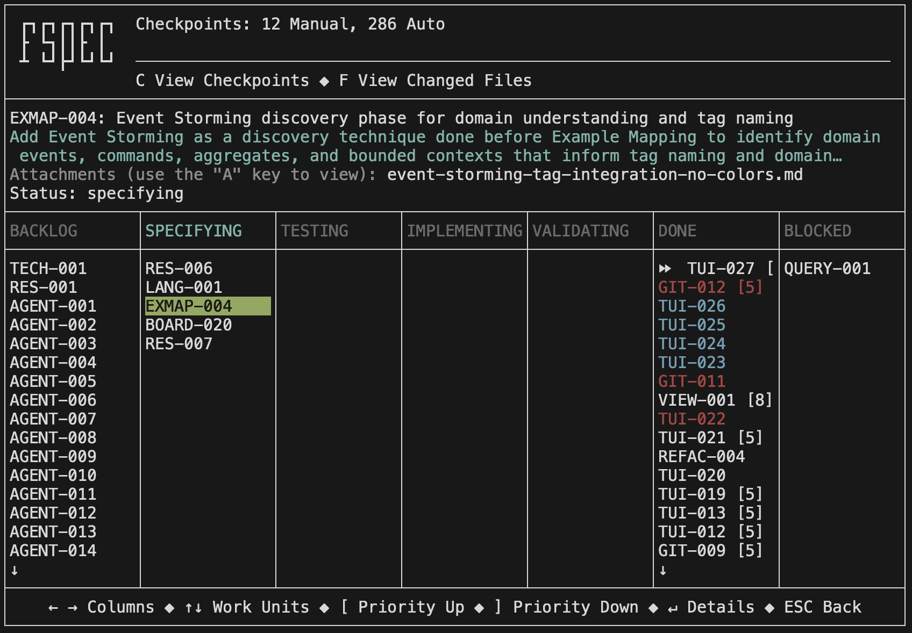
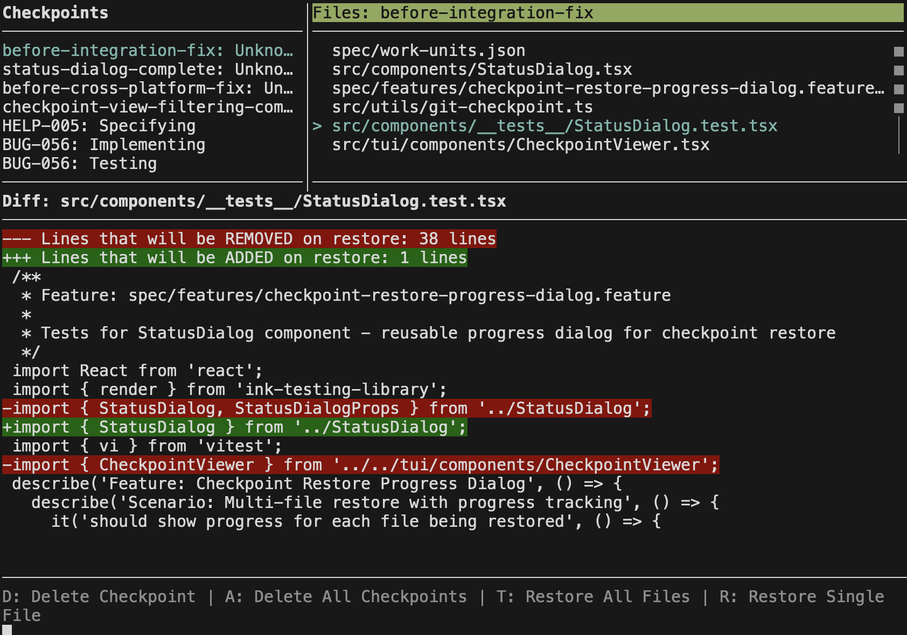

<picture>
  <source media="(prefers-color-scheme: dark)" srcset="fspec-logo-dark.svg">
  <source media="(prefers-color-scheme: light)" srcset="fspec-logo-light.svg">
  
</picture>

**Stop micromanaging AI. Start shipping tested code.**

[](https://fspec.dev)
[](https://opensource.org/licenses/MIT)
[](https://www.npmjs.com/package/@sengac/fspec)

---

## Why

AI agents lack the infrastructure that professional developers take for granted. No way to easily force AI to follow your acceptance criteria or ask questions about things it doesn't understand. AI confabulates without quality examples and doesn't ask when it needs to know what it doesn't know. No TDD guardrails. No or poorly implemented checkpoint systems for safe experimentation. No Kanban boards for tracking workflow state. No specification management systems with mermaid diagram viewers and markdown documentation. No coverage tracking to link code back to business rules. AI agents are coding in the dark, and you're left babysitting instead of building.

## What

fspec is the holy grail: a complete spec-driven system that shepherds AI through professional Gherkin scenarios, auto-generates tests from Given/When/Then criteria, enforces TDD discipline, and links every line of code back to the business rule it implements. A productivity goldmine that transforms AI agents into autonomous builders of your dreams.

## How

Follow the [Quick Start](#quick-start) below and start talking naturally with your AI agent. Don't know what to do next? Just ask your agent—it knows fspec inside and out and will suggest the best ways to use it for your workflow.

---

## Quick Start

1. **Install fspec globally**

   ```bash
   npm install -g @sengac/fspec
   ```

2. **Go to your project directory**

   ```bash
   cd /path/to/your/project
   ```

3. **Initialize fspec**

   ```bash
   fspec init
   ```

4. **Run your AI agent** (e.g., Claude Code, Codex)

5. **Bootstrap fspec context**
   - Use a bootstrapping command: `/fspec` (Claude Code) or `/prompts:fspec` (Codex)
   - Or tell your agent: "Run fspec bootstrap"

6. **Talk naturally with fspec**

   ```
   "I want to create a bug to fix this issue"
   "Create a checkpoint for this work"
   "Show me the kanban board"
   "Generate scenarios from the example map"
   ```

7. **Launch the interactive kanban**

   ```bash
   fspec
   ```

   Watch live changes, view work unit details, manage checkpoints, and navigate your kanban board with an intuitive TUI.

   

8. **When your AI goes off track (and it will)**

   AI agents sometimes rush ahead, skip Example Mapping, or write code before tests. **That's okay—fspec has your back.**

   **Auto checkpoints** are created automatically before every state transition, so you can always roll back:

   ```
   "You skipped Example Mapping. Move back to specifying status and let's do discovery properly."
   "You wrote code before tests. Restore from the auto checkpoint and follow ACDD this time."
   "List the auto checkpoints so I can see what you saved."
   ```

   **Recovery is simple:**
   - Tell your agent to move the work unit backward (e.g., from `testing` back to `specifying`)
   - Have it restore from the most recent auto checkpoint: `fspec restore-checkpoint <id> <checkpoint-name>`
   - Checkpoints can be restored multiple times—experiment fearlessly

   The workflow enforcer prevents disasters, and checkpoints provide instant recovery. No work is ever lost.

9. **Keep context fresh**
   - Over time, your agent's context gets cluttered
   - Clear your agent's context and bootstrap fspec again
   - Repeat as needed to maintain clean workflow

---

## Checkpoints

Experiment fearlessly with built-in Git checkpoints. Tell your agent to **"create a checkpoint"** to save your current state, then view and restore checkpoints from the interactive kanban by pressing the **C** key.



---

## Attachment Viewer

Attach markdown documents with mermaid diagrams to work units for rich documentation **before** starting Example Mapping. Perfect for researching complex topics and creating visual designs.

**Example workflow:**

```
"Create a story about adding Event Storming. I want you to research this
topic on the web and create a markdown document with mermaid diagrams
and attach it to this story using fspec."
```

View attachments in the interactive kanban by pressing the **A** key, with full markdown and mermaid diagram rendering.


---

## 🦴 DOGFOODING 🍖

**We practice what we preach.** fspec was built entirely using fspec. The result? **257 feature files** with complete Gherkin specifications, full test coverage, and end-to-end traceability.

How long would that normally take? A traditional QA and business analyst team would need **9-12 months** to produce that level of documentation. We did it in weeks with AI agents following ACDD discipline.

**See for yourself:** Browse the [complete feature file collection](https://github.com/sengac/fspec/tree/main/spec/features) and witness what AI-driven, test-first development actually looks like at scale.

---

## Documentation

- 📘 **[Getting Started](https://fspec.dev/getting-started/quickstart/)** - 5-minute quickstart
- 📖 **[User Guide](https://fspec.dev/getting-started/introduction/)** - Comprehensive usage
- 🎯 **[ACDD Workflow](https://fspec.dev/concepts/acdd/)** - Understanding the process
- 🤝 **[Example Mapping](https://fspec.dev/concepts/example-mapping/)** - Discovery techniques
- 📊 **[Work Units](https://fspec.dev/concepts/kanban/)** - Project management
- 🔗 **[Coverage Tracking](https://fspec.dev/docs/coverage-tracking/)** - Traceability
- 🔄 **[Reverse ACDD](https://fspec.dev/docs/reverse-acdd/)** - Existing codebases
- 💾 **[Git Checkpoints](https://fspec.dev/docs/checkpoints/)** - Safe experimentation
- ⚡ **[Virtual Hooks](https://fspec.dev/docs/virtual-hooks/)** - Quality gates
- 🏷️ **[Tags](https://fspec.dev/commands/specs/)** - Organization system
- 🔧 **[CLI Reference](https://fspec.dev/reference/cli/)** - Command cheatsheet

**Pro tip:** All commands have comprehensive `--help` output:

```bash
fspec <command> --help
fspec help specs      # Gherkin commands
fspec help work       # Kanban commands
fspec help discovery  # Example mapping commands
```

---

## Bug Reporting & Support

Found a bug? Just tell your AI agent:

```
"Report a bug to GitHub"
```

Your agent knows how to use `fspec report-bug-to-github` to automatically gather context and create the issue.

**Manual reporting:** [Create an issue](https://github.com/sengac/fspec/issues/new)

---

## Need Your Legacy Code Rewritten?

**Your codebase is costing you millions.** Untested. Undocumented. Impossible to maintain. SENGAC specializes in transforming legacy nightmares into modern, AI-tested, fully-specified systems using tools like fspec. We don't just migrate—we rebuild with complete test coverage, living documentation, and end-to-end traceability.

**Stop throwing money at technical debt.** [Reach out to SENGAC](https://sengac.com) and let's modernize your infrastructure.

---

**[Visit fspec.dev](https://fspec.dev)** | **[GitHub](https://github.com/sengac/fspec)** | **[npm](https://www.npmjs.com/package/@sengac/fspec)**
