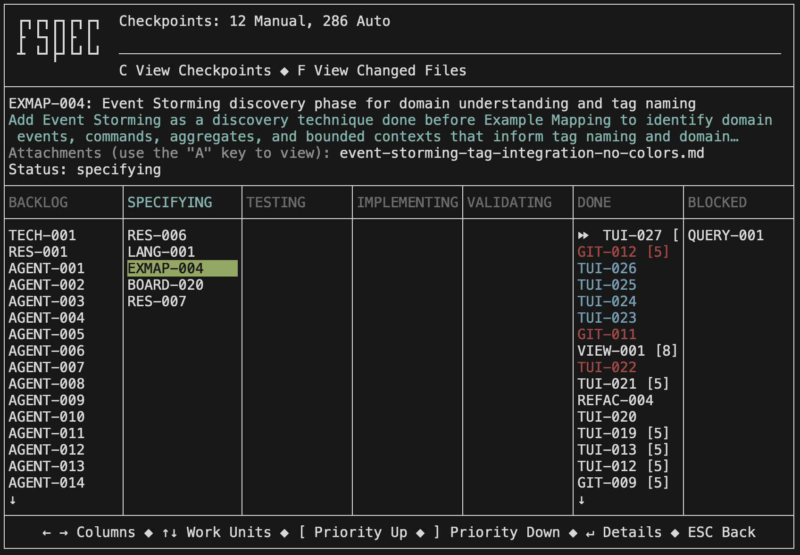

<picture>
  <source media="(prefers-color-scheme: dark)" srcset="fspec-logo-dark.svg">
  <source media="(prefers-color-scheme: light)" srcset="fspec-logo-light.svg">
  
</picture>

**The spec-driven, multi-agent coding platform.**

[](https://fspec.dev)
[](https://opensource.org/licenses/MIT)
[](https://www.npmjs.com/package/@sengac/fspec)

---

## What is fspec?

fspec is an AI coding platform that runs multiple agents in parallel, each working on different tasks. Launch one agent to implement a feature while another fixes a bug. Switch between conversations. Let them run in the background.

When you want rigor, fspec follows **Acceptance Criteria Driven Development**: specs first, then tests, then code. The AI asks clarifying questions, writes Gherkin scenarios, generates failing tests, and implements just enough to pass. Every line of code traces back to a requirement.

When you just want to code, skip all that. fspec is a capable coding assistant on its own—refactor, debug, explain, review. The workflow tools are there when you need them.

---

## Quick Start

```bash
npm install -g @sengac/fspec
cd /path/to/your/project
fspec
```

This opens the interactive platform with a Kanban board and AI conversations.



---

## First Run: Getting Started

When you first run `fspec` on a new project, the board is empty—no work units yet. Here's how to begin:

### 1. Start an AI Agent

Press **`/`** (or **Shift+Right**) to start a new AI conversation. A dialog appears:

```
Start New Agent?
Begin a fresh AI conversation, not linked to any task.

Mode:  Normal  / Isolated
```

- **Normal** — Agent works directly in your project
- **Isolated** — Agent works in a git worktree (safe for experimental changes)

Press **Enter** on "Yes" to launch the agent.

### 2. Use It However You Want

**fspec doesn't force any workflow.** The AI agent is a full-featured coding assistant. You can:

- Ask it to write code, refactor, debug, or explain things
- Have it review PRs, write documentation, or answer questions
- Use it exactly like any other AI coding tool

The ACDD workflow is available when you want it, not required. fspec provides the tools—you decide how to use them.

### 3. Foundation Discovery (When Using ACDD)

If you want to use the spec-driven workflow, start with **Foundation Discovery**. For new projects without `spec/foundation.json`, tell the AI:

```
"Let's set up fspec for this project"
"Run fspec discover-foundation"
```

The AI guides you through creating your project's requirements document:

- Analyzes your codebase
- Asks about project vision, personas, and capabilities
- Builds `foundation.json` field by field
- Finalizes with `fspec discover-foundation --finalize`

This is a one-time setup that establishes project context for the ACDD workflow.

### 4. Create Work Units

Once foundation exists (or skip it for quick tasks), tell the AI what you want:

```
"Create a story for user authentication"
"I need to add a payment processing feature"
"There's a bug where login fails on mobile"
```

The AI creates work units (stories, bugs, or tasks) and adds them to your backlog.

### 5. Work the Kanban Board

Now you have cards on the board! The workflow is:

```
BACKLOG → SPECIFYING → TESTING → IMPLEMENTING → VALIDATING → DONE
```

- Press **Enter** on any card to work on it with the AI
- The AI moves cards through stages automatically
- Each stage has specific goals (see "How It Works" below)

Or ignore the board entirely and just chat with the agent—it's your choice.

---

## Keyboard Shortcuts

| Key | Action |
|-----|--------|
| `/` | Start new AI agent |
| **Shift+Right** | Navigate to next session (or create new) |
| **Shift+Left** | Navigate to previous session (or back to board) |
| **Enter** | Open selected work unit with AI |
| **↑ ↓ ← →** | Navigate board |
| **C** | View git checkpoints |
| **F** | View changed files |
| **D** | View FOUNDATION.md |
| **Esc** | Exit / Go back |

---

## How It Works

1. **You describe what you want** — A feature, a bug fix, a task
2. **fspec asks questions** — Clarifies edge cases, rules, and expectations
3. **fspec writes specs** — Generates Gherkin scenarios from your answers
4. **fspec writes tests** — Failing tests that prove the spec isn't implemented
5. **fspec writes code** — Just enough to make the tests pass
6. **Coverage tracks everything** — Every line of code links back to a requirement

This is **Acceptance Criteria Driven Development (ACDD)**. The agent drives. You steer.

---

## Using with External Agents

fspec also works as a tool for Claude Code, Cursor, Codex, or any AI agent:

```bash
cd /path/to/your/project
fspec init
```

This installs agent-specific documentation and slash commands. Then tell your agent:

```
"Run fspec bootstrap"
"Create a story for user authentication"
"Show me the board"
```

The agent learns fspec's workflow and manages your specs automatically.

---

## Key Capabilities

- **Example Mapping** — Agent discovers rules, examples, and edge cases by asking you questions
- **Gherkin generation** — Specs written automatically from your answers
- **Test-first development** — Tests before code, always
- **Kanban workflow** — Track work from backlog to done
- **Git checkpoints** — Automatic save points for safe experimentation
- **Coverage tracking** — Link code to requirements
- **Multiple sessions** — Run concurrent AI conversations in background
- **Isolated sessions** — Work in git worktrees for safe experimentation
- **Watcher sessions** — Child AIs that observe and review parent sessions in real-time

---

## Telegram Bridge

Monitor and interact with your AI sessions from your phone. The Bridge tool connects any session to external WebSocket endpoints, with a built-in Telegram integration.

### Setup

1. **Create a Telegram bot** — Message [@BotFather](https://t.me/botfather), send `/newbot`, get your token

2. **Configure the bridge** — Create `bridge/.env`:
   ```bash
   TELEGRAM_BOT_TOKEN=your_token_here
   ```

3. **Start the endpoint**:
   ```bash
   npm run bridge:telegram
   ```

4. **Message your bot** — Send any message to link your chat

5. **Connect the AI** — Tell the agent:
   ```
   Connect to the Telegram bridge at ws://localhost:8080
   ```

Now all AI responses stream to Telegram. Send messages back to provide input. Run tasks overnight and check progress from bed.

### Multiple Bridges

Connect to multiple endpoints simultaneously—Telegram, Slack, Discord, or any WebSocket server. Each bridge receives the same stream.

---

## Watcher Sessions

Watchers are child AI sessions that observe a parent session in real-time and can automatically interject with feedback. Think of them as specialized reviewers running alongside your main coding agent.

### Use Cases

- **Security Reviewer** — Watches for SQL injection, XSS, authentication issues
- **Test Enforcer** — Reminds the agent to write tests before implementation  
- **Architecture Advisor** — Suggests patterns and flags structural problems
- **Documentation Checker** — Ensures code changes include doc updates

### Creating a Watcher

Type `/watcher` in any session to open the watcher overlay. Press **N** to create a new template:

- **Name** — Role name like "Security Reviewer"
- **Authority** — Peer (suggestions) or Supervisor (directives)
- **Model** — Which AI model to use
- **Brief** — Instructions for what to watch for
- **Auto-inject** — Whether to automatically send feedback to the parent

### How It Works

1. Watcher observes parent session output in real-time
2. At breakpoints (tool results, turn completion), watcher evaluates what it saw
3. If the watching brief is triggered, watcher decides to interject or continue
4. **Auto-inject ON**: Feedback automatically appears in parent session as a purple message
5. **Auto-inject OFF**: You review the feedback and manually inject if desired

### Split View

When viewing a watcher session, the screen splits:

- **Left pane** — Parent session (read-only, dimmed)
- **Right pane** — Watcher conversation (interactive)
- **←/→ arrows** — Switch between panes
- **Tab** — Select specific turns to discuss

### Templates

Watcher configurations are saved as reusable templates in `~/.fspec/watcher-templates.json`. Spawn instances quickly with `/watcher spawn <slug>` or press Enter on any template in the overlay.
