# RES-018: Unconfigured Research Tool Visibility and Discovery

## Executive Summary

This document provides comprehensive research and implementation guidance for improving research tool discoverability in fspec. The feature balances two competing needs:

1. **User Experience**: Clean, focused output showing only configured/ready tools
2. **AI Agent Awareness**: Complete visibility of all tools for intelligent suggestions

**Key Design Decisions** (from Example Mapping):
- Default output (`fspec research`) shows only configured tools
- `--all` flag reveals unconfigured tools with setup instructions
- System-reminders (AI-only) always show all tools
- Full configuration validation on listing (accurate status)
- Inline JSON examples in error messages (copy-paste ready)

---

## Example Mapping Summary

### 🟨 User Story

**As a** developer or AI agent using fspec research tools
**I want to** discover available research tools even when not configured
**So that** I know what tools exist and can configure them when needed

### 🟦 Business Rules

1. **Dual Display Mode**: User-facing shows configured tools by default, `--all` shows everything. System-reminders always show all.
2. **Fail Fast on Use**: Attempting to use unconfigured tool fails with clear setup instructions.
3. **Config File Based**: Uses JSON files at `spec/fspec-config.json` (project) or `~/.fspec/fspec-config.json` (user).
4. **Per-Tool Requirements**:
   - AST: No configuration needed
   - Perplexity: `apiKey`
   - JIRA: `jiraUrl`, `username`, `apiToken`
   - Confluence: `confluenceUrl`, `username`, `apiToken`
   - Stakeholder: At least one platform webhook/token
5. **Full Validation**: Use existing `loadConfig()` logic to accurately detect configuration status.
6. **Inline JSON Examples**: Show full copy-paste-ready JSON in error messages and help text.

### 🟩 Examples

1. User runs `fspec research` with no config → Shows AST only + footer about `--all`
2. User runs `fspec research --all` → Shows all 5 tools with ✓/✗ status + JSON examples
3. AI sees system-reminder → All 5 tools with status and config structure
4. User runs unconfigured tool → Error with JSON example + suggest AST alternative
5. User has only AST → Shows AST + footer message about 4 unconfigured tools

---

## Current Implementation Analysis

### Configuration System Architecture


### Config Resolution

**File**: `src/utils/config-resolution.ts`

**Key Functions**:
- `resolveConfig(toolName, options)` (lines 74-145) - Multi-layer merge
- `validateConfig(toolName, options)` (lines 150-187) - Required field checking
- `REQUIRED_FIELDS` (lines 41-46) - Per-tool requirements map

**Resolution Order**:
1. Environment variables (highest priority)
2. User config (`~/.fspec/fspec-config.json`)
3. Project config (`spec/fspec-config.json`)
4. Defaults (lowest priority)

### Tool Registry

**File**: `src/research-tools/registry.ts`

**Current Functions**:
- `getResearchTool(toolName, cwd)` (lines 40-97) - Load single tool
- `listAvailableTools(cwd)` (lines 106-110) - Return bundled tool names only

**Bundled Tools** (lines 23-29):
```typescript
const BUNDLED_TOOLS: Map<string, ResearchTool> = new Map([
  ['ast', astTool],
  ['perplexity', perplexityTool],
  ['jira', jiraTool],
  ['confluence', confluenceTool],
  ['stakeholder', stakeholderTool],
]);
```

### Per-Tool Configuration Loading

Each tool implements its own `loadConfig()`:

**Perplexity** (`src/research-tools/perplexity.ts`, lines 21-44):
```typescript
function loadConfig(): PerplexityConfig {
  const configPath = path.join(os.homedir(), '.fspec', 'fspec-config.json');

  if (!fs.existsSync(configPath)) {
    throw new Error('Config file not found...');
  }

  const config = JSON.parse(fs.readFileSync(configPath, 'utf8'));

  if (!config.research?.perplexity?.apiKey) {
    throw new Error('Perplexity API key not configured...');
  }

  return config.research.perplexity;
}
```

**Similar patterns in**:
- JIRA (lines 24-52)
- Confluence (lines 24-52)
- Stakeholder (lines 21-44)

---

## Proposed Implementation

### Phase 1: Enhanced Tool Status Detection (30 minutes)

#### New Function: `getToolConfigurationStatus()`

**File**: `src/research-tools/registry.ts`

```typescript
/**
 * Get configuration status for all bundled tools
 * Uses full validation (calls each tool's loadConfig) for accuracy
 *
 * @param cwd - Current working directory
 * @returns Map of tool name to configuration status
 */
export async function getToolConfigurationStatus(
  cwd: string = process.cwd()
): Promise<Map<string, ToolConfigStatus>> {
  const statusMap = new Map<ToolConfigStatus>();

  for (const [toolName, tool] of BUNDLED_TOOLS.entries()) {
    try {
      // AST tool has no config, always ready
      if (toolName === 'ast') {
        statusMap.set(toolName, {
          configured: true,
          reason: 'No configuration required',
          requiredFields: []
        });
        continue;
      }

      // Attempt to validate config using existing tool logic
      // This calls the tool's loadConfig() and catches errors
      const config = await resolveConfig(toolName, { cwd });
      await validateConfig(toolName, { cwd }); // Throws if missing required fields

      statusMap.set(toolName, {
        configured: true,
        reason: 'All required fields configured',
        requiredFields: REQUIRED_FIELDS[toolName] || []
      });
    } catch (error: any) {
      // Tool not configured - extract missing fields from error
      const requiredFields = REQUIRED_FIELDS[toolName] || [];

      statusMap.set(toolName, {
        configured: false,
        reason: error.message || 'Configuration incomplete',
        requiredFields,
        configExample: getConfigExample(toolName)
      });
    }
  }

  return statusMap;
}

interface ToolConfigStatus {
  configured: boolean;
  reason: string;
  requiredFields: string[];
  configExample?: string; // JSON example for unconfigured tools
}
```

#### New Function: `getConfigExample()`

```typescript
/**
 * Get JSON configuration example for a tool
 *
 * @param toolName - Name of the tool
 * @returns JSON string with config example
 */
function getConfigExample(toolName: string): string {
  const examples: Record<string, any> = {
    perplexity: {
      research: {
        perplexity: {
          apiKey: 'pplx-your-api-key-here'
        }
      }
    },
    jira: {
      research: {
        jira: {
          jiraUrl: 'https://example.atlassian.net',
          username: 'your-email@example.com',
          apiToken: 'your-api-token'
        }
      }
    },
    confluence: {
      research: {
        confluence: {
          confluenceUrl: 'https://example.atlassian.net/wiki',
          username: 'your-email',
          apiToken: 'your-token'
        }
      }
    },
    stakeholder: {
      research: {
        stakeholder: {
          teams: {
            webhookUrl: 'https://...'
          }
          // OR
          // slack: {
          //   token: '...',
          //   channel: '...'
          // }
        }
      }
    }
  };

  return JSON.stringify(examples[toolName] || {}, null, 2);
}
```

---

### Phase 2: Update `fspec research` Command (45 minutes)

#### Add `--all` Flag

**File**: `src/commands/research.ts`

**Current behavior** (lines 189-294):
- Lists tools if no `--tool` specified
- Executes tool if `--tool` provided

**New behavior**:
- Default (`fspec research`): List configured tools only + footer about `--all`
- With `--all` (`fspec research --all`): List all tools with status + JSON examples
- With `--tool` (`fspec research --tool=name`): Execute tool (unchanged)

```typescript
/**
 * research command handler
 *
 * @param args - Command arguments
 * @param options - Command options
 */
export async function research(
  args: string[],
  options: {
    tool?: string;
    all?: boolean; // NEW FLAG
    cwd: string;
  }
): Promise<void> {
  const { tool, all = false, cwd } = options;

  // If no tool specified, list available tools
  if (!tool) {
    await listResearchTools(cwd, all);
    return;
  }

  // Execute specific tool (existing logic)
  // ... rest of function unchanged
}
```

#### New Function: `listResearchTools()`

```typescript
/**
 * List available research tools
 *
 * @param cwd - Current working directory
 * @param showAll - If true, show unconfigured tools with setup instructions
 */
async function listResearchTools(
  cwd: string,
  showAll: boolean
): Promise<void> {
  const toolStatus = await getToolConfigurationStatus(cwd);

  const configuredTools: string[] = [];
  const unconfiguredTools: string[] = [];

  for (const [toolName, status] of toolStatus.entries()) {
    if (status.configured) {
      configuredTools.push(toolName);
    } else {
      unconfiguredTools.push(toolName);
    }
  }

  // Output configured tools
  if (configuredTools.length > 0) {
    console.log('Available research tools:\n');

    for (const toolName of configuredTools) {
      const tool = await getResearchTool(toolName, cwd);
      const status = toolStatus.get(toolName)!;

      console.log(`✓ ${toolName} - ${tool.description}`);
      console.log(`  Status: Ready to use`);
      console.log(`  Usage: fspec research --tool=${toolName} [options]`);
      console.log();
    }
  } else {
    console.log('No research tools configured.\n');
  }

  // Show unconfigured tools if --all flag
  if (showAll && unconfiguredTools.length > 0) {
    console.log('\nUnconfigured tools (need setup):\n');

    for (const toolName of unconfiguredTools) {
      const tool = await getResearchTool(toolName, cwd);
      const status = toolStatus.get(toolName)!;

      console.log(`✗ ${toolName} - ${tool.description}`);
      console.log(`  Status: Not configured`);
      console.log(`  Required: ${status.requiredFields.join(', ')}`);
      console.log(`  Setup: Add to spec/fspec-config.json or ~/.fspec/fspec-config.json:`);
      console.log();
      console.log(status.configExample); // Indented JSON
      console.log();
    }
  } else if (!showAll && unconfiguredTools.length > 0) {
    // Show footer message about --all
    console.log(`\nℹ️  ${unconfiguredTools.length} additional tool(s) available but not configured.`);
    console.log(`   Run 'fspec research --all' to see setup instructions.\n`);
  }
}
```

---

### Phase 3: Enhanced Error Messages (20 minutes)

#### Update Tool Execution Error Handling

**File**: `src/commands/research.ts` (lines 280-287)

**Current error handling**:
```typescript
try {
  const result = await tool.execute(args, cwd);
  console.log(result);
} catch (error: any) {
  const errorMessage = `${error.message}`;
  const reminder = appendReminder('', errorMessage);
  console.error(reminder);
  process.exit(1);
}
```

**Enhanced error handling**:
```typescript
try {
  const result = await tool.execute(args, cwd);
  console.log(result);
} catch (error: any) {
  // Check if this is a configuration error
  const isConfigError = error.message.includes('not configured') ||
                        error.message.includes('missing') ||
                        error.message.includes('API key');

  if (isConfigError) {
    // Enhanced error with alternatives
    const configExample = getConfigExample(toolName);
    const toolStatus = await getToolConfigurationStatus(cwd);
    const configuredAlternatives = Array.from(toolStatus.entries())
      .filter(([name, status]) => status.configured && name !== toolName)
      .map(([name]) => name);

    let errorMessage = `✗ ${toolName} is not configured\n\n`;
    errorMessage += `Error: ${error.message}\n\n`;
    errorMessage += `Setup: Add to spec/fspec-config.json or ~/.fspec/fspec-config.json:\n\n`;
    errorMessage += configExample;
    errorMessage += `\n\n`;

    if (configuredAlternatives.length > 0) {
      errorMessage += `Alternatively, use these configured tools:\n`;
      for (const alt of configuredAlternatives) {
        errorMessage += `  - ${alt}\n`;
      }
    }

    const reminder = appendReminder('', errorMessage);
    console.error(reminder);
  } else {
    // Regular error (not config-related)
    const reminder = appendReminder('', error.message);
    console.error(reminder);
  }

  process.exit(1);
}
```

---

### Phase 4: System-Reminder Integration (30 minutes)

#### Update System-Reminder for Research Tools

**File**: `src/utils/system-reminder.ts`

**Update**: Enhance existing reminder to use new status detection

**Current reminder** (lines 63-72):
```typescript
RESEARCH TOOLS: Use research tools to answer questions:
  fspec research                                  # List available
  fspec research --tool=ast --query="pattern"     # AST analysis
  fspec research --tool=stakeholder --question="Q"

Available research tools (--tool=ast or --tool=stakeholder):
  - ast: AST code analysis and pattern detection
  - stakeholder: Send questions to stakeholders
```

**Enhanced reminder**:
```typescript
RESEARCH TOOLS: Use research tools during Example Mapping:
  fspec research                    # List configured tools
  fspec research --all              # See all tools + setup instructions
  fspec research --tool=<name>      # Use specific tool

Available research tools:
  ✓ ast - AST code analysis (ready)
    Usage: fspec research --tool=ast list-functions --lang=typescript

  ✗ perplexity - AI-powered web search (not configured)
    Setup: Add to spec/fspec-config.json:
    {
      "research": {
        "perplexity": {
          "apiKey": "pplx-..."
        }
      }
    }

  [... similar for all 5 tools ...]

For full help: fspec research --tool=<name> --help
```

**Implementation**:
```typescript
export function specifyingStateReminder(
  workUnitId: string,
  workUnit: WorkUnit,
  cwd: string
): string {
  // ... existing reminder content ...

  // Add research tools section
  const toolStatus = await getToolConfigurationStatus(cwd);
  let researchSection = '\nRESEARCH TOOLS: Use research tools during Example Mapping:\n';
  researchSection += '  fspec research                    # List configured tools\n';
  researchSection += '  fspec research --all              # See all tools + setup\n';
  researchSection += '  fspec research --tool=<name>      # Use specific tool\n\n';
  researchSection += 'Available research tools:\n';

  for (const [toolName, status] of toolStatus.entries()) {
    const tool = await getResearchTool(toolName, cwd);
    const indicator = status.configured ? '✓' : '✗';
    const statusText = status.configured ? 'ready' : 'not configured';

    researchSection += `  ${indicator} ${toolName} - ${tool.description} (${statusText})\n`;

    if (status.configured) {
      researchSection += `    Usage: fspec research --tool=${toolName} [options]\n`;
    } else {
      // Show concise setup hint for system-reminder (AI can run --help for full details)
      researchSection += `    Setup: spec/fspec-config.json → research.${toolName}.${status.requiredFields[0]}\n`;
    }

    researchSection += '\n';
  }

  researchSection += 'For full help: fspec research --tool=<name> --help\n';

  // ... rest of reminder ...

  return reminder + researchSection;
}
```

---

## Implementation Timeline

### Total Estimate: **2-3 hours**

| Phase | Task | Time |
|-------|------|------|
| 1 | Enhanced tool status detection | 30 min |
| 2 | Update `fspec research` command with `--all` flag | 45 min |
| 3 | Enhanced error messages with JSON examples | 20 min |
| 4 | System-reminder integration | 30 min |
| 5 | Testing and validation | 30 min |
| 6 | Documentation updates | 15 min |

---

## Testing Strategy

### Unit Tests

**File**: `src/research-tools/__tests__/registry.test.ts`

```typescript
describe('getToolConfigurationStatus', () => {
  it('should detect AST as always configured', async () => {
    const status = await getToolConfigurationStatus('/test');
    const astStatus = status.get('ast');

    expect(astStatus.configured).toBe(true);
    expect(astStatus.reason).toContain('No configuration required');
  });

  it('should detect Perplexity as not configured without apiKey', async () => {
    // Mock config without perplexity
    mockConfigFile({});

    const status = await getToolConfigurationStatus('/test');
    const pplxStatus = status.get('perplexity');

    expect(pplxStatus.configured).toBe(false);
    expect(pplxStatus.requiredFields).toContain('apiKey');
    expect(pplxStatus.configExample).toContain('research.perplexity.apiKey');
  });

  it('should detect configured tool when config exists', async () => {
    mockConfigFile({
      research: {
        perplexity: {
          apiKey: 'test-key'
        }
      }
    });

    const status = await getToolConfigurationStatus('/test');
    const pplxStatus = status.get('perplexity');

    expect(pplxStatus.configured).toBe(true);
  });
});

describe('getConfigExample', () => {
  it('should return valid JSON for Perplexity', () => {
    const example = getConfigExample('perplexity');
    const parsed = JSON.parse(example);

    expect(parsed.research.perplexity.apiKey).toBeDefined();
  });

  it('should return valid JSON for JIRA', () => {
    const example = getConfigExample('jira');
    const parsed = JSON.parse(example);

    expect(parsed.research.jira.jiraUrl).toBeDefined();
    expect(parsed.research.jira.username).toBeDefined();
    expect(parsed.research.jira.apiToken).toBeDefined();
  });
});
```

### Integration Tests

**File**: `src/commands/__tests__/research.test.ts`

```typescript
describe('fspec research (listing)', () => {
  it('should list only configured tools by default', async () => {
    mockConfigFile({ research: { ast: {} } }); // AST only

    const output = await runCommand('fspec', ['research']);

    expect(output).toContain('✓ ast');
    expect(output).not.toContain('✓ perplexity');
    expect(output).toContain('additional tool(s) available');
    expect(output).toContain('--all');
  });

  it('should list all tools with --all flag', async () => {
    mockConfigFile({});

    const output = await runCommand('fspec', ['research', '--all']);

    expect(output).toContain('✓ ast');
    expect(output).toContain('✗ perplexity');
    expect(output).toContain('✗ jira');
    expect(output).toContain('✗ confluence');
    expect(output).toContain('✗ stakeholder');
    expect(output).toContain('spec/fspec-config.json');
  });

  it('should show JSON config examples with --all', async () => {
    const output = await runCommand('fspec', ['research', '--all']);

    expect(output).toContain('"research"');
    expect(output).toContain('"perplexity"');
    expect(output).toContain('"apiKey"');
  });
});

describe('fspec research --tool (execution)', () => {
  it('should fail with helpful error when tool not configured', async () => {
    mockConfigFile({});

    const result = await runCommandExpectFail('fspec', [
      'research',
      '--tool=perplexity',
      '--query=test'
    ]);

    expect(result.exitCode).toBe(1);
    expect(result.stderr).toContain('not configured');
    expect(result.stderr).toContain('spec/fspec-config.json');
    expect(result.stderr).toContain('"apiKey"');
    expect(result.stderr).toContain('Alternatively, use these configured tools');
    expect(result.stderr).toContain('ast');
  });
});
```

### Manual Testing Checklist

- [ ] Run `fspec research` with no config → Shows AST only + footer
- [ ] Run `fspec research --all` with no config → Shows all 5 tools with JSON examples
- [ ] Configure Perplexity, run `fspec research` → Shows AST + Perplexity
- [ ] Run `fspec research --all` with partial config → Shows configured (✓) and unconfigured (✗)
- [ ] Run `fspec research --tool=perplexity` without config → Error with JSON example + AST alternative
- [ ] Move work unit to specifying → System-reminder shows all tools with status
- [ ] Verify JSON examples are valid and copy-paste ready
- [ ] Check that config examples show correct file paths

---

## Detailed Flow Diagrams

### User Flow: Listing Tools

```mermaid
sequenceDiagram
    participant User
    participant CLI as fspec research
    participant Registry
    participant Config as Config System

    User->>CLI: fspec research
    CLI->>Registry: getToolConfigurationStatus()
    Registry->>Config: Load config files
    Config-->>Registry: Merged config

    loop For each tool
        Registry->>Config: validateConfig(toolName)
        alt Tool configured
            Config-->>Registry: ✓ Valid
        else Tool not configured
            Config-->>Registry: ✗ Missing fields
        end
    end

    Registry-->>CLI: Map<toolName, status>

    CLI->>CLI: Filter configured tools
    CLI->>User: ✓ ast (ready)<br/>ℹ️ 4 tools need config<br/>Use --all to see
```



### User Flow: Listing All Tools


### AI Agent Flow: System-Reminder


---

## Configuration Examples

### Complete Config File

**File**: `spec/fspec-config.json` or `~/.fspec/fspec-config.json`

```json
{
  "research": {
    "perplexity": {
      "apiKey": "pplx-your-api-key-here"
    },
    "jira": {
      "jiraUrl": "https://example.atlassian.net",
      "username": "your-email@example.com",
      "apiToken": "your-jira-api-token"
    },
    "confluence": {
      "confluenceUrl": "https://example.atlassian.net/wiki",
      "username": "your-email",
      "apiToken": "your-confluence-api-token"
    },
    "stakeholder": {
      "teams": {
        "webhookUrl": "https://outlook.office.com/webhook/..."
      }
    }
  }
}
```

---

## Output Examples

### Example 1: Default Listing (No Config)

```bash
$ fspec research

Available research tools:

✓ ast - AST code analysis using deterministic tree-sitter query operations
  Status: Ready to use
  Usage: fspec research --tool=ast [options]

ℹ️  4 additional tool(s) available but not configured.
   Run 'fspec research --all' to see setup instructions.
```

### Example 2: Listing with --all Flag

```bash
$ fspec research --all

Available research tools:

✓ ast - AST code analysis using deterministic tree-sitter query operations
  Status: Ready to use
  Usage: fspec research --tool=ast [options]


Unconfigured tools (need setup):

✗ perplexity - Perplexity AI research tool for web search and AI-powered answers
  Status: Not configured
  Required: apiKey
  Setup: Add to spec/fspec-config.json or ~/.fspec/fspec-config.json:

{
  "research": {
    "perplexity": {
      "apiKey": "pplx-your-api-key-here"
    }
  }
}

✗ jira - JIRA research tool for fetching issues and running JQL queries
  Status: Not configured
  Required: jiraUrl, username, apiToken
  Setup: Add to spec/fspec-config.json or ~/.fspec/fspec-config.json:

{
  "research": {
    "jira": {
      "jiraUrl": "https://example.atlassian.net",
      "username": "your-email@example.com",
      "apiToken": "your-api-token"
    }
  }
}

[... similar for confluence and stakeholder ...]
```

### Example 3: Error with Unconfigured Tool

```bash
$ fspec research --tool=perplexity --query="How to implement JWT?"

✗ perplexity is not configured

Error: Perplexity API key not configured

Setup: Add to spec/fspec-config.json or ~/.fspec/fspec-config.json:

{
  "research": {
    "perplexity": {
      "apiKey": "pplx-your-api-key-here"
    }
  }
}

Alternatively, use these configured tools:
  - ast
```

---

## Benefits

### For Users

1. **Clean Default Output**: Only see tools that are ready to use
2. **Easy Discovery**: `--all` flag reveals what's possible
3. **Copy-Paste Setup**: JSON examples are immediately actionable
4. **Clear Errors**: Know exactly what's missing and how to fix it

### For AI Agents

1. **Full Awareness**: System-reminders show all tools regardless of config
2. **Intelligent Suggestions**: Can recommend better tools and guide setup
3. **Contextual Guidance**: Know when to suggest Perplexity vs AST
4. **Self-Service Help**: Can run `--help` commands for full details

### For the fspec Ecosystem

1. **Consistent UX**: Same pattern across all research tools
2. **Extensible**: New tools automatically get same treatment
3. **Maintainable**: Uses existing validation logic
4. **Documented**: Config examples are self-documenting

---

## Future Enhancements

1. **Interactive Setup Wizard**: `fspec configure-research-tool <name>`
2. **Config Validation Command**: `fspec validate-config`
3. **Tool Recommendations**: Suggest tools based on work unit type/title
4. **Usage Analytics**: Track which tools are used most, suggest configuration
5. **Multi-Tool Workflows**: Chain tools together (AST → Perplexity)

---

## Appendix: File Reference

### Files to Modify

1. **`src/research-tools/registry.ts`**
   - Add: `getToolConfigurationStatus()`
   - Add: `getConfigExample()`
   - Update: `listAvailableTools()` to use new status detection

2. **`src/commands/research.ts`**
   - Add: `--all` flag to command options
   - Add: `listResearchTools()` function
   - Update: Error handling for unconfigured tools

3. **`src/utils/system-reminder.ts`**
   - Update: `specifyingStateReminder()` to show all tools with status

### Files to Reference (Read-Only)

1. **`src/utils/config-resolution.ts`** - Config loading and validation
2. **`src/research-tools/perplexity.ts`** - Example tool implementation
3. **`src/research-tools/types.ts`** - ResearchTool interface

---

**Document Version**: 1.0
**Created**: 2025-11-12
**Work Unit**: RES-018
**Example Mapping**: Complete
**Scenarios**: Generated
**Estimated Implementation**: 2-3 hours
