```mermaid
flowchart TB
  subgraph Commands["⚡ Commands"]
    C49[RunAgent]
    C50[SendPrompt]
    C51[TriggerCompaction]
  end

  subgraph Aggregates["📦 Aggregates"]
    A5[RigAgent]
    A6[Compaction]
  end

  subgraph Events["📢 Events"]
    E28[AgentStarted]
    E29[PromptReceived]
    E30[ResponseStreaming]
    E31[ResponseCompleted]
    E32[CompactionTriggered]
    E33[ConversationCompacted]
  end

  Commands -.-> Aggregates
  Aggregates -.-> Events
```

```mermaid
flowchart TB
  subgraph Commands["⚡ Commands"]
    C52[SelectProvider]
    C53[RequestCompletion]
  end

  subgraph Aggregates["📦 Aggregates"]
    A7[ProviderManager]
    A8[ClaudeProvider]
    A9[OpenAIProvider]
    A10[GeminiProvider]
    A11[CodexProvider]
    A12[CachingClient]
  end

  subgraph Events["📢 Events"]
    E34[ProviderSelected]
    E35[CompletionRequested]
    E36[StreamChunkReceived]
    E37[CacheHit]
    E38[CacheTokensExtracted]
  end

  Commands -.-> Aggregates
  Aggregates -.-> Events
```

```mermaid
flowchart TB
  subgraph Commands["⚡ Commands"]
    C54[InvokeTool]
    C55[ExecuteBash]
    C56[ReadFile]
    C57[WriteFile]
    C58[EditFile]
    C59[SearchFiles]
  end

  subgraph Aggregates["📦 Aggregates"]
    A13[BashTool]
    A14[ReadTool]
    A15[WriteTool]
    A16[EditTool]
    A17[GrepTool]
    A18[GlobTool]
    A19[AstGrepTool]
    A20[LsTool]
  end

  subgraph Events["📢 Events"]
    E39[ToolInvoked]
    E40[ToolExecuted]
    E41[ToolFailed]
    E42[OutputTruncated]
  end

  Commands -.-> Aggregates
  Aggregates -.-> Events
```

```mermaid
flowchart TB
  subgraph Commands["⚡ Commands"]
    C60[ParseCommand]
    C61[StartInteractiveMode]
    C62[CreateSession]
    C63[GatherContext]
    C64[InjectSystemReminder]
  end

  subgraph Aggregates["📦 Aggregates"]
    A21[Cli]
    A22[InteractiveMode]
    A23[Session]
    A24[CompactionThreshold]
    A25[Terminal]
    A26[InputQueue]
    A27[StatusDisplay]
  end

  subgraph Events["📢 Events"]
    E43[CommandParsed]
    E44[InteractiveModeStarted]
    E45[SessionCreated]
    E46[ContextGathered]
    E47[SystemReminderInjected]
    E48[UserInputReceived]
  end

  Commands -.-> Aggregates
  Aggregates -.-> Events
```

<!-- THIS FILE IS AUTO-GENERATED FROM spec/foundation.json -->
<!-- DO NOT EDIT THIS FILE DIRECTLY -->
<!-- Edit spec/foundation.json and run: fspec generate-foundation-md -->

# codelet Project Foundation

## Vision

A multi-provider AI coding agent CLI in Rust that enables developers to leverage multiple LLM providers (Claude, OpenAI, Gemini) with advanced context management, tool execution, and conversation compaction for AI-assisted software development.

---

## Problem Space

### Vendor lock-in and lack of flexibility in AI coding agents

Existing AI coding agents are often monolithic and locked to a single LLM provider. Developers cannot easily switch between providers (Anthropic, OpenAI, Google) based on cost, capabilities, or availability. Additionally, context management becomes unwieldy as conversations grow, leading to token waste and degraded responses.

**Impact:** high

---

## Solution Space

### Overview

A lightweight, high-performance Rust CLI that provides a unified interface to multiple LLM providers through Rig.rs, with intelligent context management including automatic conversation compaction, prompt caching, and token tracking. The tool exposes file operations, code search, and command execution as tools the AI can use, following the patterns established by OpenAI Codex CLI.

### Capabilities

- **Multi-Provider LLM Integration**: Connect to multiple LLM providers (Anthropic Claude, OpenAI GPT, Google Gemini) through a unified interface using Rig.rs
- **Tool Execution Framework**: Execute file operations (read, write, edit), code search (grep, glob), and bash commands as AI-callable tools
- **Context Management**: Intelligent context window management with automatic conversation compaction, token tracking, and prompt caching
- **Interactive and Non-Interactive Modes**: Support both interactive REPL mode for development and non-interactive exec mode for scripting and CI/CD

---

## Personas

### Software Developer

A developer who uses AI to assist with coding tasks including writing, debugging, and refactoring code

**Goals:**
- Quickly get AI assistance for coding tasks
- Switch between LLM providers based on task needs

### DevOps Engineer

An engineer who integrates AI coding assistance into CI/CD pipelines and automated workflows

**Goals:**
- Run AI-assisted code generation in non-interactive mode
- Integrate LLM capabilities into build scripts

---

# Domain Architecture

## Bounded Contexts

- Agent Execution
- Provider Management
- Tool Execution
- CLI Interface

## Bounded Context Map

## Agent Execution Context

### Event Flow

**Aggregates:**
- RigAgent - Orchestrates LLM communication and multi-turn tool execution
- Compaction - Manages conversation history size through summarization and anchor points

**Domain Events:**
- AgentStarted - Agent begins execution loop
- PromptReceived - User submits a prompt to the agent
- ResponseStreaming - Agent is streaming response chunks
- ResponseCompleted - Agent finished generating response
- CompactionTriggered - Conversation compaction process initiated
- ConversationCompacted - Conversation history successfully summarized and reduced

**Commands:**
- RunAgent - Start the agent execution loop
- SendPrompt - Submit a prompt to the agent
- TriggerCompaction - Force conversation compaction

## Provider Management Context

### Event Flow

**Aggregates:**
- ProviderManager - Selects and manages LLM provider instances
- ClaudeProvider - Anthropic Claude API integration with prompt caching support
- OpenAIProvider - OpenAI GPT API integration
- GeminiProvider - Google Gemini API integration
- CodexProvider - OpenAI Codex/ChatGPT backend with OAuth authentication
- CachingClient - HTTP middleware for Anthropic prompt cache control

**Domain Events:**
- ProviderSelected - LLM provider chosen for use
- CompletionRequested - Completion request sent to LLM provider
- StreamChunkReceived - Streaming response chunk received from provider
- CacheHit - Prompt cache was reused, reducing token costs
- CacheTokensExtracted - Cache token counts parsed from API response

**Commands:**
- SelectProvider - Choose which LLM provider to use
- RequestCompletion - Send completion request to LLM

## Tool Execution Context

### Event Flow

**Aggregates:**
- BashTool - Executes shell commands with timeout and output handling
- ReadTool - Reads file contents with line range support
- WriteTool - Writes content to files
- EditTool - Performs search-and-replace edits on files
- GrepTool - Searches file contents using ripgrep
- GlobTool - Finds files matching glob patterns
- AstGrepTool - AST-based code search using tree-sitter
- LsTool - Lists directory contents

**Domain Events:**
- ToolInvoked - Tool called by the agent
- ToolExecuted - Tool completed execution successfully
- ToolFailed - Tool execution encountered an error
- OutputTruncated - Tool output exceeded limits and was truncated

**Commands:**
- InvokeTool - Call a tool by name with parameters
- ExecuteBash - Run a shell command
- ReadFile - Read contents of a file
- WriteFile - Write content to a file
- EditFile - Apply search-and-replace edit to a file
- SearchFiles - Search file contents or find files by pattern

## CLI Interface Context

### Event Flow

**Aggregates:**
- Cli - Command-line argument parsing using clap
- InteractiveMode - REPL orchestration for interactive agent sessions
- Session - Session state including context gathering and system reminders
- CompactionThreshold - Calculates when conversation compaction should trigger
- Terminal - Terminal setup, teardown, and panic handling
- InputQueue - Manages user input buffering during agent execution
- StatusDisplay - Displays status information in the terminal

**Domain Events:**
- CommandParsed - CLI arguments parsed and validated
- InteractiveModeStarted - Interactive REPL session began
- SessionCreated - New conversation session initialized
- ContextGathered - Project context files (CLAUDE.md) loaded
- SystemReminderInjected - System reminder added to conversation
- UserInputReceived - User typed input in interactive mode

**Commands:**
- ParseCommand - Parse and validate CLI arguments
- StartInteractiveMode - Launch the interactive REPL
- CreateSession - Initialize a new conversation session
- GatherContext - Load project context files (CLAUDE.md)
- InjectSystemReminder - Add system reminder to conversation

---
