```mermaid
flowchart TB
  subgraph Commands["⚡ Commands"]
    C50[RunAgent]
    C51[SendPrompt]
    C52[InterruptAgent]
    C53[ResumeSession]
  end

  subgraph Aggregates["📦 Aggregates"]
    A6[Runner]
    A7[MessageHistory]
    A8[InputManager]
  end

  subgraph Events["📢 Events"]
    E27[AgentStarted]
    E28[PromptReceived]
    E29[ResponseStreaming]
    E30[ResponseCompleted]
    E31[AgentInterrupted]
  end

  Commands -.-> Aggregates
  Aggregates -.-> Events
```

```mermaid
flowchart TB
  subgraph Commands["⚡ Commands"]
    C54[SelectProvider]
    C55[SwitchProvider]
    C56[RequestCompletion]
  end

  subgraph Aggregates["📦 Aggregates"]
    A9[ProviderManager]
    A10[ClaudeProvider]
    A11[OpenAIProvider]
    A12[GeminiProvider]
  end

  subgraph Events["📢 Events"]
    E32[ProviderSelected]
    E33[ProviderSwitched]
    E34[ApiKeyValidated]
    E35[CompletionRequested]
    E36[StreamChunkReceived]
  end

  Commands -.-> Aggregates
  Aggregates -.-> Events
```

```mermaid
flowchart TB
  subgraph Commands["⚡ Commands"]
    C57[InvokeTool]
    C58[ExecuteBash]
    C59[ReadFile]
    C60[WriteFile]
    C61[EditFile]
    C62[SearchFiles]
  end

  subgraph Aggregates["📦 Aggregates"]
    A13[ToolRegistry]
    A14[BashTool]
    A15[ReadTool]
    A16[WriteTool]
    A17[EditTool]
    A18[GrepTool]
    A19[GlobTool]
  end

  subgraph Events["📢 Events"]
    E37[ToolInvoked]
    E38[ToolExecuted]
    E39[ToolOutputTruncated]
    E40[ToolFailed]
  end

  Commands -.-> Aggregates
  Aggregates -.-> Events
```

```mermaid
flowchart TB
  subgraph Commands["⚡ Commands"]
    C63[TrackTokens]
    C64[TriggerCompaction]
    C65[LoadProjectContext]
  end

  subgraph Aggregates["📦 Aggregates"]
    A20[TokenTracker]
    A21[Compaction]
    A22[PromptCache]
    A23[ProjectContext]
  end

  subgraph Events["📢 Events"]
    E41[TokensTracked]
    E42[CompactionTriggered]
    E43[ConversationCompacted]
    E44[AnchorPointDetected]
    E45[CacheHit]
    E46[ContextFileLoaded]
  end

  Commands -.-> Aggregates
  Aggregates -.-> Events
```

```mermaid
flowchart TB
  subgraph Commands["⚡ Commands"]
    C66[ParseCommand]
    C67[LoadConfig]
    C68[ApplyOverrides]
  end

  subgraph Aggregates["📦 Aggregates"]
    A24[Cli]
    A25[ConfigOverrides]
    A26[Config]
  end

  subgraph Events["📢 Events"]
    E47[CommandParsed]
    E48[ConfigLoaded]
    E49[ConfigOverrideApplied]
  end

  Commands -.-> Aggregates
  Aggregates -.-> Events
```

<!-- THIS FILE IS AUTO-GENERATED FROM spec/foundation.json -->
<!-- DO NOT EDIT THIS FILE DIRECTLY -->
<!-- Edit spec/foundation.json and run: fspec generate-foundation-md -->

# codelet Project Foundation

## Vision

A multi-provider AI coding agent CLI in Rust that enables developers to leverage multiple LLM providers (Claude, OpenAI, Gemini) with advanced context management, tool execution, and conversation compaction for AI-assisted software development.

---

## Problem Space

### Vendor lock-in and lack of flexibility in AI coding agents

Existing AI coding agents are often monolithic and locked to a single LLM provider. Developers cannot easily switch between providers (Anthropic, OpenAI, Google) based on cost, capabilities, or availability. Additionally, context management becomes unwieldy as conversations grow, leading to token waste and degraded responses.

**Impact:** high

---

## Solution Space

### Overview

A lightweight, high-performance Rust CLI that provides a unified interface to multiple LLM providers through Rig.rs, with intelligent context management including automatic conversation compaction, prompt caching, and token tracking. The tool exposes file operations, code search, and command execution as tools the AI can use, following the patterns established by OpenAI Codex CLI.

### Capabilities

- **Multi-Provider LLM Integration**: Connect to multiple LLM providers (Anthropic Claude, OpenAI GPT, Google Gemini) through a unified interface using Rig.rs
- **Tool Execution Framework**: Execute file operations (read, write, edit), code search (grep, glob), and bash commands as AI-callable tools
- **Context Management**: Intelligent context window management with automatic conversation compaction, token tracking, and prompt caching
- **Interactive and Non-Interactive Modes**: Support both interactive REPL mode for development and non-interactive exec mode for scripting and CI/CD

---

## Personas

### Software Developer

A developer who uses AI to assist with coding tasks including writing, debugging, and refactoring code

**Goals:**
- Quickly get AI assistance for coding tasks
- Switch between LLM providers based on task needs

### DevOps Engineer

An engineer who integrates AI coding assistance into CI/CD pipelines and automated workflows

**Goals:**
- Run AI-assisted code generation in non-interactive mode
- Integrate LLM capabilities into build scripts

---

# Domain Architecture

## Bounded Contexts

- Agent Execution
- Provider Management
- Tool Execution
- Context Management
- CLI Interface

## Bounded Context Map

## Agent Execution Context

### Event Flow

**Aggregates:**
- Runner
- MessageHistory
- InputManager

**Domain Events:**
- AgentStarted
- PromptReceived
- ResponseStreaming
- ResponseCompleted
- AgentInterrupted

**Commands:**
- RunAgent
- SendPrompt
- InterruptAgent
- ResumeSession

## Provider Management Context

### Event Flow

**Aggregates:**
- ProviderManager
- ClaudeProvider
- OpenAIProvider
- GeminiProvider

**Domain Events:**
- ProviderSelected
- ProviderSwitched
- ApiKeyValidated
- CompletionRequested
- StreamChunkReceived

**Commands:**
- SelectProvider
- SwitchProvider
- RequestCompletion

## Tool Execution Context

### Event Flow

**Aggregates:**
- ToolRegistry
- BashTool
- ReadTool
- WriteTool
- EditTool
- GrepTool
- GlobTool

**Domain Events:**
- ToolInvoked
- ToolExecuted
- ToolOutputTruncated
- ToolFailed

**Commands:**
- InvokeTool
- ExecuteBash
- ReadFile
- WriteFile
- EditFile
- SearchFiles

## Context Management Context

### Event Flow

**Aggregates:**
- TokenTracker
- Compaction
- PromptCache
- ProjectContext

**Domain Events:**
- TokensTracked
- CompactionTriggered
- ConversationCompacted
- AnchorPointDetected
- CacheHit
- ContextFileLoaded

**Commands:**
- TrackTokens
- TriggerCompaction
- LoadProjectContext

## CLI Interface Context

### Event Flow

**Aggregates:**
- Cli
- ConfigOverrides
- Config

**Domain Events:**
- CommandParsed
- ConfigLoaded
- ConfigOverrideApplied

**Commands:**
- ParseCommand
- LoadConfig
- ApplyOverrides

---
