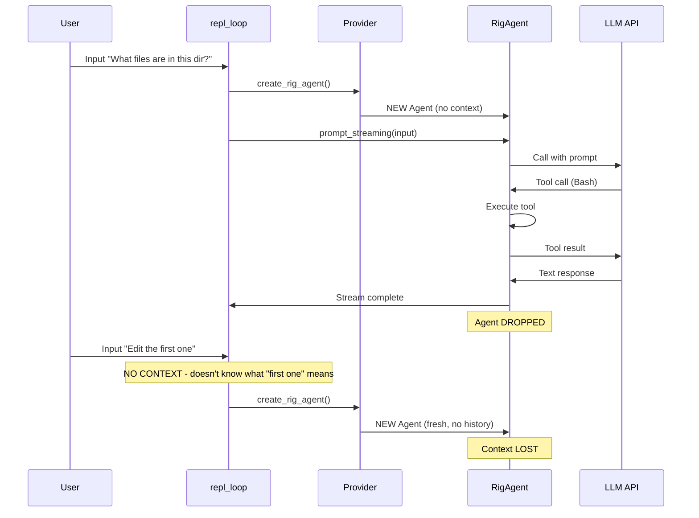

# Multi-Turn Context System Analysis - Codelet

## Executive Summary

The codelet system currently **creates a fresh agent for every user prompt** in the REPL loop, which causes **conversation context to be lost** immediately after tool execution completes. This is the root cause of the "context goes away as soon as last tool call is done" issue.

## Current Architecture

### 1. Multi-Turn Conversation Flow

The interactive REPL loop (`src/cli/interactive.rs`) follows this pattern:

```rust
// File: /home/rquast/projects/codelet/src/cli/interactive.rs
async fn repl_loop(manager: &mut ProviderManager) -> Result<()> {
    loop {
        // Read user input
        let mut input = String::new();
        std::io::stdin().read_line(&mut input)?;

        // Create NEW agent for EACH request
        run_agent_with_interruption(
            manager,
            input,
            &mut event_stream,
            &mut input_queue,
            is_interrupted.clone(),
        ).await;

        // Agent is dropped here - context lost!
    }
}
```

### 2. Agent Creation Pattern

**Key Issue**: Agent is created fresh on every request at line 141-142:

```rust
// File: /home/rquast/projects/codelet/src/cli/interactive.rs:138-151
macro_rules! run_with_provider {
    ($get_provider:ident) => {{
        let provider = manager.$get_provider()?;
        let rig_agent = provider.create_rig_agent();  // <-- Creates NEW agent
        let agent = RigAgent::with_default_depth(rig_agent);
        run_agent_stream_with_interruption(
            agent,
            prompt,
            event_stream,
            input_queue,
            is_interrupted,
        ).await
    }};
}
```

### 3. Where Context SHOULD Be Stored

Looking at the `rig` framework integration, agents are built through providers:

```rust
// File: /home/rquast/projects/codelet/src/providers/claude.rs:183-208
pub fn create_rig_agent(&self) -> rig::agent::Agent<anthropic::completion::CompletionModel> {
    let mut agent_builder = self
        .rig_client
        .agent(DEFAULT_MODEL)
        .max_tokens(MAX_OUTPUT_TOKENS as u64)
        .tool(ReadTool::new())
        .tool(WriteTool::new())
        .tool(EditTool::new())
        .tool(BashTool::new())
        .tool(GrepTool::new())
        .tool(GlobTool::new())
        .tool(AstGrepTool::new());

    if let Some(preamble) = self.system_prompt() {
        agent_builder = agent_builder.preamble(preamble);
    }

    agent_builder.build()  // Returns fresh agent with NO conversation history
}
```

### 4. RigAgent Structure

The RigAgent wrapper is simple and stateless:

```rust
// File: /home/rquast/projects/codelet/src/agent/rig_agent.rs:21-29
pub struct RigAgent<M>
where
    M: CompletionModel + 'static,
{
    /// The underlying rig agent with tools
    agent: Agent<M>,  // <-- This is the rig framework's Agent
    /// Maximum depth for multi-turn execution
    max_depth: usize,
}
```

### 5. Legacy Runner (Not Used in Interactive Mode)

The old `Runner` struct (in `/home/rquast/projects/codelet/src/agent/mod.rs`) **does** maintain message history:

```rust
// File: /home/rquast/projects/codelet/src/agent/mod.rs:96-103
pub struct Runner {
    /// Message history
    messages: Vec<Message>,  // <-- This stores conversation context!
    /// Tool registry
    tools: ToolRegistry,
    /// LLM provider for completions
    provider: Option<Box<dyn LlmProvider>>,
}
```

**However**, the interactive mode (`src/cli/interactive.rs`) **does not use Runner** - it uses RigAgent directly via the provider's `create_rig_agent()` method.

## The Problem: Context Lifecycle

### Request Lifecycle

```
User Input
    ↓
repl_loop() reads input
    ↓
run_agent_with_interruption() called
    ↓
provider.create_rig_agent() - CREATES NEW AGENT (no context)
    ↓
RigAgent::with_default_depth() - wraps it
    ↓
agent.prompt_streaming(prompt) - single-shot prompt
    ↓
Stream processing (tool calls, results, text)
    ↓
Agent is DROPPED when function returns
    ↓
**ALL CONTEXT LOST**
    ↓
Loop continues, next input gets FRESH agent
```

### Why Context Disappears

1. **Agent is created per-request**: Line 141 in `interactive.rs` creates a fresh `rig::agent::Agent` on every loop iteration
2. **No conversation history storage**: The `RigAgent` wrapper doesn't maintain message history
3. **Rig Agent state is opaque**: The underlying `rig::agent::Agent` manages its own state internally, but we create a new instance each time
4. **Old Runner not used**: The `Runner` struct which HAS message storage isn't used in interactive mode

## Relevant Data Structures

### Message Types (agent/mod.rs)

```rust
// File: /home/rquast/projects/codelet/src/agent/mod.rs:60-67
#[derive(Debug, Clone, Serialize, Deserialize)]
pub struct Message {
    pub role: MessageRole,
    pub content: MessageContent,
}

pub enum MessageRole {
    System,
    User,
    Assistant,
}

pub enum MessageContent {
    Text(String),
    Parts(Vec<ContentPart>),
}

pub enum ContentPart {
    Text { text: String },
    ToolUse { id: String, name: String, input: serde_json::Value },
    ToolResult { tool_use_id: String, content: String, is_error: bool },
}
```

These structures exist but are **not being populated or maintained** in the interactive REPL loop.

## Architecture Diagrams

### Current (Broken) Flow



### Provider Manager Structure

```rust
// File: /home/rquast/projects/codelet/src/providers/manager.rs:45-50
pub struct ProviderManager {
    credentials: ProviderCredentials,
    current_provider: ProviderType,
    // NO agent storage, NO message history!
}
```

## Code Locations Summary

### Key Files Involved

| File | Purpose | Lines of Interest |
|------|---------|-------------------|
| `/home/rquast/projects/codelet/src/cli/interactive.rs` | REPL loop | 60-127 (repl_loop), 138-151 (agent creation macro) |
| `/home/rquast/projects/codelet/src/agent/rig_agent.rs` | RigAgent wrapper | 21-29 (struct), 59-75 (prompt method) |
| `/home/rquast/projects/codelet/src/providers/claude.rs` | Claude provider | 183-208 (create_rig_agent) |
| `/home/rquast/projects/codelet/src/providers/manager.rs` | Provider manager | 45-50 (struct) |
| `/home/rquast/projects/codelet/src/agent/mod.rs` | Legacy Runner | 96-103 (Runner with messages), 134-142 (message methods) |

### Context Management Points

**Where context SHOULD be maintained:**
- Option A: In `ProviderManager` - store agent instance and reuse
- Option B: In `RigAgent` - add message history Vec
- Option C: Create session wrapper - manage agent lifecycle
- Option D: Use `Runner` instead of RigAgent in interactive mode

**Where context is currently LOST:**
- Line 141-142 in `interactive.rs` - creates fresh agent each iteration
- No storage between loop iterations in `repl_loop()`

## The Specific Problem

### Root Cause

The REPL loop at `/home/rquast/projects/codelet/src/cli/interactive.rs:60-127` creates a **NEW agent** for every user prompt:

```rust
loop {
    // Read input
    print!("{}", manager.get_prompt_prefix());
    let mut input = String::new();
    std::io::stdin().read_line(&mut input)?;

    // CHECK FOR EXIT/PROVIDER SWITCH...

    // RUN AGENT - Creates NEW agent here!
    run_agent_with_interruption(
        manager,      // Provider manager (no agent storage)
        input,        // Just this turn's input
        &mut event_stream,
        &mut input_queue,
        is_interrupted.clone(),
    ).await;

    // Agent is DROPPED when run_agent_with_interruption returns
}
```

### Evidence from Comments

From the provider code itself:

```rust
// File: /home/rquast/projects/codelet/src/providers/claude.rs:257-261
MessageRole::Assistant => {
    // Multi-turn conversation history (including assistant messages) is out of
    // scope for REFAC-003. Multi-turn support will be added in REFAC-004 using
    // rig::agent::Agent which handles conversation history automatically.
    // For now, we only extract the last user message for single-turn completions.
}
```

This comment indicates that **multi-turn conversation was planned but not implemented**.

## Solution Requirements

To fix the multi-turn context issue, the system needs:

1. **Persistent Agent Storage**: Store agent instance between REPL iterations
2. **Conversation History**: Maintain `Vec<Message>` across turns
3. **Context Injection**: Pass previous messages to each new prompt
4. **Provider Integration**: Ensure providers can accept conversation history
5. **State Management**: Handle provider switching (must clear context on switch)

### Potential Approaches

#### Approach 1: Store Agent in ProviderManager

```rust
pub struct ProviderManager {
    credentials: ProviderCredentials,
    current_provider: ProviderType,
    // Add these:
    current_agent: Option<Box<dyn Any>>,  // Store active agent
    message_history: Vec<Message>,         // Store conversation
}
```

#### Approach 2: Session Wrapper

```rust
struct InteractiveSession<M: CompletionModel> {
    agent: RigAgent<M>,
    messages: Vec<Message>,
    provider_type: ProviderType,
}

impl InteractiveSession {
    fn add_turn(&mut self, user_input: &str) -> Result<Stream> {
        // Append to messages
        // Call agent with full history
    }
}
```

#### Approach 3: Enhance RigAgent

```rust
pub struct RigAgent<M> {
    agent: Agent<M>,
    max_depth: usize,
    // Add:
    conversation_history: Vec<Message>,
}
```

#### Approach 4: Use rig's Native Context

Research if `rig::agent::Agent` has built-in conversation history management that we're not utilizing.

## Next Steps for Implementation

1. **Research rig framework**: Check if `rig::agent::Agent` supports conversation context natively
2. **Choose storage location**: Decide where to persist agent/messages
3. **Update repl_loop**: Maintain agent instance across iterations
4. **Handle provider switching**: Clear context when switching providers
5. **Test multi-turn**: Verify context persists across tool calls

---

**Report Generated**: 2025-12-03
**Codebase**: /home/rquast/projects/codelet
**Analysis Scope**: Multi-turn context management, agent lifecycle, conversation history
