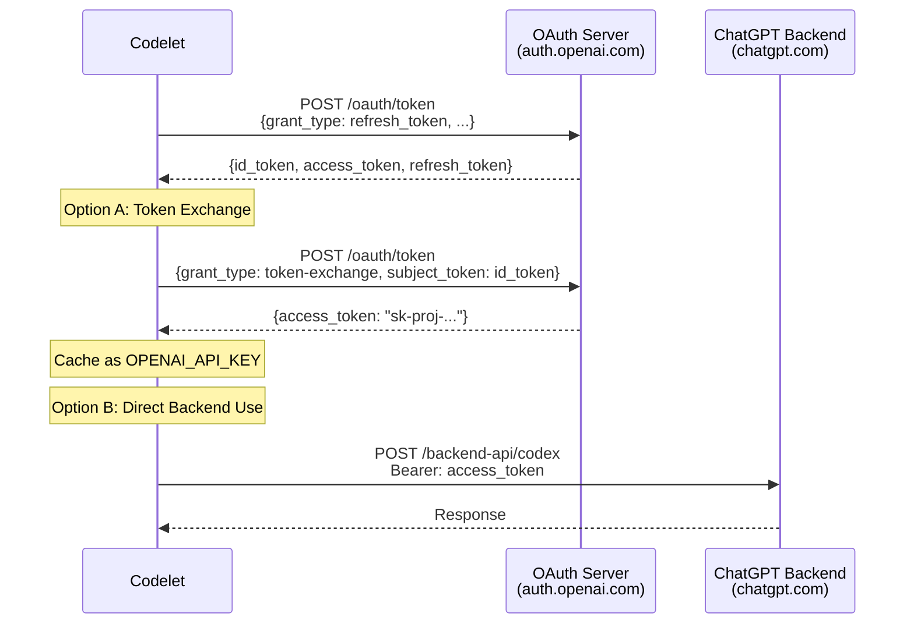

# Codex Provider Implementation Research

## Research Objective
Understand the Codex provider implementation from codelet (TypeScript) to port it to codelet (Rust), enabling GitHub Copilot CLI OAuth authentication with ChatGPT backend API.

## Executive Summary

The Codex provider enables authentication to OpenAI's ChatGPT backend API (`https://chatgpt.com/backend-api/codex`) using OAuth tokens stored in `~/.codex/auth.json` or macOS keychain. Unlike standard OpenAI API, this uses a **private backend API** with special headers and the `gpt-5.1-codex` model.

**Key Complexity**: OAuth token refresh flow + token exchange for API keys + macOS keychain integration

**Estimated Story Points**: 8 points

## Codex vs Standard OpenAI Comparison

| Aspect | Standard OpenAI (PROV-003) | Codex Provider |
|--------|----------------------------|----------------|
| API Endpoint | `https://api.openai.com/v1/chat/completions` | `https://chatgpt.com/backend-api/codex` |
| Authentication | Simple API key (`OPENAI_API_KEY` env var) | OAuth tokens with refresh flow |
| Credential Storage | Environment variable only | `~/.codex/auth.json` OR macOS keychain |
| API Type | Standard OpenAI Chat Completions API | Private ChatGPT Backend API (responses API) |
| Model | `gpt-4-turbo` (128K context, 4K output) | `gpt-5.1-codex` (context/output TBD) |
| Token Management | Static API key | Dynamic: refresh_token → id_token → access_token |
| Special Headers | None | `conversation_id`, `session_id`, `chatgpt-account-id`, `originator` |
| User-Agent | Default | Custom: `codex_cli_rs/0.1.0 (OS info) codelet` |

## Codex Authentication Flow

### 1. Credential Sources (Priority Order)

```
1. macOS Keychain (darwin only)
   ├─ Service: "Codex Auth"
   └─ Account: "cli|{first 16 chars of sha256(CODEX_HOME)}"

2. File System (all platforms)
   └─ Path: $CODEX_HOME/auth.json (default: ~/.codex/auth.json)
```

### 2. auth.json Structure

```json
{
  "OPENAI_API_KEY": "sk-proj-abc123...",  // Preferred: Proper API key from token exchange
  "tokens": {
    "id_token": "eyJ...",      // Fresh JWT from OAuth refresh
    "access_token": "tok_...", // Short-lived access token
    "refresh_token": "ref_...", // Long-lived token for refresh flow
    "account_id": "user-abc123" // ChatGPT account ID
  },
  "last_refresh": "2025-12-02T10:30:00.000Z"
}
```

**Credential Priority**:
1. **First choice**: Use `OPENAI_API_KEY` field (if present) - This is a proper OpenAI API key obtained via token exchange
2. **Fallback**: Use `tokens.access_token` for ChatGPT backend API
3. **Auto-refresh**: If only `refresh_token` exists, refresh to get fresh tokens

### 3. OAuth Token Refresh Flow



### 4. Token Exchange Grant (urn:ietf:params:oauth:grant-type:token-exchange)

**Purpose**: Convert a fresh `id_token` into a long-lived OpenAI API key (`sk-proj-...`)

**Request**:
```http
POST https://auth.openai.com/oauth/token
Content-Type: application/x-www-form-urlencoded

grant_type=urn:ietf:params:oauth:grant-type:token-exchange
client_id=app_EMoamEEZ73f0CkXaXp7hrann
requested_token=openai-api-key
subject_token={id_token}
subject_token_type=urn:ietf:params:oauth:token-type:id_token
```

**Response**:
```json
{
  "access_token": "sk-proj-abc123def456...",
  "token_type": "Bearer"
}
```

**Why This Matters**: The exchanged API key can be used with **standard OpenAI API** (`api.openai.com/v1/chat/completions`), not just the private backend. This makes the provider more flexible.

## TypeScript Implementation Analysis

### File: src/agent/codex-provider.ts

**Key Functions**:

1. **`refreshTokens(refreshToken: string)`** (lines 61-86)
   - POST to `https://auth.openai.com/oauth/token`
   - Grant type: `refresh_token`
   - Returns: `{id_token, access_token, refresh_token}`

2. **`getOrCreateSession()`** (lines 91-134)
   - Reads auth.json via `readCodexAuth()`
   - Refreshes tokens to get fresh access_token
   - Creates session with `conversationId` (UUID)
   - Updates auth.json with new tokens
   - Returns: `{conversationId, accessToken, accountId}`

3. **`createCodexProvider()`** (lines 148-172)
   - Creates session
   - Configures OpenAI provider with:
     - `baseURL`: `https://chatgpt.com/backend-api/codex`
     - `apiKey`: `session.accessToken`
     - Custom headers: `User-Agent`, `originator`, `conversation_id`, `session_id`, `chatgpt-account-id`
   - Returns: `codex.responses(CODEX_MODEL)` (uses responses API, not chat)

### File: src/agent/codex-auth.ts

**Key Functions**:

1. **`getKeychainCredentials()`** (lines 38-65)
   - macOS only (`process.platform === 'darwin'`)
   - Computes keyring key: `cli|{first 16 chars of sha256(CODEX_HOME)}`
   - Executes: `security find-generic-password -s "Codex Auth" -a "{account}" -w`
   - Returns: Parsed `CodexAuthJson` or `null`

2. **`readCodexAuth()`** (lines 171-182)
   - Priority: Try keychain first (macOS), then fall back to file
   - File path: `$CODEX_HOME/auth.json` (default: `~/.codex/auth.json`)
   - Returns: `CodexAuthJson | null`

3. **`getCodexOpenAIApiKeyAsync()`** (lines 294-335)
   - Returns cached `OPENAI_API_KEY` if available
   - Otherwise: refresh tokens → exchange id_token for API key → cache
   - Updates auth.json with new API key
   - This is the **recommended** flow for codelet

## Porting Strategy to Rust

### Dependencies Required

```toml
[dependencies]
# OAuth and HTTP
reqwest = { version = "0.12", features = ["json"] }
serde = { version = "1.0", features = ["derive"] }
serde_json = "1.0"

# Keychain access (macOS only)
keyring = "3.3"  # Cross-platform keyring API

# SHA-256 hashing for keyring key computation
sha2 = "0.10"

# UUID generation for conversation_id
uuid = { version = "1.0", features = ["v4"] }

# File I/O
tokio = { version = "1", features = ["fs"] }
```

### Implementation Plan

#### Phase 1: Authentication Module (`src/providers/codex_auth.rs`)

**Structs**:
```rust
#[derive(Debug, Clone, Serialize, Deserialize)]
pub struct CodexAuthJson {
    #[serde(rename = "OPENAI_API_KEY", skip_serializing_if = "Option::is_none")]
    pub openai_api_key: Option<String>,

    #[serde(skip_serializing_if = "Option::is_none")]
    pub tokens: Option<CodexTokens>,

    #[serde(skip_serializing_if = "Option::is_none")]
    pub last_refresh: Option<String>,
}

#[derive(Debug, Clone, Serialize, Deserialize)]
pub struct CodexTokens {
    pub id_token: String,
    pub access_token: String,
    pub refresh_token: String,
    pub account_id: String,
}
```

**Functions**:
1. `get_codex_home() -> PathBuf` - Read `CODEX_HOME` env var or default to `~/.codex`
2. `compute_store_key(codex_home: &Path) -> String` - SHA-256 hash + truncate to 16 chars
3. `read_keychain_credentials() -> Result<Option<CodexAuthJson>>` - macOS only, use `keyring` crate
4. `read_file_credentials() -> Result<Option<CodexAuthJson>>` - Read from `$CODEX_HOME/auth.json`
5. `read_codex_auth() -> Result<Option<CodexAuthJson>>` - Priority: keychain → file
6. `write_codex_auth(auth: &CodexAuthJson) -> Result<()>` - Write to `$CODEX_HOME/auth.json`

**OAuth Functions**:
7. `refresh_tokens(refresh_token: &str) -> Result<RefreshResponse>` - POST to OAuth server
8. `exchange_token_for_api_key(id_token: &str) -> Result<String>` - Token exchange grant
9. `get_codex_api_key_async() -> Result<Option<String>>` - Full flow: refresh → exchange → cache

#### Phase 2: Provider Module (`src/providers/codex.rs`)

**Structs**:
```rust
#[derive(Clone)]
pub struct CodexProvider {
    completion_model: openai::completion::CompletionModel, // Reuse OpenAI model
    rig_client: openai::CompletionsClient,
    model_name: String,
    session: CodexSession,
}

struct CodexSession {
    conversation_id: String,   // UUID v4
    access_token: String,      // From OAuth
    account_id: String,        // From auth.json
}
```

**Implementation**:
- Follow `OpenAIProvider` pattern (PROV-003) but with custom configuration:
  - Custom `baseURL`: `https://chatgpt.com/backend-api/codex`
  - Custom headers: `User-Agent`, `originator`, `conversation_id`, `session_id`, `chatgpt-account-id`
  - Model: `gpt-5.1-codex`
- Uses `openai::CompletionsClient` with custom base URL (check if rig supports this)
- Implements `LlmProvider` trait (like Claude and OpenAI)

**Key Challenges**:
1. **Rig base URL override**: Need to verify if rig-core 0.25.0 allows custom base URLs for OpenAI provider
2. **Custom headers**: Need to inject custom headers into rig's HTTP client
3. **Responses API vs Chat API**: Codex uses `responses` API, not `chat/completions`

#### Phase 3: Testing

**Test Coverage**:
1. `test_read_codex_auth_from_file()` - File-based credential reading
2. `test_refresh_tokens()` - OAuth token refresh (mock server)
3. `test_exchange_token_for_api_key()` - Token exchange (mock server)
4. `test_initialize_codex_provider()` - Provider creation with session
5. `test_codex_provider_trait_methods()` - LlmProvider trait compliance

**Integration Test** (marked `#[ignore]`):
- Requires real `~/.codex/auth.json` file
- Tests full OAuth flow + API call to ChatGPT backend

## Architectural Decisions

### Decision 1: Use Token Exchange for Standard OpenAI API

**Context**: Codex supports two modes:
- Mode A: Direct ChatGPT backend API with `access_token`
- Mode B: Token exchange to get `sk-proj-...` API key for standard OpenAI API

**Decision**: **Prefer Mode B (token exchange)** in codelet implementation

**Rationale**:
1. Standard OpenAI API is more stable than private backend
2. Can reuse existing `OpenAIProvider` infrastructure
3. Token exchange provides long-lived API keys (cache-friendly)
4. Reduces dependency on private API changes

**Implementation**:
- `CodexProvider::new()` calls `get_codex_api_key_async()`
- Exchanged API key used to create `OpenAIProvider` internally
- Falls back to direct backend if exchange fails

### Decision 2: macOS Keychain Support

**Context**: Codelet reads from macOS keychain on darwin platforms

**Decision**: **Implement keychain support using `keyring` crate**

**Rationale**:
1. The `keyring` crate is cross-platform (macOS, Windows, Linux)
2. Matches codelet's behavior for macOS users
3. Provides better security than file-only storage

**Implementation**:
- Conditional compilation: `#[cfg(target_os = "macos")]`
- Use `keyring::Entry::new("Codex Auth", &account_key)`
- Fall back to file if keyring fails

### Decision 3: Model Configuration

**Context**: Codex uses `gpt-5.1-codex` model (undocumented)

**Decision**: **Default to `gpt-5.1-codex`, allow override via `CODEX_MODEL` env var**

**Rationale**:
1. Matches codelet's default behavior
2. Provides flexibility if model changes
3. Follows pattern from `OpenAIProvider` (which allows `OPENAI_MODEL` override)

### Decision 4: No Dynamic Provider Switching in This Story

**Context**: codelet has `ProviderManager` for dynamic switching between Claude/OpenAI/Codex

**Decision**: **Defer ProviderManager to separate story (PROV-005 or INFRA-013)**

**Rationale**:
1. Keeps story focused and within 8 point limit
2. CodexProvider can be tested independently
3. ProviderManager requires CLI changes (interactive REPL mode)
4. Follows incremental porting strategy

**Future Work**:
- PROV-005: Google Gemini Provider (3-5 points)
- INFRA-013: Provider Manager + Dynamic Switching (5-8 points)

## Risk Assessment

### High Risks

1. **Rig Custom Base URL Support**
   - **Risk**: rig-core 0.25.0 may not support custom base URLs for OpenAI provider
   - **Mitigation**: Research rig source code; if unsupported, use reqwest directly or fork rig
   - **Likelihood**: Medium | **Impact**: High

2. **Private API Changes**
   - **Risk**: ChatGPT backend API (`/backend-api/codex`) is undocumented and may change
   - **Mitigation**: Prefer token exchange to use standard OpenAI API
   - **Likelihood**: High | **Impact**: Medium

3. **OAuth Token Expiration**
   - **Risk**: Tokens expire, refresh may fail without user intervention
   - **Mitigation**: Clear error messages directing user to re-authenticate via codex CLI
   - **Likelihood**: Medium | **Impact**: Medium

### Medium Risks

4. **Keychain Permission Errors (macOS)**
   - **Risk**: User may deny keychain access
   - **Mitigation**: Fall back to file-based credentials; log warning
   - **Likelihood**: Low | **Impact**: Low

5. **Cross-Platform Keychain Behavior**
   - **Risk**: `keyring` crate behavior varies by platform
   - **Mitigation**: Extensive testing on macOS, Linux, Windows
   - **Likelihood**: Medium | **Impact**: Low

## Open Questions

### Q1: Does rig-core 0.25.0 support custom base URLs for OpenAI provider?

**Answer**: Need to research rig source code

**Options**:
- **Option A**: rig supports custom `baseURL` → use rig's `OpenAIProvider` with override
- **Option B**: rig doesn't support → use reqwest directly (bypass rig for Codex)
- **Option C**: rig doesn't support → contribute PR to rig-core

**Resolution Strategy**: Clone rig repository, grep for "baseURL" or "base_url", check `openai::Client::builder()` API

### Q2: What are the context window and max output limits for gpt-5.1-codex?

**Answer**: Undocumented model, need to query API or assume defaults

**Assumption**: Use same limits as `gpt-4-turbo` (128K context, 4K output) until proven otherwise

### Q3: Should we support both responses API and chat API?

**Answer**: Defer to implementation phase

**Preferred**: Use token exchange to get standard API key → use chat API (simpler, more stable)

**Fallback**: If exchange fails, fall back to responses API with direct backend

### Q4: How should we handle missing codex credentials?

**Answer**: Return clear error with setup instructions

**Error Message**:
```
Codex provider selected but no credentials found.

To use Codex provider:
1. Authenticate with the codex CLI: `codex auth login`
2. Verify credentials exist: `cat ~/.codex/auth.json`
3. Set CODEX_HOME if using custom location

For more info: https://github.com/openai/codex
```

## Success Criteria

**Must Have** (for story completion):
1. ✅ CodexProvider implements LlmProvider trait
2. ✅ OAuth token refresh flow works
3. ✅ Token exchange for OpenAI API key works
4. ✅ Read credentials from `~/.codex/auth.json`
5. ✅ macOS keychain support (darwin only)
6. ✅ All 7 tools available to Codex provider
7. ✅ Comprehensive unit tests (mocked OAuth)
8. ✅ Integration test with real credentials (marked `#[ignore]`)

**Should Have** (nice to have):
- Clear error messages for auth failures
- Automatic token refresh on expiration
- Support for `CODEX_HOME` environment variable

**Won't Have** (deferred to future stories):
- Dynamic provider switching (`/codex` command) → INFRA-013
- Interactive REPL with provider display → INFRA-013
- Google Gemini provider → PROV-005

## Story Point Breakdown

| Task | Points | Notes |
|------|--------|-------|
| Research rig base URL support | 1 | May unblock implementation approach |
| Implement codex_auth.rs (file + keychain) | 2 | File I/O, keyring crate, SHA-256 hashing |
| Implement OAuth refresh + token exchange | 2 | HTTP requests, error handling |
| Implement CodexProvider (rig integration) | 2 | Follow OpenAIProvider pattern, custom config |
| Unit tests (mocked OAuth) | 1 | Test auth flow without real credentials |
| **Total** | **8 points** | Fits within "8 or fewer story points" constraint |

## References

### Code References (codelet TypeScript)
- `/home/rquast/projects/codelet/src/agent/codex-provider.ts` - Provider implementation
- `/home/rquast/projects/codelet/src/agent/codex-auth.ts` - Authentication flow
- `/home/rquast/projects/codelet/spec/features/multi-provider-llm-support-with-dynamic-switching.feature` - Feature spec

### Code References (codelet Rust)
- `/home/rquast/projects/codelet/src/providers/claude.rs` - Pattern to follow
- `/home/rquast/projects/codelet/src/providers/openai.rs` - Pattern to follow (closest match)
- `/home/rquast/projects/codelet/src/providers/mod.rs` - LlmProvider trait

### External References
- **OAuth 2.0 Token Exchange**: [RFC 8693](https://datatracker.ietf.org/doc/html/rfc8693)
- **OpenAI OAuth**: `https://auth.openai.com` (undocumented)
- **rig-core Documentation**: [GitHub](https://github.com/0xPlaygrounds/rig)
- **keyring Crate**: [crates.io](https://crates.io/crates/keyring)
- **Codex CLI**: [GitHub](https://github.com/openai/codex) (if public)

## Validation Checklist

Before marking story as done:
- [ ] Can create `CodexProvider::new()` with valid auth.json
- [ ] Token refresh works (integration test with real credentials)
- [ ] Token exchange works (integration test with real credentials)
- [ ] Provider responds to prompts using Codex model
- [ ] All 7 tools available and functional
- [ ] Unit tests pass (100% coverage of auth flow)
- [ ] Integration test exists (marked `#[ignore]`)
- [ ] Error handling: missing credentials, expired tokens, network failures
- [ ] Code follows DRY principles (shared with OpenAIProvider where possible)
- [ ] Code follows SOLID principles
- [ ] Clippy and rustfmt pass
- [ ] Feature file created with all scenarios
- [ ] Tests linked to feature file via coverage system
