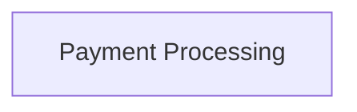

<!-- THIS FILE IS AUTO-GENERATED FROM spec/foundation.json -->
<!-- DO NOT EDIT THIS FILE DIRECTLY -->
<!-- Edit spec/foundation.json and run: fspec generate-foundation-md -->

# test-project Project Foundation

## Vision

test vision

---

## Problem Space

### test problem

test problem description

**Impact:** high

---

## Solution Space

### Overview

test solution

### Capabilities

- **Test Capability**: A test capability

---

# Domain Architecture

## Bounded Contexts

- Payment Processing

## Bounded Context Map

---
