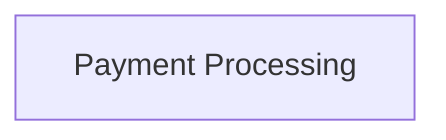

<!-- THIS FILE IS AUTO-GENERATED FROM spec/foundation.json -->
<!-- DO NOT EDIT THIS FILE DIRECTLY -->
<!-- Edit spec/foundation.json and run: fspec generate-foundation-md -->

# fspec Project Foundation

## Vision

Enable AI agents to build production-quality software through spec-driven development with ACDD workflow, eliminating babysitting and enforcing professional TDD discipline.

---

## Problem Space

### AI agents lack professional development infrastructure and quality examples

AI agents code without acceptance criteria enforcement, TDD guardrails, quality gates, or workflow management. Without quality examples, AI confabulates and hallucinates instead of asking clarifying questions, forcing developers to babysit instead of build.

**Impact:** high

---

## Solution Space

### Overview

A complete spec-driven development system that provides AI agents with professional Gherkin scenarios, Example Mapping and Event Storming for discovery and quality examples, automated test generation from acceptance criteria, TDD enforcement with temporal ordering validation, interactive Kanban TUI with live updates, git-based checkpoint systems for safe experimentation, work unit-scoped virtual hooks for quality gates, reverse ACDD for legacy codebases, foundation-level domain architecture modeling, coverage tracking linking code to business rules, and attachment viewers for rich documentation.

### Capabilities

- **Manage Work Units**: Create, track, and move work through ACDD workflow states (backlog → specifying → testing → implementing → validating → done)
- **Conduct Discovery**: Use Example Mapping and Event Storming to clarify requirements with quality examples before writing specifications
- **Write Specifications**: Create Gherkin feature files with Given-When-Then scenarios that serve as living documentation and test foundations
- **Track Coverage**: Link tests and implementation code to Gherkin scenarios for complete traceability from business rules to code
- **Create Checkpoints**: Save and restore git-based snapshots of work for safe experimentation and rollback
- **Manage Quality Gates**: Add work unit-scoped virtual hooks to enforce linting, testing, and validation at workflow transitions
- **Visualize Progress**: View interactive Kanban TUI with live updates, work unit details, attachments, and checkpoint management
- **Reverse Engineer Codebases**: Document existing codebases with feature files, test skeletons, and coverage mappings using reverse ACDD

---

## Personas

### AI Agent

AI coding assistant (Claude Code, Codex, etc.) that follows ACDD workflow to build features

**Goals:**
- Execute spec-driven development workflow with proper TDD discipline and quality gates

### Developer/Product Owner

Human developer or product owner who guides AI agents through discovery and validates implementations

**Goals:**
- Guide AI agents to build production-quality software without constant babysitting

---

# Domain Architecture

## Bounded Contexts

- Payment Processing

## Bounded Context Map

---
