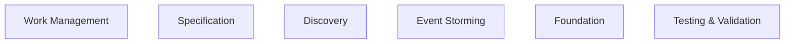

<!-- THIS FILE IS AUTO-GENERATED FROM spec/foundation.json -->
<!-- DO NOT EDIT THIS FILE DIRECTLY -->
<!-- Edit spec/foundation.json and run: fspec generate-foundation-md -->

# fspec Project Foundation

## Vision

The only system that transforms business conversations into production-ready features—unifying product owners, business analysts, developers, QA engineers, and AI agents in a single disciplined workflow where requirements become executable specs, specs become tests, and complete traceability prevents anyone (human or AI) from breaking the chain.

---

## Problem Space

### Requirements and implementation are disconnected across fragmented tools, causing lost context, broken traceability, and undisciplined AI agents

Product owners define business value in Jira. Business analysts capture requirements in sticky notes during Example Mapping sessions that get photographed and forgotten. Developers write Gherkin specs in .feature files disconnected from those requirements. QA engineers write tests disconnected from the specs. AI agents skip all of this and write code with zero traceability. The result: what gets built rarely matches what was discussed, tests don't validate the right things, and nobody can trace a line of code back to the business requirement that justified it. Every handoff loses context. Every tool works in isolation. Every AI agent operates without discipline or guardrails.

**Impact:** high

---

## Solution Space

### Overview

A unified CLI and TUI system that connects business conversations (Example Mapping, Event Storming) directly to executable Gherkin specs, enforces test-first development through workflow states, and maintains complete traceability from requirements through tests to implementation. AI agents and humans work in the same disciplined workflow with automatic checkpoints, quality gates, and coverage tracking that prevents anyone from breaking the chain of accountability.

### Capabilities

- **Kanban Project Management**: Track work units (stories, tasks, bugs) through ACDD workflow states (backlog → specifying → testing → implementing → validating → done) with dependency management and epic organization
- **Example Mapping**: Facilitate collaborative discovery sessions by capturing business rules (blue cards), concrete examples (green cards), and questions (red cards), then transform them into Gherkin scenarios
- **Event Storming**: Conduct Big Picture (foundation-level) and Process Modeling (work-unit-level) Event Storming to discover domain events, commands, aggregates, policies, and bounded contexts
- **Gherkin Specification Management**: Create, edit, validate, and format .feature files with full Cucumber compatibility, tag management, and automatic prefill detection
- **Test-Driven Development Enforcement**: Enforce TDD discipline through temporal validation that prevents writing code before tests, with @step comment validation to ensure test-to-spec traceability
- **Coverage Tracking**: Link Gherkin scenarios to test files to implementation code with .feature.coverage files that provide complete requirement-to-code traceability
- **Git Checkpoint System**: Create automatic checkpoints before workflow transitions and manual checkpoints for experimentation, with conflict-aware restoration and cleanup management
- **Virtual Hooks & Quality Gates**: Define work-unit-scoped and global lifecycle hooks that execute custom validation, testing, and automation at workflow transition points
- **Interactive TUI**: Live Kanban board with real-time updates, attachment viewer with Mermaid diagram rendering, checkpoint management, and keyboard-driven navigation
- **AST Code Analysis**: Parse and analyze code across 16 languages using tree-sitter for pattern detection, function discovery, and deep codebase understanding during discovery
- **Query & Analytics**: Query work units, bottlenecks, estimation accuracy, orphaned work, dependency statistics, and generate comprehensive summary reports
- **Reverse ACDD**: Import existing codebases into fspec by generating feature files, scenarios, and skeleton tests from existing code implementations
- **Foundation Discovery**: AI-guided field-by-field project foundation bootstrapping that defines project context, personas, capabilities, and problem space

---

## Personas

### AI Agent

Autonomous coding agents (Claude Code, Cursor, Codex, etc.) that need structured workflows and quality enforcement

**Goals:**
- Follow TDD discipline automatically

### AI Agent

Autonomous coding agents (Claude Code, Cursor, Codex, etc.) that need structured workflows and quality enforcement

**Goals:**
- Generate specs from business conversations

### AI Agent

Autonomous coding agents (Claude Code, Cursor, Codex, etc.) that need structured workflows and quality enforcement

**Goals:**
- Maintain traceability from requirements to code

### AI Agent

Autonomous coding agents (Claude Code, Cursor, Codex, etc.) that need structured workflows and quality enforcement

**Goals:**
- Self-recover from mistakes using checkpoints

### Developer

Software developers working with AI agents or manually following ACDD workflow

**Goals:**
- Clear acceptance criteria before coding

### Developer

Software developers working with AI agents or manually following ACDD workflow

**Goals:**
- Enforce test-first development

### Developer

Software developers working with AI agents or manually following ACDD workflow

**Goals:**
- Track work through Kanban states

### Developer

Software developers working with AI agents or manually following ACDD workflow

**Goals:**
- Collaborate with AI agents effectively

### Business Analyst

BAs facilitating Example Mapping and Event Storming sessions to capture requirements

**Goals:**
- Transform business conversations into executable specs

### Business Analyst

BAs facilitating Example Mapping and Event Storming sessions to capture requirements

**Goals:**
- Capture rules, examples, and questions systematically

### Business Analyst

BAs facilitating Example Mapping and Event Storming sessions to capture requirements

**Goals:**
- Ensure requirements are complete before development

### Product Owner

POs defining business value and making prioritization decisions

**Goals:**
- See exactly what's being built (acceptance criteria)

### Product Owner

POs defining business value and making prioritization decisions

**Goals:**
- Prioritize work units on Kanban board

### Product Owner

POs defining business value and making prioritization decisions

**Goals:**
- Verify features meet acceptance criteria

### QA Engineer

QA engineers validating feature implementation against specs

**Goals:**
- Trace every test back to business requirements

### QA Engineer

QA engineers validating feature implementation against specs

**Goals:**
- Verify 100% scenario coverage

### QA Engineer

QA engineers validating feature implementation against specs

**Goals:**
- Validate implementation matches acceptance criteria

---

# Domain Architecture

## Bounded Contexts

- Work Management
- Specification
- Discovery
- Event Storming
- Foundation
- Testing & Validation

## Bounded Context Map

## Work Management Context

**Aggregates:**
- WorkUnit - Story, task, or bug tracking unit
- Epic - Collection of related work units
- Dependency - Relationship between work units
- Prefix - Namespace for work unit IDs

**Domain Events:**
- WorkUnitCreated - Work unit was created
- WorkUnitStatusChanged - Work unit moved through ACDD workflow
- WorkUnitBlocked - Work unit blocked by dependency
- DependencyAdded - Dependency relationship created

**Commands:**
- CreateWorkUnit - Create story, task, or bug
- UpdateWorkUnitStatus - Move through ACDD workflow
- BlockWorkUnit - Block work unit with reason
- AddDependency - Link work units

## Specification Context

**Aggregates:**
- Feature - Gherkin feature file
- Scenario - Test scenario within feature
- Step - Given/When/Then step
- Tag - Classification metadata

**Domain Events:**
- FeatureCreated - Feature file created
- ScenarioAdded - Scenario added to feature
- FeatureValidated - Feature file passed validation
- TagRegistered - Tag added to registry

**Commands:**
- CreateFeature - Create Gherkin feature file
- AddScenario - Add scenario to feature
- ValidateFeature - Validate Gherkin syntax
- RegisterTag - Add tag to registry

## Discovery Context

**Aggregates:**
- Rule - Business rule (blue card)
- Example - Concrete example (green card)
- Question - Uncertainty (red card)
- Assumption - Answered question converted to assumption

**Domain Events:**
- RuleAdded - Business rule captured
- ExampleAdded - Concrete example captured
- QuestionAsked - Uncertainty identified
- ScenariosGenerated - Scenarios generated from example map

**Commands:**
- AddRule - Capture business rule
- AddExample - Capture concrete example
- AskQuestion - Record uncertainty
- GenerateScenarios - Generate from example map

## Event Storming Context

**Aggregates:**
- DomainEvent - Orange sticky - business event
- Command - Blue sticky - user action
- Policy - Purple sticky - reactive rule
- Hotspot - Red sticky - uncertainty/risk

**Domain Events:**
- EventStormSessionStarted - Event Storm session initiated
- DomainEventCaptured - Domain event sticky added
- CommandCaptured - Command sticky added
- HotspotCaptured - Hotspot identified

**Commands:**
- StartEventStormSession - Initiate Event Storm
- CaptureDomainEvent - Add domain event sticky
- CaptureCommand - Add command sticky
- CaptureHotspot - Mark uncertainty

## Foundation Context

**Aggregates:**
- ProjectVision - What we're building
- Capability - What the system can do
- Persona - Who uses the system
- Diagram - Mermaid architecture diagrams

**Domain Events:**
- FoundationDiscovered - Foundation initialized
- VisionDefined - Project vision articulated
- CapabilityAdded - New capability documented
- DiagramCreated - Architecture diagram added

**Commands:**
- DiscoverFoundation - Initialize foundation
- DefineVision - Articulate project vision
- AddCapability - Document capability
- AddDiagram - Create architecture diagram

## Testing & Validation Context

**Aggregates:**
- Coverage - Scenario-to-test-to-implementation mapping
- TestMapping - Test file linked to scenario
- ImplementationMapping - Source code linked to test
- ValidationResult - Syntax check, tag validation

**Domain Events:**
- CoverageGenerated - Coverage file created
- TestLinked - Test file linked to scenario
- FeatureValidated - Feature passed validation
- TagsValidated - Tags verified against registry

**Commands:**
- GenerateCoverage - Create coverage file
- LinkTest - Link test to scenario
- ValidateFeature - Check Gherkin syntax
- ValidateTags - Verify tag registry

---
