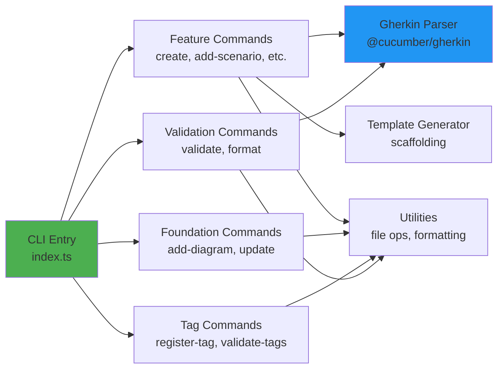
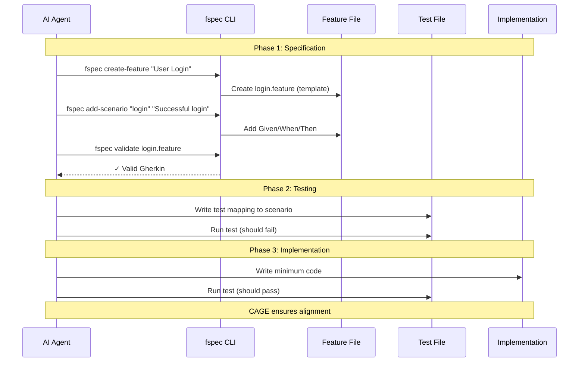

<!-- THIS FILE IS AUTO-GENERATED FROM spec/foundation.json -->
<!-- DO NOT EDIT THIS FILE DIRECTLY -->
<!-- Edit spec/foundation.json and run: fspec generate-foundation -->

# fspec Project Foundation Document

**IMPORTANT NOTE:** This is a legitimate developer tool that provides AI agents with a standardized interface for managing Gherkin-based specifications. fspec prevents ecosystem fragmentation by promoting industry-standard BDD practices over proprietary documentation formats. This tool helps AI agents ask the right questions and structure specifications correctly using battle-tested Gherkin/Cucumber conventions.

## 1. What We Are Building

### Project Overview

A CLI tool that provides AI agents (like Claude Code, GitHub Copilot, etc.) with a standardized interface for creating, validating, and managing Gherkin-based feature specifications. fspec acts as the canonical interface between AI agents and BDD specifications, ensuring proper Gherkin syntax, enforcing tag discipline, maintaining architecture documentation (Mermaid diagrams in FOUNDATION.md), and keeping the tag registry (TAGS.md) synchronized with actual usage. It is designed for developers practicing Acceptance Criteria Driven Development (ACDD) with AI assistance, particularly those using CAGE or similar agentic coding systems.

### Technical Requirements

#### Core Technologies

- **Programming Language:** TypeScript/Node.js
- **Build System:** Vite - for fast bundling and development
- **CLI Framework:** Commander.js - argument parsing and command structure
- **Gherkin Parsing:** @cucumber/gherkin-parser - official Cucumber parser
- **Formatting:** Custom AST-based formatter - using @cucumber/gherkin (replaces Prettier plugin)
- **Code Quality:** ESLint + Prettier - for TypeScript/JavaScript only
- **Testing:** Vitest - unit and integration tests following ACDD
- **Storage:** File-based - manages spec/, spec/features/, FOUNDATION.md, TAGS.md

#### Key Libraries & Dependencies

**Core:**
- **@cucumber/gherkin-parser**: Official Gherkin parser for syntax validation
- **@cucumber/messages**: Gherkin AST types and message protocol
- **commander.js**: CLI argument parsing and command structure
- **chalk**: Terminal output styling and colored messages

**File Operations:**
- **Node.js fs/promises**: File system operations (read/write feature files, FOUNDATION.md, TAGS.md)
- **glob/tinyglobby**: Pattern matching for finding feature files

**Validation & Formatting:**
- **prettier**: Code formatter (for TypeScript/JavaScript only)
- **Custom AST formatter**: Built-in Gherkin formatter using @cucumber/gherkin
- **zod**: Schema validation for internal data structures

**Development:**
- **vite**: Build system and bundler
- **vitest**: Testing framework
- **typescript**: Type checking and compilation
- **@types/node**: Node.js type definitions

### Non-Functional Requirements

- **Reliability:**
  - Gherkin syntax validation must catch ALL malformed syntax
  - Tag validation must ensure 100% registry compliance
  - File operations must be atomic (no partial writes)
  - Must never corrupt existing feature files
- **Maintainability:**
  - Follows same spec/ structure as CAGE (self-documenting)
  - Command handlers are modular and independently testable
  - Clear error messages guide AI agents to correct usage
  - JSDoc documentation for all public APIs
- **Compatibility:**
  - Node.js: 18+ (matches CAGE requirement)
  - OS Support: Cross-platform (Windows, macOS, Linux)
  - Gherkin: Follows official Cucumber Gherkin specification
  - Integration: Works seamlessly with CAGE hook system
- **Compliance:**
  - MIT License
  - Follows Cucumber Gherkin specification: https://cucumber.io/docs/gherkin/reference
  - Adheres to BDD best practices
  - All data stays local (no external services)

---

## 2. Why We Are Building It

### Problem Definition

#### Industry Fragmentation in AI-Assisted Specification Management

Some tools and approaches rely primarily on AI agents to maintain specifications without providing structured tooling to guide them. While these approaches (like spec-kit and others) offer flexibility, the lack of deterministic tooling can lead to:

No Standard Interface: AI agents have no consistent way to work with specifications
Inconsistency Risk: Without structured commands, AI may manage specs differently each time
Lost Ecosystem Benefits: Custom formats mean teams lose access to mature Cucumber tooling, parsers, and reporting
Increased Cognitive Load: Developers and AI must learn multiple formats instead of one proven standard

#### Secondary Problems

Malformed Gherkin: When AI does attempt Gherkin, syntax errors break parsing tools
Tag Chaos: Tags are created ad-hoc without registry tracking, causing inconsistency
Lost Context: AI loses track of existing features, creating duplicates or conflicts
Architecture Drift: Architecture documentation lives in separate files, becoming outdated
No Enforcement: Without tooling, teams can't enforce Gherkin standards consistently
Manual Maintenance: Developers manually fix feature files, update tags, sync docs

### Success Criteria

**Zero Malformed Gherkin:**

- AI agents produce syntactically valid Gherkin 100% of the time
- All feature files pass `@cucumber/gherkin-parser` validation
- Prettier formatting compliance for all `.feature` files

**100% Tag Registry Compliance:**

- Every tag in feature files exists in TAGS.md
- No orphaned tags in TAGS.md (all tags are actually used)
- Tag validation runs automatically via fspec commands

**Architecture Documentation Synchronization:**

- FOUNDATION.md contains up-to-date Mermaid diagrams
- Architecture notes in feature files reference FOUNDATION.md
- No stale or contradictory architecture documentation

**AI Agent Guidance:**

- AI agents consistently capture user stories (Background section)
- AI agents include architecture notes (""" doc strings) for complex features
- AI agents apply correct tags (phase, component, feature group)

**CAGE Integration Success:**

- CAGE hooks can call fspec commands via execa
- Feature files connect to test files (tracked in CAGE)
- Specifications stay aligned with code throughout development

**Ecosystem Standardization:**

- Teams choose Gherkin over proprietary formats
- fspec becomes reference implementation for AI-spec tooling
- Reduces fragmentation in AI-assisted BDD practices

**Developer Satisfaction:**

- Developers trust AI-generated specifications
- Minimal manual specification cleanup needed
- Clear error messages guide corrections when needed

---

## 3. Architecture Diagrams

### fspec System Context

```mermaid
graph TB
    AI[AI Agent<br/>Claude Code, Copilot]
    CAGE[CAGE System<br/>Hooks & Alignment]
    FSPEC[fspec CLI]
    FEATURES[Feature Files<br/>spec/features/*.feature]
    FOUNDATION[foundation.json<br/>Architecture Data]
    TAGS[tags.json<br/>Tag Registry]
    PARSER[@cucumber/gherkin-parser<br/>Validation]

    AI -->|CLI Commands| FSPEC
    CAGE -->|execa calls| FSPEC
    FSPEC -->|validate| PARSER
    FSPEC -->|read/write| FEATURES
    FSPEC -->|read/write| FOUNDATION
    FSPEC -->|read/write| TAGS
    PARSER -->|syntax check| FEATURES

    style FSPEC fill:#4CAF50
    style FEATURES fill:#2196F3
    style FOUNDATION fill:#FF9800
    style TAGS fill:#FF9800
```

### fspec Command Architecture



### ACDD Workflow with fspec



---

## 4. Core Commands Reference

### Feature File Commands

- `fspec create-feature <name>` - Create new feature file with template ✅
- `fspec add-scenario <feature> <name>` - Add scenario to feature ✅
- `fspec add-step <feature> <scenario> <type> <text>` - Add Given/When/Then step ✅
- `fspec update-scenario <feature> <old-name> <new-name>` - Rename scenario ✅
- `fspec update-step <feature> <scenario> <current-step> [--text=<new>] [--keyword=<kw>]` - Update step ✅
- `fspec delete-scenario <feature> <scenario>` - Delete scenario from feature ✅
- `fspec delete-step <feature> <scenario> <step>` - Delete step from scenario ✅
- `fspec add-architecture <feature> <notes>` - Add/update architecture doc string ✅
- `fspec add-background <feature> <user-story>` - Add/update user story background ✅
- `fspec list-features [--tag=@phase1]` - List all features (optionally filtered) ✅
- `fspec show-feature <name> [--format=text|json] [--output=file]` - Display feature file contents ✅

### FOUNDATION.md Commands

- `fspec add-diagram <section> <title> <mermaid-code>` - Add Mermaid diagram ✅
- `fspec update-foundation <section> <content>` - Update foundation section ✅
- `fspec show-foundation [--section=<name>] [--format=text|markdown|json] [--output=file] [--list-sections] [--line-numbers]` - Display FOUNDATION.md ✅

### TAGS.md Commands

- `fspec register-tag <tag> <category> <description>` - Register new tag ✅
- `fspec update-tag <tag> [--category=<cat>] [--description=<desc>]` - Update tag ✅
- `fspec delete-tag <tag> [--force] [--dry-run]` - Delete tag from registry ✅
- `fspec validate-tags` - Ensure all feature file tags exist in TAGS.md ✅
- `fspec list-tags [--category=phase]` - List registered tags ✅
- `fspec tag-stats` - Show tag usage statistics ✅
- `fspec retag --from=<old> --to=<new> [--dry-run]` - Rename tags across all files ✅

### Query & Bulk Operations Commands

- `fspec get-scenarios [--tag=@phase1]` - Get scenarios by tag(s) ✅
- `fspec show-acceptance-criteria [--tag=@phase1] [--format=text|markdown|json] [--output=file]` - Show ACs ✅
- `fspec delete-scenarios --tag=<tag> [--dry-run]` - Bulk delete scenarios by tag ✅
- `fspec delete-features --tag=<tag> [--dry-run]` - Bulk delete feature files by tag ✅

### Validation & Formatting Commands

- `fspec validate [file]` - Validate Gherkin syntax (all files or specific) ✅
- `fspec format [file]` - Format using Prettier (all files or specific) ✅
- `fspec check [--verbose]` - Run all validations (syntax + tags + formatting) ✅

---

## 5. Feature File Inventory

### Core Validation & Feature Management (5 features)

5 features

| Feature File | Command | Description |
|--------------|---------|-------------|
| gherkin-validation.feature | `fspec validate [file]` | Gherkin syntax validation using @cucumber/gherkin-parser |
| format-features.feature | `fspec format [file]` | Format feature files with Prettier |
| create-feature.feature | `fspec create-feature <name>` | Create feature file with Gherkin template |
| list-features.feature | `fspec list-features [--tag]` | List all features with optional tag filtering |
| check.feature | `fspec check [--verbose]` | Run all validations (syntax + tags + formatting) |

### Tag Registry & Management (8 features)

7 features

| Feature File | Command | Description |
|--------------|---------|-------------|
| validate-tags.feature | `fspec validate-tags [file]` | Validate feature file tags against TAGS.md registry |
| register-tag.feature | `fspec register-tag <tag> <cat> <desc>` | Register new tag in TAGS.md |
| list-tags.feature | `fspec list-tags [--category]` | List all registered tags from TAGS.md |
| tag-stats.feature | `fspec tag-stats` | Show tag usage statistics across all features |
| update-tag.feature | `fspec update-tag <tag> [--category] [--desc]` | Update tag definition in registry |
| add-architecture.feature | `fspec add-architecture <feature> <notes>` | Add/update architecture doc string in feature file |
| add-background.feature | `fspec add-background <feature> <story>` | Add/update user story background section |
| show-feature.feature | `fspec show-feature <name> [--format] [--output]` | Display feature file contents |

### Advanced Feature Editing (2 features)

2 features

| Feature File | Command | Description |
|--------------|---------|-------------|
| add-scenario.feature | `fspec add-scenario <feature> <name>` | Add new scenario to existing feature file |
| add-step.feature | `fspec add-step <feature> <scenario> <type> <text>` | Add Given/When/Then step to scenario |

### CRUD Operations & Tag-Based Queries (4 features)

4 features

| Feature File | Command | Description |
|--------------|---------|-------------|
| get-scenarios.feature | `fspec get-scenarios [--tag]` | Query scenarios by tag with AND logic filtering |
| show-acceptance-criteria.feature | `fspec show-acceptance-criteria [--tag] [--format]` | Display acceptance criteria by tag (text/markdown/JSON) |
| delete-scenario.feature | `fspec delete-scenario <feature> <scenario>` | Delete scenario from feature file |
| update-tag.feature | `fspec update-tag <tag> [options]` | Update tag category/description in registry |

### Advanced CRUD & Bulk Operations (7 features)

7 features

| Feature File | Command | Description |
|--------------|---------|-------------|
| update-scenario.feature | `fspec update-scenario <feature> <old> <new>` | Rename scenario in feature file |
| update-step.feature | `fspec update-step <feature> <scenario> <step> [options]` | Update step text or keyword |
| delete-step.feature | `fspec delete-step <feature> <scenario> <step>` | Delete step from scenario |
| delete-tag.feature | `fspec delete-tag <tag> [--force] [--dry-run]` | Delete tag from TAGS.md registry |
| retag.feature | `fspec retag --from=<old> --to=<new> [--dry-run]` | Bulk rename tags across all feature files |
| delete-scenarios-by-tag.feature | `fspec delete-scenarios --tag=<tag> [--dry-run]` | Bulk delete scenarios matching tag(s) |
| delete-features-by-tag.feature | `fspec delete-features --tag=<tag> [--dry-run]` | Bulk delete entire feature files by tag |

### Architecture Documentation (3 features)

3 features

| Feature File | Command | Description |
|--------------|---------|-------------|
| add-diagram.feature | `fspec add-diagram <section> <title> <code>` | Add/update Mermaid diagram in FOUNDATION.md |
| update-foundation.feature | `fspec update-foundation <section> <content>` | Update FOUNDATION.md section content |
| show-foundation.feature | `fspec show-foundation [options]` | Display FOUNDATION.md with multiple format options |

### Tag Usage Summary

**Phase Distribution:**
- @phase1: 5 files (18%)
- @phase2: 7 files (25%)
- @phase3: 2 files (7%)
- @phase4: 4 files (14%)
- @phase5: 7 files (25%)
- @phase6: 3 files (11%)

**Component Distribution:**
- @cli: 28 files (100%)
- @parser: 3 files (11%)
- @generator: 1 files (4%)
- @validator: 1 files (4%)
- @formatter: 1 files (4%)
- @file-ops: 1 files (4%)

---

## Notes Section

### Development Status

#### ✅ Core Validation & Feature Management (COMPLETE)
- Gherkin syntax validation using @cucumber/gherkin-parser
- Feature file creation with templates
- List features with tag filtering
- Prettier formatting integration
- Clear error messages with line numbers
- Batch validation for all feature files

**Test Coverage:** 42 tests, all passing

#### ✅ Tag Registry & Management (COMPLETE)
- TAGS.md validation and enforcement
- Tag registration with categories
- List registered tags with filtering
- Tag usage statistics and reporting
- Identify unused and unregistered tags
- Cross-file tag consistency checks

**Test Coverage:** 41 tests, all passing

#### ✅ Advanced Feature Editing (COMPLETE)
- Add scenarios to existing features
- Add steps to existing scenarios
- Preserve formatting and indentation
- Handle data tables and doc strings
- Validate modifications automatically

**Test Coverage:** 27 tests, all passing

#### ✅ CRUD Operations & Tag-Based Queries (COMPLETE)
- Query scenarios by tag(s) with AND logic
- Show acceptance criteria by tag with multiple formats (text, markdown, JSON)
- Export acceptance criteria to file
- Update tag definitions (category and/or description)
- Delete scenarios from feature files
- Preserve feature structure during deletions
- Complete tag-based filtering foundation

**Test Coverage:** 28 tests, all passing

#### ✅ Advanced CRUD & Bulk Operations (COMPLETE)
- Delete step from scenario
- Update scenario (rename)
- Update step (edit text/type)
- Delete tag from registry
- Bulk delete scenarios by tag
- Bulk delete features by tag
- Retag operations (rename tags across files)
- Comprehensive validation suite (`check` command)
- Dry-run support for destructive operations

**Test Coverage:** 108 tests, all passing

#### ✅ Architecture Documentation (COMPLETE)
- Add/update architecture notes in feature files
- Add/update user stories (Background) in feature files
- Add/update Mermaid diagrams in FOUNDATION.md
- Update foundation sections programmatically
- Display foundation content with multiple formats
- Section-specific operations
- JSON output for programmatic access
- Diagram validation and formatting

**Test Coverage:** 41 tests, all passing

### Project Name: fspec

fspec = feature specification management for AI agents. A standardized CLI tool preventing ecosystem fragmentation by promoting industry-standard Gherkin/BDD practices over proprietary specification formats. fspec ensures AI agents ask the right questions and structure specifications correctly using battle-tested Cucumber conventions.

**GitHub Repository:** https://github.com/rquast/fspec
