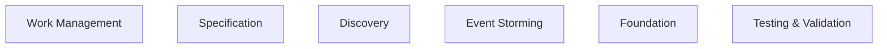

<!-- THIS FILE IS AUTO-GENERATED FROM spec/foundation.json -->
<!-- DO NOT EDIT THIS FILE DIRECTLY -->
<!-- Edit spec/foundation.json and run: fspec generate-foundation-md -->

# test-project Project Foundation

## Vision

test vision

---

## Problem Space

### test problem

test problem description

**Impact:** high

---

## Solution Space

### Overview

test solution

### Capabilities

- **Test Capability**: A test capability

---

# Domain Architecture

## Bounded Contexts

- Work Management
- Specification
- Discovery
- Event Storming
- Foundation
- Testing & Validation

## Bounded Context Map

## Work Management Context

**Aggregates:**
- WorkUnit - Story, task, or bug tracking unit
- Epic - Collection of related work units
- Dependency - Relationship between work units
- Prefix - Namespace for work unit IDs

**Domain Events:**
- WorkUnitCreated - Work unit was created
- WorkUnitStatusChanged - Work unit moved through ACDD workflow
- WorkUnitBlocked - Work unit blocked by dependency
- DependencyAdded - Dependency relationship created

**Commands:**
- CreateWorkUnit - Create story, task, or bug
- UpdateWorkUnitStatus - Move through ACDD workflow
- BlockWorkUnit - Block work unit with reason
- AddDependency - Link work units

## Specification Context

**Aggregates:**
- Feature - Gherkin feature file
- Scenario - Test scenario within feature
- Step - Given/When/Then step
- Tag - Classification metadata

**Domain Events:**
- FeatureCreated - Feature file created
- ScenarioAdded - Scenario added to feature
- FeatureValidated - Feature file passed validation
- TagRegistered - Tag added to registry

**Commands:**
- CreateFeature - Create Gherkin feature file
- AddScenario - Add scenario to feature
- ValidateFeature - Validate Gherkin syntax
- RegisterTag - Add tag to registry

## Discovery Context

**Aggregates:**
- Rule - Business rule (blue card)
- Example - Concrete example (green card)
- Question - Uncertainty (red card)
- Assumption - Answered question converted to assumption

**Domain Events:**
- RuleAdded - Business rule captured
- ExampleAdded - Concrete example captured
- QuestionAsked - Uncertainty identified
- ScenariosGenerated - Scenarios generated from example map

**Commands:**
- AddRule - Capture business rule
- AddExample - Capture concrete example
- AskQuestion - Record uncertainty
- GenerateScenarios - Generate from example map

## Event Storming Context

**Aggregates:**
- DomainEvent - Orange sticky - business event
- Command - Blue sticky - user action
- Policy - Purple sticky - reactive rule
- Hotspot - Red sticky - uncertainty/risk

**Domain Events:**
- EventStormSessionStarted - Event Storm session initiated
- DomainEventCaptured - Domain event sticky added
- CommandCaptured - Command sticky added
- HotspotCaptured - Hotspot identified

**Commands:**
- StartEventStormSession - Initiate Event Storm
- CaptureDomainEvent - Add domain event sticky
- CaptureCommand - Add command sticky
- CaptureHotspot - Mark uncertainty

## Foundation Context

**Aggregates:**
- ProjectVision - What we're building
- Capability - What the system can do
- Persona - Who uses the system
- Diagram - Mermaid architecture diagrams

**Domain Events:**
- FoundationDiscovered - Foundation initialized
- VisionDefined - Project vision articulated
- CapabilityAdded - New capability documented
- DiagramCreated - Architecture diagram added

**Commands:**
- DiscoverFoundation - Initialize foundation
- DefineVision - Articulate project vision
- AddCapability - Document capability
- AddDiagram - Create architecture diagram

## Testing & Validation Context

**Aggregates:**
- Coverage - Scenario-to-test-to-implementation mapping
- TestMapping - Test file linked to scenario
- ImplementationMapping - Source code linked to test
- ValidationResult - Syntax check, tag validation

**Domain Events:**
- CoverageGenerated - Coverage file created
- TestLinked - Test file linked to scenario
- FeatureValidated - Feature passed validation
- TagsValidated - Tags verified against registry

**Commands:**
- GenerateCoverage - Create coverage file
- LinkTest - Link test to scenario
- ValidateFeature - Check Gherkin syntax
- ValidateTags - Verify tag registry

---
