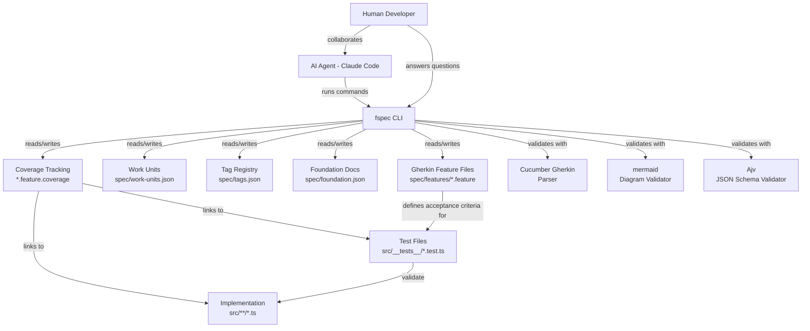
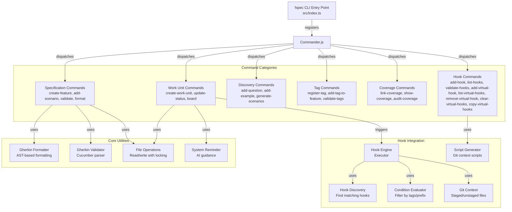
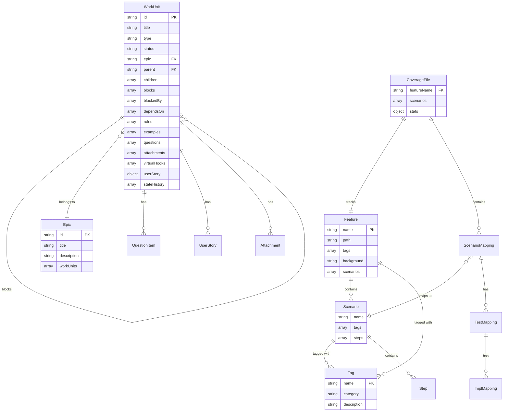
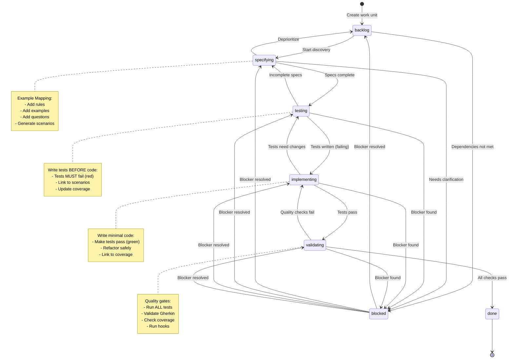
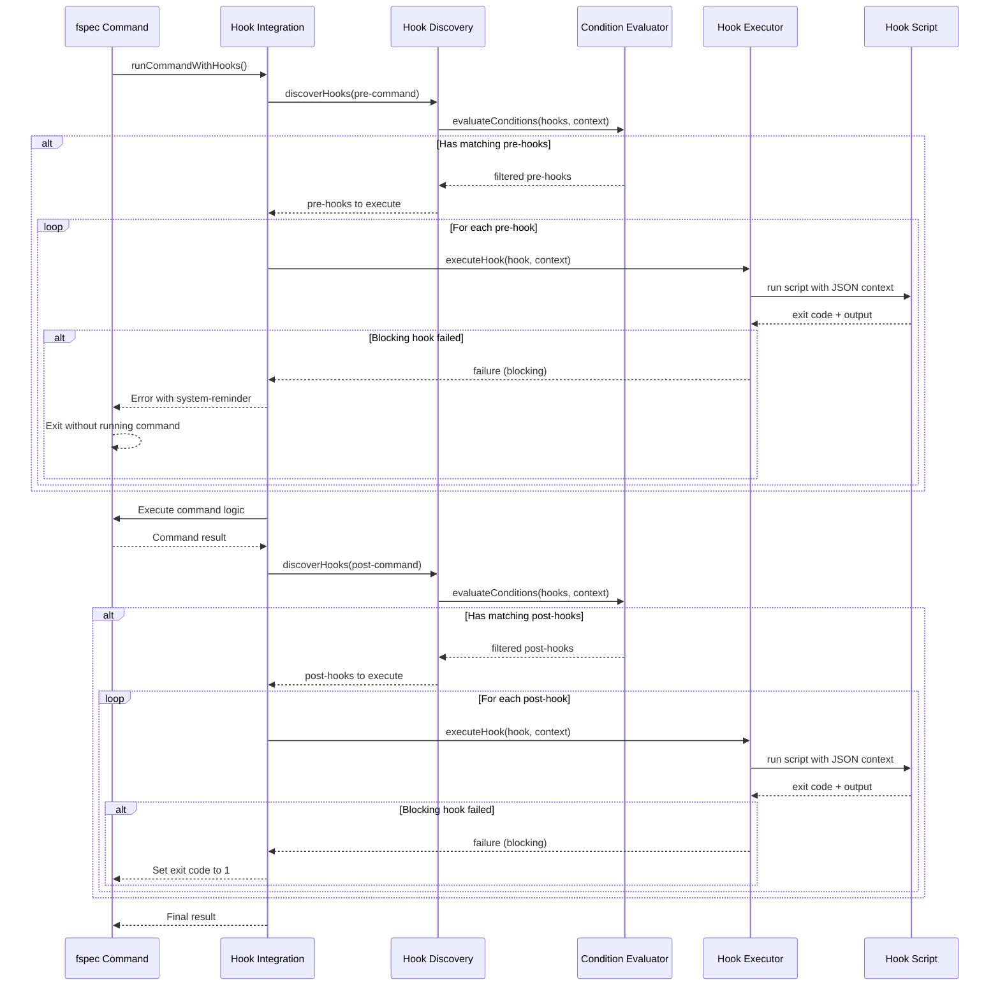
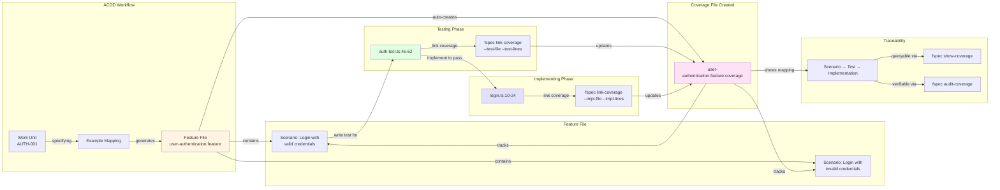
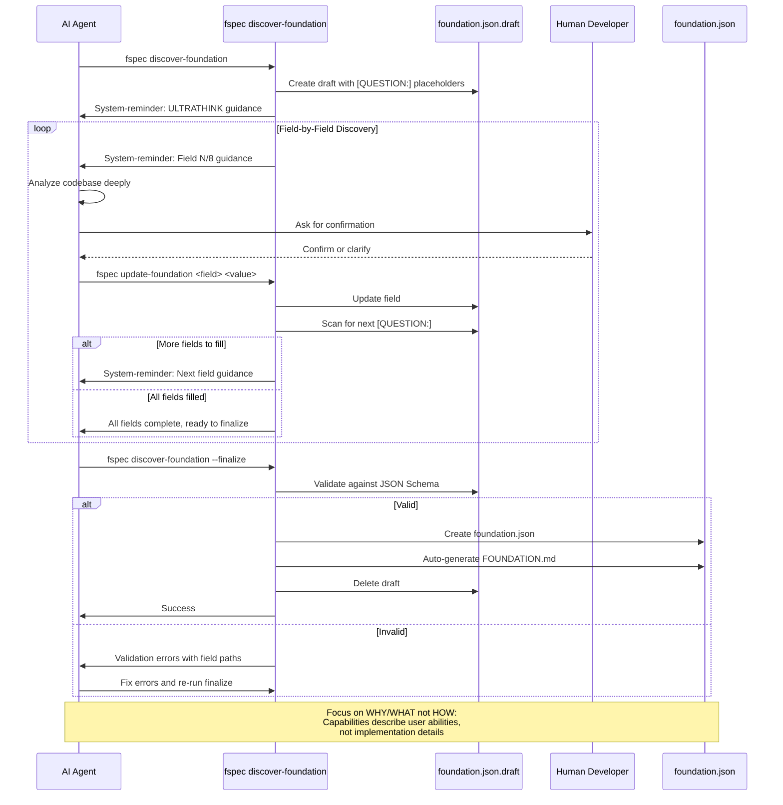
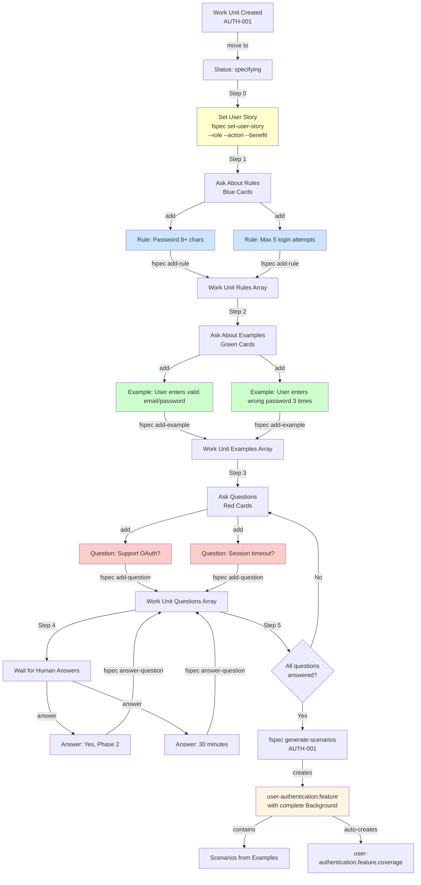

<!-- THIS FILE IS AUTO-GENERATED FROM spec/foundation.json -->
<!-- DO NOT EDIT THIS FILE DIRECTLY -->
<!-- Edit spec/foundation.json and run: fspec generate-foundation-md -->

# fspec Project Foundation

## Vision

Enable AI agents to build quality software through structured spec-driven development with enforced ACDD workflow and persistent queryable state

---

## Problem Space

### AI agents lack persistent state and workflow enforcement for building quality software

AI agents lack persistent state and workflow enforcement for building quality software. AI coding agents excel at writing code but struggle with software quality because they lose context between sessions, skip discovery phases, violate test-driven discipline, and rely on conversation history instead of queryable project state. Without structure, they jump straight to implementation without understanding requirements, creating specification chaos and building features that don't match user needs.

**Impact:** high

---

## Solution Space

### Overview

Provides AI agents with a Kanban-based project management system that enforces ACDD workflow, collaborative discovery through Example Mapping, validated Gherkin specifications, and persistent queryable state. Agents track work through structured phases, write acceptance criteria before tests, write tests before code, and maintain traceability from scenarios to implementation.

### Capabilities

- **Kanban Workflow Management**: Track work through ACDD phases (backlog → specifying → testing → implementing → validating → done) with visual board and state enforcement
- **Example Mapping Discovery**: Collaborative requirement clarification through rules, examples, and questions before writing specifications
- **Gherkin Specification Management**: Create, validate, format, and query Gherkin feature files using official Cucumber parser
- **Work Unit Management**: Create, track, prioritize, and manage work units with dependencies, epics, and estimates
- **Coverage Tracking**: Link Gherkin scenarios to test files and implementation code for full traceability
- **Tag Management**: Organize features with JSON-backed tag registry and validation
- **Foundation Discovery**: AI-guided draft-driven workflow to bootstrap project foundation documentation
- **Lifecycle Hooks**: Execute custom scripts at command events for quality gates and workflow automation
- **Virtual Hooks**: Work unit-scoped ephemeral hooks for temporary quality checks with auto-generated git context scripts
- **Interactive Reverse ACDD Strategy Planning**: Analyze project state to detect gaps (missing features, tests, coverage), suggest strategic approaches, and guide AI step-by-step through gap-filling workflow for existing codebases

---

## Personas

### AI Agent (Claude Code)

AI coding agent that uses fspec to manage project work and specifications through ACDD workflow

**Goals:**
- Build quality software using ACDD
- Maintain persistent queryable project state
- Enforce workflow discipline and prevent shortcuts

### Human Developer

Software developer collaborating with AI agents during discovery and validation

**Goals:**
- Provide clear requirements through Example Mapping
- Answer clarifying questions during discovery
- Validate AI's understanding of user stories

### Team Lead / Product Owner

Technical leader managing project priorities and tracking progress

**Goals:**
- Track work progress across Kanban board
- Prioritize backlog based on business value
- Ensure specifications align with business goals

---

## Architecture Diagrams

### System Context

### Command Architecture

### Data Model

### ACDD Workflow State Machine

### File System Structure

```mermaid
graph TD
    Root[Project Root]
    
    Root --> Spec[spec/]
    Root --> Src[src/]
    Root --> Claude[.claude/]
    
    Spec --> Features[features/]
    Spec --> WorkUnits[work-units.json]
    Spec --> Tags[tags.json]
    Spec --> Foundation[foundation.json]
    Spec --> Epics[epics.json]
    Spec --> Prefixes[prefixes.json]
    Spec --> SpecAttachments[attachments/]
    Spec --> HooksDir[hooks/]
    Spec --> HooksConfig[fspec-hooks.json]
    Spec --> ClaudeSpec[CLAUDE.md]
    
    HooksDir --> VirtualHooksDir[.virtual/]
    VirtualHooksDir --> GeneratedScripts[<work-unit-id>-<hook-name>.sh]
    Spec --> TagsMd[TAGS.md]
    Spec --> FoundationMd[FOUNDATION.md]
    
    Features --> Feature1[*.feature]
    Features --> Coverage1[*.feature.coverage]
    
    Feature1 -->|defines| Scenarios[Scenarios with<br/>acceptance criteria]
    Coverage1 -->|links| TestFiles[Test files with<br/>line numbers]
    Coverage1 -->|links| ImplFiles[Implementation files<br/>with line numbers]
    
    SpecAttachments --> WorkUnitDir[work-unit-id/]
    WorkUnitDir --> Diagrams[diagrams/]
    WorkUnitDir --> Mockups[mockups/]
    WorkUnitDir --> Docs[documents/]
    
    Src --> Commands[commands/]
    Src --> Utils[utils/]
    Src --> Types[types/]
    Src --> HooksSrc[hooks/]
    Src --> Validators[validators/]
    
    Claude --> FspecCmd[commands/fspec.md]
    Claude --> RspecCmd[commands/rspec.md]
    
    style WorkUnits fill:#e1f5ff
    style Tags fill:#e1f5ff
    style Foundation fill:#e1f5ff
    style Feature1 fill:#fff4e1
    style Coverage1 fill:#ffe1f5
```

### Hook System Architecture

### Coverage Tracking Flow

### Foundation Discovery Workflow

### Example Mapping Process

---
