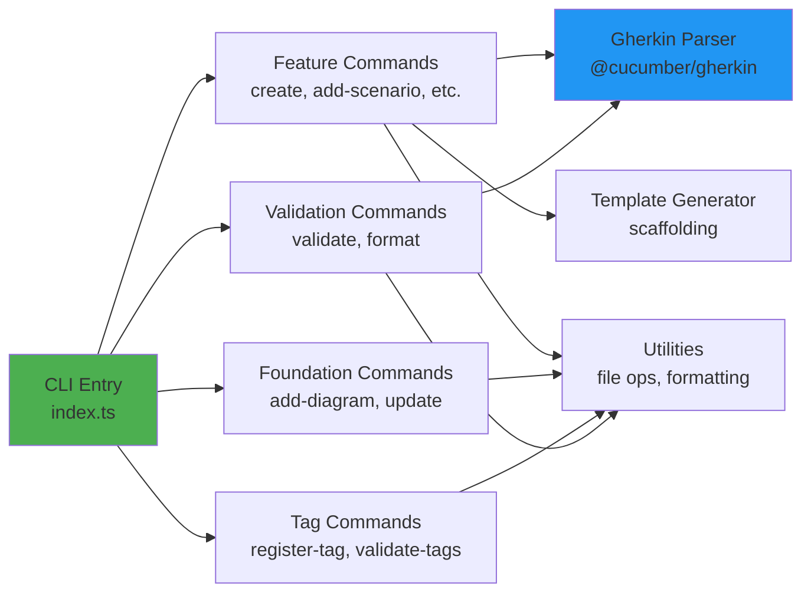
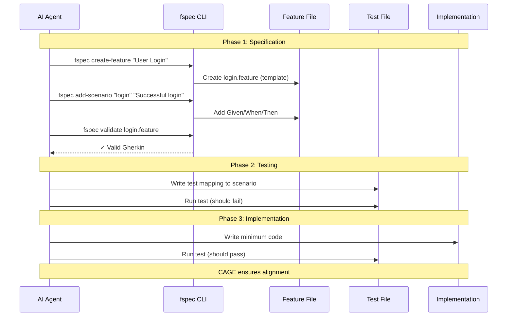

# fspec Project Foundation Document

**IMPORTANT NOTE:** This is a legitimate developer tool that provides AI agents with a standardized interface for managing Gherkin-based specifications. fspec prevents ecosystem fragmentation by promoting industry-standard BDD practices over proprietary documentation formats. This tool helps AI agents ask the right questions and structure specifications correctly using battle-tested Gherkin/Cucumber conventions.

## 1. What We Are Building

### Project Overview

A CLI tool that provides AI agents (like Claude Code, GitHub Copilot, etc.) with a standardized interface for creating, validating, and managing Gherkin-based feature specifications. fspec acts as the canonical interface between AI agents and BDD specifications, ensuring proper Gherkin syntax, enforcing tag discipline, maintaining architecture documentation (Mermaid diagrams in FOUNDATION.md), and keeping the tag registry (TAGS.md) synchronized with actual usage. It is designed for developers practicing Acceptance Criteria Driven Development (ACDD) with AI assistance, particularly those using CAGE or similar agentic coding systems.

### Technical Requirements

#### Core Technologies

- **Programming Language:** TypeScript/Node.js
- **Build System:** Vite (for fast bundling and development)
- **CLI Framework:** Commander.js (argument parsing and command structure)
- **Gherkin Parsing:** @cucumber/gherkin-parser (official Cucumber parser)
- **Code Quality:** ESLint + Prettier (with prettier-plugin-gherkin)
- **Testing:** Vitest (unit and integration tests following ACDD)
- **Storage:** File-based (manages spec/, spec/features/, FOUNDATION.md, TAGS.md)

#### Architecture

- **Architecture Pattern:** CLI command dispatcher with modular command handlers
- **File Structure:**
  ```
  fspec/
  ├── src/
  │   ├── index.ts                 # CLI entry point
  │   ├── commands/                # Command implementations
  │   │   ├── feature/             # Feature file commands
  │   │   ├── foundation/          # FOUNDATION.md commands
  │   │   ├── tags/                # TAGS.md commands
  │   │   └── validate/            # Validation commands
  │   ├── parsers/                 # Gherkin parsing logic
  │   ├── generators/              # Template generators
  │   └── utils/                   # Shared utilities
  └── spec/                        # fspec's own specifications
      ├── FOUNDATION.md            # This file
      ├── TAGS.md                  # Tag registry
      └── features/                # Gherkin feature files
  ```
- **Deployment Target:** Local development machines (invoked by CAGE hooks or directly by AI agents)
- **Integration Model:**
  - CAGE hooks call fspec via `execa` (Node.js child process)
  - AI agents can invoke fspec CLI commands directly
  - All operations are synchronous (no service/API component)

#### Development & Operations

- **Development Tools:** Standard TypeScript/Node.js toolchain
- **Testing Strategy:** ACDD methodology - feature files first, tests second, code last
- **Logging:** Console output (success/error messages) - verbose mode for debugging
- **Validation:** Gherkin syntax validation using @cucumber/gherkin-parser
- **Formatting:** Prettier with prettier-plugin-gherkin for consistent formatting

#### Key Libraries & Dependencies

**Core:**
- **@cucumber/gherkin-parser**: Official Gherkin parser for syntax validation
- **@cucumber/messages**: Gherkin AST types and message protocol
- **commander.js**: CLI argument parsing and command structure
- **chalk**: Terminal output styling and colored messages

**File Operations:**
- **Node.js fs/promises**: File system operations (read/write feature files, FOUNDATION.md, TAGS.md)
- **glob/tinyglobby**: Pattern matching for finding feature files

**Validation & Formatting:**
- **prettier**: Code formatter
- **prettier-plugin-gherkin**: Gherkin-specific formatting rules
- **zod**: Schema validation for internal data structures

**Development:**
- **vite**: Build system and bundler
- **vitest**: Testing framework
- **typescript**: Type checking and compilation
- **@types/node**: Node.js type definitions

### Non-Functional Requirements

- **Reliability:**
  - Gherkin syntax validation must catch ALL malformed syntax
  - Tag validation must ensure 100% registry compliance
  - File operations must be atomic (no partial writes)
  - Must never corrupt existing feature files
- **Maintainability:**
  - Follows same spec/ structure as CAGE (self-documenting)
  - Command handlers are modular and independently testable
  - Clear error messages guide AI agents to correct usage
  - JSDoc documentation for all public APIs
- **Compatibility:**
  - Node.js: 18+ (matches CAGE requirement)
  - OS Support: Cross-platform (Windows, macOS, Linux)
  - Gherkin: Follows official Cucumber Gherkin specification
  - Integration: Works seamlessly with CAGE hook system
- **Compliance:**
  - MIT License
  - Follows Cucumber Gherkin specification: https://cucumber.io/docs/gherkin/reference
  - Adheres to BDD best practices
  - All data stays local (no external services)

---

## 2. Why We Are Building It

### Problem Definition

#### Primary Problem

**Industry Fragmentation in AI-Assisted Specification Management**

Major companies and tools are creating proprietary specification formats (like spec-kit and others) that ignore decades of established BDD practices. This fragmentation forces AI agents to improvise with unstructured markdown or learn multiple proprietary formats, leading to:

1. **No Standard Interface**: AI agents have no consistent way to work with specifications
2. **Reinventing the Wheel**: Proprietary formats duplicate functionality that Gherkin already provides
3. **Lost Ecosystem Benefits**: Teams lose access to mature Cucumber tooling, parsers, and reporting
4. **Increased Cognitive Load**: Developers and AI must learn multiple formats instead of one proven standard

**AI Agents Default to Unstructured Specifications**

When AI agents (Claude Code, Copilot, etc.) are asked to write specifications, they default to unstructured markdown documents. This happens because:

1. **No Guidance**: AI lacks a structured interface for specification management
2. **Wrong Questions**: AI doesn't know what information to capture (user stories, acceptance criteria, architecture)
3. **No Validation**: Markdown specs have no enforced structure, leading to inconsistency
4. **Not Testable**: Markdown specs don't connect to automated tests
5. **Not Parseable**: Tools can't extract scenarios, steps, or generate reports

#### Secondary Problems

1. **Malformed Gherkin**: When AI does attempt Gherkin, syntax errors break parsing tools
2. **Tag Chaos**: Tags are created ad-hoc without registry tracking, causing inconsistency
3. **Lost Context**: AI loses track of existing features, creating duplicates or conflicts
4. **Architecture Drift**: Architecture documentation lives in separate files, becoming outdated
5. **No Enforcement**: Without tooling, teams can't enforce Gherkin standards consistently
6. **Manual Maintenance**: Developers manually fix feature files, update tags, sync docs

### Pain Points

#### Current State Analysis

Without fspec, AI-assisted specification management looks like this:

- AI agents write specifications in unstructured markdown (`.md` files)
- Developers manually convert markdown to Gherkin (if they use BDD at all)
- Gherkin files have syntax errors that break Cucumber tooling
- Tags are created inconsistently (`@phase1` vs `@phase-1` vs `@p1`)
- TAGS.md registry diverges from actual feature file tags
- Architecture diagrams live in scattered documents, becoming stale
- No automated validation catches problems until tests fail
- Teams fragment across proprietary formats, losing interoperability

#### Specific Pain Points

1. **AI Writes Unstructured Markdown Instead of Gherkin:**
   - Impact: Specifications aren't testable, parseable, or connected to code
   - Frequency: Every time AI is asked to write specifications
   - Cost: Manual conversion effort, lost BDD benefits, technical debt

2. **Malformed Gherkin Breaks Tooling:**
   - Impact: Cucumber parsers fail, CI pipelines break, reports can't generate
   - Frequency: Frequently when AI attempts Gherkin without validation
   - Cost: Developer time fixing syntax, broken builds, delayed testing

3. **Tag Discipline Breakdown:**
   - Impact: Cannot filter/query features reliably, tags become meaningless
   - Frequency: Progressive degradation as project grows
   - Cost: Lost organizational structure, manual tag cleanup, spec chaos

4. **Architecture Documentation Drift:**
   - Impact: FOUNDATION.md becomes outdated, diagrams don't match reality
   - Frequency: Continuously as code evolves
   - Cost: Misleading documentation, onboarding confusion, architectural misalignment

5. **Ecosystem Fragmentation:**
   - Impact: Teams adopt proprietary formats, losing interoperability
   - Frequency: Industry-wide trend (spec-kit, custom markdown, etc.)
   - Cost: Reinvented wheels, incompatible tooling, knowledge fragmentation

6. **No AI Guidance for "Right Questions":**
   - Impact: AI captures wrong information (implementation details instead of behavior)
   - Frequency: Consistently without structured prompts
   - Cost: Poor specifications, missed acceptance criteria, test gaps

### Stakeholder Impact

- **Developers Using AI Pair Programming:** Frustrated by constantly fixing malformed specifications and manually enforcing standards. Time wasted on specification hygiene instead of building features.

- **Teams Practicing BDD:** Cannot rely on AI to maintain specification quality. Must choose between AI assistance OR specification discipline, not both.

- **Organizations Adopting ACDD:** Lack tooling to enforce specification-first workflows with AI agents. Risk specification drift and code-spec misalignment.

- **BDD Community:** Industry fragmentation undermines decades of Cucumber/Gherkin standardization. Proprietary formats fragment ecosystem and knowledge.

### Theoretical Solutions

#### Solution Approach 1: fspec - Standardized AI Interface for Gherkin (Selected Approach)

- **Description:** CLI tool providing AI agents with structured commands for managing Gherkin specifications. Validates syntax, enforces tag discipline, maintains FOUNDATION.md (with Mermaid diagrams), and keeps TAGS.md synchronized. Prevents fragmentation by promoting industry-standard Gherkin over proprietary formats.

- **Pros:**
  - Leverages 15+ years of Gherkin/Cucumber ecosystem maturity
  - Validates syntax using official @cucumber/gherkin-parser
  - Enforces standards automatically (tags, architecture docs, formatting)
  - Guides AI to ask right questions (user stories, acceptance criteria)
  - Works with existing Cucumber tooling (parsers, reporters, test frameworks)
  - Prevents ecosystem fragmentation through standardization
  - Enables CAGE to maintain code-spec alignment

- **Cons:**
  - Requires AI agents to learn fspec CLI interface
  - Adds dependency to development workflow
  - Initial setup effort for spec/ directory structure

- **Feasibility:** Highly feasible - builds on proven Cucumber parser, simple CLI architecture

#### Solution Approach 2: AI Prompt Engineering Only

- **Description:** Provide AI with detailed prompts teaching Gherkin syntax without tooling

- **Pros:**
  - No additional tooling needed
  - Simple to implement

- **Cons:**
  - No validation enforcement
  - AI still produces syntax errors
  - Cannot maintain tag registry or architecture docs
  - No protection against fragmentation
  - Doesn't scale across teams

- **Feasibility:** Easy but ineffective for reliable specification management

#### Solution Approach 3: Proprietary Format (Like spec-kit)

- **Description:** Create new specification format designed specifically for AI agents

- **Pros:**
  - Could optimize for AI agent interaction patterns
  - Full control over format evolution

- **Cons:**
  - **Contributes to fragmentation problem** (the exact issue we're solving!)
  - Loses Cucumber ecosystem benefits
  - Requires building entire tooling stack from scratch
  - No interoperability with existing BDD tools
  - Ignores 15+ years of Gherkin maturity

- **Feasibility:** Feasible but counterproductive - we'd become part of the problem

### Development Methodology: Acceptance Criteria Driven Development (ACDD)

fspec follows **Acceptance Criteria Driven Development**:

1. **Specification First:** Define acceptance criteria in Gherkin format (spec/features/*.feature)
2. **Test Second:** Write tests that implement acceptance criteria (before any code)
3. **Code Last:** Write minimum code to make tests pass

This approach ensures:
- Every feature has clear, testable acceptance criteria
- fspec "eats its own dog food" - uses itself to manage its own specifications
- Tests serve as living documentation
- Code directly maps to specified requirements

### Success Criteria

Define what success looks like for fspec:

1. **Zero Malformed Gherkin:**
   - AI agents produce syntactically valid Gherkin 100% of the time
   - All feature files pass `@cucumber/gherkin-parser` validation
   - Prettier formatting compliance for all `.feature` files

2. **100% Tag Registry Compliance:**
   - Every tag in feature files exists in TAGS.md
   - No orphaned tags in TAGS.md (all tags are actually used)
   - Tag validation runs automatically via fspec commands

3. **Architecture Documentation Synchronization:**
   - FOUNDATION.md contains up-to-date Mermaid diagrams
   - Architecture notes in feature files reference FOUNDATION.md
   - No stale or contradictory architecture documentation

4. **AI Agent Guidance:**
   - AI agents consistently capture user stories (Background section)
   - AI agents include architecture notes (""" doc strings) for complex features
   - AI agents apply correct tags (phase, component, feature group)

5. **CAGE Integration Success:**
   - CAGE hooks can call fspec commands via execa
   - Feature files connect to test files (tracked in CAGE)
   - Specifications stay aligned with code throughout development

6. **Ecosystem Standardization:**
   - Teams choose Gherkin over proprietary formats
   - fspec becomes reference implementation for AI-spec tooling
   - Reduces fragmentation in AI-assisted BDD practices

7. **Developer Satisfaction:**
   - Developers trust AI-generated specifications
   - Minimal manual specification cleanup needed
   - Clear error messages guide corrections when needed

### Constraints & Assumptions

#### Constraints

- **Integration Dependency:** Designed for CAGE integration (execa-based CLI invocation)
- **Technical Constraints:**
  - Must use official @cucumber/gherkin-parser (syntax compatibility)
  - Must follow Cucumber Gherkin specification exactly
  - Must work with CAGE's spec/ directory structure
- **Scope Constraints:**
  - CLI only (no API/service component)
  - File-based operations (no database)
  - Synchronous execution (CAGE hooks need immediate feedback)

#### Assumptions

- **AI Agent Capabilities:**
  - AI agents can execute CLI commands
  - AI agents can interpret error messages and correct mistakes
  - AI agents will follow structured prompts when guided
- **Gherkin Stability:**
  - Cucumber Gherkin specification remains stable
  - @cucumber/gherkin-parser maintains backward compatibility
- **Developer Environment:**
  - Node.js 18+ installed
  - Git repository with spec/ directory structure
  - Prettier and Gherkin plugin available
- **CAGE Integration:**
  - CAGE hooks provide necessary context for fspec commands
  - CAGE manages test-to-feature mapping (fspec only validates feature files)

---

## 3. Architecture Diagrams

### fspec System Context

```mermaid
graph TB
    AI[AI Agent<br/>Claude Code, Copilot]
    CAGE[CAGE System<br/>Hooks & Alignment]
    FSPEC[fspec CLI]
    FEATURES[Feature Files<br/>spec/features/*.feature]
    FOUNDATION[FOUNDATION.md<br/>Architecture Docs]
    TAGS[TAGS.md<br/>Tag Registry]
    PARSER[@cucumber/gherkin-parser<br/>Validation]

    AI -->|CLI Commands| FSPEC
    CAGE -->|execa calls| FSPEC
    FSPEC -->|validate| PARSER
    FSPEC -->|read/write| FEATURES
    FSPEC -->|read/write| FOUNDATION
    FSPEC -->|read/write| TAGS
    PARSER -->|syntax check| FEATURES

    style FSPEC fill:#4CAF50
    style FEATURES fill:#2196F3
    style FOUNDATION fill:#FF9800
    style TAGS fill:#FF9800
```

### fspec Command Architecture



### ACDD Workflow with fspec



---

## 4. Core Commands Reference

### Feature File Commands

- `fspec create-feature <name>` - Create new feature file with template ✅
- `fspec add-scenario <feature> <name>` - Add scenario to feature ✅
- `fspec add-step <feature> <scenario> <type> <text>` - Add Given/When/Then step ✅
- `fspec update-scenario <feature> <old-name> <new-name>` - Rename scenario ✅
- `fspec update-step <feature> <scenario> <current-step> [--text=<new>] [--keyword=<kw>]` - Update step ✅
- `fspec delete-scenario <feature> <scenario>` - Delete scenario from feature ✅
- `fspec delete-step <feature> <scenario> <step>` - Delete step from scenario ✅
- `fspec add-architecture <feature> <notes>` - Add/update architecture doc string ✅
- `fspec add-background <feature> <user-story>` - Add/update user story background ✅
- `fspec list-features [--tag=@phase1]` - List all features (optionally filtered) ✅
- `fspec show-feature <name> [--format=text|json] [--output=file]` - Display feature file contents ✅

### FOUNDATION.md Commands

- `fspec add-diagram <section> <title> <mermaid-code>` - Add Mermaid diagram ✅
- `fspec update-foundation <section> <content>` - Update foundation section ✅
- `fspec show-foundation [--section=<name>] [--format=text|markdown|json] [--output=file] [--list-sections] [--line-numbers]` - Display FOUNDATION.md ✅

### TAGS.md Commands

- `fspec register-tag <tag> <category> <description>` - Register new tag ✅
- `fspec update-tag <tag> [--category=<cat>] [--description=<desc>]` - Update tag ✅
- `fspec delete-tag <tag> [--force] [--dry-run]` - Delete tag from registry ✅
- `fspec validate-tags` - Ensure all feature file tags exist in TAGS.md ✅
- `fspec list-tags [--category=phase]` - List registered tags ✅
- `fspec tag-stats` - Show tag usage statistics ✅
- `fspec retag --from=<old> --to=<new> [--dry-run]` - Rename tags across all files ✅

### Query & Bulk Operations Commands

- `fspec get-scenarios [--tag=@phase1]` - Get scenarios by tag(s) ✅
- `fspec show-acceptance-criteria [--tag=@phase1] [--format=text|markdown|json] [--output=file]` - Show ACs ✅
- `fspec delete-scenarios --tag=<tag> [--dry-run]` - Bulk delete scenarios by tag ✅
- `fspec delete-features --tag=<tag> [--dry-run]` - Bulk delete feature files by tag ✅

### Validation & Formatting Commands

- `fspec validate [file]` - Validate Gherkin syntax (all files or specific) ✅
- `fspec format [file]` - Format using Prettier (all files or specific) ✅
- `fspec validate-tags [file]` - Validate tags against registry ✅
- `fspec check [--verbose]` - Run all validations (syntax + tags + formatting) ✅

---

## Notes Section

### Development Status

#### ✅ Phase 1 - Core Validation & Feature Management (COMPLETE)
- ✅ Gherkin syntax validation using @cucumber/gherkin-parser
- ✅ Feature file creation with templates
- ✅ List features with tag filtering
- ✅ Prettier formatting integration
- ✅ Clear error messages with line numbers
- ✅ Batch validation for all feature files

**Test Coverage:** 42 tests, all passing

#### ✅ Phase 2 - Tag Registry & Management (COMPLETE)
- ✅ TAGS.md validation and enforcement
- ✅ Tag registration with categories
- ✅ List registered tags with filtering
- ✅ Tag usage statistics and reporting
- ✅ Identify unused and unregistered tags
- ✅ Cross-file tag consistency checks

**Test Coverage:** 41 tests, all passing

#### ✅ Phase 3 - Advanced Feature Editing (COMPLETE)
- ✅ Add scenarios to existing features
- ✅ Add steps to existing scenarios
- ✅ Preserve formatting and indentation
- ✅ Handle data tables and doc strings
- ✅ Validate modifications automatically

**Test Coverage:** 27 tests, all passing

#### ✅ Phase 4 - CRUD Operations & Tag-Based Queries (COMPLETE)
- ✅ Query scenarios by tag(s) with AND logic
- ✅ Show acceptance criteria by tag with multiple formats (text, markdown, JSON)
- ✅ Export acceptance criteria to file
- ✅ Update tag definitions (category and/or description)
- ✅ Delete scenarios from feature files
- ✅ Preserve feature structure during deletions
- ✅ Complete tag-based filtering foundation

**Test Coverage:** 28 tests, all passing

#### ✅ Phase 5 - Advanced CRUD & Bulk Operations (COMPLETE)
- ✅ Delete step from scenario
- ✅ Update scenario (rename)
- ✅ Update step (edit text/type)
- ✅ Delete tag from registry
- ✅ Bulk delete scenarios by tag
- ✅ Bulk delete features by tag
- ✅ Retag operations (rename tags across files)
- ✅ Comprehensive validation suite (`check` command)
- ✅ Dry-run support for destructive operations

**Test Coverage:** 108 tests, all passing

#### ✅ Phase 6 - Architecture Documentation (COMPLETE)
- ✅ Add/update architecture notes in feature files
- ✅ Add/update user stories (Background) in feature files
- ✅ Add/update Mermaid diagrams in FOUNDATION.md
- ✅ Update foundation sections programmatically
- ✅ Display foundation content with multiple formats
- ✅ Section-specific operations
- ✅ JSON output for programmatic access
- ✅ Diagram validation and formatting

**Test Coverage:** 41 tests, all passing

#### 🎯 All Core Features Complete!

**Overall Progress:**
- **Commands Implemented:** 29/29 (100%)
- **Total Tests:** 315 passing (100% pass rate)
- **Feature Files:** 28 validated specifications
- **Code Coverage:** All commands fully tested
- **Build Size:** 84.15 kB (gzip: 17.54 kB)

#### 🔮 Future Enhancements (Optional)
- **JSON I/O Enhancement**: Consistent JSON input/output across all commands for easier AI agent integration
  - Accept JSON input for complex operations (multi-step scenarios, batch updates)
  - Standardize JSON output format across all commands
  - Machine-readable error responses in JSON format

### Integration with CAGE

fspec is designed as a companion tool to CAGE:

- **CAGE Responsibility:** Code-spec alignment, test-to-feature mapping, hook orchestration
- **fspec Responsibility:** Gherkin validation, tag discipline, architecture documentation, specification structure

CAGE hooks invoke fspec to ensure specifications remain valid and well-organized throughout agentic coding sessions.

### Project Name: fspec

**fspec** = **f**eature **spec**ification management for AI agents

A standardized CLI tool preventing ecosystem fragmentation by promoting industry-standard Gherkin/BDD practices over proprietary specification formats. fspec ensures AI agents ask the right questions and structure specifications correctly using battle-tested Cucumber conventions.

**GitHub Repository:** https://github.com/rquast/fspec (or your preferred location)
