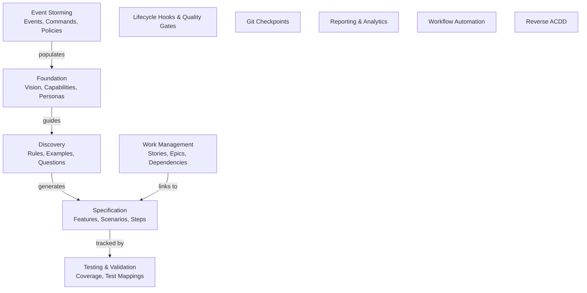
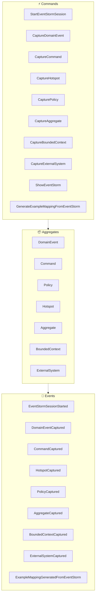
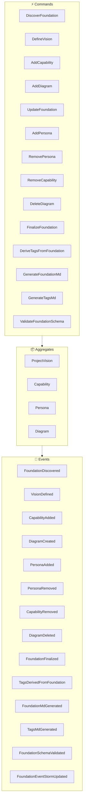
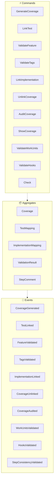
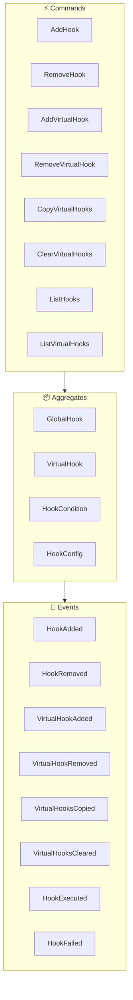
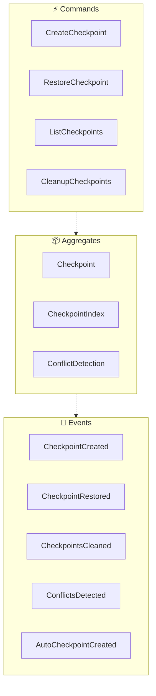
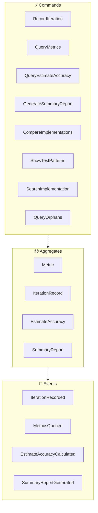
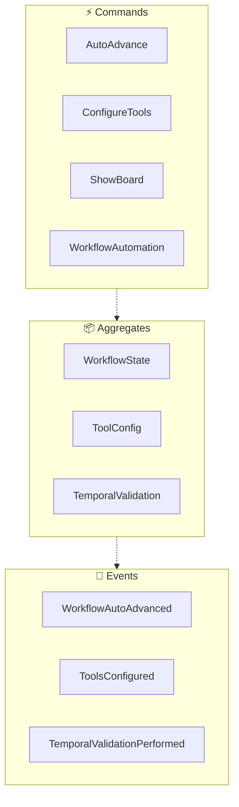
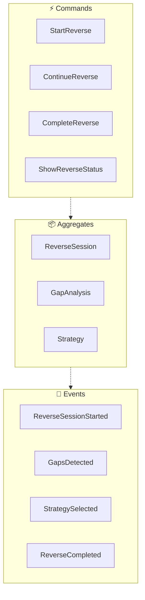

<!-- THIS FILE IS AUTO-GENERATED FROM spec/foundation.json -->
<!-- DO NOT EDIT THIS FILE DIRECTLY -->
<!-- Edit spec/foundation.json and run: fspec generate-foundation-md -->

# fspec Project Foundation

## Vision

The only system that transforms business conversations into production-ready features—unifying product owners, business analysts, developers, QA engineers, and AI agents in a single disciplined workflow where requirements become executable specs, specs become tests, and complete traceability prevents anyone (human or AI) from breaking the chain.

---

## Problem Space

### Requirements and implementation are disconnected across fragmented tools, causing lost context, broken traceability, and undisciplined AI agents

Product owners define business value in Jira. Business analysts capture requirements in sticky notes during Example Mapping sessions that get photographed and forgotten. Developers write Gherkin specs in .feature files disconnected from those requirements. QA engineers write tests disconnected from the specs. AI agents skip all of this and write code with zero traceability. The result: what gets built rarely matches what was discussed, tests don't validate the right things, and nobody can trace a line of code back to the business requirement that justified it. Every handoff loses context. Every tool works in isolation. Every AI agent operates without discipline or guardrails.

**Impact:** high

---

## Solution Space

### Overview

A unified CLI and TUI system that connects business conversations (Example Mapping, Event Storming) directly to executable Gherkin specs, enforces test-first development through workflow states, and maintains complete traceability from requirements through tests to implementation. AI agents and humans work in the same disciplined workflow with automatic checkpoints, quality gates, and coverage tracking that prevents anyone from breaking the chain of accountability.

### Capabilities

- **Kanban Project Management**: Track work units (stories, tasks, bugs) through ACDD workflow states (backlog → specifying → testing → implementing → validating → done) with dependency management and epic organization
- **Example Mapping**: Facilitate collaborative discovery sessions by capturing business rules (blue cards), concrete examples (green cards), and questions (red cards), then transform them into Gherkin scenarios
- **Event Storming**: Conduct Big Picture (foundation-level) and Process Modeling (work-unit-level) Event Storming to discover domain events, commands, aggregates, policies, and bounded contexts
- **Gherkin Specification Management**: Create, edit, validate, and format .feature files with full Cucumber compatibility, tag management, and automatic prefill detection
- **Test-Driven Development Enforcement**: Enforce TDD discipline through temporal validation that prevents writing code before tests, with @step comment validation to ensure test-to-spec traceability
- **Coverage Tracking**: Link Gherkin scenarios to test files to implementation code with .feature.coverage files that provide complete requirement-to-code traceability
- **Git Checkpoint System**: Create automatic checkpoints before workflow transitions and manual checkpoints for experimentation, with conflict-aware restoration and cleanup management
- **Virtual Hooks & Quality Gates**: Define work-unit-scoped and global lifecycle hooks that execute custom validation, testing, and automation at workflow transition points
- **Interactive TUI**: Live Kanban board with real-time updates, attachment viewer with Mermaid diagram rendering, checkpoint management, and keyboard-driven navigation
- **AST Code Analysis**: Parse and analyze code across 16 languages using tree-sitter for pattern detection, function discovery, and deep codebase understanding during discovery
- **Query & Analytics**: Query work units, bottlenecks, estimation accuracy, orphaned work, dependency statistics, and generate comprehensive summary reports
- **Reverse ACDD**: Import existing codebases into fspec by generating feature files, scenarios, and skeleton tests from existing code implementations
- **Foundation Discovery**: AI-guided field-by-field project foundation bootstrapping that defines project context, personas, capabilities, and problem space

---

## Personas

### AI Agent

Autonomous coding agents (Claude Code, Cursor, Codex, etc.) that need structured workflows and quality enforcement

**Goals:**
- Follow TDD discipline automatically

### Developer

Software developers working with AI agents or manually following ACDD workflow

**Goals:**
- Clear acceptance criteria before coding

### Business Analyst

BAs facilitating Example Mapping and Event Storming sessions to capture requirements

**Goals:**
- Transform business conversations into executable specs

### Product Owner

POs defining business value and making prioritization decisions

**Goals:**
- See exactly what's being built (acceptance criteria)

### QA Engineer

QA engineers validating feature implementation against specs

**Goals:**
- Trace every test back to business requirements

---

# Domain Architecture

## Bounded Contexts

- Work Management
- Specification
- Discovery
- Event Storming
- Foundation
- Testing & Validation
- Lifecycle Hooks & Quality Gates
- Git Checkpoints
- Reporting & Analytics
- Workflow Automation
- Reverse ACDD

## Bounded Context Map

```mermaid
graph TB
  BC1["Work Management<br/>Stories, Epics, Dependencies"]
  BC2["Specification<br/>Features, Scenarios, Steps"]
  BC3["Discovery<br/>Rules, Examples, Questions"]
  BC4["Event Storming<br/>Events, Commands, Policies"]
  BC5["Foundation<br/>Vision, Capabilities, Personas"]
  BC6["Testing & Validation<br/>Coverage, Test Mappings"]
  BC7["Lifecycle Hooks & Quality Gates"]
  BC8["Git Checkpoints"]
  BC9["Reporting & Analytics"]
  BC10["Workflow Automation"]
  BC11["Reverse ACDD"]

  BC3 -->|generates| BC2
  BC1 -->|links to| BC2
  BC2 -->|tracked by| BC6
  BC4 -->|populates| BC5
  BC5 -->|guides| BC3
```

## Work Management Context

### Event Flow

```mermaid
flowchart TB
  subgraph Commands["⚡ Commands"]
    C55[CreateWorkUnit]
    C56[UpdateWorkUnitStatus]
    C57[BlockWorkUnit]
    C58[AddDependency]
    C124[UpdateWorkUnit]
    C125[DeleteWorkUnit]
    C126[PrioritizeWorkUnit]
    C127[EstimateWorkUnit]
    C128[CompactWorkUnit]
    C129[RepairWorkUnits]
    C130[CreateEpic]
    C131[DeleteEpic]
    C132[CreatePrefix]
    C133[UpdatePrefix]
    C134[RemoveDependency]
    C135[ClearDependencies]
    C136[ValidateDependencies]
    C137[ExportDependencies]
    C138[AddAttachment]
    C139[RemoveAttachment]
  end

  subgraph Aggregates["📦 Aggregates"]
    A7[WorkUnit]
    A8[Epic]
    A9[Dependency]
    A10[Prefix]
    A84[Estimate]
    A109[Attachment]
  end

  subgraph Events["📢 Events"]
    E31[WorkUnitCreated]
    E32[WorkUnitStatusChanged]
    E33[WorkUnitBlocked]
    E34[DependencyAdded]
    E110[WorkUnitUpdated]
    E111[WorkUnitDeleted]
    E112[WorkUnitPrioritized]
    E113[WorkUnitEstimated]
    E114[WorkUnitCompacted]
    E115[WorkUnitRepaired]
    E116[EpicCreated]
    E117[EpicDeleted]
    E118[PrefixCreated]
    E119[PrefixUpdated]
    E120[DependencyRemoved]
    E121[DependenciesCleared]
    E122[AttachmentAdded]
    E123[AttachmentRemoved]
  end

  Commands -.-> Aggregates
  Aggregates -.-> Events
```

**Aggregates:**
- WorkUnit - Story, task, or bug tracking unit
- Epic - Collection of related work units
- Dependency - Relationship between work units
- Prefix - Namespace for work unit IDs
- Estimate - Story point estimation and re-estimation
- Attachment - File linked to work unit

**Domain Events:**
- WorkUnitCreated - Work unit was created
- WorkUnitStatusChanged - Work unit moved through ACDD workflow
- WorkUnitBlocked - Work unit blocked by dependency
- DependencyAdded - Dependency relationship created
- WorkUnitUpdated - Work unit fields modified
- WorkUnitDeleted - Work unit permanently removed
- WorkUnitPrioritized - Work unit position changed in backlog
- WorkUnitEstimated - Story points assigned or updated
- WorkUnitCompacted - Soft-deleted items permanently removed
- WorkUnitRepaired - State inconsistencies fixed
- EpicCreated - New epic created with prefix
- EpicDeleted - Epic removed from project
- PrefixCreated - New work unit ID namespace created
- PrefixUpdated - Prefix description changed
- DependencyRemoved - Dependency relationship removed
- DependenciesCleared - All dependencies removed from work unit
- AttachmentAdded - File attached to work unit
- AttachmentRemoved - File detached from work unit

**Commands:**
- CreateWorkUnit - Create story, task, or bug
- UpdateWorkUnitStatus - Move through ACDD workflow
- BlockWorkUnit - Block work unit with reason
- AddDependency - Link work units
- UpdateWorkUnit - Modify work unit fields
- DeleteWorkUnit - Permanently delete work unit
- PrioritizeWorkUnit - Reorder work unit in backlog
- EstimateWorkUnit - Assign or update story points
- CompactWorkUnit - Permanently remove soft-deleted items
- RepairWorkUnits - Fix state inconsistencies
- CreateEpic - Create epic with prefix
- DeleteEpic - Remove epic from project
- CreatePrefix - Create work unit ID namespace
- UpdatePrefix - Update prefix description
- RemoveDependency - Remove dependency relationship
- ClearDependencies - Remove all dependencies from work unit
- ValidateDependencies - Check for cycles and orphans
- ExportDependencies - Export dependency graph as mermaid or JSON
- AddAttachment - Attach file to work unit
- RemoveAttachment - Detach file from work unit

## Specification Context

### Event Flow

```mermaid
flowchart TB
  subgraph Commands["⚡ Commands"]
    C59[CreateFeature]
    C60[AddScenario]
    C61[ValidateFeature]
    C62[RegisterTag]
    C155[UpdateScenario]
    C156[DeleteScenario]
    C157[AddStep]
    C158[UpdateStep]
    C159[DeleteStep]
    C160[FormatFeatures]
    C161[AddBackground]
    C162[AddFeatureArchitecture]
    C163[AddTagToFeature]
    C164[RemoveTagFromFeature]
    C165[AddTagToScenario]
    C166[RemoveTagFromScenario]
    C167[UpdateTag]
    C168[DeleteTag]
    C169[Retag]
    C170[DeleteFeaturesByTag]
    C171[DeleteScenariosByTag]
    C172[SearchScenarios]
  end

  subgraph Aggregates["📦 Aggregates"]
    A11[Feature]
    A12[Scenario]
    A13[Step]
    A14[Tag]
    A85[Background]
  end

  subgraph Events["📢 Events"]
    E35[FeatureCreated]
    E36[ScenarioAdded]
    E37[FeatureValidated]
    E38[TagRegistered]
    E140[ScenarioUpdated]
    E141[ScenarioDeleted]
    E142[StepAdded]
    E143[StepUpdated]
    E144[StepDeleted]
    E145[FeatureFormatted]
    E146[TagUpdated]
    E147[TagDeleted]
    E148[TagRenamed]
    E149[FeatureTagAdded]
    E150[FeatureTagRemoved]
    E151[ScenarioTagAdded]
    E152[ScenarioTagRemoved]
    E153[BackgroundAdded]
    E154[FeatureArchitectureAdded]
  end

  Commands -.-> Aggregates
  Aggregates -.-> Events
```

**Aggregates:**
- Feature - Gherkin feature file
- Scenario - Test scenario within feature
- Step - Given/When/Then step
- Tag - Classification metadata
- Background - Feature background section

**Domain Events:**
- FeatureCreated - Feature file created
- ScenarioAdded - Scenario added to feature
- FeatureValidated - Feature file passed validation
- TagRegistered - Tag added to registry
- ScenarioUpdated - Scenario name changed
- ScenarioDeleted - Scenario removed from feature
- StepAdded - Given/When/Then step added to scenario
- StepUpdated - Step text or keyword modified
- StepDeleted - Step removed from scenario
- FeatureFormatted - Feature file reformatted
- TagUpdated - Tag description or category changed
- TagDeleted - Tag removed from registry
- TagRenamed - Tag bulk-renamed across all features
- FeatureTagAdded - Tag added to feature file
- FeatureTagRemoved - Tag removed from feature file
- ScenarioTagAdded - Tag added to scenario
- ScenarioTagRemoved - Tag removed from scenario
- BackgroundAdded - Background section added to feature
- FeatureArchitectureAdded - Architecture notes added to feature

**Commands:**
- CreateFeature - Create Gherkin feature file
- AddScenario - Add scenario to feature
- ValidateFeature - Validate Gherkin syntax
- RegisterTag - Add tag to registry
- UpdateScenario - Rename a scenario
- DeleteScenario - Remove scenario from feature
- AddStep - Add Given/When/Then step
- UpdateStep - Modify step text or keyword
- DeleteStep - Remove step from scenario
- FormatFeatures - Auto-format Gherkin feature files
- AddBackground - Add background section to feature
- AddFeatureArchitecture - Add architecture notes to feature
- AddTagToFeature - Tag a feature file
- RemoveTagFromFeature - Remove tag from feature file
- AddTagToScenario - Tag a specific scenario
- RemoveTagFromScenario - Remove tag from scenario
- UpdateTag - Modify tag description or category
- DeleteTag - Remove tag from registry
- Retag - Bulk rename tag across features
- DeleteFeaturesByTag - Bulk delete features by tag
- DeleteScenariosByTag - Bulk delete scenarios by tag
- SearchScenarios - Search scenarios by query or regex

## Discovery Context

### Event Flow

```mermaid
flowchart TB
  subgraph Commands["⚡ Commands"]
    C63[AddRule]
    C64[AddExample]
    C65[AskQuestion]
    C66[GenerateScenarios]
    C184[SetUserStory]
    C185[AnswerQuestion]
    C186[RemoveRule]
    C187[RemoveExample]
    C188[RemoveQuestion]
    C189[AddAssumption]
    C190[AddArchitectureNote]
    C191[RemoveArchitectureNote]
    C192[RestoreItem]
    C193[ShowDeleted]
    C194[ExportExampleMap]
    C195[ImportExampleMap]
  end

  subgraph Aggregates["📦 Aggregates"]
    A15[Rule]
    A16[Example]
    A17[Question]
    A18[Assumption]
    A86[UserStory]
    A87[ArchitectureNote]
  end

  subgraph Events["📢 Events"]
    E39[RuleAdded]
    E40[ExampleAdded]
    E41[QuestionAsked]
    E42[ScenariosGenerated]
    E173[UserStorySet]
    E174[QuestionAnswered]
    E175[RuleRemoved]
    E176[ExampleRemoved]
    E177[QuestionRemoved]
    E178[AssumptionAdded]
    E179[ArchitectureNoteAdded]
    E180[ArchitectureNoteRemoved]
    E181[ItemRestored]
    E182[ExampleMapExported]
    E183[ExampleMapImported]
  end

  Commands -.-> Aggregates
  Aggregates -.-> Events
```

**Aggregates:**
- Rule - Business rule (blue card)
- Example - Concrete example (green card)
- Question - Uncertainty (red card)
- Assumption - Answered question converted to assumption
- UserStory - Yellow card - user story definition
- ArchitectureNote - Work unit-level architecture notes

**Domain Events:**
- RuleAdded - Business rule captured
- ExampleAdded - Concrete example captured
- QuestionAsked - Uncertainty identified
- ScenariosGenerated - Scenarios generated from example map
- UserStorySet - Yellow card user story defined
- QuestionAnswered - Red card resolved with answer
- RuleRemoved - Business rule soft-deleted
- ExampleRemoved - Concrete example soft-deleted
- QuestionRemoved - Question soft-deleted
- AssumptionAdded - Assumption captured from answered question
- ArchitectureNoteAdded - Work unit architecture note captured
- ArchitectureNoteRemoved - Architecture note soft-deleted
- ItemRestored - Soft-deleted item restored
- ExampleMapExported - Example map exported to JSON
- ExampleMapImported - Example map imported from JSON

**Commands:**
- AddRule - Capture business rule
- AddExample - Capture concrete example
- AskQuestion - Record uncertainty
- GenerateScenarios - Generate from example map
- SetUserStory - Define yellow card user story
- AnswerQuestion - Resolve red card with answer
- RemoveRule - Soft-delete a business rule
- RemoveExample - Soft-delete an example
- RemoveQuestion - Soft-delete a question
- AddAssumption - Capture project assumption
- AddArchitectureNote - Add architecture note to work unit
- RemoveArchitectureNote - Soft-delete architecture note
- RestoreItem - Restore soft-deleted rule, example, question, or note
- ShowDeleted - View soft-deleted items
- ExportExampleMap - Export example map to JSON
- ImportExampleMap - Import example map from JSON

## Event Storming Context

### Event Flow

```mermaid
flowchart TB
  subgraph Commands["⚡ Commands"]
    C67[StartEventStormSession]
    C68[CaptureDomainEvent]
    C69[CaptureCommand]
    C70[CaptureHotspot]
    C201[CapturePolicy]
    C202[CaptureAggregate]
    C203[CaptureBoundedContext]
    C204[CaptureExternalSystem]
    C205[ShowEventStorm]
    C206[GenerateExampleMappingFromEventStorm]
  end

  subgraph Aggregates["📦 Aggregates"]
    A19[DomainEvent]
    A20[Command]
    A21[Policy]
    A22[Hotspot]
    A88[Aggregate]
    A89[BoundedContext]
    A90[ExternalSystem]
  end

  subgraph Events["📢 Events"]
    E43[EventStormSessionStarted]
    E44[DomainEventCaptured]
    E45[CommandCaptured]
    E46[HotspotCaptured]
    E196[PolicyCaptured]
    E197[AggregateCaptured]
    E198[BoundedContextCaptured]
    E199[ExternalSystemCaptured]
    E200[ExampleMappingGeneratedFromEventStorm]
  end

  Commands -.-> Aggregates
  Aggregates -.-> Events
```

**Aggregates:**
- DomainEvent - Orange sticky - business event
- Command - Blue sticky - user action
- Policy - Purple sticky - reactive rule
- Hotspot - Red sticky - uncertainty/risk
- Aggregate - Yellow sticky - domain aggregate
- BoundedContext - Boundary around related concepts
- ExternalSystem - External system integration point

**Domain Events:**
- EventStormSessionStarted - Event Storm session initiated
- DomainEventCaptured - Domain event sticky added
- CommandCaptured - Command sticky added
- HotspotCaptured - Hotspot identified
- PolicyCaptured - Policy sticky added to event storm
- AggregateCaptured - Aggregate sticky added
- BoundedContextCaptured - Bounded context boundary defined
- ExternalSystemCaptured - External system integration identified
- ExampleMappingGeneratedFromEventStorm - Example map cards generated from event storm data

**Commands:**
- StartEventStormSession - Initiate Event Storm
- CaptureDomainEvent - Add domain event sticky
- CaptureCommand - Add command sticky
- CaptureHotspot - Mark uncertainty
- CapturePolicy - Add reactive rule sticky
- CaptureAggregate - Add domain aggregate sticky
- CaptureBoundedContext - Define context boundary
- CaptureExternalSystem - Identify external system dependency
- ShowEventStorm - Display event storm visualization
- GenerateExampleMappingFromEventStorm - Convert event storm to example map cards

## Foundation Context

### Event Flow

```mermaid
flowchart TB
  subgraph Commands["⚡ Commands"]
    C71[DiscoverFoundation]
    C72[DefineVision]
    C73[AddCapability]
    C74[AddDiagram]
    C217[UpdateFoundation]
    C218[AddPersona]
    C219[RemovePersona]
    C220[RemoveCapability]
    C221[DeleteDiagram]
    C222[FinalizeFoundation]
    C223[DeriveTagsFromFoundation]
    C224[GenerateFoundationMd]
    C225[GenerateTagsMd]
    C226[ValidateFoundationSchema]
  end

  subgraph Aggregates["📦 Aggregates"]
    A23[ProjectVision]
    A24[Capability]
    A25[Persona]
    A26[Diagram]
  end

  subgraph Events["📢 Events"]
    E47[FoundationDiscovered]
    E48[VisionDefined]
    E49[CapabilityAdded]
    E50[DiagramCreated]
    E207[PersonaAdded]
    E208[PersonaRemoved]
    E209[CapabilityRemoved]
    E210[DiagramDeleted]
    E211[FoundationFinalized]
    E212[TagsDerivedFromFoundation]
    E213[FoundationMdGenerated]
    E214[TagsMdGenerated]
    E215[FoundationSchemaValidated]
    E216[FoundationEventStormUpdated]
  end

  Commands -.-> Aggregates
  Aggregates -.-> Events
```

**Aggregates:**
- ProjectVision - What we're building
- Capability - What the system can do
- Persona - Who uses the system
- Diagram - Mermaid architecture diagrams

**Domain Events:**
- FoundationDiscovered - Foundation initialized
- VisionDefined - Project vision articulated
- CapabilityAdded - New capability documented
- DiagramCreated - Architecture diagram added
- PersonaAdded - New persona defined
- PersonaRemoved - Persona removed from foundation
- CapabilityRemoved - Capability removed from foundation
- DiagramDeleted - Architecture diagram removed
- FoundationFinalized - Draft foundation validated and committed
- TagsDerivedFromFoundation - Component/feature tags auto-generated
- FoundationMdGenerated - FOUNDATION.md regenerated
- TagsMdGenerated - TAGS.md regenerated
- FoundationSchemaValidated - Foundation JSON schema validation passed
- FoundationEventStormUpdated - Big picture event storm modified

**Commands:**
- DiscoverFoundation - Initialize foundation
- DefineVision - Articulate project vision
- AddCapability - Document capability
- AddDiagram - Create architecture diagram
- UpdateFoundation - Update foundation field
- AddPersona - Define new user persona
- RemovePersona - Remove persona from foundation
- RemoveCapability - Remove capability from foundation
- DeleteDiagram - Remove architecture diagram
- FinalizeFoundation - Validate and commit foundation draft
- DeriveTagsFromFoundation - Auto-generate tags from bounded contexts
- GenerateFoundationMd - Regenerate FOUNDATION.md
- GenerateTagsMd - Regenerate TAGS.md
- ValidateFoundationSchema - Validate foundation.json against schema

## Testing & Validation Context

### Event Flow

```mermaid
flowchart TB
  subgraph Commands["⚡ Commands"]
    C75[GenerateCoverage]
    C76[LinkTest]
    C77[ValidateFeature]
    C78[ValidateTags]
    C233[LinkImplementation]
    C234[UnlinkCoverage]
    C235[AuditCoverage]
    C236[ShowCoverage]
    C237[ValidateWorkUnits]
    C238[ValidateHooks]
    C239[Check]
  end

  subgraph Aggregates["📦 Aggregates"]
    A27[Coverage]
    A28[TestMapping]
    A29[ImplementationMapping]
    A30[ValidationResult]
    A108[StepComment]
  end

  subgraph Events["📢 Events"]
    E51[CoverageGenerated]
    E52[TestLinked]
    E53[FeatureValidated]
    E54[TagsValidated]
    E227[ImplementationLinked]
    E228[CoverageUnlinked]
    E229[CoverageAudited]
    E230[WorkUnitsValidated]
    E231[HooksValidated]
    E232[StepConsistencyValidated]
  end

  Commands -.-> Aggregates
  Aggregates -.-> Events
```

**Aggregates:**
- Coverage - Scenario-to-test-to-implementation mapping
- TestMapping - Test file linked to scenario
- ImplementationMapping - Source code linked to test
- ValidationResult - Syntax check, tag validation
- StepComment - @step annotation in test files

**Domain Events:**
- CoverageGenerated - Coverage file created
- TestLinked - Test file linked to scenario
- FeatureValidated - Feature passed validation
- TagsValidated - Tags verified against registry
- ImplementationLinked - Implementation file linked to test/scenario
- CoverageUnlinked - Test or implementation unlinked from scenario
- CoverageAudited - Coverage files audited for consistency
- WorkUnitsValidated - Work unit schema validation passed
- HooksValidated - Hook configuration validated
- StepConsistencyValidated - @step comments verified against Gherkin steps

**Commands:**
- GenerateCoverage - Create coverage file
- LinkTest - Link test to scenario
- ValidateFeature - Check Gherkin syntax
- ValidateTags - Verify tag registry
- LinkImplementation - Link implementation file to scenario coverage
- UnlinkCoverage - Remove test or implementation link
- AuditCoverage - Audit coverage files for consistency
- ShowCoverage - Display coverage status
- ValidateWorkUnits - Validate work units against schema
- ValidateHooks - Validate hook configuration
- Check - Run all validation checks at once

## Lifecycle Hooks & Quality Gates Context

### Event Flow

```mermaid
flowchart TB
  subgraph Commands["⚡ Commands"]
    C248[AddHook]
    C249[RemoveHook]
    C250[AddVirtualHook]
    C251[RemoveVirtualHook]
    C252[CopyVirtualHooks]
    C253[ClearVirtualHooks]
    C254[ListHooks]
    C255[ListVirtualHooks]
  end

  subgraph Aggregates["📦 Aggregates"]
    A91[GlobalHook]
    A92[VirtualHook]
    A93[HookCondition]
    A94[HookConfig]
  end

  subgraph Events["📢 Events"]
    E240[HookAdded]
    E241[HookRemoved]
    E242[VirtualHookAdded]
    E243[VirtualHookRemoved]
    E244[VirtualHooksCopied]
    E245[VirtualHooksCleared]
    E246[HookExecuted]
    E247[HookFailed]
  end

  Commands -.-> Aggregates
  Aggregates -.-> Events
```

**Aggregates:**
- GlobalHook - Project-wide lifecycle hook
- VirtualHook - Work unit-scoped ephemeral hook
- HookCondition - Conditional filter for hook execution
- HookConfig - fspec-hooks.json configuration

**Domain Events:**
- HookAdded - Global lifecycle hook configured
- HookRemoved - Global lifecycle hook removed
- VirtualHookAdded - Work unit-scoped hook added
- VirtualHookRemoved - Work unit-scoped hook removed
- VirtualHooksCopied - Virtual hooks copied between work units
- VirtualHooksCleared - All virtual hooks removed from work unit
- HookExecuted - Hook script ran successfully
- HookFailed - Hook script failed or timed out

**Commands:**
- AddHook - Add global lifecycle hook
- RemoveHook - Remove global lifecycle hook
- AddVirtualHook - Add work unit-scoped hook
- RemoveVirtualHook - Remove work unit-scoped hook
- CopyVirtualHooks - Copy hooks between work units
- ClearVirtualHooks - Remove all virtual hooks from work unit
- ListHooks - List global lifecycle hooks
- ListVirtualHooks - List virtual hooks for work unit

## Git Checkpoints Context

### Event Flow

```mermaid
flowchart TB
  subgraph Commands["⚡ Commands"]
    C261[CreateCheckpoint]
    C262[RestoreCheckpoint]
    C263[ListCheckpoints]
    C264[CleanupCheckpoints]
  end

  subgraph Aggregates["📦 Aggregates"]
    A95[Checkpoint]
    A96[CheckpointIndex]
    A97[ConflictDetection]
  end

  subgraph Events["📢 Events"]
    E256[CheckpointCreated]
    E257[CheckpointRestored]
    E258[CheckpointsCleaned]
    E259[ConflictsDetected]
    E260[AutoCheckpointCreated]
  end

  Commands -.-> Aggregates
  Aggregates -.-> Events
```

**Aggregates:**
- Checkpoint - Git ghost commit save point
- CheckpointIndex - Metadata index for checkpoints per work unit
- ConflictDetection - Detect conflicts before checkpoint restore

**Domain Events:**
- CheckpointCreated - Git ghost commit save point created
- CheckpointRestored - Working tree restored to checkpoint state
- CheckpointsCleaned - Old checkpoints removed
- ConflictsDetected - File conflicts found before restore
- AutoCheckpointCreated - Automatic checkpoint on status transition

**Commands:**
- CreateCheckpoint - Create manual checkpoint
- RestoreCheckpoint - Restore working tree to checkpoint
- ListCheckpoints - List checkpoints for work unit
- CleanupCheckpoints - Remove old checkpoints keeping N most recent

## Reporting & Analytics Context

### Event Flow

```mermaid
flowchart TB
  subgraph Commands["⚡ Commands"]
    C269[RecordIteration]
    C270[QueryMetrics]
    C271[QueryEstimateAccuracy]
    C272[GenerateSummaryReport]
    C273[CompareImplementations]
    C274[ShowTestPatterns]
    C275[SearchImplementation]
    C276[QueryOrphans]
  end

  subgraph Aggregates["📦 Aggregates"]
    A98[Metric]
    A99[IterationRecord]
    A100[EstimateAccuracy]
    A101[SummaryReport]
  end

  subgraph Events["📢 Events"]
    E265[IterationRecorded]
    E266[MetricsQueried]
    E267[EstimateAccuracyCalculated]
    E268[SummaryReportGenerated]
  end

  Commands -.-> Aggregates
  Aggregates -.-> Events
```

**Aggregates:**
- Metric - Velocity and throughput measurements
- IterationRecord - Completed iteration tracking
- EstimateAccuracy - Estimation vs actual comparison
- SummaryReport - Project-wide summary report

**Domain Events:**
- IterationRecorded - Work unit iteration snapshot captured
- MetricsQueried - Velocity/throughput metrics retrieved
- EstimateAccuracyCalculated - Estimation accuracy report generated
- SummaryReportGenerated - Project summary report created

**Commands:**
- RecordIteration - Capture iteration snapshot
- QueryMetrics - Retrieve velocity and throughput data
- QueryEstimateAccuracy - Calculate estimation accuracy
- GenerateSummaryReport - Create comprehensive project report
- CompareImplementations - Compare implementations by tag
- ShowTestPatterns - Display test patterns by tag
- SearchImplementation - Search implementation by function name
- QueryOrphans - Find orphaned work units

## Workflow Automation Context

### Event Flow

```mermaid
flowchart TB
  subgraph Commands["⚡ Commands"]
    C280[AutoAdvance]
    C281[ConfigureTools]
    C282[ShowBoard]
    C283[WorkflowAutomation]
  end

  subgraph Aggregates["📦 Aggregates"]
    A102[WorkflowState]
    A103[ToolConfig]
    A104[TemporalValidation]
  end

  subgraph Events["📢 Events"]
    E277[WorkflowAutoAdvanced]
    E278[ToolsConfigured]
    E279[TemporalValidationPerformed]
  end

  Commands -.-> Aggregates
  Aggregates -.-> Events
```

**Aggregates:**
- WorkflowState - ACDD state machine and transitions
- ToolConfig - Test and quality command configuration
- TemporalValidation - File timestamp vs state entry time enforcement

**Domain Events:**
- WorkflowAutoAdvanced - Work unit automatically moved to next state
- ToolsConfigured - Test and quality commands configured
- TemporalValidationPerformed - File timestamps checked against state entry

**Commands:**
- AutoAdvance - Automatically advance ready work units
- ConfigureTools - Set test and quality check commands
- ShowBoard - Display Kanban board
- WorkflowAutomation - Show workflow automation recommendations

## Reverse ACDD Context

### Event Flow

```mermaid
flowchart TB
  subgraph Commands["⚡ Commands"]
    C288[StartReverse]
    C289[ContinueReverse]
    C290[CompleteReverse]
    C291[ShowReverseStatus]
  end

  subgraph Aggregates["📦 Aggregates"]
    A105[ReverseSession]
    A106[GapAnalysis]
    A107[Strategy]
  end

  subgraph Events["📢 Events"]
    E284[ReverseSessionStarted]
    E285[GapsDetected]
    E286[StrategySelected]
    E287[ReverseCompleted]
  end

  Commands -.-> Aggregates
  Aggregates -.-> Events
```

**Aggregates:**
- ReverseSession - Multi-step reverse engineering session
- GapAnalysis - Spec, test, and coverage gap detection
- Strategy - Reverse strategy (A=Spec Gap, B=Test Gap, C=Coverage, D=Full)

**Domain Events:**
- ReverseSessionStarted - Reverse ACDD analysis initiated
- GapsDetected - Spec, test, or coverage gaps found
- StrategySelected - Reverse strategy chosen (A/B/C/D)
- ReverseCompleted - Reverse ACDD process finished

**Commands:**
- StartReverse - Initiate reverse ACDD analysis
- ContinueReverse - Continue multi-step reverse session
- CompleteReverse - Finalize reverse ACDD session
- ShowReverseStatus - Check reverse session progress

---
