<!-- THIS FILE IS AUTO-GENERATED FROM spec/foundation.json -->
<!-- DO NOT EDIT THIS FILE DIRECTLY -->
<!-- Edit spec/foundation.json and run: fspec generate-foundation -->

# fspec Project Foundation Document

**IMPORTANT NOTE:** This is a legitimate developer tool that provides AI agents with a standardized interface for managing Gherkin-based specifications and project management. fspec prevents ecosystem fragmentation by promoting industry-standard BDD practices over proprietary documentation formats. This tool helps AI agents ask the right questions and structure specifications correctly using battle-tested Gherkin/Cucumber conventions.

## 1. What We Are Building

### Project Overview

A CLI tool that provides AI agents (like Claude Code, GitHub Copilot, etc.) with a standardized interface for creating, validating, and managing Gherkin-based feature specifications and project work units. fspec has two main purposes: (1) Specification Management - acts as the canonical interface between AI agents and BDD specifications, ensuring proper Gherkin syntax, enforcing tag discipline, maintaining architecture documentation (Mermaid diagrams), and keeping the tag registry synchronized; (2) Project Management - provides tag-based work unit tracking with Kanban workflow (backlog → specifying → testing → implementing → validating → done), example mapping support, dependency management, and estimation/metrics tracking. It is designed for developers practicing Acceptance Criteria Driven Development (ACDD) with AI assistance, particularly those using CAGE or similar agentic coding systems.

### Technical Requirements

#### Core Technologies

- **Programming Language:** TypeScript/Node.js
- **Build System:** Vite - for fast bundling and development
- **CLI Framework:** Commander.js - argument parsing and command structure
- **Gherkin Parsing:** @cucumber/gherkin-parser - official Cucumber parser
- **Formatting:** Custom AST-based formatter - using @cucumber/gherkin (replaces Prettier plugin)
- **Code Quality:** ESLint + Prettier - for TypeScript/JavaScript only
- **Testing:** Vitest - unit and integration tests following ACDD
- **Storage:** File-based - manages spec/, spec/features/, FOUNDATION.md, TAGS.md

#### Key Libraries & Dependencies

**Core:**
- **@cucumber/gherkin-parser**: Official Gherkin parser for syntax validation
- **@cucumber/messages**: Gherkin AST types and message protocol
- **commander.js**: CLI argument parsing and command structure
- **chalk**: Terminal output styling and colored messages
- **ink**: React renderer for building rich, interactive CLI interfaces (used for board display and other UI-heavy commands)
- **react**: Component library for building terminal UI with Ink

**File Operations:**
- **Node.js fs/promises**: File system operations (read/write feature files, FOUNDATION.md, TAGS.md)
- **glob/tinyglobby**: Pattern matching for finding feature files

**Validation & Formatting:**
- **prettier**: Code formatter (for TypeScript/JavaScript only)
- **Custom AST formatter**: Built-in Gherkin formatter using @cucumber/gherkin
- **zod**: Schema validation for internal data structures

**Development:**
- **vite**: Build system and bundler
- **vitest**: Testing framework
- **typescript**: Type checking and compilation
- **@types/node**: Node.js type definitions
- **ink-testing-library**: Testing utilities for Ink applications (render(), lastFrame())

### Non-Functional Requirements

- **Reliability:**
  - Gherkin syntax validation must catch ALL malformed syntax
  - Tag validation must ensure 100% registry compliance
  - File operations must be atomic (no partial writes)
  - Must never corrupt existing feature files
- **Maintainability:**
  - Follows same spec/ structure as CAGE (self-documenting)
  - Command handlers are modular and independently testable
  - Clear error messages guide AI agents to correct usage
  - JSDoc documentation for all public APIs
- **Compatibility:**
  - Node.js: 18+ (matches CAGE requirement)
  - OS Support: Cross-platform (Windows, macOS, Linux)
  - Gherkin: Follows official Cucumber Gherkin specification
  - Integration: Works seamlessly with CAGE hook system
- **Compliance:**
  - MIT License
  - Follows Cucumber Gherkin specification: https://cucumber.io/docs/gherkin/reference
  - Adheres to BDD best practices
  - All data stays local (no external services)

---

## 2. Why We Are Building It

### Problem Definition

#### AI Agents Lack Structured Workflow for Building the Right Software

AI agents (like Claude Code, GitHub Copilot) excel at writing code but struggle to build quality software reliably because they lack persistent, queryable project state and structured discovery tools. They rely on fragile conversation context, flat TODO lists, and ad-hoc workflows - leading to specification drift, skipped ACDD phases, lost context between sessions, and building the wrong features.

#### Specification Management Problems

- Malformed Gherkin: AI agents produce syntax errors that break Cucumber tooling
- Tag Chaos: Tags created ad-hoc without registry tracking (@phase1 vs @phase-1 vs @p1)
- Architecture Drift: Architecture docs live in scattered files, becoming outdated
- No Validation: No automated checks until tests fail in CI
- Ecosystem Fragmentation: Teams use proprietary formats instead of battle-tested Gherkin/Cucumber

#### Project Management Problems

- Lost Context Across Sessions: AI can't query 'what's in specifying phase?' or 'what's blocked?' - must infer from conversation
- No Workflow Enforcement: AI can jump from specifying → implementing without testing phase
- Invisible Dependencies: Can't see that AUTH-002 is blocked by AUTH-001 or track epic relationships
- No Discovery Structure: No place to capture rules, examples, questions, assumptions before writing specs
- TODO List Limitations: Flat lists can't represent Kanban states, relationships, or collaborative discovery

### Why Acceptance Criteria Driven Development (ACDD)?

ACDD builds on Behavior-Driven Development (BDD) and Specification by Example by enforcing a rigorous workflow: Acceptance Criteria (specs) → Tests → Code. This prevents over-implementation (building features not specified) and under-implementation (missing acceptance criteria).

**Specification by Example:**

- **Principle:** Instead of abstract requirements like 'The system shall authenticate users', we specify behavior through concrete examples: 'Login succeeds with email user@example.com and password 12345678'
- **Benefit:** Examples are unambiguous, testable, and become executable specifications

**BDD (Behavior-Driven Development):**

- **Principle:** Takes Specification by Example and adds Given/When/Then structure in Gherkin format
- **Benefit:** Creates shared language between stakeholders and developers, scenarios become both documentation AND automated tests

**ACDD (Acceptance Criteria Driven Development):**

- **Principle:** Takes BDD and enforces the ORDER: specs FIRST (acceptance criteria in Gherkin), tests SECOND (before any code), code LAST (minimum to pass tests)
- **Benefit:** AI agents build exactly what's specified - no more, no less. Prevents scope creep and missed requirements.
- **Challenge:** AI agents naturally violate ACDD workflow without tooling enforcement - they get sidetracked, lose context, skip discovery, and jump to implementation

### How fspec Solves Both Problems Together

fspec provides two integrated systems that work together to enable reliable AI-driven software development following ACDD workflow.

**Specification Management:**

*Purpose:* Ensures specs are valid, concrete (Specification by Example), and follow BDD conventions

*Tools:*
- Gherkin syntax validation using @cucumber/gherkin-parser
- Tag registry enforcement (tags.json) prevents tag chaos
- Architecture documentation with Mermaid diagram validation
- Auto-formatting and comprehensive validation (fspec check)

*Impact:* AI agents produce valid, testable specifications every time

**Project Management:**

*Purpose:* Provides persistent queryable state, workflow enforcement, and collaborative discovery

*Tools:*
- Work Units: Persistent project state (not TODO lists) with status, dependencies, epic relationships, example mapping
- Kanban Workflow: Enforces ACDD phases (backlog → specifying → testing → implementing → validating → done)
- Example Mapping: Structured discovery where AI adds rules/examples/questions and human provides clarifying answers
- Queryable State: AI can run 'fspec list-work-units --status=specifying' to see what's in flight - doesn't rely on conversation context

*Impact:* AI agents follow ACDD reliably, maintain context across sessions, collaborate with humans on discovery, and build the RIGHT software

**Integrated Workflow:**

- Discovery: Create work unit AUTH-001, enter 'specifying' phase, use example mapping to gather rules/examples/questions collaboratively
- Specification: Convert examples → Gherkin scenarios (fspec create-feature, add-scenario), validate syntax
- Testing: Move to 'testing' phase, write tests that map to Gherkin scenarios
- Implementation: Move to 'implementing' phase, write minimum code to pass tests
- Validation: Move to 'validating' phase, verify all acceptance criteria met
- Done: Move to 'done' phase - feature complete

**Example:**

Work unit AUTH-001 shows: status='specifying', blockedBy=[], epic='user-management', examples=['user logs in with valid email', 'user logs in with Google OAuth'], questions=['Should we support OAuth 2.0?']. AI can query this state, answer questions collaboratively with human, then move to testing phase ONLY after specs are complete. No skipping phases, no lost context, no building wrong features.

### Before vs. After fspec

**Before fspec:**

AI-assisted development without fspec:

- AI jumps straight to code without discovery or specification
- TODO lists provide no workflow state or relationships
- Context gets lost between sessions - AI must reconstruct intent from conversation
- Specifications written in markdown, not testable Gherkin
- Tags created inconsistently, architecture docs drift
- AI builds what IT thinks is needed, not what human actually needs
- No collaborative discovery - AI guesses at examples instead of asking clarifying questions
- ACDD workflow not enforced - code often comes before specs or tests

**After fspec:**

AI-assisted development with fspec:

- AI follows explicit Kanban workflow: discovery → specification → testing → implementation
- Work units provide queryable state that persists across sessions
- Example mapping enables AI-human collaboration through questions/answers
- Specifications in validated Gherkin (Specification by Example + BDD)
- Enforced ACDD workflow - cannot skip from specifying → implementing
- AI builds exactly what's specified, no more, no less
- Context engineering supplements persistent state (not replaces it)
- Clear visibility into what's in progress, what's blocked, what's next

### Stakeholder Impact

**Developers Using AI Coding Agents:**

- **Current Pain:** AI agents get sidetracked, lose context between sessions, build wrong features, skip discovery and testing phases, produce malformed specs
- **Benefit:** Reliable ACDD workflow with persistent state, collaborative discovery through example mapping, validated specs, and confidence that AI is building the right thing

**Teams Practicing BDD/ACDD:**

- **Current Pain:** Cannot trust AI to maintain workflow discipline or specification quality - must choose between AI assistance OR methodology compliance
- **Benefit:** AI agents that follow BDD/ACDD rigorously through enforced workflow, validated Gherkin, and structured discovery

**Product Owners & Stakeholders:**

- **Current Pain:** No visibility into what AI is building, features don't match requirements, over/under-implementation common
- **Benefit:** Clear visibility through work units and Kanban board, collaborative discovery ensures right features are built, acceptance criteria driven approach prevents scope creep

**BDD/Cucumber Ecosystem:**

- **Current Pain:** AI-driven development fragments ecosystem with proprietary formats and ad-hoc approaches
- **Benefit:** fspec promotes standard Gherkin, works with existing Cucumber tooling, prevents fragmentation

### Why Not Alternative Approaches?

**Just Use Better Prompts / Context Engineering:**

- Context gets compacted/edited between sessions - not reliable for long-term project state
- TODO lists in conversation can't express workflow states, dependencies, or structured discovery
- No enforcement - AI can still skip ACDD phases if it gets sidetracked
- Collaborative discovery (example mapping with questions) requires structured data, not just conversation

**Generic Project Management Tools (Jira, Linear, etc.):**

- Not designed for ACDD workflow - no built-in 'specifying' or 'testing' phases
- No Gherkin integration or validation
- No example mapping or collaborative discovery tools
- AI agents can't query local files easily - require API integration
- Not optimized for AI agent access patterns

**Manual Gherkin Files + TODO Lists:**

- No workflow enforcement - AI can skip phases
- TODO lists don't show state, dependencies, or enable discovery
- No validation until specs are written (malformed Gherkin common)
- Lost context between sessions - no queryable project state
- No structured collaboration for example mapping

### Success Criteria

**AI Agents Follow ACDD Reliably:**

- AI agents complete discovery (example mapping) before writing specs
- Specs written in valid Gherkin (Specification by Example + BDD)
- Tests written before implementation code
- Work units progress through Kanban phases in order
- No skipping phases or jumping to implementation prematurely

**Context Persists Across Sessions:**

- AI can query work unit state without relying on conversation context
- Dependencies, blockers, and relationships visible and queryable
- Example mapping data persists and remains accessible
- AI doesn't lose track of what's in progress between sessions

**AI-Human Collaboration Through Discovery:**

- AI adds rules, examples, and asks clarifying questions during example mapping
- Humans answer questions to refine understanding
- Collaborative discovery happens in structured data (work units), not just conversation
- AI builds features that match actual needs, not assumptions

**Validated Specifications Every Time:**

- Zero malformed Gherkin - all specs pass @cucumber/gherkin-parser validation
- 100% tag registry compliance
- Architecture docs stay synchronized with code

**Build the Right Software:**

- Features match acceptance criteria exactly (no over/under-implementation)
- Example mapping ensures concrete understanding before implementation
- Minimal rework due to misunderstood requirements

---

## 3. Architecture Diagrams

### fspec System Context

### fspec Command Architecture

### ACDD Workflow with fspec

### Data and Storage Architecture

### Kanban Workflow State Machine

### Example Mapping Discovery Process

```mermaid
sequenceDiagram
    participant Human
    participant AI as AI Agent
    participant WorkUnit as Work Unit
    participant FeatureFile as Feature File
    
    Note over Human,FeatureFile: Discovery Phase (specifying state)
    
    AI->>Human: What are the key business rules?
    Human->>AI: Rule: Validation must complete in <2s
    AI->>WorkUnit: add-rule "Validation <2s"
    
    AI->>Human: Can you give concrete examples?
    Human->>AI: Example: fspec validate shows "All valid"
    AI->>WorkUnit: add-example "validate shows success"
    
    AI->>Human: Question: Support custom rules in config?
    AI->>WorkUnit: add-question "Custom validation rules?"
    Human->>AI: No, defer to future work
    AI->>WorkUnit: answer-question "Defer to VALID-025"
    
    Note over AI,WorkUnit: Iterate until no questions remain
    
    AI->>WorkUnit: generate-scenarios
    WorkUnit->>FeatureFile: Transform to Gherkin
    
    Note over FeatureFile: Generated Feature File
    Note over FeatureFile: - Rules → Background context
    Note over FeatureFile: - Examples → Scenarios
    Note over FeatureFile: - Questions → Assumptions
    
    Note over Human,FeatureFile: Ready for Testing Phase
```

---
