# AI Agent Information Ingestion Optimization

**Problem**: How can AI agents efficiently consume fspec workflow documentation when tool output limits constrain information delivery?

**Baseline Constraints**: Using Codex CLI as the most restrictive baseline:
- Tool output: 10 KB max, 256 lines (hardcoded, not configurable)
- Project docs: 32 KB default (100 KB configurable)
- fspec bootstrap: ~30KB+ (exceeds limits)

**Goal**: Design documentation strategies that work within these constraints while serving ALL AI agents (Claude Code, Codex, Gemini, Qwen, etc.)

**New Approach**: Combine intelligent documentation delivery with a **knowledge graph** that models command relationships, state transitions, and domain concepts (Event Storming integration).

---

## Table of Contents

1. [Current State Analysis](#current-state-analysis)
2. [Knowledge Graph Architecture](#knowledge-graph-architecture)
3. [Graph Library Selection](#graph-library-selection)
4. [Strategy 1: Progressive Disclosure with Graph Navigation](#strategy-1-progressive-disclosure-with-graph-navigation)
5. [Strategy 2: Context-Aware Bootstrap](#strategy-2-context-aware-bootstrap)
6. [Strategy 3: Chunked Bootstrap](#strategy-3-chunked-bootstrap)
7. [Strategy 4: Inline Contextual Tips with Graph](#strategy-4-inline-contextual-tips-with-graph)
8. [Integration with Event Storming (EXMAP-004)](#integration-with-event-storming-exmap-004)
9. [Recommended Hybrid Approach](#recommended-hybrid-approach)
10. [Implementation Plan](#implementation-plan)

---

## Current State Analysis

### Information Flow (Current)

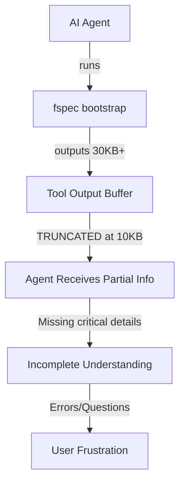

### Problem Breakdown

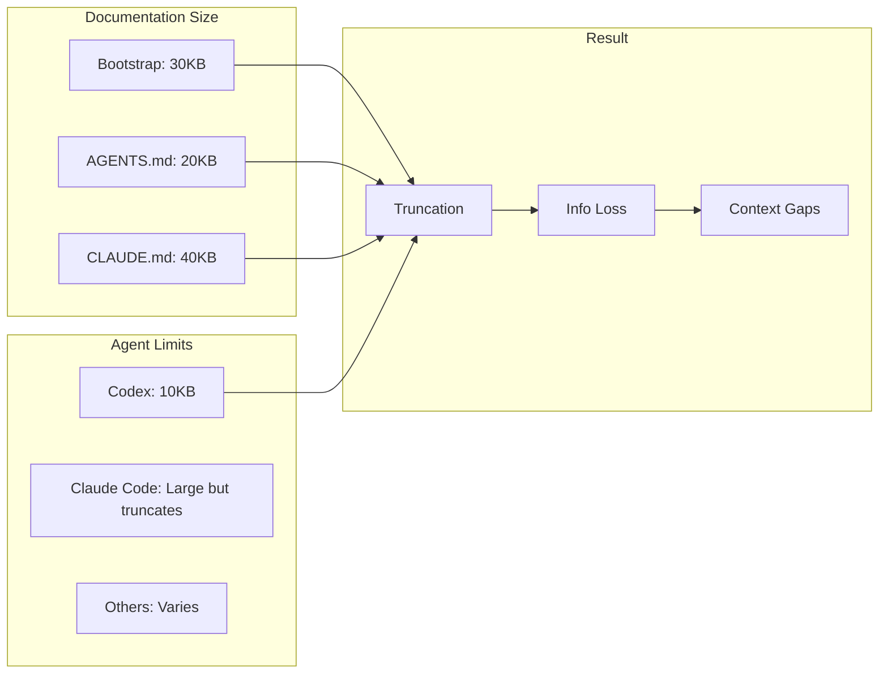

### Core Issues

1. **No intelligent navigation** - Agents don't know what commands to run next
2. **No relationship modeling** - Commands exist in isolation
3. **Manual context switching** - User must remember workflow sequences
4. **Discovery bottleneck** - Hard to find relevant documentation

---

## Knowledge Graph Architecture

### Concept

Model fspec's entire command space, state transitions, and domain concepts as a **directed graph** where:
- **Nodes** = Commands, States, Events, Guides, Concepts
- **Edges** = Relationships (triggers, requires, suggests, blocks, documents)

### Graph Structure

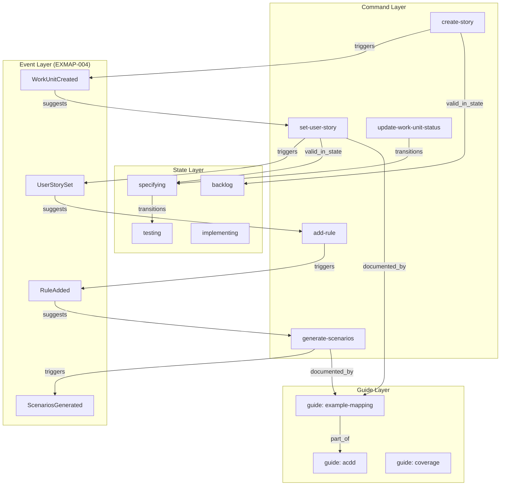

### Node Types

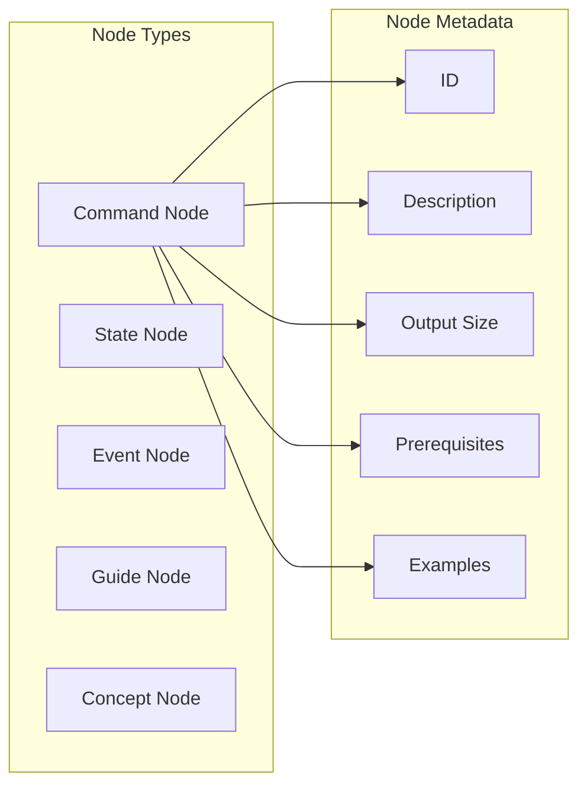

### Edge Types

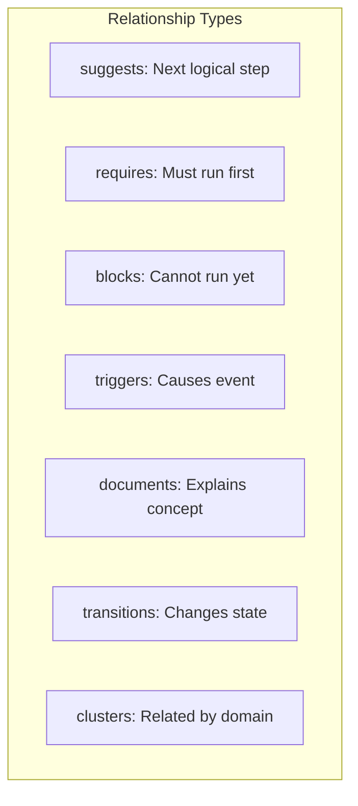

### Benefits of Graph Model

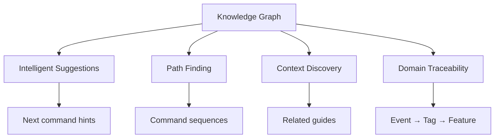

**Advantages:**
1. ✅ **Smart navigation** - "What commands lead to 'done' state?" → Graph pathfinding
2. ✅ **Context-aware suggestions** - Based on current position in graph
3. ✅ **Discover relationships** - Find related commands/guides automatically
4. ✅ **Event Storming integration** - Domain events map naturally to graph
5. ✅ **Visualization** - Generate Mermaid diagrams from graph structure
6. ✅ **Queryable** - "Show me all commands valid in 'specifying' state"

---

## Graph Library Selection

### Requirements

**For AGENT-019 (Information Ingestion):**
- Model command relationships (create-story → set-user-story)
- Track state transitions (backlog → specifying → testing)
- Find command sequences (pathfinding: how to reach goal?)
- Link commands to documentation
- Suggest next actions based on context

**For EXMAP-004 (Event Storming):**
- Model domain events and commands
- Track cause-effect chains (Event → Command → Event)
- Identify bounded contexts (graph clustering)
- Map events to tags and features
- Visualize domain architecture

**Common Needs:**
1. Directed graphs (A → B doesn't mean B → A)
2. Node metadata (commands have descriptions, events have timestamps)
3. Edge metadata (relationships have types and weights)
4. Pathfinding algorithms (Dijkstra, A*)
5. Graph traversal (DFS, BFS)
6. Clustering (identify related concepts)
7. Serialization (save/load graph state)

### Candidate Libraries

#### Option 1: graph-data-structure

**Repository**: https://github.com/datavis-tech/graph-data-structure

**Features:**
```typescript
const graph = Graph();
graph.addNode('A');
graph.addNode('B');
graph.addEdge('A', 'B');
graph.adjacent('A'); // ['B']
graph.topologicalSort(); // Dependency ordering
graph.shortestPath('A', 'B'); // Basic pathfinding
```

**Pros:**
- ✅ Very simple API
- ✅ Topological sort (dependency ordering)
- ✅ Basic pathfinding
- ✅ Lightweight (~2KB)

**Cons:**
- ❌ No edge metadata support (can't label relationships)
- ❌ Last commit: 4 years ago (inactive)
- ❌ No TypeScript definitions
- ❌ No visualization helpers
- ❌ Limited pathfinding (only shortest path)
- ❌ No clustering algorithms
- ❌ No performance optimization for large graphs

**Verdict for fspec:** ❌ Too limited - need edge metadata for relationship types

---

#### Option 2: ngraph.graph (⭐ RECOMMENDED)

**Repository**: https://github.com/anvaka/ngraph.graph

**Features:**
```typescript
import createGraph from 'ngraph.graph';

const graph = createGraph();

// Nodes with metadata
graph.addNode('create-story', {
  description: 'Create a new work unit',
  outputSize: 500,
  phase: 'backlog'
});

// Edges with metadata
graph.addLink('create-story', 'set-user-story', {
  type: 'suggests',
  weight: 1.0,
  description: 'Next step after creating story'
});

// Query
graph.getNode('create-story').data; // Access metadata
graph.getLinks('create-story'); // Get outgoing edges
```

**Ecosystem:**
- `ngraph.path` - Pathfinding (Dijkstra, A*, BFS, DFS)
- `ngraph.forcelayout` - Force-directed graph layout
- `ngraph.centrality` - Identify important nodes
- `ngraph.offline.layout` - Pre-compute layouts
- `ngraph.pixel` - WebGL visualization

**Pros:**
- ✅ **Node metadata** - Store command descriptions, output sizes, etc.
- ✅ **Edge metadata** - Label relationship types (suggests, requires, triggers)
- ✅ **Active maintenance** - Last commit 8 months ago
- ✅ **TypeScript support** - @types/ngraph.graph available
- ✅ **Rich ecosystem** - Pathfinding, layout, centrality, visualization
- ✅ **Performance optimized** - Handles large graphs efficiently
- ✅ **Production-ready** - Used in VivaGraphJS, many visualizations
- ✅ **Serialization** - Easy to save/load graph state
- ✅ **Flexible** - Directed/undirected, weighted edges

**Cons:**
- ❌ Slightly more complex API than graph-data-structure
- ❌ Larger bundle size (~15KB core + ecosystem)

**Verdict for fspec:** ✅ **Perfect fit** - Meets all requirements for both AGENT-019 and EXMAP-004

---

### Decision Matrix

| Feature | graph-data-structure | ngraph.graph |
|---------|---------------------|--------------|
| Edge metadata | ❌ | ✅ |
| Node metadata | ❌ | ✅ |
| Pathfinding | Basic | Advanced (A*, Dijkstra) |
| TypeScript | ❌ | ✅ |
| Active maintenance | ❌ (4 years) | ✅ (8 months) |
| Visualization | ❌ | ✅ (ecosystem) |
| Clustering | ❌ | ✅ (centrality) |
| Performance | Basic | Optimized |
| Event Storming fit | ❌ | ✅ |
| Command graph fit | ⚠️ Limited | ✅ |

**Recommendation:** **ngraph.graph**

---

### ngraph.graph Architecture for fspec

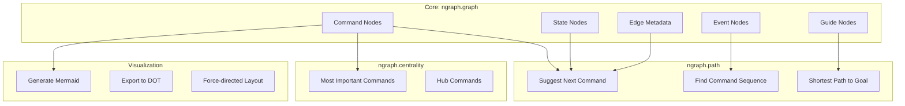

---

## Strategy 1: Progressive Disclosure with Graph Navigation

### Concept

AGENTS.md becomes a **minimal entry point**. Deep documentation accessed via:
1. `fspec guide <topic>` - Topic-focused guides (5KB each)
2. `fspec suggest` - Graph-powered next command suggestions
3. `fspec path <goal>` - Show command sequence to reach goal

### Architecture

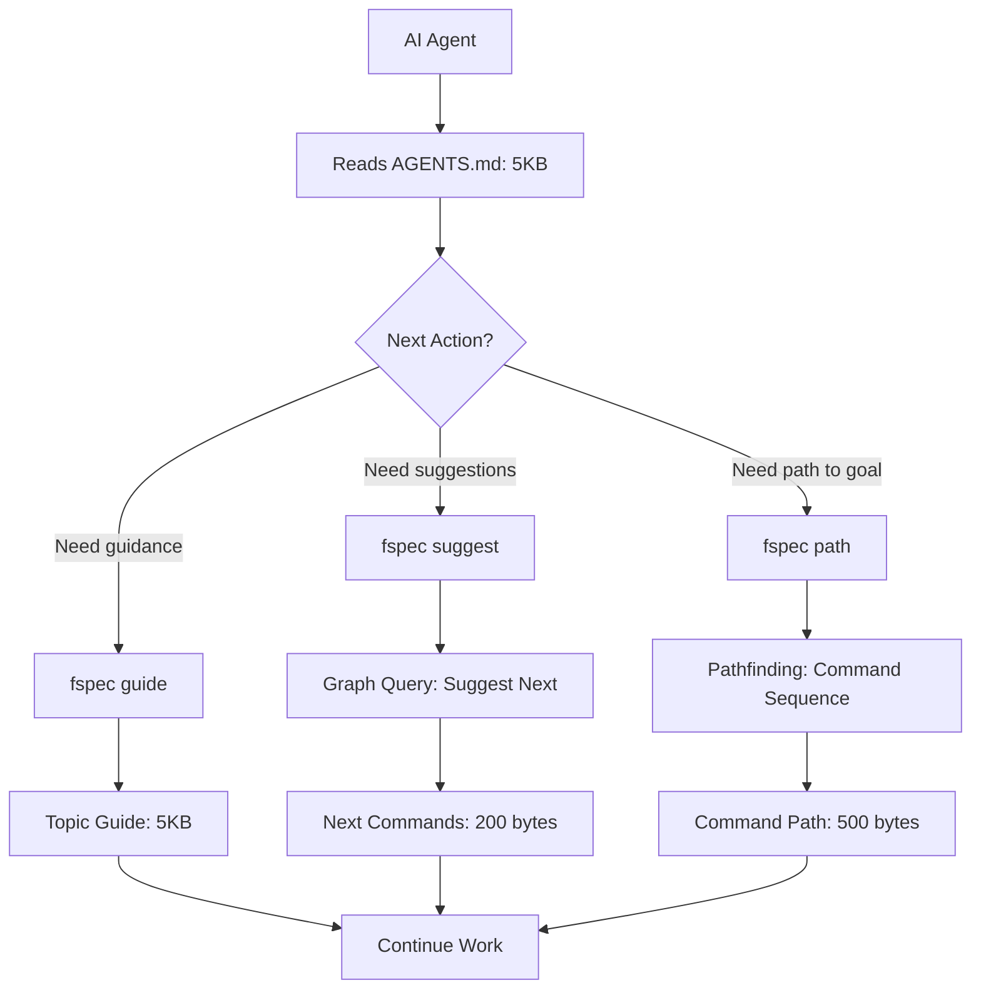

### AGENTS.md Structure

```markdown
# fspec - Navigation Hub

**Version**: 0.7.0
**Commands**: `fspec help` for full list

## Quick Start

New project? `fspec create-prefix <PREFIX> "Description"`

## Current Context

No active work unit detected. Suggestions:
- View backlog: `fspec list-work-units --status=backlog`
- Create story: `fspec create-story <PREFIX> "Title"`
- Get suggestions: `fspec suggest`

## Core Workflows

- **ACDD**: backlog → specifying → testing → implementing → validating → done
- **Example Mapping**: Rules → Examples → Questions → Scenarios
- **Event Storming**: Events → Commands → Aggregates → Tags (see EXMAP-004)

## Get Help

- Workflow guide: `fspec guide acdd`
- Example Mapping: `fspec guide example-mapping`
- Command list: `fspec help`
- Next steps: `fspec suggest`
- Path to goal: `fspec path <goal>`

## Knowledge Graph

fspec uses a knowledge graph to model command relationships. Query it:
- `fspec suggest` - What should I do next?
- `fspec path done` - How do I complete this work unit?
- `fspec graph show` - Visualize command graph
```

**Size**: ~4KB

### fspec suggest Command

```bash
$ fspec suggest
Based on current context:

📍 Current: No active work unit
🎯 Suggested next steps:

1. View backlog
   fspec list-work-units --status=backlog

2. Create new story
   fspec create-story <PREFIX> "Title"

3. Continue work on AUTH-001 (last worked: 2 hours ago)
   fspec show-work-unit AUTH-001

💡 Need help? fspec guide getting-started
```

**Output**: ~300 bytes

### fspec path Command

```bash
$ fspec path done
Path from current state to 'done':

1. fspec create-story AUTH "User Login"
   → Creates work unit in backlog

2. fspec update-work-unit-status AUTH-001 specifying
   → Moves to specifying phase

3. fspec set-user-story AUTH-001 --role "..." --action "..." --benefit "..."
   → Defines user story

4. fspec generate-scenarios AUTH-001
   → Creates feature file

5. fspec update-work-unit-status AUTH-001 testing
   → Moves to testing phase

6. (Write tests, link coverage)

7. fspec update-work-unit-status AUTH-001 implementing
   → Moves to implementing phase

8. (Write code, create checkpoints)

9. fspec update-work-unit-status AUTH-001 validating
   → Moves to validating phase

10. fspec update-work-unit-status AUTH-001 done
    → Completes work unit

💡 See guide: fspec guide acdd
```

**Output**: ~800 bytes

### Guide Topics

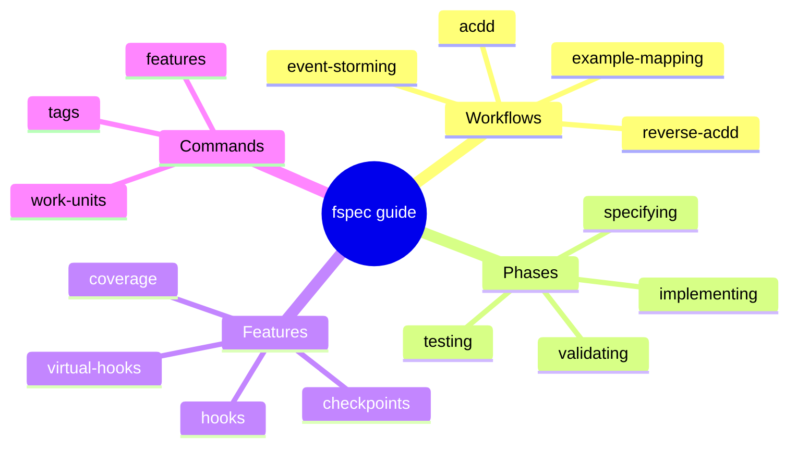

Each guide: **≤ 5KB**

### Advantages

- ✅ Minimal baseline (4KB AGENTS.md)
- ✅ Graph-powered suggestions
- ✅ Pathfinding to goals
- ✅ On-demand deep dives
- ✅ All outputs fit in 10KB limit

### Disadvantages

- ❌ Requires learning new commands (suggest, path)
- ❌ Graph must be built and maintained

---

## Strategy 2: Context-Aware Bootstrap

### Concept (REVISED)

**OLD APPROACH (rejected):** Auto-detect active work unit and show phase-specific guide.

**NEW APPROACH:** Bootstrap provides general overview with **optional** context flag for specific work units.

### Architecture

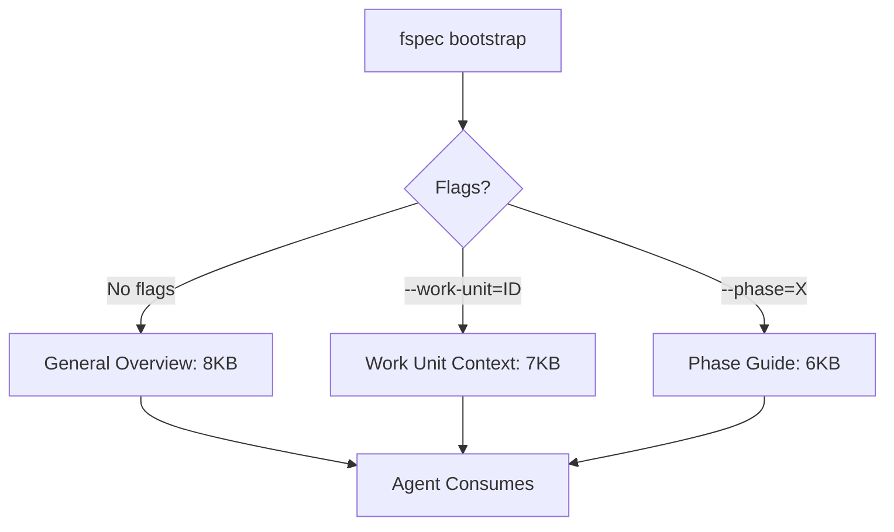

### Default Bootstrap (No Flags)

```bash
$ fspec bootstrap
# Outputs 8KB general overview

# Contents:
# - Core concepts (3KB)
# - Command overview (2KB)
# - Workflow summary (2KB)
# - Navigation links (1KB)
```

**Why no auto-detection?**
- ✅ User may not want to continue last work unit
- ✅ User may want project overview first
- ✅ Explicit is better than implicit
- ✅ Respects user intent

### Context-Specific Bootstrap

```bash
# Show context for specific work unit
$ fspec bootstrap --work-unit=AUTH-001
# Outputs 7KB work unit context

# Contents:
# - Work unit details (2KB)
# - Current phase guide (4KB)
# - Next steps (1KB)

# Show phase-specific guide
$ fspec bootstrap --phase=implementing
# Outputs 6KB implementing phase guide

# Contents:
# - Checkpoints guide (3KB)
# - Hooks guide (2KB)
# - Examples (1KB)
```

### Advantages

- ✅ User controls context
- ✅ No unexpected behavior
- ✅ General overview available
- ✅ Opt-in specificity

### Disadvantages

- ❌ User must know flags exist
- ❌ More typing for context

---

## Strategy 3: Chunked Bootstrap

*(Same as before - see previous version)*

---

## Strategy 4: Inline Contextual Tips with Graph

### Concept

Commands output **graph-powered hints** for next actions.

### Architecture

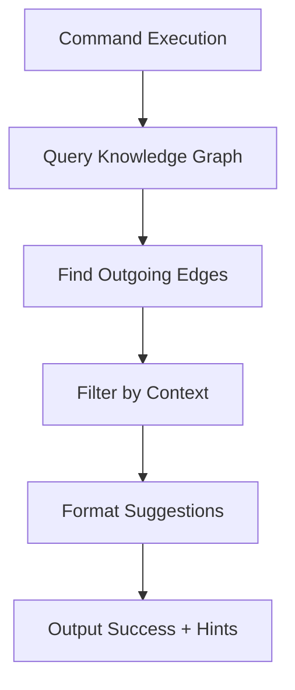

### Example with Graph

```bash
$ fspec create-story AUTH "User Login"
✓ Created AUTH-001

💡 Next: Suggested commands (from graph)
   1. Move to specifying:
      fspec update-work-unit-status AUTH-001 specifying

   2. View work unit:
      fspec show-work-unit AUTH-001

   3. Get all suggestions:
      fspec suggest

$ fspec update-work-unit-status AUTH-001 specifying
✓ Work unit AUTH-001 status updated to specifying

💡 Next: Example Mapping (from graph)
   1. Set user story:
      fspec set-user-story AUTH-001 --role "..." --action "..." --benefit "..."

   2. Add rules:
      fspec add-rule AUTH-001 "rule text"

   3. Full guide:
      fspec guide example-mapping

   4. See all paths:
      fspec path done
```

### Advantages

- ✅ Just-in-time learning
- ✅ Graph-backed accuracy
- ✅ Natural workflow
- ✅ Minimal overhead (~200 bytes)

---

## Integration with Event Storming (EXMAP-004)

### Shared Graph Model

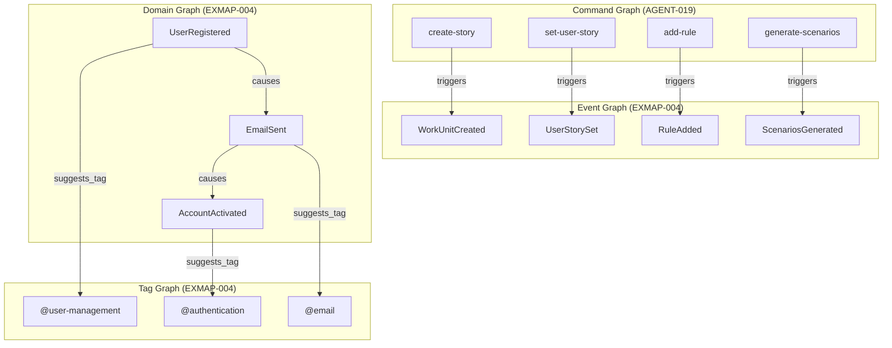

### Event Storming Commands Using Graph

```bash
# Add domain event
$ fspec add-domain-event "UserRegistered"
✓ Added event: UserRegistered

💡 Graph suggests related events:
   - EmailSent (commonly follows UserRegistered)
   - AccountCreated (prerequisite for UserRegistered)

# Find event chains
$ fspec event-chain UserRegistered
Event chain from UserRegistered:

UserRegistered → EmailSent → AccountActivated

Suggested tags based on this chain:
- @user-management (cluster: User*)
- @email (event: EmailSent)
- @authentication (event: AccountActivated)

# Visualize domain events
$ fspec graph show --type=events
# Outputs Mermaid diagram of event relationships
```

### Graph Queries for Event Storming

```typescript
// Find all events that trigger EmailSent
graph.forEachLinkedNode('EmailSent', (node, link) => {
  if (link.data.type === 'causes') {
    console.log(`${node.id} → EmailSent`);
  }
}, true); // incoming links

// Find suggested tags for event cluster
const cluster = findCluster('UserRegistered', graph);
const suggestedTags = cluster.map(event =>
  inferTagFromEvent(event)
);

// Find bounded contexts (graph clustering)
const communities = detectCommunities(graph);
communities.forEach(community => {
  console.log(`Bounded Context: ${community.name}`);
  console.log(`Events: ${community.events.join(', ')}`);
  console.log(`Suggested tags: ${community.tags.join(', ')}`);
});
```

### Traceability Chain

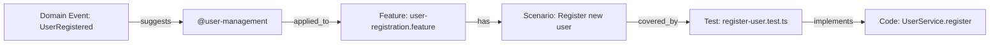

**Queryable:**
```bash
# What features use @user-management tag?
$ fspec query tag @user-management
Features tagged with @user-management:
- user-registration.feature
- user-profile.feature

# What domain events led to this tag?
$ fspec trace tag @user-management
Tag @user-management originated from:
- Event: UserRegistered
- Event: UserProfileUpdated
- Event: UserDeleted

# Show full trace
$ fspec trace feature user-registration.feature
Traceability chain:

Event: UserRegistered
  ↓
Tag: @user-management
  ↓
Feature: user-registration.feature
  ↓
Scenario: Register new user with valid email
  ↓
Test: register-user.test.ts:45-67
  ↓
Implementation: src/services/UserService.ts:23-45
```

---

## Recommended Hybrid Approach

### Combined Architecture

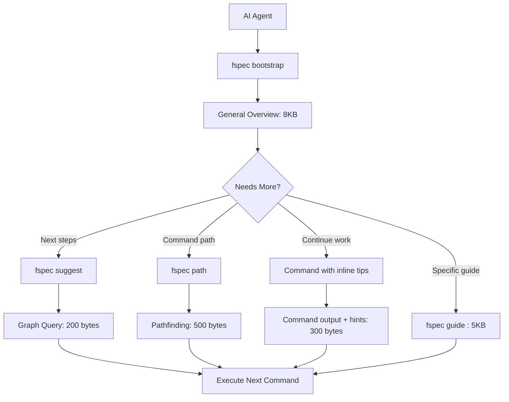

### Components

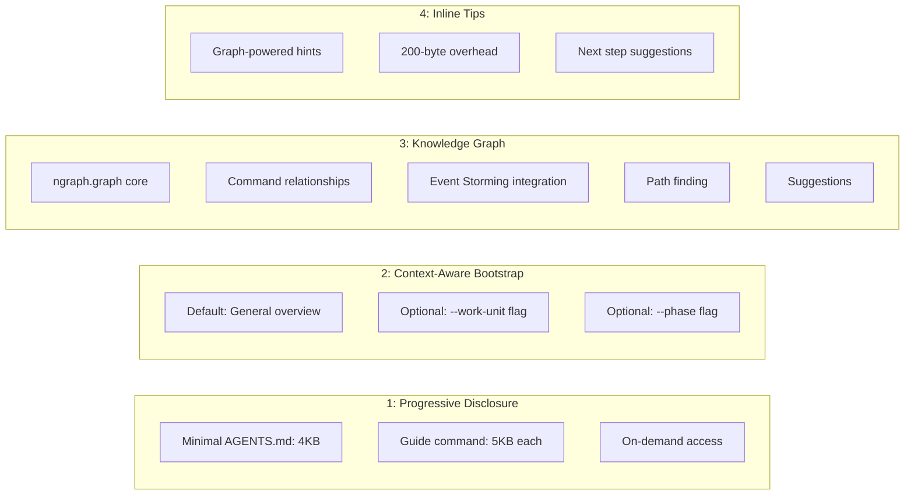

### Information Flow

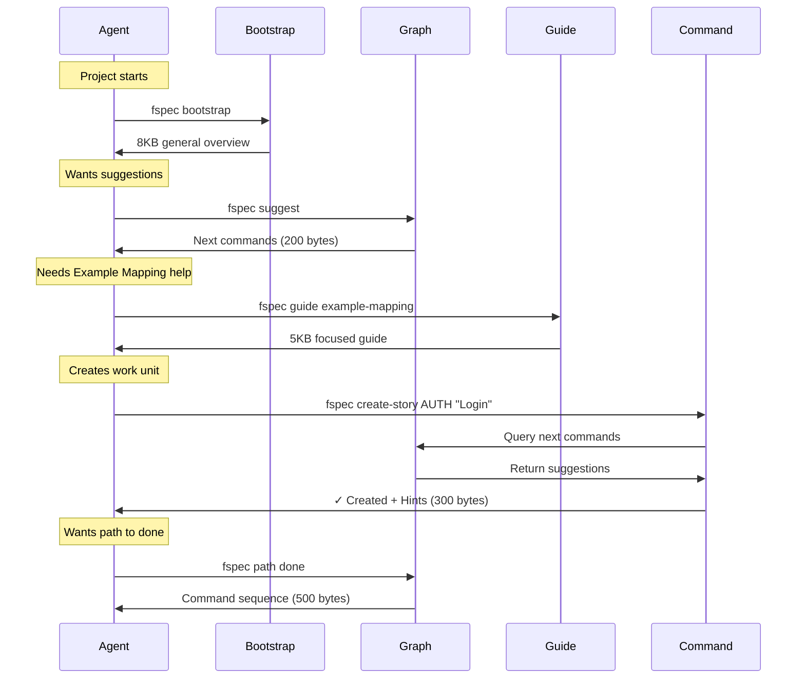

---

## Implementation Order

This work can be broken into the following work units in sequence:

### 1. Graph Core Infrastructure (Foundation)

**Natural boundary: Basic graph operations working**

- Install and configure ngraph.graph
- Create graph builder module
- Define node types (Command, State, Event, Guide, Tag)
- Define edge types (suggests, requires, triggers, documents)
- Build serialization system (save/load graph from JSON)
- Write unit tests for graph operations

**Acceptance criteria:**
- Graph can be created, nodes/edges added, and serialized
- Node and edge metadata can be stored and retrieved
- Tests pass for core graph operations

---

### 2. Graph Population (Data Model)

**Natural boundary: All existing commands mapped to graph**

- Map all existing fspec commands to graph nodes
- Model state transitions (backlog → specifying → testing → implementing → validating → done)
- Add command prerequisites and dependencies
- Link commands to existing documentation
- Add Event Storming node placeholders (for future EXMAP-004 integration)

**Acceptance criteria:**
- Every fspec command exists as a graph node with metadata
- State transitions modeled as edges
- Command relationships defined (suggests, requires, blocks)

---

### 3. Graph Query Commands (Navigation)

**Natural boundary: Basic navigation working**

- Implement `fspec suggest` command using ngraph.path
- Implement `fspec path <goal>` command using pathfinding
- Add graph traversal utilities (find related commands, filter by state)
- Write unit tests for query operations
- Test output sizes (must fit in 10KB limit)

**Acceptance criteria:**
- `fspec suggest` returns contextual next-step suggestions
- `fspec path done` shows command sequence to completion
- Output sizes validated (≤ 300 bytes for suggest, ≤ 800 bytes for path)

---

### 4. Guide System (Progressive Disclosure)

**Natural boundary: All guides written and accessible**

- Create `fspec guide <topic>` command
- Write focused guides (≤ 5KB each):
  - acdd workflow
  - example-mapping process
  - event-storming integration
  - coverage tracking
  - lifecycle hooks
  - kanban states
- Link guides to graph nodes
- Add guide discovery to `fspec suggest`

**Acceptance criteria:**
- Each guide file ≤ 5KB
- Guides linked in knowledge graph
- `fspec guide <topic>` outputs guide content
- `fspec suggest` recommends relevant guides

---

### 5. AGENTS.md Restructure (Entry Point)

**Natural boundary: Minimal navigation hub complete**

- Rewrite AGENTS.md as 4KB navigation hub
- Add knowledge graph introduction
- Add examples of `fspec suggest`, `fspec path`, `fspec guide`
- Remove verbose content (delegate to guides)
- Test with Codex (10KB limit), Claude Code

**Acceptance criteria:**
- AGENTS.md ≤ 4KB
- Contains links to graph query commands
- Tested with Codex and Claude Code
- No truncation in Codex output

---

### 6. Context-Aware Bootstrap (Smart Entry)

**Natural boundary: Bootstrap supports optional context flags**

- Implement default bootstrap (8KB general overview)
- Add `--work-unit=<id>` flag for work unit context
- Add `--phase=<phase>` flag for phase-specific guide
- Update bootstrap documentation
- Test output sizes for all modes

**Acceptance criteria:**
- Default bootstrap ≤ 8KB (general overview)
- `--work-unit` flag outputs ≤ 7KB (work unit context)
- `--phase` flag outputs ≤ 6KB (phase guide)
- All modes tested with Codex

---

### 7. Inline Contextual Tips (Just-in-Time Learning)

**Natural boundary: Key commands output graph-powered suggestions**

- Query graph on command execution
- Format suggestions (max 200 bytes overhead)
- Add inline tips to key commands:
  - `create-story` → suggests `set-user-story`
  - `update-work-unit-status` → suggests next phase commands
  - `set-user-story` → suggests `add-rule`, `add-example`
  - `generate-scenarios` → suggests testing commands
- Test output sizes (command output + tips ≤ 300 bytes overhead)

**Acceptance criteria:**
- Tips appear after command success
- Tips are graph-powered (not hardcoded)
- Total overhead ≤ 200-300 bytes
- Tips suggest 1-3 next commands with examples

---

### 8. Event Storming Integration (Domain Modeling)

**Natural boundary: Event Storming commands working, integrated with graph**

*(This work unit coordinates with EXMAP-004)*

- Add event nodes to graph (domain events, commands, aggregates)
- Implement domain event commands (`add-domain-event`, `event-chain`)
- Implement event chaining (cause-effect relationships)
- Tag suggestion from event clusters
- Traceability queries (Event → Tag → Feature → Test → Code)
- Write unit tests for event operations

**Acceptance criteria:**
- Domain events can be added to graph
- Event chains can be queried
- Tag suggestions based on event clusters
- Full traceability chain queryable

---

### 9. Graph Visualization (Developer Tools)

**Natural boundary: Graph can be visualized and exported**

- Generate Mermaid diagrams from graph structure
- Export to DOT format (Graphviz)
- Implement `fspec graph show` command
- Implement `fspec graph export` command
- Add filtering options (by node type, by state, by domain)

**Acceptance criteria:**
- `fspec graph show` generates Mermaid diagram
- `fspec graph export` outputs DOT format
- Filtering works (show only commands, show only events, etc.)
- Generated diagrams are valid and renderable

---

## Work Unit Grouping Recommendation

**Epic: "AI Agent Information Ingestion Optimization"**

Suggested work unit breakdown:
1. `AGENT-020`: Graph Core Infrastructure
2. `AGENT-021`: Graph Population
3. `AGENT-022`: Graph Query Commands
4. `AGENT-023`: Guide System
5. `AGENT-024`: AGENTS.md Restructure
6. `AGENT-025`: Context-Aware Bootstrap
7. `AGENT-026`: Inline Contextual Tips
8. `AGENT-027`: Event Storming Integration (coordinates with EXMAP-004)
9. `AGENT-028`: Graph Visualization

**Dependencies:**
- Work units 1-3 must be sequential (graph infrastructure → data → queries)
- Work units 4-7 can run in parallel AFTER work unit 3 completes
- Work unit 8 depends on work unit 2 (needs graph populated)
- Work unit 9 can run anytime after work unit 1 (only needs core graph)

**Critical path:** 1 → 2 → 3 → (4, 5, 6, 7 in parallel) → 8

---

## Success Metrics

### Quantitative

| Metric | Before | After | Target |
|--------|--------|-------|--------|
| Bootstrap output | 30KB | 8KB | ≤ 10KB |
| Guide output | N/A | 5KB | ≤ 5KB |
| Suggestion output | N/A | 200 bytes | ≤ 300 bytes |
| Path output | N/A | 500 bytes | ≤ 800 bytes |
| Info loss | 66% | 0% | 0% |

### Qualitative

- ✅ Agents discover commands via graph
- ✅ Natural workflow progression
- ✅ Event Storming traces to tags/features
- ✅ Works across all agents (Codex, Claude, Gemini, Qwen)

---

## Edge Cases & Considerations

### Empty Graph (New Project)

```bash
$ fspec suggest
No commands run yet. Suggested first steps:

1. Configure project:
   fspec configure-tools

2. Create prefix:
   fspec create-prefix <PREFIX> "Description"

3. Bootstrap knowledge:
   fspec bootstrap
```

### Circular Dependencies

Graph builder must detect cycles and warn:
```bash
$ fspec validate graph
⚠️  Circular dependency detected:
   create-story → set-user-story → create-story

Fix: Remove circular edge or mark as optional
```

### Graph Staleness

Graph should rebuild when commands change:
```bash
$ fspec build-graph
Rebuilding knowledge graph...
✓ 150 command nodes
✓ 300 edges
✓ 50 guide nodes
✓ Graph saved to .fspec/graph.json
```

---

## Conclusion

The **Hybrid Approach with Knowledge Graph** provides optimal AI agent information ingestion:

**Key Benefits:**
1. ✅ **Universal Compatibility** - Works within 10KB limit
2. ✅ **Intelligent Navigation** - Graph-powered suggestions
3. ✅ **Context Discovery** - Find related commands/guides
4. ✅ **Event Storming Integration** - Unified graph for EXMAP-004
5. ✅ **Traceability** - Domain events → Tags → Features → Code
6. ✅ **No Auto-Magic** - User controls context (no surprise behavior)

**Implementation Priority:**
1. Knowledge Graph Foundation (highest impact, enables everything)
2. Progressive Disclosure (completes navigation)
3. Inline Tips (just-in-time learning)
4. Event Storming Integration (EXMAP-004 synergy)

**Library Decision:** **ngraph.graph**
- Supports both AGENT-019 (commands) and EXMAP-004 (events)
- Enables pathfinding, suggestions, clustering, visualization
- Active maintenance, TypeScript support, production-ready

This strategy ensures ALL AI agents efficiently consume fspec documentation while building a **knowledge infrastructure** that scales with the project.
