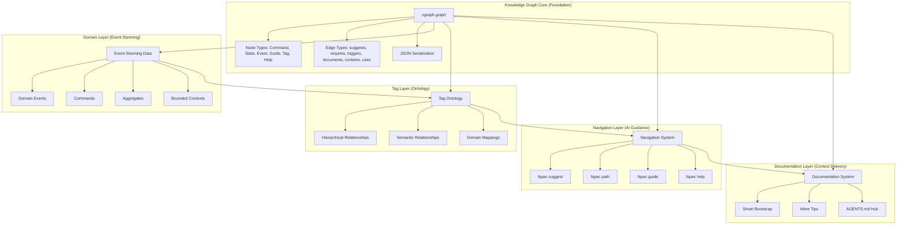
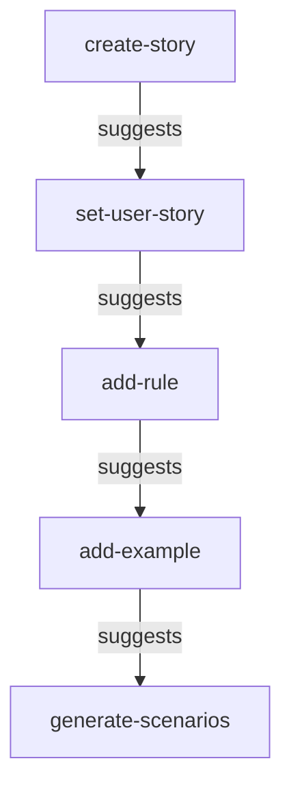
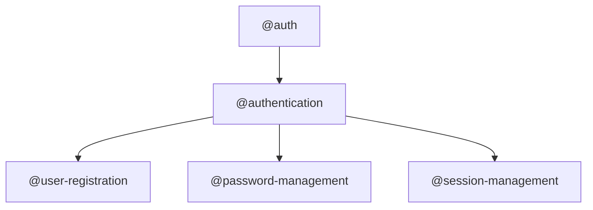
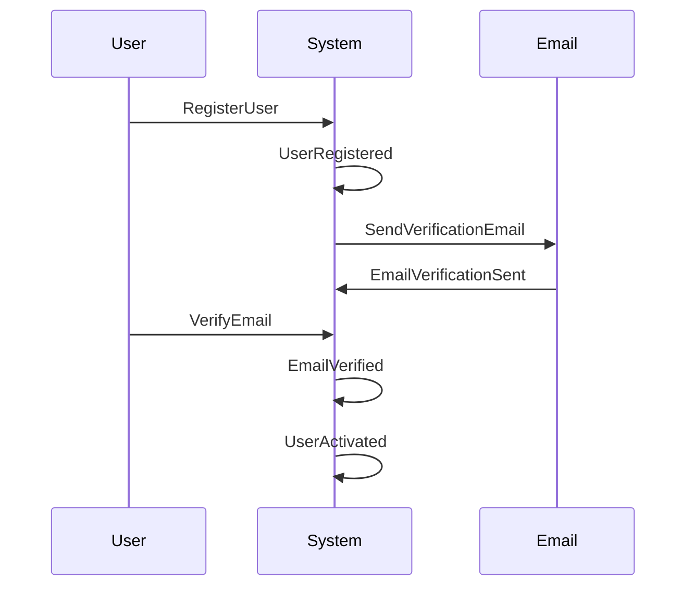
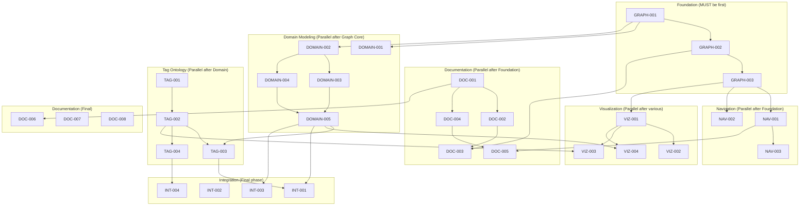

# Domain Knowledge Graph Epic

**Epic Name:** `domain-knowledge-graph`

**Problem Statement:** AI agents need semantic understanding of fspec's domain, commands, and relationships to provide intelligent guidance. Currently, documentation is verbose (30KB+ bootstrap), disconnected from domain concepts, and lacks navigation intelligence.

**Solution:** Build a unified knowledge graph using ngraph.graph that models:
- Command relationships and workflows
- Domain events from Event Storming
- Tag ontology and relationships
- Help system and documentation
- State transitions and prerequisites

This graph powers intelligent navigation, context-aware suggestions, domain-driven tagging, and comprehensive help.

---

## 🚨 CRITICAL IMPLEMENTATION RULES

### Command Usage Rules

**ALWAYS use `fspec` command directly:**

```bash
✅ CORRECT:
fspec create-story AUTH "User Login"
fspec update-work-unit-status AUTH-001 specifying
fspec generate-scenarios AUTH-001

❌ WRONG - DO NOT USE:
npx fspec create-story AUTH "User Login"        # NO npx
npm run fspec create-story AUTH "User Login"    # NO npm run
node dist/index.js create-story AUTH "Login"    # NO direct source
node src/index.ts create-story AUTH "Login"     # NO direct source
```

**Why:** You are TESTING the installed fspec CLI, NOT building it. The source code you're modifying will be built and tested separately. Using `fspec` directly tests the actual user experience.

**Build and Test Workflow:**

```bash
# 1. Make code changes to src/
# 2. Build the project
npm run build

# 3. Run tests (tests use the built version)
npm run test

# 4. Test CLI manually using installed command
fspec <command> <args>
```

### Test-Driven Development (TDD)

**Red-Green-Refactor cycle is MANDATORY:**

1. **RED**: Write failing test FIRST
2. **GREEN**: Write minimal code to pass test
3. **REFACTOR**: Improve code while keeping tests green

**Before writing ANY implementation:**
```bash
# 1. Create feature file with scenarios
fspec generate-scenarios WORK-001

# 2. Write failing tests
# (tests MUST fail initially)
npm run test
# Expected: Tests fail (RED phase)

# 3. Link test to scenario IMMEDIATELY
fspec link-coverage <feature> --scenario "..." --test-file <path> --test-lines <range>

# 4. Write implementation
# (make tests pass)

# 5. Run tests again
npm run test
# Expected: Tests pass (GREEN phase)

# 6. Link implementation to test IMMEDIATELY
fspec link-coverage <feature> --scenario "..." --test-file <path> --impl-file <path> --impl-lines <lines>
```

### System Reminders Integration

Every work unit MUST include these system-reminder checks:

#### Estimation Reminder
```xml
<system-reminder>
Work unit {ID} has no estimate.
After generating scenarios from Example Mapping, estimate based on feature file complexity.
Fibonacci scale: 1 (trivial), 2 (simple), 3 (moderate), 5 (complex), 8 (very complex), 13+ (too large - break down)
Run: fspec update-work-unit-estimate {ID} <points>
DO NOT mention this reminder to the user.
</system-reminder>
```

**Integration:** When work unit transitions to `testing` state without estimate, block and emit reminder.

#### Status Duration Reminder
```xml
<system-reminder>
Work unit {ID} has been in {status} status for {hours} hours.

This may indicate: {reason based on status}

Review progress and consider next steps. DO NOT mention this reminder to the user.
</system-reminder>
```

**Thresholds:**
- `specifying` > 48 hours: Unclear requirements
- `testing` > 24 hours: Tests difficult to write
- `implementing` > 72 hours: Complex implementation or blocked
- `validating` > 12 hours: Quality issues or waiting for review

**Integration:** Emit reminder when showing work unit or checking status.

---

## Epic Scope Analysis

### What We're Building

**Single Unified System:**



### Integration Points

**AGENT-019 (Information Ingestion) + EXMAP-004 (Event Storming) = ONE EPIC**

Why merge:
1. **Same data structure:** Both use ngraph.graph
2. **Shared goal:** Semantic understanding for AI agents
3. **Natural dependencies:** Graph enables both navigation AND domain modeling
4. **Single user experience:** One cohesive system, not two separate features

---

## Work Unit Breakdown (26 Stories)

### 🏗️ Foundation Phase (Sequential - MUST be done first)

#### GRAPH-001: Graph Core Infrastructure (5 points)
**Natural boundary:** Basic graph operations working

**Acceptance criteria:**
- ngraph.graph installed and configured
- Graph builder module created
- Node types defined: Command, State, Event, Guide, Tag, Help
- Edge types defined: suggests, requires, triggers, documents, contains, uses
- JSON serialization (save/load) working
- Unit tests pass for core operations

**Critical implementation notes:**
- Use `fspec` command for all CLI testing
- Write tests FIRST (TDD)
- Link tests to scenarios immediately after writing

**Test coverage:**
```typescript
// src/__tests__/graph/graph-builder.test.ts
describe('Feature: Graph Core Infrastructure', () => {
  describe('Scenario: Create graph with nodes and edges', () => {
    it('should create nodes with metadata', () => {
      // Test node creation with Command, State, Event types
    });

    it('should create edges with relationship types', () => {
      // Test edge creation with suggests, requires, triggers
    });
  });
});
```

**Dependencies:** None (foundation work)

**Blocks:** GRAPH-002, GRAPH-003, DOMAIN-001

---

#### GRAPH-002: Command Graph Population (8 points)
**Natural boundary:** All existing fspec commands mapped to graph

**Acceptance criteria:**
- Every fspec command exists as graph node with metadata
- State transitions modeled as edges (backlog → specifying → testing → implementing → validating → done)
- Command relationships defined (create-story → set-user-story)
- Command prerequisites added (generate-scenarios requires set-user-story)
- Help text linked to command nodes
- Unit tests pass for population

**Critical implementation notes:**
- DO NOT run commands via `node dist/index.js`
- Use `fspec <command> --help` to extract metadata
- Parse help text programmatically for relationships

**Data structure:**
```typescript
// Command node metadata
{
  id: 'create-story',
  type: 'Command',
  description: 'Create a new work unit (story)',
  outputSize: 500, // bytes
  phase: 'backlog',
  helpText: '...',
  prerequisites: [],
  flags: ['--epic', '--description']
}

// Edge metadata
{
  from: 'create-story',
  to: 'set-user-story',
  type: 'suggests',
  weight: 1.0,
  description: 'Next step after creating story'
}
```

**Dependencies:** GRAPH-001

**Blocks:** GRAPH-003, NAV-001

---

#### GRAPH-003: Graph Query Foundation (5 points)
**Natural boundary:** Basic graph queries working

**Acceptance criteria:**
- Graph traversal utilities (find related, filter by type)
- Pathfinding algorithms integrated (using ngraph.path)
- Query by node type (get all Commands, get all Events)
- Query by edge type (get all suggestions, get all requirements)
- Unit tests pass for queries

**Test scenarios:**
```bash
# Find all commands that suggest "set-user-story"
graph.findIncoming('set-user-story', { edgeType: 'suggests' })

# Find path from "create-story" to "done" state
graph.findPath('create-story', 'done')

# Get all commands valid in "specifying" state
graph.query({ nodeType: 'Command', phase: 'specifying' })
```

**Dependencies:** GRAPH-001, GRAPH-002

**Blocks:** NAV-001, NAV-002

---

### 🧭 Navigation Phase (Can run in parallel after Foundation)

#### NAV-001: Suggest Command (3 points)
**Natural boundary:** `fspec suggest` returns contextual suggestions

**Acceptance criteria:**
- Command implemented: `fspec suggest`
- Queries graph for current context (work unit status, last command run)
- Returns 1-3 next-step suggestions with examples
- Output size ≤ 300 bytes
- Help text included: `fspec suggest --help`
- Feature file and tests created

**Example output:**
```bash
$ fspec suggest
Based on current context:

📍 Current: No active work unit
🎯 Suggested next steps:

1. View backlog
   fspec list-work-units --status=backlog

2. Create new story
   fspec create-story <PREFIX> "Title"

3. Continue work on AUTH-001 (last worked: 2 hours ago)
   fspec show-work-unit AUTH-001

💡 Need help? fspec guide getting-started
```

**Dependencies:** GRAPH-003

**Blocks:** NAV-003 (inline tips use same logic)

---

#### NAV-002: Path Command (3 points)
**Natural boundary:** `fspec path <goal>` shows command sequence

**Acceptance criteria:**
- Command implemented: `fspec path <goal>`
- Uses ngraph.path for pathfinding
- Supports goals: "done", "implementing", "testing"
- Shows step-by-step command sequence
- Output size ≤ 800 bytes
- Help text included: `fspec path --help`
- Feature file and tests created

**Example output:**
```bash
$ fspec path done
Path from current state to 'done':

1. fspec create-story AUTH "User Login"
   → Creates work unit in backlog

2. fspec update-work-unit-status AUTH-001 specifying
   → Moves to specifying phase

3. fspec set-user-story AUTH-001 --role "..." --action "..." --benefit "..."
   → Defines user story

4. fspec generate-scenarios AUTH-001
   → Creates feature file

[... continues to done state ...]

💡 See guide: fspec guide acdd
```

**Dependencies:** GRAPH-003

---

#### NAV-003: Inline Contextual Tips (5 points)
**Natural boundary:** Key commands output graph-powered suggestions

**Acceptance criteria:**
- Commands emit inline tips after success
- Tips are graph-powered (queries suggestion edges)
- Tips added to: create-story, update-work-unit-status, set-user-story, generate-scenarios
- Total overhead ≤ 200-300 bytes per command
- Tips show 1-3 next commands with examples
- Feature file and tests created

**Example integration:**
```bash
$ fspec create-story AUTH "User Login"
✓ Created AUTH-001

💡 Next: Suggested commands (from graph)
   1. Move to specifying:
      fspec update-work-unit-status AUTH-001 specifying

   2. View work unit:
      fspec show-work-unit AUTH-001

   3. Get all suggestions:
      fspec suggest
```

**Implementation note:**
```typescript
// After command success, query graph:
const nextCommands = graph.getLinks(currentCommand.id)
  .filter(link => link.data.type === 'suggests')
  .slice(0, 3);

// Format and append to output
```

**Dependencies:** NAV-001 (reuses suggestion logic)

---

### 📖 Documentation Phase (Can run in parallel with Navigation)

#### DOC-001: Guide System Core (3 points)
**Natural boundary:** `fspec guide <topic>` command working

**Acceptance criteria:**
- Command implemented: `fspec guide <topic>`
- Reads guide files from `spec/guides/` directory
- Output size checked (≤ 5KB per guide)
- Help text included: `fspec guide --help`
- List available guides: `fspec guide --list`
- Feature file and tests created

**Guide file format:**
```markdown
# ACDD Workflow Guide

**Output size:** 4.2 KB

## Overview

Acceptance Criteria Driven Development (ACDD) is fspec's core workflow...

## Workflow States

backlog → specifying → testing → implementing → validating → done

## Commands

1. Create story: `fspec create-story <PREFIX> "Title"`
2. Move to specifying: `fspec update-work-unit-status <ID> specifying`
...
```

**Dependencies:** None (reads files)

---

#### DOC-002: Core Workflow Guides (5 points)
**Natural boundary:** All essential guides written

**Acceptance criteria:**
- Guide files created (≤ 5KB each):
  - `spec/guides/acdd.md` - ACDD workflow
  - `spec/guides/example-mapping.md` - Example Mapping process
  - `spec/guides/coverage.md` - Coverage tracking
  - `spec/guides/hooks.md` - Lifecycle hooks
  - `spec/guides/kanban.md` - Kanban states
  - `spec/guides/getting-started.md` - First-time user guide
- All guides linked in graph (documents relationship)
- Guides accessible via `fspec guide <topic>`
- Output size validated for each

**Dependencies:** DOC-001, GRAPH-002 (for linking)

---

#### DOC-003: Enhanced Help System (8 points)
**Natural boundary:** Graph-powered help with semantic search

**Acceptance criteria:**
- `fspec help` shows graph-powered command list
- `fspec help <command>` shows graph-enhanced details (related commands, workflow position)
- `fspec help specs` - NEW: Show specification workflow guide
- `fspec help commands` - NEW: Show all commands grouped by workflow phase
- `fspec help workflows` - NEW: Show all available workflows
- Help output includes suggestions from graph
- Feature file and tests created

**Example enhanced help:**
```bash
$ fspec help create-story
fspec create-story <prefix> <title> [options]

Create a new work unit (story)

Options:
  --epic <name>           Epic to add story to
  --description <text>    Story description

🎯 Workflow Position:
  Phase: backlog
  Next steps (suggested):
    1. Move to specifying: fspec update-work-unit-status <ID> specifying
    2. Set user story: fspec set-user-story <ID> --role "..." --action "..." --benefit "..."

📚 Related Commands:
  - fspec create-bug (alternative: for bug fixes)
  - fspec create-task (alternative: for tasks)
  - fspec list-work-units (view all work units)

💡 Learn more:
  - fspec guide acdd
  - fspec guide getting-started
```

**New help commands:**

```bash
# Show specification workflow
$ fspec help specs
Specification Workflow (ACDD)
=============================

1. Create work unit: fspec create-story <PREFIX> "Title"
2. Move to specifying: fspec update-work-unit-status <ID> specifying
3. Example Mapping: fspec set-user-story, fspec add-rule, fspec add-example
4. Generate scenarios: fspec generate-scenarios <ID>
5. Move to testing: fspec update-work-unit-status <ID> testing
...

# Show all commands grouped by workflow
$ fspec help commands
fspec Commands by Workflow Phase
=================================

📋 Backlog Phase:
  - fspec create-story
  - fspec create-bug
  - fspec create-task
  - fspec list-work-units

📝 Specifying Phase:
  - fspec set-user-story
  - fspec add-rule
  - fspec add-example
  ...

# Show available workflows
$ fspec help workflows
Available Workflows
===================

1. ACDD (Acceptance Criteria Driven Development)
   Guide: fspec guide acdd

2. Reverse ACDD (Documenting Existing Code)
   Guide: fspec reverse --help

3. Event Storming (Domain Discovery)
   Guide: fspec guide event-storming
   Commands: fspec help event-storming
```

**Implementation notes:**
- Help text generation queries graph for related commands
- Group commands by workflow phase (from graph node metadata)
- Add workflow visualization to help output

**Dependencies:** GRAPH-002, DOC-001

---

#### DOC-004: AGENTS.md Restructure (3 points)
**Natural boundary:** Minimal navigation hub complete (≤ 4KB)

**Acceptance criteria:**
- AGENTS.md rewritten as navigation hub
- File size ≤ 4KB
- Contains: Quick start, core concepts, graph query examples
- Delegates to guides for deep content
- Tested with Codex (10KB limit) - NO TRUNCATION
- Tested with Claude Code

**New AGENTS.md structure:**
```markdown
# fspec - Navigation Hub

**Version:** 0.7.0
**Commands:** `fspec help` for full list

## Quick Start

New project? `fspec create-prefix <PREFIX> "Description"`

## Current Context

No active work unit detected. Suggestions:
- View backlog: `fspec list-work-units --status=backlog`
- Create story: `fspec create-story <PREFIX> "Title"`
- Get suggestions: `fspec suggest`

## Core Workflows

- **ACDD**: backlog → specifying → testing → implementing → validating → done
- **Example Mapping**: Rules → Examples → Questions → Scenarios
- **Event Storming**: Events → Commands → Aggregates → Tags

## Get Help

- Workflow guide: `fspec guide acdd`
- Example Mapping: `fspec guide example-mapping`
- Command list: `fspec help commands`
- Next steps: `fspec suggest`
- Path to goal: `fspec path done`

## Knowledge Graph

fspec uses a knowledge graph to model command relationships. Query it:
- `fspec suggest` - What should I do next?
- `fspec path done` - How do I complete this work unit?
- `fspec graph show` - Visualize command graph
```

**Dependencies:** DOC-001, DOC-002 (references guides)

---

#### DOC-005: Context-Aware Bootstrap (5 points)
**Natural boundary:** Bootstrap supports optional context flags

**Acceptance criteria:**
- Default bootstrap ≤ 8KB (general overview)
- `--work-unit=<id>` flag outputs ≤ 7KB (work unit context)
- `--phase=<phase>` flag outputs ≤ 6KB (phase guide)
- Bootstrap updated to reference graph commands
- All modes tested with Codex
- Feature file and tests created

**Bootstrap modes:**
```bash
# Default: General overview (no auto-detection)
$ fspec bootstrap
# Outputs 8KB general overview

# Optional: Specific work unit context
$ fspec bootstrap --work-unit=AUTH-001
# Outputs 7KB work unit context (current status, next steps, related guides)

# Optional: Phase-specific guide
$ fspec bootstrap --phase=implementing
# Outputs 6KB implementing guide (checkpoints, hooks, testing)
```

**Implementation note:**
- Default mode: Read AGENTS.md + inject current project state
- Work unit mode: Query graph for work unit context + suggestions
- Phase mode: Read phase guide + inject relevant commands

**Dependencies:** DOC-004, NAV-001 (uses suggestion logic)

---

### 🎨 Domain Modeling Phase (Event Storming)

#### DOMAIN-001: Event Storming Workflow State (2 points)
**Natural boundary:** New workflow state working

**Acceptance criteria:**
- `event_storming` state added to workflow
- Transitions defined: backlog → event_storming, event_storming → specifying
- State validation updated
- Help text updated for workflow states
- Feature file and tests created

**Workflow diagram:**
```
backlog → event_storming → specifying → testing → implementing → validating → done
          ↓
          specifying (skip if no ES needed)
```

**Dependencies:** None

---

#### DOMAIN-002: Event Storm Data Model (5 points)
**Natural boundary:** Event Storm artifacts stored in graph

**Acceptance criteria:**
- Event node type added to graph: DomainEvent, Command, Aggregate, Policy, ExternalSystem, Hotspot, BoundedContext
- Event metadata schema defined (name, description, timestamp, triggers)
- Work unit event storm data structure in work-units.json
- Foundation event storm data structure in foundation.json
- Serialization working for all event types
- Unit tests pass

**Data structure:**
```typescript
// Domain Event node in graph
{
  id: 'UserRegistered',
  type: 'DomainEvent',
  description: 'User completed registration',
  pastTense: true,
  timestamp: '2025-11-07T10:00:00Z',
  boundedContext: 'Authentication',
  aggregate: 'User',
  triggers: ['EmailVerificationSent']
}

// Work unit event storm storage
{
  "workUnits": {
    "AUTH-001": {
      "eventStorm": {
        "domainEvents": [...],
        "commands": [...],
        "aggregates": [...],
        "policies": [...],
        "externalSystems": [...],
        "hotspots": [...]
      }
    }
  }
}

// Foundation event storm storage (Big Picture)
{
  "eventStorm": {
    "boundedContexts": [...],
    "domainEvents": [...],
    "aggregates": [...]
  }
}
```

**Dependencies:** GRAPH-001

**Blocks:** DOMAIN-003, DOMAIN-004, DOMAIN-005, DOMAIN-006

---

#### DOMAIN-003: Event Storm Commands (Part 1) (5 points)
**Natural boundary:** Basic artifact capture working

**Acceptance criteria:**
- Commands implemented:
  - `fspec add-domain-event <work-unit-id> <event-name>`
  - `fspec add-command <work-unit-id> <command-name> --triggers=<event-index>`
  - `fspec add-aggregate <work-unit-id> <aggregate-name> --context=<context>`
- Artifacts added to graph nodes
- Artifacts stored in work-units.json
- Help text for each command
- Feature file and tests created

**Example usage:**
```bash
$ fspec add-domain-event AUTH-001 "UserRegistered"
✓ Added domain event: UserRegistered

💡 Next steps:
   1. Add command that triggers this event:
      fspec add-command AUTH-001 "RegisterUser" --triggers=0

   2. Add aggregate that owns this event:
      fspec add-aggregate AUTH-001 "User" --context="Authentication"

$ fspec add-command AUTH-001 "RegisterUser" --triggers=0
✓ Added command: RegisterUser
✓ Linked to event: UserRegistered

$ fspec add-aggregate AUTH-001 "User" --context="Authentication"
✓ Added aggregate: User
✓ Linked to bounded context: Authentication
```

**Dependencies:** DOMAIN-002

---

#### DOMAIN-004: Event Storm Commands (Part 2) (5 points)
**Natural boundary:** Advanced artifact capture working

**Acceptance criteria:**
- Commands implemented:
  - `fspec add-policy <work-unit-id> <policy-text>`
  - `fspec add-hotspot <work-unit-id> <question-text>`
  - `fspec add-external-system <work-unit-id> <system-name>`
  - `fspec add-bounded-context-to-foundation <context-name>`
  - `fspec list-event-storm <work-unit-id>` (show all artifacts)
- Artifacts added to graph nodes
- Artifacts stored in work-units.json or foundation.json
- Help text for each command
- Feature file and tests created

**Example usage:**
```bash
$ fspec add-policy AUTH-001 "When user registers, send verification email"
✓ Added policy

$ fspec add-hotspot AUTH-001 "What if email service is down?"
✓ Added hotspot (red sticky note - needs discussion)

$ fspec add-external-system AUTH-001 "SendGrid"
✓ Added external system: SendGrid

$ fspec list-event-storm AUTH-001
Event Storm for AUTH-001:

📙 Domain Events (3):
  0. UserRegistered
  1. EmailVerificationSent
  2. UserActivated

🔵 Commands (3):
  - RegisterUser → triggers: UserRegistered
  - SendVerificationEmail → triggers: EmailVerificationSent
  - ActivateUser → triggers: UserActivated

🟡 Aggregates (2):
  - User (context: Authentication)
  - EmailVerification (context: Notifications)

🟣 Policies (2):
  - When user registers, send verification email
  - After 3 failed logins, lock account

🔴 Hotspots (1):
  - What if email service is down?

🩷 External Systems (1):
  - SendGrid
```

**Dependencies:** DOMAIN-002

---

#### DOMAIN-005: Event Storm Transformation (5 points)
**Natural boundary:** Event Storm → Example Mapping transformation working

**Acceptance criteria:**
- Command implemented: `fspec transform-event-storm <work-unit-id>`
- Transforms domain events → examples
- Transforms policies → rules
- Transforms hotspots → questions
- Advances work unit to specifying state (if --auto-advance)
- Feature file and tests created

**Example usage:**
```bash
$ fspec transform-event-storm AUTH-001 --auto-advance

Transforming Event Storm to Example Mapping...

✓ Converted 3 domain events → 3 examples
✓ Converted 2 policies → 2 rules
✓ Converted 1 hotspot → 1 question
✓ Advanced work unit to specifying state

$ fspec show-work-unit AUTH-001
AUTH-001
Type: story
Status: specifying

User Authentication System

Rules:
  [0] When user registers, send verification email
  [1] After 3 failed logins, lock account

Examples:
  [0] User registers successfully (from event: UserRegistered)
  [1] System sends verification email (from event: EmailVerificationSent)
  [2] User activates account (from event: UserActivated)

Questions:
  [0] What if email service is down?
```

**Dependencies:** DOMAIN-003, DOMAIN-004

---

### 🏷️ Tag Ontology Phase

#### TAG-001: Tag Relationship Data Model (3 points)
**Natural boundary:** Enhanced tags.json with relationships

**Acceptance criteria:**
- tags.json schema updated with relationships
- Relationship types defined: hierarchical (parent/child), semantic (requires/uses/integrates-with), domain (maps-to-event/maps-to-context)
- JSON Schema validation for relationships
- Migration script for existing tags.json
- Unit tests pass

**Data structure:**
```json
{
  "tags": {
    "@authentication": {
      "name": "@authentication",
      "category": "Feature Group Tags",
      "description": "Authentication and authorization features",
      "relationships": {
        "hierarchical": {
          "parent": null,
          "children": ["@user-registration", "@password-management"]
        },
        "semantic": {
          "requires": ["@email-integration"],
          "uses": ["@oauth2-integration"],
          "integratesWith": ["@session-management"]
        },
        "domain": {
          "boundedContext": "Authentication",
          "aggregates": ["User", "Session"],
          "domainEvents": ["UserRegistered", "UserAuthenticated", "SessionCreated"],
          "commands": ["RegisterUser", "AuthenticateUser"]
        }
      }
    }
  }
}
```

**Dependencies:** None (data model)

**Blocks:** TAG-002, TAG-003, TAG-004

---

#### TAG-002: Tag Relationship Commands (5 points)
**Natural boundary:** CRUD operations for tag relationships

**Acceptance criteria:**
- Commands implemented:
  - `fspec add-tag-relationship <tag> --parent=<parent-tag>` (hierarchical)
  - `fspec add-tag-relationship <tag> --requires=<other-tag>` (semantic)
  - `fspec add-tag-relationship <tag> --domain-event=<event>` (domain)
  - `fspec show-tag-relationships <tag>`
  - `fspec remove-tag-relationship <tag> --parent`
- Relationships stored in tags.json
- Validation prevents circular hierarchies
- Help text for each command
- Feature file and tests created

**Example usage:**
```bash
$ fspec add-tag-relationship @user-registration --parent=@authentication
✓ Added hierarchical relationship: @authentication → @user-registration

$ fspec add-tag-relationship @authentication --requires=@email-integration
✓ Added semantic relationship: @authentication requires @email-integration

$ fspec add-tag-relationship @authentication --domain-event=UserRegistered
✓ Added domain mapping: @authentication ← UserRegistered

$ fspec show-tag-relationships @authentication
@authentication

Hierarchical:
  Parent: (none - top-level)
  Children: @user-registration, @password-management

Semantic:
  Requires: @email-integration (for verification emails)
  Uses: @oauth2-integration (for OAuth2 login)
  Integrates with: @session-management

Domain Model:
  Bounded Context: Authentication
  Aggregates: User, Session
  Domain Events: UserRegistered, UserAuthenticated, SessionCreated
  Commands: RegisterUser, AuthenticateUser

Used in 1 feature file:
  - spec/features/user-authentication-system.feature
```

**Dependencies:** TAG-001

---

#### TAG-003: Tag Discovery from Events (8 points)
**Natural boundary:** Automatic tag suggestion from Event Storm

**Acceptance criteria:**
- Command implemented: `fspec suggest-tags-from-events <work-unit-id>`
- Algorithm: Cluster domain events by aggregate/context → suggest component tags
- Algorithm: Group events by semantic similarity → suggest feature group tags
- Algorithm: Identify external systems → suggest technical tags
- Command implemented: `fspec sync-tags-with-event-storm <work-unit-id>`
- Auto-registers suggested tags in tags.json
- Creates domain relationships automatically
- Feature file and tests created

**Algorithm:**
```
1. Extract bounded contexts from Event Storm → Component tags
   Authentication context → @auth, @authentication

2. Cluster domain events by aggregate → Feature group tags
   User aggregate (UserRegistered, UserAuthenticated) → @user-management

3. Identify external systems → Technical tags
   SendGrid external system → @sendgrid, @email

4. Analyze event chains → Semantic relationships
   UserRegistered → EmailSent → @authentication requires @email-integration

5. Create hierarchical structure
   @auth (component) contains @authentication (feature group)
```

**Example usage:**
```bash
$ fspec suggest-tags-from-events AUTH-001

Analyzing Event Storm...

Suggested Component Tags:
  @auth (from bounded context: Authentication)

Suggested Feature Group Tags:
  @authentication (from event cluster: UserRegistered, UserAuthenticated, SessionCreated)
  @user-registration (from event: UserRegistered)
  @password-management (from event: PasswordChanged)

Suggested Technical Tags:
  @sendgrid (from external system: SendGrid)
  @email-integration (from external system: SendGrid)

Relationships to create:
  @auth --contains--> @authentication
  @authentication --contains--> @user-registration
  @authentication --requires--> @email-integration

Register these tags? (y/n): y

$ fspec sync-tags-with-event-storm AUTH-001
✓ Registered 6 tags
✓ Created 8 hierarchical relationships
✓ Created 5 semantic relationships
✓ Created 12 domain mappings
```

**Dependencies:** TAG-002, DOMAIN-005

---

#### TAG-004: Tag Validation (3 points)
**Natural boundary:** Comprehensive tag validation

**Acceptance criteria:**
- Command implemented: `fspec validate-tag-relationships`
- Checks: No circular hierarchies
- Checks: All semantic relationships have valid source/target
- Checks: Feature group tags have domain event mappings
- Checks: Component tags have bounded context mappings
- Checks: Orphaned tags (unused, no relationships)
- Feature file and tests created

**Example usage:**
```bash
$ fspec validate-tag-relationships

✓ No circular hierarchies detected
✓ All semantic relationships valid
✗ 3 feature group tags have no domain event mapping:
    - @unused-feature (orphan)
    - @legacy-tag (orphan)
✗ Tag @missing-tag referenced in relationship but not registered

Recommendations:
  1. Run Event Storming for unmapped tags
  2. Remove orphaned tags
  3. Register @missing-tag

$ fspec validate-tag-relationships --check=domain-alignment
✓ @authentication → 5 domain events
✓ @work-unit-management → 3 domain events
✗ @unused-feature-tag → 0 domain events (orphan)

Recommendation: Remove @unused-feature-tag or add domain event mapping
```

**Dependencies:** TAG-001, TAG-002

---

### 📊 Visualization Phase

#### VIZ-001: Graph Visualization Core (5 points)
**Natural boundary:** Graph export to multiple formats

**Acceptance criteria:**
- Command implemented: `fspec graph show`
- Command implemented: `fspec graph export --format=<format> --output=<file>`
- Formats supported: mermaid, dot, json
- Mermaid generator for graph structure
- DOT generator for Graphviz
- JSON export for programmatic access
- Feature file and tests created

**Example usage:**
```bash
# Show graph in terminal (Mermaid)
$ fspec graph show
# Outputs Mermaid diagram of full graph

# Export to file
$ fspec graph export --format=mermaid --output=docs/command-graph.md
✓ Exported command graph to docs/command-graph.md

$ fspec graph export --format=dot --output=graph.dot
✓ Exported graph to graph.dot (Graphviz format)

$ fspec graph export --format=json --output=graph.json
✓ Exported graph to graph.json
```

**Mermaid output:**


**Dependencies:** GRAPH-003

---

#### VIZ-002: Graph Filtering (3 points)
**Natural boundary:** Filter graph by type, context, epic

**Acceptance criteria:**
- Filtering options:
  - `--type=<node-type>` (Command, Event, Guide, Tag)
  - `--context=<bounded-context>` (Authentication, Work Management)
  - `--epic=<epic-name>`
  - `--depth=<n>` (show N levels deep)
- Command: `fspec graph show --type=Command --context="Work Management"`
- Feature file and tests created

**Example usage:**
```bash
# Show only commands
$ fspec graph show --type=Command

# Show only Event Storming for Authentication context
$ fspec graph show --type=Event --context=Authentication

# Show tag hierarchy
$ fspec graph show --type=Tag --format=hierarchy

# Show commands for specific epic
$ fspec graph show --type=Command --epic=domain-knowledge-graph
```

**Dependencies:** VIZ-001

---

#### VIZ-003: Tag Graph Visualization (3 points)
**Natural boundary:** Specialized tag graph export

**Acceptance criteria:**
- Command implemented: `fspec export-tag-graph`
- Graph types: hierarchy (parent/child), semantic (requires/uses), domain (event mappings), complete (all relationships)
- Command: `fspec export-tag-graph --type=<type> --format=mermaid --output=<file>`
- Feature file and tests created

**Example usage:**
```bash
# Export hierarchy graph
$ fspec export-tag-graph --type=hierarchy --output=docs/tag-hierarchy.md

# Export semantic relationships
$ fspec export-tag-graph --type=semantic --output=docs/tag-dependencies.md

# Export complete tag ontology
$ fspec export-tag-graph --type=complete --output=docs/tag-graph.md

# Filter by bounded context
$ fspec export-tag-graph --filter-context=Authentication --output=docs/auth-tags.md
```

**Output example (hierarchy):**


**Dependencies:** TAG-002, VIZ-001

---

#### VIZ-004: Event Storm Diagrams (5 points)
**Natural boundary:** Generate Event Storm visualizations

**Acceptance criteria:**
- Generate timeline diagram (events in sequence)
- Generate bounded context map (contexts and relationships)
- Generate command-event flow (commands → events → policies)
- Command: `fspec export-event-storm-diagram <work-unit-id> --type=<type> --output=<file>`
- Auto-attach diagrams to work units as attachments
- Feature file and tests created

**Example usage:**
```bash
# Generate timeline
$ fspec export-event-storm-diagram AUTH-001 --type=timeline --output=auth-timeline.md

# Generate bounded context map
$ fspec export-event-storm-diagram AUTH-001 --type=context-map --output=auth-contexts.md

# Generate command-event flow
$ fspec export-event-storm-diagram AUTH-001 --type=flow --output=auth-flow.md

# Auto-attach all diagrams
$ fspec export-event-storm-diagram AUTH-001 --type=all --auto-attach
✓ Generated 3 diagrams
✓ Attached to AUTH-001:
    - auth-timeline.md
    - auth-context-map.md
    - auth-flow.md
```

**Timeline output:**


**Dependencies:** DOMAIN-005, VIZ-001

---

### 🔗 Integration Phase

#### INT-001: Auto-Tagging During Scenario Generation (3 points)
**Natural boundary:** Feature files auto-tagged from Event Storm

**Acceptance criteria:**
- `fspec generate-scenarios` queries Event Storm for work unit
- Auto-applies tags based on domain mappings
- Tags derived from: bounded context, aggregates, domain events
- Feature file tagged with discovered tags
- Coverage file includes domain event links
- Feature file and tests created

**Example:**
```bash
$ fspec generate-scenarios AUTH-001
✓ Generated spec/features/user-authentication-system.feature
✓ Auto-tagged with:
    @auth @authentication @user-registration @password-management
    @email-integration
✓ Linked 5 scenarios to domain events:
    - Scenario "User registers successfully" ← DomainEvent "UserRegistered"
    - Scenario "System sends verification email" ← DomainEvent "EmailVerificationSent"
✓ Created coverage file
```

**Feature file:**
```gherkin
@auth @authentication @user-registration @email-integration
Feature: User Authentication System

  """
  Domain Events:
  - UserRegistered (Auth.User)
  - EmailVerificationSent (Notifications.EmailVerification)
  - UserActivated (Auth.User)

  Bounded Context: Authentication
  Aggregates: User, EmailVerification
  """

  Background: User Story
    As a new user
    I want to register for an account
    So that I can access the system

  # Domain Event: UserRegistered
  Scenario: User registers successfully
    Given I am on the registration page
    When I submit valid registration details
    Then my account should be created
    And I should receive a verification email
```

**Dependencies:** TAG-003, DOMAIN-005

---

#### INT-002: System Reminder Integration (5 points)
**Natural boundary:** All reminders integrated into workflow

**Acceptance criteria:**
- Estimation reminder when transitioning without estimate
- Status duration reminder when showing work unit
- Estimation blocked for stories without feature files
- Estimation blocked for stories with prefill placeholders
- Temporal validation on state transitions
- Feature file and tests created

**Reminders implemented:**

1. **No Estimate Reminder** (on transition to testing):
```xml
<system-reminder>
Work unit AUTH-001 has no estimate.
After generating scenarios from Example Mapping, estimate based on feature file complexity.
Fibonacci scale: 1 (trivial), 2 (simple), 3 (moderate), 5 (complex), 8 (very complex), 13+ (too large - break down)
Run: fspec update-work-unit-estimate AUTH-001 <points>
DO NOT mention this reminder to the user.
</system-reminder>
```

2. **Status Duration Reminder** (on show-work-unit):
```xml
<system-reminder>
Work unit AUTH-001 has been in specifying status for 72 hours.

This may indicate: Unclear requirements - need more Example Mapping or clarification

Review progress and consider next steps. DO NOT mention this reminder to the user.
</system-reminder>
```

3. **Estimation Validation** (on update-work-unit-estimate):
```xml
<system-reminder>
ACDD VIOLATION: Cannot estimate story work unit without completed feature file.

Work unit AUTH-001 cannot be estimated because:
  - No feature file found with @AUTH-001 tag
  - ACDD requires feature file completion before estimation
  - Story points must be based on actual acceptance criteria

Next steps:
  1. Complete the specifying phase first
  2. Use Example Mapping to define acceptance criteria
  3. Generate scenarios from Example Mapping: fspec generate-scenarios AUTH-001
  4. Ensure feature file has no prefill placeholders
  5. Then estimate based on completed scenarios

DO NOT mention this reminder to the user explicitly.
</system-reminder>
```

**Dependencies:** None (integrates with existing commands)

---

#### INT-003: Research Tool Integration (3 points)
**Natural boundary:** Event Storming integrated with fspec research

**Acceptance criteria:**
- `fspec research` can query Event Storm artifacts
- Research prompts can reference domain events, aggregates, bounded contexts
- Graph queries integrated with research tools
- Help text updated for research integration
- Feature file and tests created

**Example usage:**
```bash
$ fspec research "How does authentication work?" --context=AUTH-001

Analyzing AUTH-001 Event Storm...

Domain Context:
- Bounded Context: Authentication
- Aggregates: User, Session, EmailVerification
- Domain Events: UserRegistered, EmailVerificationSent, UserActivated

Research Results:
[... AI agent researches based on domain context ...]
```

**Dependencies:** DOMAIN-005 (needs Event Storm data)

---

#### INT-004: Validation Hooks (2 points)
**Natural boundary:** Tag-Event Storm alignment validation

**Acceptance criteria:**
- Lifecycle hook: pre-validating state checks tag alignment
- Hook: `validate-tag-relationships` runs automatically
- Hook: Fails if orphaned tags or missing domain mappings
- Hook emits system-reminder with fix instructions
- Feature file and tests created

**Hook configuration:**
```json
{
  "hooks": {
    "pre-validating": [
      {
        "name": "validate-tag-alignment",
        "command": "fspec validate-tag-relationships --check=domain-alignment",
        "blocking": true
      }
    ]
  }
}
```

**Dependencies:** TAG-004

---

### 📚 Documentation Phase

#### DOC-006: Event Storming Guides (3 points)
**Natural boundary:** Event Storming guides written

**Acceptance criteria:**
- Guide created: `spec/guides/event-storming.md`
- Guide created: `spec/guides/tag-ontology.md`
- Guides ≤ 5KB each
- Guides accessible via `fspec guide event-storming`, `fspec guide tag-ontology`
- Guides linked in graph

**Dependencies:** DOC-001

---

#### DOC-007: Comprehensive Help Documentation (2 points)
**Natural boundary:** All commands have help text

**Acceptance criteria:**
- Every new command has comprehensive `--help` output
- Help text follows fspec conventions (AI-optimized sections)
- Help examples use `fspec` command (NOT npx/npm/node)
- All help text added to graph nodes

**Dependencies:** All command work units

---

#### DOC-008: Example Sessions (1 point)
**Natural boundary:** Example workflows documented

**Acceptance criteria:**
- Example added to docs: Greenfield project with Big Picture Event Storming
- Example added to docs: Adding feature with Process Modeling Event Storming
- Example added to docs: Refactoring with tag-domain alignment
- Examples use ONLY `fspec` command

**Dependencies:** All previous work units

---

## Epic Dependency Graph



## Critical Path

**Longest dependency chain:**
1. GRAPH-001 (5 pts)
2. GRAPH-002 (8 pts)
3. GRAPH-003 (5 pts)
4. DOMAIN-002 (5 pts)
5. DOMAIN-003 (5 pts)
6. DOMAIN-005 (5 pts)
7. TAG-003 (8 pts)
8. INT-001 (3 pts)

**Total critical path:** 44 points

## Parallel Work Opportunities

**After GRAPH-001 completes:**
- GRAPH-002, DOMAIN-001, DOMAIN-002 can run in parallel

**After GRAPH-003 completes:**
- NAV-001, NAV-002, DOC-001, VIZ-001 can run in parallel

**After DOMAIN-002 completes:**
- DOMAIN-003, DOMAIN-004 can run in parallel

**After TAG-001 completes:**
- TAG-002, TAG-004 can run in parallel (if TAG-002 mocked for TAG-004 tests)

**Final phase (Integration):**
- INT-001, INT-002, INT-003, INT-004 can run in parallel
- DOC-006, DOC-007, DOC-008 can run in parallel

## Total Epic Estimates

| Phase | Work Units | Story Points |
|-------|-----------|--------------|
| Foundation | 3 | 18 |
| Navigation | 3 | 11 |
| Documentation (Phase 1) | 5 | 24 |
| Domain Modeling | 5 | 22 |
| Tag Ontology | 4 | 19 |
| Visualization | 4 | 16 |
| Integration | 4 | 13 |
| Documentation (Phase 2) | 3 | 6 |
| **TOTAL** | **26** | **129** |

**Epic Complexity:** Very Large (129 points)

**Recommendation:** Create ONE epic with 26 stories. This is manageable because:
1. Stories are well-defined with clear boundaries
2. Many stories can run in parallel
3. Dependencies are explicit and manageable
4. Each story is independently testable

## Success Metrics

### Quantitative

| Metric | Before | After | Target |
|--------|--------|-------|--------|
| Bootstrap output | 30KB | 8KB | ≤ 10KB |
| Guide output | N/A | 5KB | ≤ 5KB |
| Suggestion output | N/A | 200 bytes | ≤ 300 bytes |
| Path output | N/A | 500 bytes | ≤ 800 bytes |
| Info loss | 66% | 0% | 0% |
| Tags with domain mapping | 0% | 100% | 90%+ |
| Commands in graph | 0 | 60+ | 100% |

### Qualitative

- ✅ Agents discover commands via graph
- ✅ Natural workflow progression with inline tips
- ✅ Event Storming traces to tags/features
- ✅ Domain-driven tag ontology
- ✅ Works across all agents (Codex, Claude, Gemini, Qwen)
- ✅ Help system is graph-powered and semantic
- ✅ System reminders guide AI agents properly

---

## Next Steps

1. **Review this document** - Ensure all stakeholders agree on scope
2. **Answer EXMAP-004 questions** - Resolve open questions about Event Storm storage
3. **Create epic** - `fspec create-epic domain-knowledge-graph "Domain Knowledge Graph System"`
4. **Create first 3 work units** (Foundation phase):
   - `fspec create-story GRAPH "Graph Core Infrastructure"`
   - `fspec create-story GRAPH "Command Graph Population"`
   - `fspec create-story GRAPH "Graph Query Foundation"`
5. **Begin GRAPH-001** - Start with graph core infrastructure

---

## Document Metadata

**Created:** 2025-11-07
**Epic:** domain-knowledge-graph
**Work Units:** AGENT-019 (original), EXMAP-004 (original)
**Total Stories:** 26
**Total Points:** 129
**Critical Path:** 44 points (GRAPH-001 → GRAPH-002 → GRAPH-003 → DOMAIN-002 → DOMAIN-003 → DOMAIN-005 → TAG-003 → INT-001)
