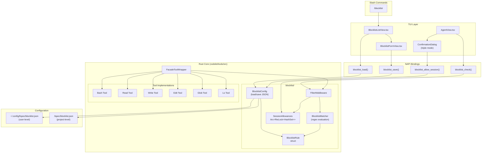
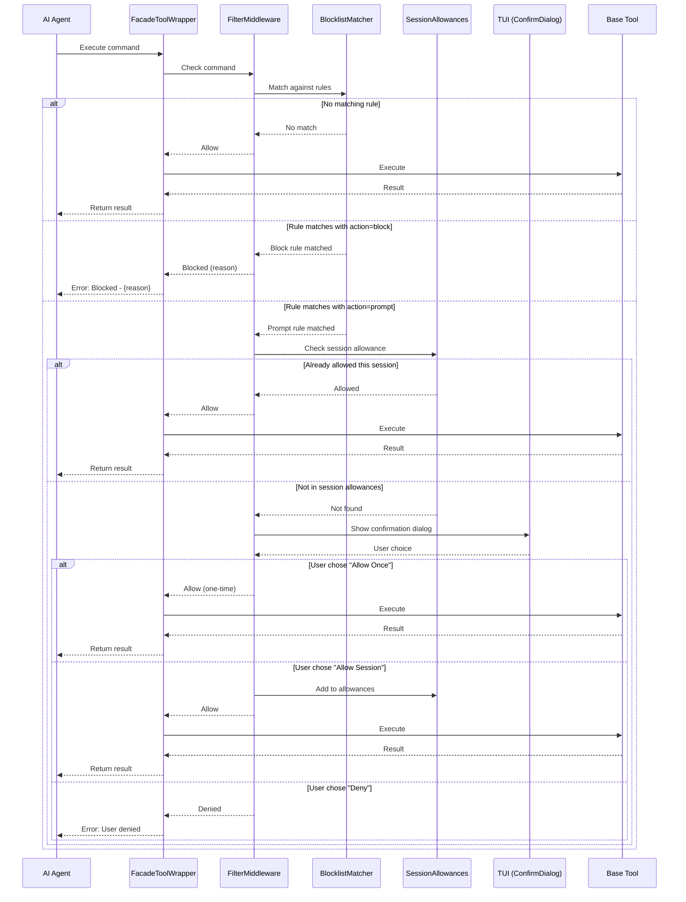
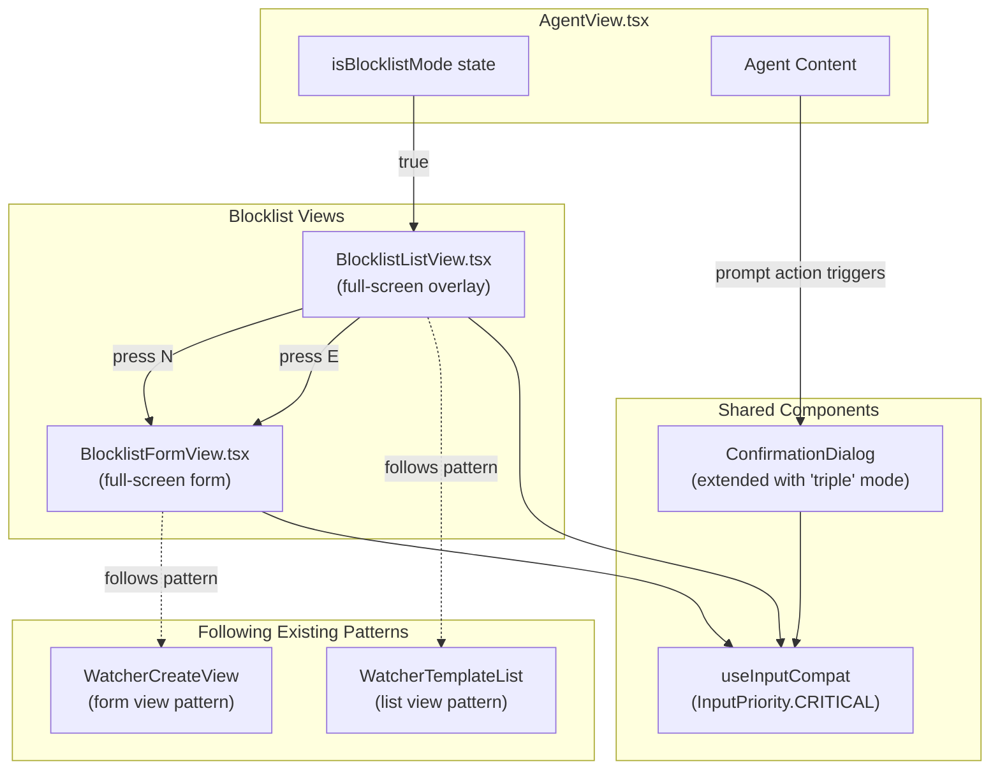
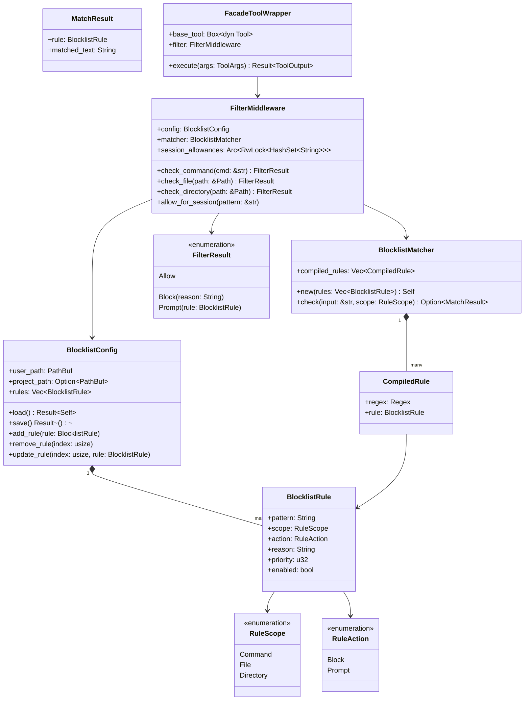
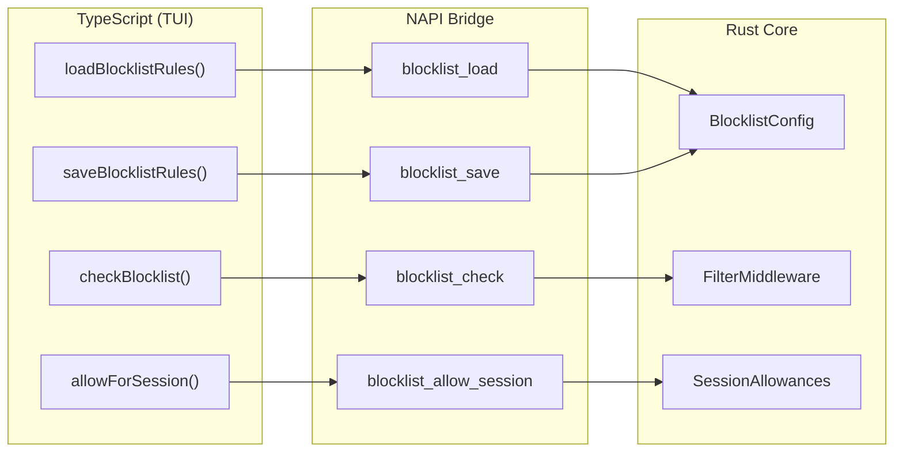

# BLOCK-001: Command Blocklist System for Tool Execution Filtering

**Type:** Story  
**Status:** Specifying  
**Created:** 2026-02-04  

---

## Overview

Implement a rule-based filtering system for commands sent to Bash (and other provider tool facades). The system should support blocking commands with explanations, prompting users for confirmation (with session-wide allow, one-time allow, or deny options), and managing rules via a TUI /blocklist command. Rules should support regex patterns for both command filtering and file/directory access control.

---

## System Architecture



---

## Rules (Business Requirements)

| # | Rule |
|---|------|
| 0 | Blocklist rules MUST be stored in a user-configurable JSON file (e.g., `~/.config/fspec/blocklist.json` or project-level `.fspec/blocklist.json`) |
| 1 | Each rule MUST specify: pattern (regex), scope (command\|file\|directory), action (block\|prompt), and reason (explanation message) |
| 2 | Block action MUST immediately reject the command/access and return the reason to the AI agent as an error |
| 3 | Prompt action MUST display a confirmation dialog with three options: Allow Once, Allow for Session, and Deny |
| 4 | Session-wide allowances MUST be stored in memory and cleared when the TUI/session exits |
| 5 | Blocklist filtering MUST be applied at the tool facade layer, intercepting commands before they reach the base tool implementation |
| 6 | The /blocklist TUI command MUST allow viewing, adding, editing, and deleting rules interactively |
| 7 | File access rules MUST be checked by Read, Write, Edit, Glob, Ls tools in addition to Bash |
| 8 | Rules MUST support priority ordering - first matching rule wins |
| 9 | Default rules SHOULD be provided for dangerous operations (rm -rf, git push --force, etc.) but be user-overridable |

---

## Command Execution Flow



---

## Examples (Acceptance Criteria)

### Example 0: Command Block
**Rule:** `{pattern: 'git checkout', scope: 'command', action: 'block', reason: 'Git checkout blocked - use git switch instead'}`

**Scenario:** AI runs `git checkout main`

**Result:** Tool returns error `Blocked: Git checkout blocked - use git switch instead`

---

### Example 1: Command Prompt
**Rule:** `{pattern: 'rm -rf', scope: 'command', action: 'prompt', reason: 'Recursive delete detected'}`

**Scenario:** AI runs `rm -rf ./build`

**Result:** Dialog shows `[Allow Once] [Allow Session] [Deny]` → User selects 'Allow Once' → Command executes

---

### Example 2: File Access Block
**Rule:** `{pattern: '.*\\.env$', scope: 'file', action: 'block', reason: 'Environment files contain secrets'}`

**Scenario:** AI tries Read tool on `.env`

**Result:** Tool returns error `Blocked: Environment files contain secrets`

---

### Example 3: Directory Access Prompt
**Rule:** `{pattern: '/home/.*/.ssh/', scope: 'directory', action: 'prompt', reason: 'SSH directory contains private keys'}`

**Scenario:** AI tries to list `~/.ssh/`

**Result:** Dialog shows options → User allows for session → Subsequent access to `~/.ssh/` during same session doesn't prompt again

---

### Example 5: Session Allowance Memory

**Scenario Flow:**
1. User allows `npm install` for session
2. Later AI runs `npm install lodash` → No prompt shown, command executes
3. User exits TUI
4. User restarts TUI
5. AI runs `npm install axios` → Prompt shown again (session cleared)

---

### Example 6: /blocklist List View

**Scenario:** User types `/blocklist`

**Result:**
- Full-screen overlay shows with header 'Command Blocklist'
- Scrollable list shows rules with format: `[scope] pattern → reason`
- User can type to filter rules
- ↑/↓ navigates selection
- Footer shows: `↑↓ Navigate | N New | E Edit | D Delete | Esc Close`

---

### Example 7: /blocklist Add Rule

**Scenario:** From list view, user presses `N`

**Result:**
- Full-screen form replaces list
- Fields: Pattern (text input), Scope (←/→ toggle: command|file|directory), Action (←/→ toggle: block|prompt), Reason (text input)
- Tab cycles between fields
- Enter on Create button saves rule
- Esc cancels and returns to list

---

### Example 8: /blocklist Edit Rule

**Scenario:** User selects a rule and presses `E`

**Result:**
- Form opens pre-populated with rule data
- User modifies pattern to be more specific
- Tab to Action field
- ←/→ changes from 'block' to 'prompt'
- Enter saves changes
- Returns to list view with updated rule

---

### Example 9: Prompt Confirmation During Execution

**Scenario:** AI executes `rm -rf ./node_modules`

**Result:**
- Rule matches with action=prompt
- Modal dialog appears over conversation: 'Recursive delete detected' with command shown
- Three buttons: `[Allow Once] [Allow Session] [Deny]`
- ←/→ navigates buttons
- Enter confirms selection
- Dialog closes, execution proceeds or is blocked based on choice

---

## TUI Component Architecture



### Component Specifications

| Component | Pattern | Key Features |
|-----------|---------|--------------|
| `BlocklistListView.tsx` | WatcherTemplateList | Full-screen overlay, position=absolute, black background, header with border, scrollable content, footer with keyboard hints |
| `BlocklistFormView.tsx` | WatcherCreateView | Full-screen form, field navigation with Tab, toggle fields with ←/→, validation before save |
| `ConfirmationDialog` | Extended existing | New 'triple' confirmMode with three buttons, visual mode pattern with ←/→ navigation |

---

## Rust Module Structure



---

## Configuration File Format

### Location Priority
1. **Project-level** (higher priority): `.fspec/blocklist.json`
2. **User-level** (fallback): `~/.config/fspec/blocklist.json`

### JSON Schema

```json
{
  "$schema": "http://json-schema.org/draft-07/schema#",
  "type": "object",
  "properties": {
    "version": { "type": "string", "const": "1.0" },
    "rules": {
      "type": "array",
      "items": {
        "type": "object",
        "required": ["pattern", "scope", "action", "reason"],
        "properties": {
          "pattern": { "type": "string", "description": "Regex pattern" },
          "scope": { "enum": ["command", "file", "directory"] },
          "action": { "enum": ["block", "prompt"] },
          "reason": { "type": "string" },
          "priority": { "type": "integer", "default": 0 },
          "enabled": { "type": "boolean", "default": true }
        }
      }
    }
  }
}
```

### Example Configuration

```json
{
  "version": "1.0",
  "rules": [
    {
      "pattern": "rm\\s+-rf\\s+/",
      "scope": "command",
      "action": "block",
      "reason": "Recursive delete of root directory is not allowed",
      "priority": 100,
      "enabled": true
    },
    {
      "pattern": "git\\s+push\\s+.*--force",
      "scope": "command",
      "action": "prompt",
      "reason": "Force push can overwrite remote history",
      "priority": 90,
      "enabled": true
    },
    {
      "pattern": ".*\\.env.*",
      "scope": "file",
      "action": "block",
      "reason": "Environment files may contain secrets",
      "priority": 80,
      "enabled": true
    },
    {
      "pattern": ".*/\\.ssh/.*",
      "scope": "directory",
      "action": "prompt",
      "reason": "SSH directory contains private keys",
      "priority": 70,
      "enabled": true
    }
  ]
}
```

---

## NAPI Bindings



### Function Signatures

| NAPI Function | Input | Output |
|---------------|-------|--------|
| `blocklist_load` | `{ userPath?: string, projectPath?: string }` | `{ rules: BlocklistRule[] }` |
| `blocklist_save` | `{ rules: BlocklistRule[], path: string }` | `{ success: boolean }` |
| `blocklist_check` | `{ input: string, scope: string }` | `{ result: 'allow' \| 'block' \| 'prompt', reason?: string, pattern?: string }` |
| `blocklist_allow_session` | `{ pattern: string }` | `{ success: boolean }` |

---

## Default Rules (Recommended)

These rules should be provided out-of-the-box but can be overridden by the user:

| Pattern | Scope | Action | Reason |
|---------|-------|--------|--------|
| `rm\s+-rf\s+/` | command | block | Recursive delete of root directory |
| `rm\s+-rf\s+~` | command | block | Recursive delete of home directory |
| `git\s+push\s+.*--force` | command | prompt | Force push can overwrite history |
| `git\s+reset\s+--hard` | command | prompt | Hard reset discards uncommitted changes |
| `chmod\s+777` | command | prompt | Overly permissive file permissions |
| `>\s*/dev/sd[a-z]` | command | block | Writing directly to disk device |
| `.*\.env.*` | file | block | Environment files contain secrets |
| `.*\.pem$` | file | block | PEM files contain private keys |
| `.*id_rsa.*` | file | block | SSH private keys |
| `.*/\.ssh/.*` | directory | prompt | SSH configuration directory |
| `.*/\.gnupg/.*` | directory | prompt | GPG keys directory |

---

## Implementation Checklist

### Rust Core
- [ ] Create `codelet/tools/src/blocklist/mod.rs`
- [ ] Implement `BlocklistConfig` struct with load/save
- [ ] Implement `BlocklistRule` struct
- [ ] Implement `BlocklistMatcher` with regex compilation
- [ ] Implement `FilterMiddleware`
- [ ] Implement session allowance storage
- [ ] Add NAPI bindings
- [ ] Write unit tests

### TUI Components
- [ ] Create `BlocklistListView.tsx`
- [ ] Create `BlocklistFormView.tsx`
- [ ] Extend `ConfirmationDialog` with triple mode
- [ ] Add `isBlocklistMode` state to `AgentView.tsx`
- [ ] Register `/blocklist` command
- [ ] Wire up keyboard navigation
- [ ] Write component tests

### Integration
- [ ] Wrap tool execution in `FacadeToolWrapper`
- [ ] Apply filtering to Bash tool
- [ ] Apply filtering to Read tool
- [ ] Apply filtering to Write tool
- [ ] Apply filtering to Edit tool
- [ ] Apply filtering to Glob tool
- [ ] Apply filtering to Ls tool
- [ ] Write integration tests

### Configuration
- [ ] Create default `blocklist.json` template
- [ ] Implement config file discovery (project > user)
- [ ] Document configuration options
- [ ] Add JSON schema validation

---

## Open Questions

None currently - all questions have been resolved through Example Mapping.

---

## Related Work Units

None currently linked.

---

*Last updated: 2026-02-04*
