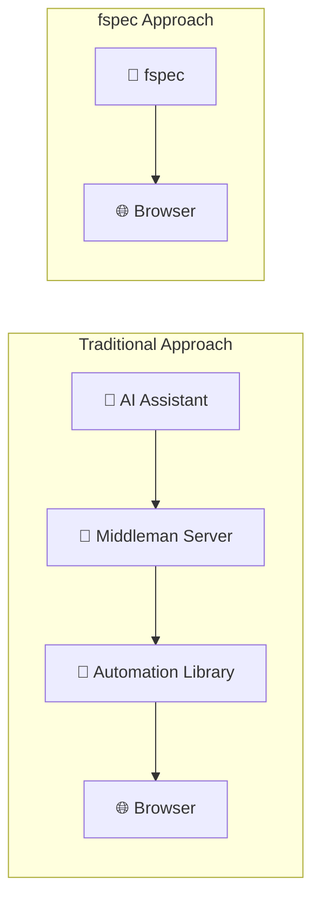
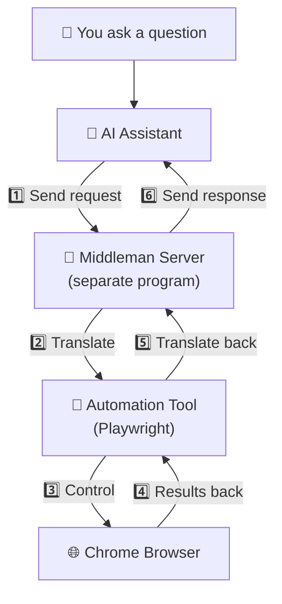
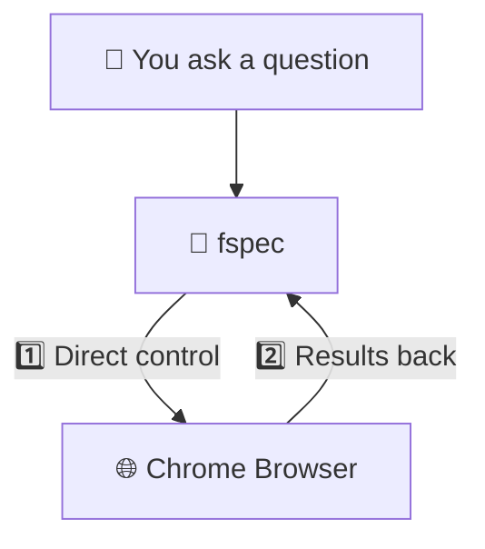
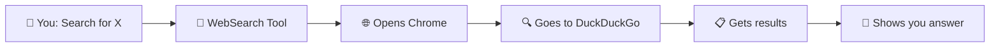
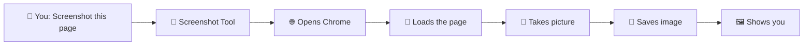
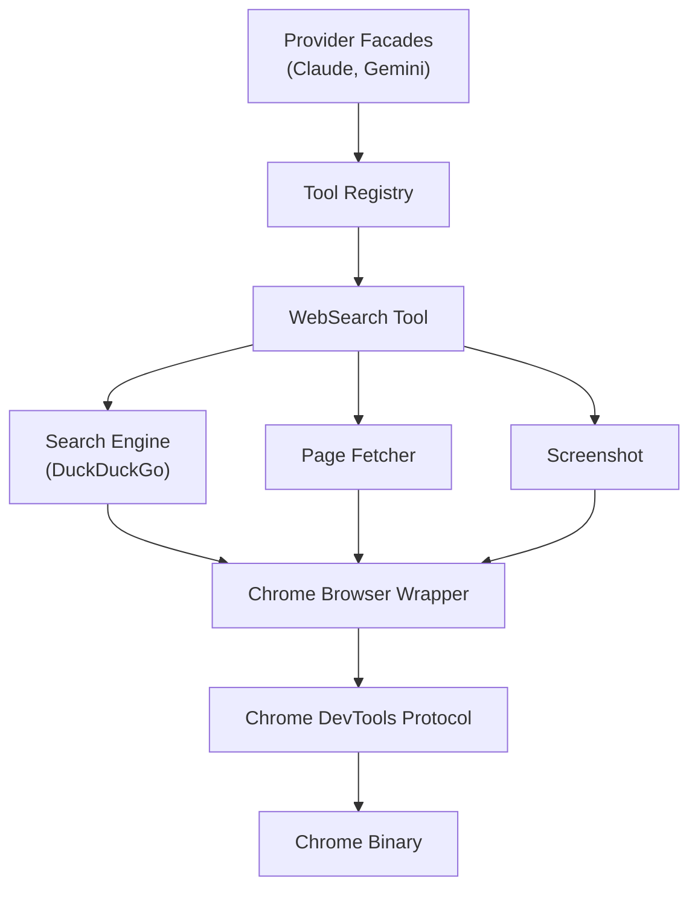
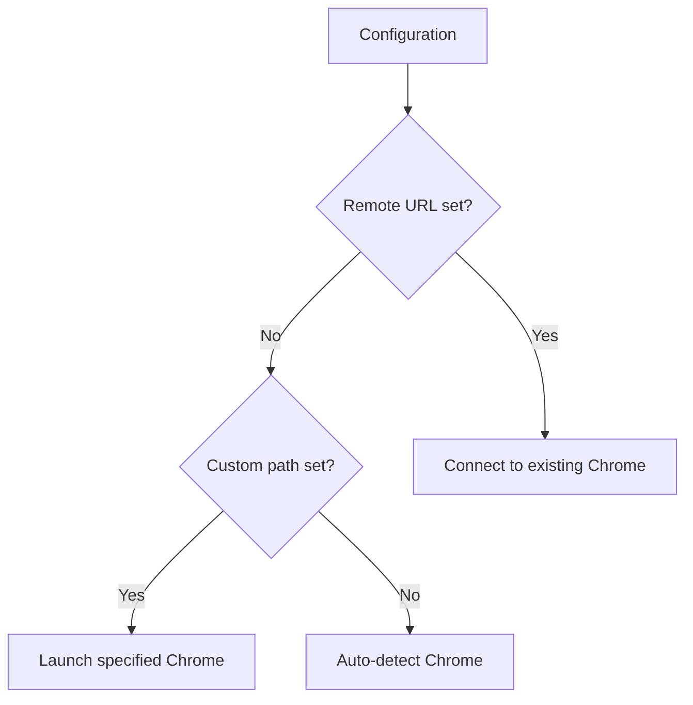

# How fspec Controls the Browser

This document explains how fspec browses the web compared to other AI assistants.

---

## The Simple Difference

**Traditional AI assistants** need a "middleman" to talk to the browser.

**fspec** talks to the browser directly.

---

## Side-by-Side Comparison

---

## Traditional Approach (Multiple Steps)

When a typical AI assistant wants to search the web or take a screenshot:

**Problems with this:**
- 🐌 Slower (6 steps instead of 2)
- 🔧 More things that can break
- 📦 Extra software to install and maintain

---

## fspec Approach (Direct Connection)

When fspec wants to search the web or take a screenshot:

**Benefits:**
- ⚡ Faster (direct connection)
- 🎯 Simpler (fewer moving parts)
- 📦 Nothing extra to install

---

## What Happens When You Ask fspec to Search

---

## What Happens When You Ask for a Screenshot

---

## Why Does This Matter?

| | Traditional | fspec |
|---|---|---|
| **Speed** | Slower | ⚡ Faster |
| **Setup** | Install extra servers | ✅ Works out of the box |
| **Reliability** | More can go wrong | ✅ Simpler = fewer problems |
| **Memory** | Multiple programs running | ✅ Single program |

> **In short:** fewer moving parts means fspec is faster, more reliable, and easier to set up than the traditional middleman approach.

---

## Technical Details (For Developers)

Click to expand technical architecture

### Component Stack

### Browser Connection Modes

### Environment Variables

| Variable | What it does |
|----------|-------------|
| `CODELET_CHROME_WS_URL` | Connect to an already-running Chrome |
| `CODELET_CHROME_PATH` | Use a specific Chrome installation |
| `CODELET_CHROME_HEADLESS` | Show/hide the browser window |
| `CODELET_CHROME_TIMEOUT` | How long before closing idle browser |

### Related Code Files

- `codelet/tools/src/chrome_browser.rs` - Browser control
- `codelet/tools/src/web_search.rs` - Search and screenshot
- `codelet/tools/src/search_engine.rs` - DuckDuckGo integration
- `codelet/tools/src/page_fetcher.rs` - Page content extraction

