# Coverage Enforcement Gap Analysis

**Date**: 2025-11-11
**Status**: Critical Design Gap
**Impact**: 21.3% of features have zero coverage despite being marked "done"

---

## Executive Summary

fspec implements a comprehensive coverage tracking system to maintain traceability from Gherkin scenarios → tests → implementation. However, a critical enforcement gap allows work units to be marked as "done" without populating coverage files, undermining the ACDD (Acceptance Criteria Driven Development) workflow.

**Key Findings:**
- **291** total coverage files exist
- **62** (21.3%) are completely empty (0% coverage)
- **334** work units marked as "done"
- **ALL 334** have `linkedFeatures: null` or empty array
- **283** (85.2%) were completed AFTER coverage system was introduced

---

## The Coverage System Architecture

### How Coverage Validation Should Work

```mermaid
graph TD
    A[Create Feature File] --> B[Auto-create .feature.coverage]
    B --> C[Write Tests]
    C --> D[Link Coverage: fspec link-coverage]
    D --> E[Implement Code]
    E --> F[Link Implementation]
    F --> G[Move to Done]
    G --> H{Coverage Complete?}
    H -->|Yes| I[✅ Done]
    H -->|No| J[❌ Blocked]
```



### How It Actually Works

```mermaid
graph TD
    A[Create Feature File] --> B[Auto-create .feature.coverage]
    B --> C[Add @WORK-UNIT-ID tag]
    C --> D[Write Tests]
    D --> E[Implement Code]
    E --> F[Move to Done]
    F --> G{linkedFeatures populated?}
    G -->|Yes| H{Coverage Complete?}
    G -->|No| I[⚠️ Warning Only - Allowed to proceed]
    H -->|Yes| J[✅ Done]
    H -->|No| K[❌ Blocked]
```



---

## The Root Cause

### Location: `src/commands/update-work-unit-status.ts:898-910`

```typescript
async function checkCoverageCompleteness(workUnit: any, cwd: string) {
  // Get linked features
  const linkedFeatures = workUnit.linkedFeatures || [];

  if (linkedFeatures.length === 0) {
    // ⚠️ THE CRITICAL GAP: This returns success with just a warning!
    return {
      complete: true,
      warning: 'No linked features found. Coverage tracking is optional.',
    };
  }

  // Coverage validation only runs if linkedFeatures exists
  // ... rest of validation code
}
```

**The Problem:**
- Coverage validation **only runs** if `workUnit.linkedFeatures` array is populated
- Developers can forget to run `fspec link-feature <work-unit-id> <feature-name>`
- Work units with `@TAG` in feature files but empty `linkedFeatures` bypass validation
- Coverage files exist but remain empty forever

---

## 10 Scenarios Creating Orphaned Coverage Files

### 1. The Forgotten Link (Most Common) 🔴

**What happens:**
1. Developer runs `fspec create-feature user-authentication`
   - ✅ Creates `spec/features/user-authentication.feature`
   - ✅ Auto-creates `spec/features/user-authentication.feature.coverage`
2. Developer adds `@AUTH-001` tag to feature file
3. Developer writes tests in `src/__tests__/auth.test.ts`
4. Developer implements code in `src/auth/login.ts`
5. Developer moves AUTH-001 to `done` status
6. ✅ **Status update succeeds** with warning: "No linked features found"

**What went wrong:**
- Developer never ran: `fspec link-feature AUTH-001 user-authentication`
- `workUnit.linkedFeatures` remains `null`
- Coverage validation never triggers
- Empty coverage file left behind

**Evidence:**
- LOCK-001: Feature file exists with `@LOCK-001` tag, 7 scenarios defined
- Coverage file shows: `"coveredScenarios": 0, "totalScenarios": 7`
- Work unit shows: `"linkedFeatures": null, "status": "done"`
- ❌ Work unit marked done anyway

---

### 2. Legacy Work (Historical Artifact) 📅

**What happens:**
- 49 work units (14.8%) completed between Oct 10-13, 2025
- Coverage system introduced Oct 13, 2025 (commit `76c2b6f`)
- Retroactive `fspec generate-coverage` created empty coverage files
- No intention to backfill coverage for completed work

**Timeline:**
```
Oct 10: EXMAP-001 done (oldest done work unit)
Oct 13: Coverage system added (commit 76c2b6f)
Later:  generate-coverage run → 49 empty coverage files for legacy work
```

**Why it's acceptable:**
- Historical work predates coverage enforcement
- Backfilling coverage for old work is low ROI

---

### 3. Tasks Don't Need Tests ✅

**What happens:**
```typescript
// src/commands/update-work-unit-status.ts:114-120
if (workUnitType === 'task' && newStatus === 'testing') {
  throw new Error('Tasks do not have a testing phase');
}
```

**Task workflow:**
```
backlog → specifying → implementing → validating → done
          (no testing phase)
```

**Examples:**
- TEST-004, TEST-005 (infrastructure setup)
- REFAC-001, REFAC-002 (code refactoring)
- HELP-001, HELP-002, HELP-003 (documentation)
- DOC-005 (design documents)

**Why coverage files exist:**
- Feature files created for **documentation/ADRs**
- Coverage files auto-created but intentionally empty
- Tasks exempt from test requirements

**Status:** ✅ Working as designed

---

### 4. Parent Work Units with Children 👨‍👧‍👦

**What happens:**
```typescript
// Lines 283-292: Parent work units skip scenario validation
const isParentWorkUnit = workUnit.children && workUnit.children.length > 0;
if (!isParentWorkUnit) {
  const hasScenarios = await checkScenariosExist(workUnitId, cwd);
  // ... validation only for leaf work units
}
```

**Architecture:**
- Parent work unit: `USER-AUTH` (epic-level feature file)
- Child work units: `USER-AUTH-001` (login), `USER-AUTH-002` (logout)
- Parent's feature file contains high-level scenarios
- Actual test coverage tracked in children

**Why parent coverage is empty:**
- Parent provides architectural overview
- Children contain actual test/implementation mappings
- Parent coverage file exists but intentionally sparse

**Status:** ✅ Working as designed

---

### 5. Bugs Reusing Existing Features 🐛

**What happens:**
```typescript
// Lines 226-245: Bugs can link to existing features
if (workUnitType === 'bug') {
  const linkedFeatures = workUnit.linkedFeatures || [];
  const hasLinkedFeatures = linkedFeatures.length > 0;
  // Bugs allowed to use existing feature files
}
```

**Workflow:**
1. Bug found in `user-authentication.feature`
2. Create work unit: `fspec create-bug AUTH BUG-042`
3. Link to existing feature: `fspec link-feature BUG-042 user-authentication`
4. Add regression test to `user-authentication.feature.coverage`
5. Bug's own feature file (if created) remains empty

**Why bug's coverage is empty:**
- Bug doesn't create new scenarios
- Bug adds test to **existing** feature's coverage
- Bug-specific feature file may be documentation-only

**Status:** ✅ Working as designed (but could be clearer)

---

### 6. Reverse ACDD Imports 🔄

**What happens:**
```typescript
// update-work-unit-status.ts:998
skipTemporalValidation?: boolean;
```

**Used by `fspec reverse`:**
- Importing existing codebases into fspec
- Tests/implementation already exist
- Feature files generated retroactively
- Coverage files created but not fully populated
- Gradual migration approach

**Example:**
```bash
fspec reverse --strategy=D  # Outside-in BDD strategy
# Creates feature files from existing tests
# Coverage files created but linking incomplete
```

**Status:** ✅ Working as designed for migration scenarios

---

### 7. Documentation-Only Features 📚

**What happens:**
- Feature files as **living documentation**
- Architecture Decision Records (ADRs)
- Design exploration documents
- Spike/research findings

**Examples:**
- `architecture-overview.feature`
- `api-design-decisions.feature`
- `performance-requirements.feature`

**Why no coverage:**
- No intention to test/implement
- Exploratory or reference material
- Coverage files auto-created but deliberately empty

**Status:** ⚠️ Acceptable but needs explicit opt-out mechanism

---

### 8. Abandoned Work 🗑️

**What happens:**
1. Work unit created: `FEAT-123`
2. Feature file generated: `fspec create-feature new-feature`
3. Coverage file auto-created
4. Work moved to `blocked` permanently
5. Work unit later deleted or abandoned
6. Orphaned coverage file remains

**Cleanup needed:**
- Periodic audit: `fspec audit-coverage`
- Remove coverage for deleted work units
- Archive blocked work artifacts

**Status:** ⚠️ Needs automated cleanup

---

### 9. Manual Feature File Creation ✍️

**What happens:**
1. Developer manually creates `.feature` file (outside fspec)
2. Uses git commit to add feature file
3. Later runs `fspec generate-coverage` to "catch up"
4. Empty coverage file created
5. Work completed without `linkedFeatures` array

**Why it bypasses validation:**
- Manual file creation doesn't populate work-units.json
- `generate-coverage` only creates files, doesn't link
- Developer assumes @TAG is sufficient

**Status:** 🔴 User education needed

---

### 10. Coverage Linking is Manual, Not Automatic 🚨

**The Root Cause:**

From `generate-coverage.ts:158-192`:
```typescript
console.log(`
<system-reminder>
CRITICAL: Coverage files are created EMPTY and must be manually POPULATED using link-coverage.

Understanding generate-coverage vs link-coverage (separate steps):
  • generate-coverage creates EMPTY coverage files
  • link-coverage POPULATES coverage files with test and implementation mappings
</system-reminder>
`);
```

**The Workflow Disconnect:**

| Command | What It Does | What Developers Think It Does |
|---------|--------------|-------------------------------|
| `fspec create-feature` | Creates `.feature` + empty `.feature.coverage` | "Coverage is set up" ✅ |
| `fspec link-feature` | Populates `workUnit.linkedFeatures` array | "Optional metadata" ❌ |
| `fspec link-coverage` | Populates coverage file test/impl mappings | "Optional documentation" ❌ |
| `fspec update-work-unit-status done` | Checks IF `linkedFeatures` exists | "Validates coverage" ❌ |

**What Actually Happens:**
```typescript
// Step 1: Feature creation
fspec create-feature user-authentication
// ✅ Creates: spec/features/user-authentication.feature
// ✅ Creates: spec/features/user-authentication.feature.coverage (EMPTY)

// Step 2: Developer adds @AUTH-001 tag to feature
// ❌ This does NOT populate workUnit.linkedFeatures

// Step 3: Developer writes tests and implementation
// ❌ No automatic link-coverage

// Step 4: Move to done
fspec update-work-unit-status AUTH-001 done
// ✅ Succeeds because linkedFeatures is null (validation skipped)
```

**The Expected Flow:**
```typescript
// What should trigger validation:
if (hasFeatureFileTaggedWithWorkUnitId || linkedFeatures.length > 0) {
  // Run coverage completeness check
}

// Current (wrong):
if (linkedFeatures.length > 0) {
  // Run coverage completeness check
}
```

**Status:** 🔴 Critical design gap

---

## Current Statistics

### Coverage File Status
```
Total coverage files:     291
Completely uncovered:      62 (21.3%)
Partially covered:        ~40 (13.7%)
Fully covered:           ~189 (65.0%)
```

### Work Unit Status
```
Total work units done:    334
Done with linkedFeatures:   0 (0%)
Done as tasks:             17 (5.1%)
Done as stories/bugs:     316 (94.6%)
```

### Timeline Analysis
```
Done before coverage system (Oct 10-13):   49 (14.8%)
Done after coverage system (Oct 13+):     283 (85.2%)
```

**Critical Finding:**
- 85.2% of work units completed AFTER coverage system existed
- Yet 21.3% of coverage files remain empty
- This indicates a **workflow problem**, not just legacy debt

---

## The Design Gap

### Current Enforcement Model

```
┌─────────────────────┐
│ Feature File @TAG   │  ← Developer adds this
└──────────┬──────────┘
           │
           │ NO CONNECTION ❌
           │
┌──────────▼──────────┐
│ linkedFeatures []   │  ← Must manually populate
└──────────┬──────────┘
           │
           │ ONLY THIS triggers validation
           │
┌──────────▼──────────┐
│ Coverage Validation │
└─────────────────────┘
```

### What Developers Expect

```
┌─────────────────────┐
│ Feature File @TAG   │  ← Developer adds this
└──────────┬──────────┘
           │
           │ AUTO-POPULATES ✅
           │
┌──────────▼──────────┐
│ linkedFeatures []   │  ← Automatically filled
└──────────┬──────────┘
           │
           │ Triggers validation
           │
┌──────────▼──────────┐
│ Coverage Validation │
└─────────────────────┘
```

---

## Proposed Solutions

### Option A: Auto-populate linkedFeatures from @TAGs (Recommended) ⭐

**Changes Required:**

1. **When moving to `testing` state:**
   ```typescript
   // src/commands/update-work-unit-status.ts:223
   if (newStatus === 'testing' && currentStatus === 'specifying') {
     // Auto-discover feature files tagged with this work unit
     const taggedFeatures = await findFeaturesByTag(workUnitId, cwd);

     if (taggedFeatures.length > 0 && !workUnit.linkedFeatures) {
       workUnit.linkedFeatures = taggedFeatures.map(f => f.featureName);
       console.log(`Auto-linked ${taggedFeatures.length} feature(s) from @${workUnitId} tags`);
     }
   }
   ```

2. **Update coverage check:**
   ```typescript
   async function checkCoverageCompleteness(workUnit: any, cwd: string) {
     // Auto-discover tagged features if linkedFeatures empty
     let linkedFeatures = workUnit.linkedFeatures || [];

     if (linkedFeatures.length === 0) {
       const taggedFeatures = await findFeaturesByTag(workUnit.id, cwd);
       linkedFeatures = taggedFeatures.map(f => f.featureName);
     }

     // Now validate coverage for discovered features
     if (linkedFeatures.length === 0) {
       // Work unit legitimately has no features (tasks, etc.)
       return { complete: true };
     }

     // ... existing validation logic
   }
   ```

**Pros:**
- ✅ Seamless developer experience
- ✅ @TAG becomes the single source of truth
- ✅ Backwards compatible (can still use explicit linking)
- ✅ Catches 95% of forgotten links

**Cons:**
- ⚠️ Need to handle multiple features with same @TAG
- ⚠️ Feature file renames require re-tagging

---

### Option B: Strict Coverage Enforcement (Purist ACDD)

**Changes Required:**

1. **Make coverage mandatory for stories/bugs:**
   ```typescript
   if (newStatus === 'done' && (workUnitType === 'story' || workUnitType === 'bug')) {
     const coverageFiles = await findCoverageFiles(workUnitId, cwd);

     if (coverageFiles.length === 0) {
       throw new Error(
         `No coverage files found for ${workUnitId}.\n` +
         `Stories and bugs MUST have feature files with coverage.\n` +
         `Use tasks for operational work without tests.`
       );
     }

     // Check ALL coverage files (not just linkedFeatures)
     for (const coverageFile of coverageFiles) {
       const coverage = await readCoverageFile(coverageFile);
       const uncovered = coverage.scenarios.filter(s => s.testMappings.length === 0);

       if (uncovered.length > 0) {
         throw new Error(`Cannot mark done: ${uncovered.length} uncovered scenarios`);
       }
     }
   }
   ```

**Pros:**
- ✅ True ACDD enforcement
- ✅ Zero tolerance for missing coverage
- ✅ Forces best practices

**Cons:**
- ❌ Breaking change for existing workflows
- ❌ May frustrate developers with legacy code
- ❌ Requires migration plan for 62 empty coverage files

---

### Option C: Coverage Audit Command with Warnings

**Changes Required:**

1. **Add pre-done validation hook:**
   ```typescript
   if (newStatus === 'done') {
     const auditResult = await auditWorkUnitCoverage(workUnit, cwd);

     if (auditResult.gaps.length > 0) {
       console.log(chalk.yellow(`
   ⚠️  COVERAGE AUDIT WARNING

   Found ${auditResult.gaps.length} coverage gap(s) for ${workUnit.id}:
   ${auditResult.gaps.map(g => `  - ${g.file}: ${g.uncovered} uncovered`).join('\n')}

   This work unit will be marked done, but coverage is incomplete.
   Run: fspec link-coverage ${auditResult.gaps[0].featureName} --scenario "..." --test-file ...
   `));

       // Still allow progression but record the warning
       workUnit.coverageWarnings = auditResult.gaps;
     }
   }
   ```

2. **Add dashboard for coverage gaps:**
   ```bash
   fspec audit-all-coverage
   # Reports all work units with empty coverage files
   ```

**Pros:**
- ✅ Non-breaking change
- ✅ Provides visibility
- ✅ Gradual improvement path

**Cons:**
- ⚠️ Warnings often ignored
- ⚠️ Doesn't enforce discipline

---

### Option D: Explicit Opt-Out Mechanism (Pragmatic)

**Changes Required:**

1. **Add coverage exemption flag:**
   ```typescript
   interface WorkUnit {
     // ... existing fields
     coverageExempt?: boolean;
     coverageExemptReason?: string;
   }
   ```

2. **Update validation:**
   ```typescript
   async function checkCoverageCompleteness(workUnit: any, cwd: string) {
     // Check for explicit exemption
     if (workUnit.coverageExempt) {
       return {
         complete: true,
         message: `Coverage exempt: ${workUnit.coverageExemptReason || 'No reason provided'}`
       };
     }

     // Auto-discover features from @TAGs
     const features = await findLinkedFeatures(workUnit, cwd);

     if (features.length === 0) {
       throw new Error(
         `No features found for ${workUnit.id}.\n` +
         `Either:\n` +
         `  1. Tag a feature file with @${workUnit.id}\n` +
         `  2. Run: fspec link-feature ${workUnit.id} <feature-name>\n` +
         `  3. Exempt from coverage: fspec exempt-coverage ${workUnit.id} --reason "..."`
       );
     }

     // ... existing validation
   }
   ```

3. **Add exemption commands:**
   ```bash
   # Exempt from coverage (for tasks, docs, etc.)
   fspec exempt-coverage TASK-001 --reason "Infrastructure setup, no testable behavior"

   # Remove exemption
   fspec unexempt-coverage TASK-001
   ```

**Pros:**
- ✅ Clear intent when coverage not needed
- ✅ Catches accidental bypasses
- ✅ Auditable (can query all exemptions)
- ✅ Backwards compatible with migration script

**Cons:**
- ⚠️ Requires migration of existing work units
- ⚠️ One more concept to learn

---

## Recommended Implementation Plan

### Phase 1: Auto-Discovery (Option A) - Weeks 1-2

**Goal:** Make @TAGs the single source of truth

1. Implement `findFeaturesByTag(workUnitId, cwd)` utility
2. Auto-populate `linkedFeatures` when moving to `testing`
3. Fallback to @TAG discovery in `checkCoverageCompleteness()`
4. Add tests for auto-discovery logic

**Acceptance Criteria:**
- When work unit moves to `testing`, auto-discover tagged features
- When moving to `done`, validate coverage even if `linkedFeatures` empty
- Existing manual `fspec link-feature` still works (override auto-discovery)

---

### Phase 2: Explicit Opt-Out (Option D) - Weeks 3-4

**Goal:** Provide escape hatch for legitimate exemptions

1. Add `coverageExempt` field to WorkUnit schema
2. Implement `fspec exempt-coverage` command
3. Update coverage check to respect exemption
4. Add TUI indicator for exempt work units

**Acceptance Criteria:**
- Tasks can be exempt with reason
- Documentation-only features can be exempt
- Audit command shows all exemptions
- Cannot exempt stories/bugs without explicit reason

---

### Phase 3: Migration & Cleanup - Weeks 5-6

**Goal:** Fix existing 62 empty coverage files

1. Create migration script:
   ```bash
   fspec migrate-coverage --audit-only  # Dry-run
   fspec migrate-coverage                # Auto-fix
   ```

2. Migration logic:
   - Scan all done work units
   - Find empty coverage files
   - Classify: Task? Legacy? Forgotten?
   - Auto-exempt or flag for manual review

3. Cleanup:
   - Remove orphaned coverage files
   - Document exemption decisions
   - Update team workflows

**Acceptance Criteria:**
- Zero work units bypass coverage accidentally
- All 62 empty files categorized
- Team documentation updated

---

### Phase 4: Strict Enforcement (Optional - Option B) - Future

**Goal:** True ACDD enforcement (if team decides)

1. Make coverage mandatory for stories/bugs (no exemption)
2. Block `done` status if coverage incomplete
3. Require coverage for all new work
4. Grandfather existing work (one-time pass)

**Decision Point:**
- Survey team: Strictness vs Flexibility?
- Measure impact on velocity
- Consider project maturity level

---

## Testing Strategy

### Unit Tests

```typescript
describe('Coverage Auto-Discovery', () => {
  it('should auto-populate linkedFeatures from @TAGs when moving to testing', async () => {
    // Given: Feature file with @AUTH-001 tag
    await createFeature('user-authentication', '@AUTH-001');
    await createWorkUnit('AUTH-001');

    // When: Move to testing
    await updateWorkUnitStatus({ workUnitId: 'AUTH-001', status: 'testing' });

    // Then: linkedFeatures should be auto-populated
    const workUnit = await getWorkUnit('AUTH-001');
    expect(workUnit.linkedFeatures).toEqual(['user-authentication']);
  });

  it('should validate coverage even if linkedFeatures empty but @TAG exists', async () => {
    // Given: Feature with @AUTH-001 but linkedFeatures not populated
    await createFeature('user-authentication', '@AUTH-001');
    const workUnit = await createWorkUnit('AUTH-001', { linkedFeatures: null });

    // When: Move to done without linking coverage
    const result = updateWorkUnitStatus({ workUnitId: 'AUTH-001', status: 'done' });

    // Then: Should fail validation
    await expect(result).rejects.toThrow(/uncovered scenarios/);
  });

  it('should allow exemption for tasks', async () => {
    // Given: Task work unit
    const workUnit = await createWorkUnit('TASK-001', { type: 'task' });
    await exemptCoverage('TASK-001', 'Infrastructure setup');

    // When: Move to done
    await updateWorkUnitStatus({ workUnitId: 'TASK-001', status: 'done' });

    // Then: Should succeed
    const result = await getWorkUnit('TASK-001');
    expect(result.status).toBe('done');
    expect(result.coverageExempt).toBe(true);
  });
});
```

### Integration Tests

```typescript
describe('Coverage Enforcement E2E', () => {
  it('should enforce full ACDD workflow with auto-discovery', async () => {
    // Full happy path
    const workUnit = await createStory('AUTH', 'User login');
    await updateStatus(workUnit.id, 'specifying');

    await createFeature('user-login', `@${workUnit.id}`);
    await updateStatus(workUnit.id, 'testing'); // Auto-discovers feature

    await writeTestFile('auth.test.ts');
    await linkCoverage('user-login', 'Login success', 'auth.test.ts', '10-20');
    await updateStatus(workUnit.id, 'implementing');

    await writeImplementation('login.ts');
    await linkImplementation('user-login', 'Login success', 'login.ts', '5,6,7');
    await updateStatus(workUnit.id, 'validating');

    await runTests(); // Pass
    await updateStatus(workUnit.id, 'done'); // Should succeed

    const final = await getWorkUnit(workUnit.id);
    expect(final.status).toBe('done');
    expect(final.linkedFeatures).toContain('user-login');
  });
});
```

---

## Migration Guide for Existing Work Units

### Step 1: Audit Current State

```bash
# Find all done work units with empty coverage
fspec audit-all-coverage --status=done --format=json > coverage-audit.json

# Analyze results
jq '.emptyCount' coverage-audit.json
# Output: 62
```

### Step 2: Categorize Empty Coverage Files

```bash
# Classify each empty coverage file
fspec classify-empty-coverage

# Output:
# Analyzing 62 empty coverage files...
#
# Category breakdown:
#   - Tasks (no tests needed):        17 (27%)
#   - Legacy (before coverage):       49 (79%)  ← Overlap with tasks
#   - Forgotten links (need fixing):  15 (24%)
#   - Documentation only:              8 (13%)
#   - Parent work units:               3 (5%)
```

### Step 3: Automatic Fixes

```bash
# Auto-exempt tasks
fspec exempt-coverage --type=task --reason="Tasks exempt from test coverage"

# Auto-tag legacy work
fspec exempt-coverage --before=2025-10-13 --reason="Legacy work (before coverage system)"

# Auto-link by @TAG
fspec auto-link-features --dry-run
fspec auto-link-features  # Actually run
```

### Step 4: Manual Review

```bash
# Show remaining work units needing manual review
fspec review-empty-coverage

# For each work unit:
# Option 1: Link to feature (if tests exist)
fspec link-feature AUTH-001 user-authentication
fspec link-coverage user-authentication --scenario "Login" --test-file ... --test-lines ...

# Option 2: Exempt (if truly no coverage needed)
fspec exempt-coverage AUTH-001 --reason="Spike/exploration only"

# Option 3: Mark as debt (track for future)
fspec mark-tech-debt AUTH-001 --reason="Tests need to be written"
```

---

## Impact Assessment

### Developer Experience

**Before (Current - Confusing):**
```bash
$ fspec create-feature user-login
✓ Created spec/features/user-login.feature
✓ Created spec/features/user-login.feature.coverage

$ # ... write tests and implementation ...

$ fspec update-work-unit-status AUTH-001 done
✓ Work unit AUTH-001 status updated to done
⚠️  No linked features found. Coverage tracking is optional.

# Developer thinks: "Coverage is optional, so I'm good!"
# Reality: Coverage file exists but empty (technical debt created)
```

**After (Option A + D - Clear):**
```bash
$ fspec create-feature user-login
✓ Created spec/features/user-login.feature
✓ Created spec/features/user-login.feature.coverage

$ # Add @AUTH-001 tag to feature file

$ fspec update-work-unit-status AUTH-001 testing
✓ Auto-discovered feature: user-login (from @AUTH-001 tag)
✓ Work unit AUTH-001 status updated to testing

$ # ... write tests and implementation ...

$ fspec update-work-unit-status AUTH-001 done
✗ Cannot mark work unit done: 3 scenarios uncovered in user-login.feature

Uncovered scenarios:
  - Login with valid credentials
  - Login with invalid password
  - Login with locked account

Add coverage using:
  fspec link-coverage user-login --scenario "Login with valid credentials" --test-file <file> --test-lines <range>

# Developer knows exactly what to fix!
```

### Team Velocity Impact

**Short-term (Weeks 1-4):**
- ⚠️ Slight slowdown while learning new workflow
- ✅ Fewer "oops, forgot coverage" moments
- ✅ Better visibility into technical debt

**Long-term (Months 3+):**
- ✅ Higher code quality
- ✅ Better test coverage metrics
- ✅ Easier onboarding (clearer workflows)
- ✅ Reduced debugging time (traceability)

### Technical Debt Reduction

**Current State:**
```
Technical Debt Score: 62 empty coverage files (21.3%)
Estimated Remediation Effort: 31-62 hours (30-60 min per feature)
Risk Level: Medium (loss of traceability)
```

**After Phase 3 (Migration):**
```
Technical Debt Score: 0 empty coverage files (0%)
Estimated Remediation Effort: 0 hours
Risk Level: Low (all gaps documented/exempt)
```

---

## Monitoring & Metrics

### Coverage Dashboard (Proposed)

```bash
$ fspec coverage-dashboard

Coverage Health Report
======================

Overall Coverage: 78.7% (229/291 features)

By Status:
  ✅ Fully covered:        189 (65.0%)
  ⚠️  Partially covered:    40 (13.7%)
  ❌ Uncovered:             62 (21.3%)

By Work Unit Type:
  Stories:  215/275 (78.2%)
  Bugs:      14/25  (56.0%)
  Tasks:      0/17  (0% - exempt)

Trend (Last 30 Days):
  Uncovered: 62 → 45 (📉 -17)
  Coverage:  65% → 78% (📈 +13%)

Action Items:
  - 15 work units missing linked features (auto-linkable)
  - 8 coverage files need test mappings
  - 3 work units marked done but incomplete

Run: fspec fix-coverage-gaps --auto
```

### CI/CD Integration

```yaml
# .github/workflows/coverage-check.yml
name: Coverage Enforcement

on: [pull_request]

jobs:
  coverage-check:
    runs-on: ubuntu-latest
    steps:
      - uses: actions/checkout@v3
      - name: Check Coverage Completeness
        run: |
          fspec audit-all-coverage --strict
          # Fails if any work unit bypasses coverage

      - name: Coverage Report
        run: |
          fspec coverage-dashboard --format=markdown >> $GITHUB_STEP_SUMMARY
```

---

## Conclusion

The coverage enforcement gap is a **critical design flaw** that undermines fspec's ACDD principles. While the system has the infrastructure for comprehensive coverage tracking, the **permissive validation** allows 21.3% of features to bypass enforcement.

**Recommended Path Forward:**
1. ✅ Implement **Option A** (Auto-discovery from @TAGs)
2. ✅ Implement **Option D** (Explicit opt-out mechanism)
3. ✅ Run migration for 62 existing empty coverage files
4. ⏸️ Defer **Option B** (Strict enforcement) until team maturity

**Timeline:** 6 weeks to full resolution

**Impact:** Closes critical gap, improves developer experience, eliminates 21.3% technical debt

---

## Appendix A: Code References

### Key Files
- `src/commands/update-work-unit-status.ts:898-910` - Coverage check (permissive)
- `src/commands/link-coverage.ts:170-207` - Step validation
- `src/commands/generate-coverage.ts` - Empty file creation
- `src/utils/step-validation.ts` - @step comment validation

### Related Issues
- (To be created)

### Git Commits
- `76c2b6f` - Coverage system introduction (Oct 13, 2025)
- `32587d0` - BUG-059: Search expansion
- `eced552` - Mermaid validation fix

---

## Appendix B: Statistics Detail

### Coverage File Analysis (Python Script)

```python
import json
import os
from collections import defaultdict

stats = defaultdict(int)
for file in os.listdir('spec/features'):
    if file.endswith('.feature.coverage'):
        with open(f'spec/features/{file}', 'r') as f:
            data = json.load(f)
            covered = data.get('stats', {}).get('coveredScenarios', 0)
            total = data.get('stats', {}).get('totalScenarios', 0)

            if total == 0:
                stats['zero_scenarios'] += 1
            elif covered == 0:
                stats['zero_coverage'] += 1
            elif covered == total:
                stats['full_coverage'] += 1
            else:
                stats['partial_coverage'] += 1

print(f"Total files: {sum(stats.values())}")
print(f"Zero scenarios: {stats['zero_scenarios']}")
print(f"Zero coverage: {stats['zero_coverage']} ({stats['zero_coverage']/sum(stats.values())*100:.1f}%)")
print(f"Partial coverage: {stats['partial_coverage']} ({stats['partial_coverage']/sum(stats.values())*100:.1f}%)")
print(f"Full coverage: {stats['full_coverage']} ({stats['full_coverage']/sum(stats.values())*100:.1f}%)")
```

**Output:**
```
Total files: 291
Zero scenarios: 0
Zero coverage: 62 (21.3%)
Partial coverage: 40 (13.7%)
Full coverage: 189 (65.0%)
```
