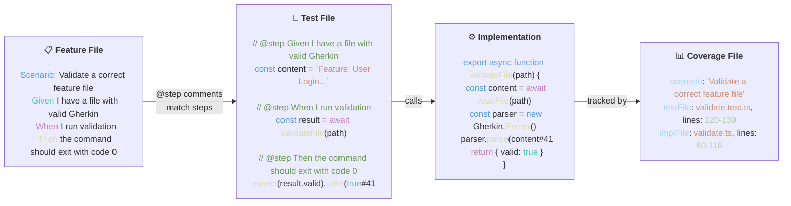
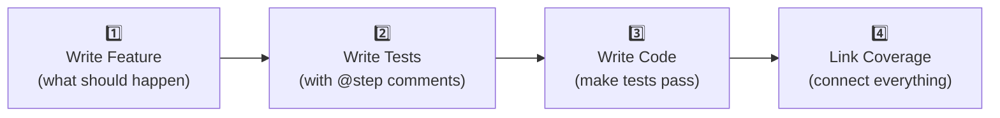

# ACDD Traceability: How Everything Connects

A visual overview of how fspec links specifications, tests, code, and coverage together.

---

## The Four Files

```mermaid
flowchart LR
    FEATURE["📋 <b>Feature File</b><br/><br/><span style='color:#569cd6'>Scenario:</span> Validate a correct feature file<br/>  <span style='color:#4ec9b0'>Given</span> I have a file with valid Gherkin<br/>  <span style='color:#c586c0'>When</span> I run validation<br/>  <span style='color:#dcdcaa'>Then</span> the command should exit with code 0"]
    
    TEST["🧪 <b>Test File</b><br/><br/><span style='color:#6a9955'>// @step Given I have a file with valid Gherkin</span><br/><span style='color:#569cd6'>const</span> content = <span style='color:#ce9178'>`Feature: User Login...`</span><br/><br/><span style='color:#6a9955'>// @step When I run validation</span><br/><span style='color:#569cd6'>const</span> result = <span style='color:#c586c0'>await</span> <span style='color:#dcdcaa'>validateFile</span>#40;path#41;<br/><br/><span style='color:#6a9955'>// @step Then the command should exit with code 0</span><br/><span style='color:#dcdcaa'>expect</span>#40;result.valid#41;.<span style='color:#dcdcaa'>toBe</span>#40;<span style='color:#4ec9b0'>true</span>#41;"]
    
    IMPL["⚙️ <b>Implementation</b><br/><br/><span style='color:#569cd6'>export async function</span> <span style='color:#dcdcaa'>validateFile</span>#40;path#41; {<br/>  <span style='color:#569cd6'>const</span> content = <span style='color:#c586c0'>await</span> <span style='color:#dcdcaa'>readFile</span>#40;path#41;<br/>  <span style='color:#569cd6'>const</span> parser = <span style='color:#569cd6'>new</span> Gherkin.<span style='color:#dcdcaa'>Parser</span>#40;#41;<br/>  parser.<span style='color:#dcdcaa'>parse</span>#40;content#41;<br/>  <span style='color:#c586c0'>return</span> { valid: <span style='color:#4ec9b0'>true</span> }<br/>}"]
    
    COV["📊 <b>Coverage File</b><br/><br/><span style='color:#9cdcfe'>scenario</span>: <span style='color:#ce9178'>'Validate a correct feature file'</span><br/><span style='color:#9cdcfe'>testFile</span>: <span style='color:#ce9178'>validate.test.ts</span>, lines: <span style='color:#b5cea8'>120-139</span><br/><span style='color:#9cdcfe'>implFile</span>: <span style='color:#ce9178'>validate.ts</span>, lines: <span style='color:#b5cea8'>80-116</span>"]

    FEATURE -->|"@step comments<br/>match steps"| TEST
    TEST -->|"calls"| IMPL
    IMPL -->|"tracked by"| COV
```

---

## The Flow

```mermaid
flowchart LR
    A["1️⃣<br/>Write Feature<br/>#40;what should happen#41;"]
    B["2️⃣<br/>Write Tests<br/>#40;with @step comments#41;"]
    C["3️⃣<br/>Write Code<br/>#40;make tests pass#41;"]
    D["4️⃣<br/>Link Coverage<br/>#40;connect everything#41;"]

    A --> B --> C --> D
```
