# Event Storming Integration with fspec ACDD Workflow

**Version:** 1.0
**Created:** 2025-11-05
**Work Unit:** EXMAP-004
**Status:** Research & Design Document

---

## Executive Summary

This document outlines the integration of Event Storming as a **pre-discovery phase** in the fspec ACDD (Acceptance Criteria Driven Development) workflow. Event Storming will occur **BEFORE** Example Mapping to:

1. **Understand the domain** through collaborative exploration of domain events, commands, and aggregates
2. **Identify bounded contexts** and natural system boundaries
3. **Generate structured artifacts** that seed Example Mapping sessions
4. **Inform tag taxonomy** based on discovered domain language
5. **Create visual documentation** as attachments for work units

---

## Table of Contents

1. [What is Event Storming?](#what-is-event-storming)
2. [Why Event Storming Before Example Mapping?](#why-event-storming-before-example-mapping)
3. [Event Storming Integration Architecture](#event-storming-integration-architecture)
4. [The Three Levels of Event Storming](#the-three-levels-of-event-storming)
5. [Workflow Integration: ACDD + Event Storming](#workflow-integration-acdd--event-storming)
6. [Data Model: Storing Event Storming Artifacts](#data-model-storing-event-storming-artifacts)
7. [Command Specification](#command-specification)
8. [Transformation Pipeline: Events → Examples → Scenarios](#transformation-pipeline-events--examples--scenarios)
9. [Integration with fspec Research Tools](#integration-with-fspec-research-tools)
10. [Visual Artifacts & Attachments](#visual-artifacts--attachments)
11. [Implementation Roadmap](#implementation-roadmap)

---

## What is Event Storming?

Event Storming is a **workshop-based method** invented by Alberto Brandolini to quickly explore complex business domains through collaborative modeling. Teams use **color-coded sticky notes** to represent different domain concepts arranged on a **timeline**.

### Core Concepts


### Color Legend

| Color | Represents | Format | Example |
|-------|-----------|--------|---------|
| 🟠 **Orange** | Domain Events | Past tense verb | "UserRegistered", "CheckpointCreated" |
| 🔵 **Blue** | Commands | Present tense verb | "RegisterUser", "CreateCheckpoint" |
| 🟡 **Yellow** (small) | Actors/Agents | Noun (person/system) | "Developer", "Admin", "CI System" |
| 🟡 **Yellow** (large) | Aggregates | Noun (entity) | "WorkUnit", "FeatureFile", "Coverage" |
| 🩷 **Pink** | External Systems | System name | "GitHub API", "PostgreSQL", "S3" |
| 🟣 **Purple** | Policies/Rules | "When...then..." | "When test passes, then mark green" |
| 🟢 **Green** | Views/Read Models | UI/Display name | "KanbanBoard", "CoverageReport" |
| 🔴 **Red** | Hotspots/Questions | Question | "What if...?", "How should...?" |

---

## Why Event Storming Before Example Mapping?

### The Problem with Starting at Example Mapping


**Without Event Storming:**
- AI/human start Example Mapping with **limited domain understanding**
- Questions arise that require **deep domain knowledge**
- **Inconsistent terminology** across work units
- **Missing relationships** between work units become visible too late
- **Tag taxonomy** is ad-hoc and not grounded in domain language

### The Solution: Event Storming First


**With Event Storming:**
- **Shared domain language** established before specification
- **Natural work unit boundaries** emerge from bounded contexts
- **Tag taxonomy** derived from actual domain events and aggregates
- **Rules and examples** seeded from Event Storming artifacts
- **Visual documentation** captures domain knowledge

---

## Event Storming Integration Architecture

### Overall System Flow


---

## The Three Levels of Event Storming

Event Storming operates at **three distinct levels of abstraction**. Each level serves a different purpose and occurs at different phases of the project.

### 1. Big Picture Event Storming

**Purpose:** Explore entire business domain to understand scope and identify critical problems

**When:** Project inception, new epic planning, major feature discovery

**Scope:** Whole system or large subsystem


**Artifacts:**
- High-level domain events across entire system
- Major bounded contexts (e.g., Work Management, Specification, Testing, Validation)
- Critical external systems
- Major hotspots and unknowns

**fspec Integration:**
- One-time or periodic exercise
- Results stored in `foundation.json` or `spec/event-storms/big-picture.json`
- Informs epic creation and tag taxonomy
- Generates attachment visualizations

### 2. Process Modeling Event Storming

**Purpose:** Deep-dive into specific business process to optimize or redesign

**When:** Designing a major feature, epic planning, process optimization

**Scope:** Single business process (e.g., "Work Unit Lifecycle", "Feature Validation")


**Artifacts:**
- Detailed event sequence for process
- Commands triggering each event
- Policies and business rules
- Read models/views needed
- Specific hotspots in process

**fspec Integration:**
- Per-epic or per-feature exercise
- Results stored in work unit metadata: `workUnit.eventStorm`
- Directly transforms into Example Mapping rules/examples
- Generates process diagram attachments

### 3. Software Design Event Storming

**Purpose:** Design technical implementation with aggregates, bounded contexts, and architecture

**When:** Before implementing complex features, architectural planning

**Scope:** Single feature or bounded context implementation


**Artifacts:**
- Aggregates and their boundaries
- Command handlers
- Event publishers/subscribers
- Bounded context interfaces
- Architecture decisions

**fspec Integration:**
- Per-work-unit exercise (complex features only)
- Results stored in `workUnit.architectureNotes`
- Generates architecture diagram attachments
- Informs test structure and implementation approach

---

## Workflow Integration: ACDD + Event Storming

### Enhanced ACDD Workflow


### State Transitions with Commands

| From State | To State | Command | Event Storming Actions |
|------------|----------|---------|------------------------|
| `backlog` | `event_storming` | `fspec update-work-unit-status WU-001 event_storming` | Begin Event Storming session |
| `event_storming` | `event_storming` | `fspec add-domain-event WU-001 "UserRegistered"` | Capture domain event |
| `event_storming` | `event_storming` | `fspec add-command WU-001 "RegisterUser"` | Capture command |
| `event_storming` | `event_storming` | `fspec add-aggregate WU-001 "User"` | Identify aggregate |
| `event_storming` | `event_storming` | `fspec add-policy WU-001 "When user registers, send welcome email"` | Capture business rule |
| `event_storming` | `event_storming` | `fspec add-hotspot WU-001 "What if email is invalid?"` | Surface question |
| `event_storming` | `specifying` | `fspec update-work-unit-status WU-001 specifying` | End Event Storming, begin Example Mapping |
| `event_storming` | `specifying` | `fspec transform-event-storm WU-001` | Auto-transform ES → EM, move to specifying |

---

## Data Model: Storing Event Storming Artifacts

### Enhanced WorkUnit Type

```typescript
interface EventStormItem {
  id: number;                    // Stable ID (never changes)
  type: 'event' | 'command' | 'aggregate' | 'policy' | 'hotspot' | 'external_system' | 'view';
  text: string;                  // The sticky note content
  color: 'orange' | 'blue' | 'yellow' | 'pink' | 'purple' | 'red' | 'green';
  timestamp?: number;            // Optional timeline position (ms from start)
  relatedTo?: number[];          // IDs of related items (e.g., command → event)
  boundedContext?: string;       // Optional bounded context assignment
  actor?: string;                // For commands: who executes this
  deleted: boolean;
  createdAt: string;
  deletedAt?: string;
}

interface EventStorm {
  level: 'big_picture' | 'process_modeling' | 'software_design';
  sessionDate: string;
  facilitator?: string;
  participants?: string[];
  items: EventStormItem[];       // All sticky notes
  nextItemId: number;            // Stable ID counter
  boundedContexts: string[];     // Discovered contexts
  timeline: {                    // Optional timeline grouping
    start: number;
    end: number;
    milestones: Array<{
      timestamp: number;
      label: string;
    }>;
  };
}

interface WorkUnit {
  id: string;
  type: 'story' | 'task' | 'bug';
  status: 'backlog' | 'event_storming' | 'specifying' | 'testing' | 'implementing' | 'validating' | 'done' | 'blocked';
  title: string;
  description?: string;

  // Event Storming (NEW)
  eventStorm?: EventStorm;

  // Example Mapping (ENHANCED)
  rules?: RuleItem[];            // Can be seeded from policies
  examples?: ExampleItem[];      // Can be seeded from events
  questions?: QuestionItem[];    // Can be seeded from hotspots

  // Existing fields...
  nextRuleId: number;
  nextExampleId: number;
  nextQuestionId: number;
  architectureNotes?: ArchitectureNoteItem[];
  attachments?: AttachmentItem[];
  epic?: string;
  estimate?: number;
  createdAt: string;
  updatedAt: string;
}
```

### Storage Options

```mermaid
graph TD
    A{Storage Decision}
    A -->|Option 1| B[Store in WorkUnit]
    A -->|Option 2| C[Separate File per WU]
    A -->|Option 3| D[Global Event Storm File]

    B --> B1[✅ Pros: Co-located with EM]
    B --> B2[✅ Pros: Single source of truth]
    B --> B3[❌ Cons: Large work-units.json]

    C --> C1[✅ Pros: Separate concerns]
    C --> C2[✅ Pros: Smaller files]
    C --> C3[❌ Cons: More files to manage]

    D --> D1[✅ Pros: Cross-WU visibility]
    D --> D2[✅ Pros: Foundation-level ES]
    D --> D3[❌ Cons: Hard to link to WU]

    style B fill:#4ecdc4
```



**Recommendation:** **Option 1 (Store in WorkUnit)** for process/design-level Event Storming, **Option 3 (Global File)** for big picture Event Storming.

**File Structure:**
```
spec/
├── foundation.json           # Big Picture ES here
├── work-units.json          # Process/Design ES per work unit
├── event-storms/
│   └── big-picture.json     # Alternative: separate big picture file
```

---

## Command Specification

### New Commands for Event Storming

```bash
# Add domain event (orange sticky)
fspec add-domain-event <workUnitId> <eventText> [--timestamp=<ms>] [--context=<name>]

# Add command (blue sticky)
fspec add-command <workUnitId> <commandText> [--actor=<name>] [--triggers=<eventId>]

# Add aggregate (yellow sticky)
fspec add-aggregate <workUnitId> <aggregateName> [--context=<name>]

# Add policy (purple sticky)
fspec add-policy <workUnitId> <policyText>

# Add hotspot (red sticky)
fspec add-hotspot <workUnitId> <questionText>

# Add external system (pink sticky)
fspec add-external-system <workUnitId> <systemName>

# Add view/read model (green sticky)
fspec add-view <workUnitId> <viewName>

# Link items (e.g., command triggers event)
fspec link-event-storm-items <workUnitId> <fromId> <toId> [--relationship=<type>]

# Identify bounded context
fspec add-bounded-context <workUnitId> <contextName> [--itemIds=<id1,id2,id3>]

# Transform Event Storm → Example Map
fspec transform-event-storm <workUnitId> [--auto-advance]

# Export Event Storm visualization
fspec export-event-storm <workUnitId> --format=<mermaid|json|timeline> --output=<path>

# Generate Event Storm diagram attachment
fspec generate-event-storm-diagram <workUnitId> [--format=<mermaid|png>]
```

### Example Session

```bash
# 1. Create work unit and move to event storming
$ fspec create-story AUTH "User Authentication"
✓ Created story AUTH-001: User Authentication

$ fspec update-work-unit-status AUTH-001 event_storming
✓ AUTH-001 moved to event_storming

# 2. Capture domain events
$ fspec add-domain-event AUTH-001 "UserRegistered"
✓ Domain event added (id: 0)

$ fspec add-domain-event AUTH-001 "LoginAttempted"
✓ Domain event added (id: 1)

$ fspec add-domain-event AUTH-001 "LoginSucceeded"
✓ Domain event added (id: 2)

$ fspec add-domain-event AUTH-001 "LoginFailed"
✓ Domain event added (id: 3)

# 3. Capture commands
$ fspec add-command AUTH-001 "RegisterUser" --triggers=0
✓ Command added (id: 4) → triggers event 0 (UserRegistered)

$ fspec add-command AUTH-001 "AttemptLogin" --triggers=1
✓ Command added (id: 5) → triggers event 1 (LoginAttempted)

# 4. Identify aggregates
$ fspec add-aggregate AUTH-001 "User" --context=authentication
✓ Aggregate added (id: 6) in context: authentication

$ fspec add-aggregate AUTH-001 "Session" --context=authentication
✓ Aggregate added (id: 7) in context: authentication

# 5. Capture policies
$ fspec add-policy AUTH-001 "When user registers, send welcome email"
✓ Policy added (id: 8)

$ fspec add-policy AUTH-001 "After 3 failed logins, lock account for 30 minutes"
✓ Policy added (id: 9)

# 6. Surface hotspots
$ fspec add-hotspot AUTH-001 "What if user email is already taken?"
✓ Hotspot added (id: 10)

$ fspec add-hotspot AUTH-001 "Should we support OAuth2?"
✓ Hotspot added (id: 11)

# 7. Add external systems
$ fspec add-external-system AUTH-001 "EmailService"
✓ External system added (id: 12)

$ fspec add-external-system AUTH-001 "OAuth2Provider"
✓ External system added (id: 13)

# 8. Generate visualization
$ fspec generate-event-storm-diagram AUTH-001 --format=mermaid
✓ Generated diagram: spec/attachments/AUTH-001/event-storm-timeline.md

$ fspec add-attachment AUTH-001 spec/attachments/AUTH-001/event-storm-timeline.md \
  --description "Event Storm timeline visualization"
✓ Attachment added successfully

# 9. Transform to Example Mapping
$ fspec transform-event-storm AUTH-001 --auto-advance
✓ Transformed Event Storm → Example Map:
  - 2 policies → 2 rules
  - 4 events → 4 examples
  - 2 hotspots → 2 questions
✓ AUTH-001 moved to specifying

# 10. Review Example Map
$ fspec show-work-unit AUTH-001
AUTH-001
Type: story
Status: specifying

User Authentication

Rules:
  [0] When user registers, send welcome email
  [1] After 3 failed logins, lock account for 30 minutes

Examples:
  [0] User registers successfully (from event: UserRegistered)
  [1] User attempts login (from event: LoginAttempted)
  [2] User login succeeds (from event: LoginSucceeded)
  [3] User login fails (from event: LoginFailed)

Questions:
  [0] What if user email is already taken?
  [1] Should we support OAuth2?
```

---

## Transformation Pipeline: Events → Examples → Scenarios

### Three-Stage Transformation

```mermaid
flowchart LR
    subgraph Stage1[Stage 1: Event Storming]
        E1[🟠 UserRegistered]
        E2[🟠 LoginSucceeded]
        C1[🔵 RegisterUser]
        C2[🔵 AttemptLogin]
        P1[🟣 Send welcome email]
        H1[🔴 Email already exists?]
    end

    subgraph Stage2[Stage 2: Example Mapping]
        R1[📘 Rule: Send welcome email]
        EX1[📗 Example: User registers]
        EX2[📗 Example: User logs in]
        Q1[📕 Question: Email validation?]
    end

    subgraph Stage3[Stage 3: Gherkin Scenarios]
        S1[Scenario: User registers<br/>Given no existing account<br/>When user submits registration<br/>Then welcome email sent]
        S2[Scenario: User logs in<br/>Given registered user<br/>When valid credentials<br/>Then session created]
    end

    E1 --> EX1
    E2 --> EX2
    P1 --> R1
    H1 --> Q1
    C1 -.-> EX1
    C2 -.-> EX2

    R1 --> S1
    EX1 --> S1
    EX2 --> S2

    style E1 fill:#ff9f43
    style E2 fill:#ff9f43
    style C1 fill:#54a0ff
    style C2 fill:#54a0ff
    style P1 fill:#a29bfe
    style H1 fill:#d63031
```



### Transformation Rules

| Event Storm Artifact | Example Mapping Artifact | Gherkin Element |
|---------------------|-------------------------|-----------------|
| 🟣 **Policy** | 📘 **Rule** | Background context or scenario precondition |
| 🟠 **Domain Event** | 📗 **Example** | Scenario title or Then step |
| 🔴 **Hotspot** | 📕 **Question** | Drives edge case scenarios |
| 🔵 **Command** | 📗 **Example** (action) | When step |
| 🟡 **Aggregate** | — | Feature file name or Background actor |
| 🩷 **External System** | 📘 **Rule** (constraint) | Given step or Background |
| 🟢 **View** | — | Then step (what user sees) |

### Automatic Transformation Algorithm

```typescript
async function transformEventStormToExampleMap(workUnitId: string): Promise<void> {
  const workUnit = await loadWorkUnit(workUnitId);
  const eventStorm = workUnit.eventStorm;

  if (!eventStorm) {
    throw new Error('No Event Storm data to transform');
  }

  // 1. Policies → Rules
  const policies = eventStorm.items.filter(item => item.type === 'policy');
  for (const policy of policies) {
    await addRule(workUnitId, policy.text);
  }

  // 2. Domain Events → Examples
  const events = eventStorm.items.filter(item => item.type === 'event');
  for (const event of events) {
    // Find triggering command
    const command = eventStorm.items.find(
      item => item.type === 'command' && item.relatedTo?.includes(event.id)
    );

    const exampleText = command
      ? `${command.text} results in ${event.text}`
      : event.text;

    await addExample(workUnitId, exampleText);
  }

  // 3. Hotspots → Questions
  const hotspots = eventStorm.items.filter(item => item.type === 'hotspot');
  for (const hotspot of hotspots) {
    await addQuestion(workUnitId, hotspot.text);
  }

  // 4. External Systems → Rules (as constraints)
  const externalSystems = eventStorm.items.filter(item => item.type === 'external_system');
  for (const system of externalSystems) {
    await addRule(workUnitId, `Integrates with external system: ${system.text}`);
  }

  console.log(`✓ Transformed Event Storm → Example Map:
  - ${policies.length} policies → ${policies.length} rules
  - ${events.length} events → ${events.length} examples
  - ${hotspots.length} hotspots → ${hotspots.length} questions
  - ${externalSystems.length} external systems → ${externalSystems.length} rules
  `);
}
```

---

## Integration with fspec Research Tools

### Research Tools Support Event Storming

The existing `fspec research` framework can be extended to support Event Storming sessions:


### New Research Backend: Event Storming Knowledge Base

**Purpose:** AI-assisted Event Storming that suggests domain events, commands, and aggregates based on project context.

**Implementation:**

```bash
# spec/research-scripts/event-storm-kb.sh
#!/bin/bash

# Event Storming Knowledge Base Research Tool
# Uses AI to suggest Event Storming artifacts based on work unit context

WORK_UNIT_ID=$1
QUERY=$2

# Get work unit details
WORK_UNIT_JSON=$(fspec show-work-unit $WORK_UNIT_ID --format=json)

# Use AI to analyze and suggest
# (Could call OpenAI API, Claude API, or local LLM)
# For now, placeholder:

echo "Event Storming Suggestions for $WORK_UNIT_ID:"
echo ""
echo "Domain Events (🟠):"
echo "  - WorkUnitCreated"
echo "  - StatusChanged"
echo "  - RuleAdded"
echo ""
echo "Commands (🔵):"
echo "  - CreateWorkUnit"
echo "  - UpdateStatus"
echo "  - AddRule"
echo ""
echo "Aggregates (🟡):"
echo "  - WorkUnit"
echo "  - KanbanBoard"
echo ""
echo "Policies (🟣):"
echo "  - When work unit created, assign to backlog"
echo "  - When status changes to done, auto-compact"
```

**Usage:**

```bash
$ fspec research --tool=event-storm-kb --query="Suggest events for user authentication"
Event Storming Suggestions for AUTH-001:

Domain Events (🟠):
  - UserRegistered
  - EmailVerified
  - LoginAttempted
  - LoginSucceeded
  - LoginFailed
  - PasswordResetRequested
  - PasswordChanged
  - AccountLocked
  - AccountUnlocked

Commands (🔵):
  - RegisterUser
  - VerifyEmail
  - AttemptLogin
  - RequestPasswordReset
  - ChangePassword
  - LockAccount
  - UnlockAccount

Aggregates (🟡):
  - User
  - Session
  - AuthenticationAttempt

Policies (🟣):
  - When user registers, send verification email
  - After 3 failed logins, lock account
  - When password reset requested, send reset link with 1hr expiry
```

### Integration Flow

```bash
# 1. Start Event Storming
$ fspec update-work-unit-status AUTH-001 event_storming

# 2. Use research tool for suggestions
$ fspec research --tool=event-storm-kb --query="authentication domain events" > /tmp/es-suggestions.txt

# 3. Add as attachment
$ fspec add-attachment AUTH-001 /tmp/es-suggestions.txt \
  --description="AI-generated Event Storming suggestions"

# 4. Manually review and selectively add events
$ fspec add-domain-event AUTH-001 "UserRegistered"
$ fspec add-domain-event AUTH-001 "EmailVerified"
# ...etc
```

---

## Visual Artifacts & Attachments

### Generating Event Storm Visualizations

Event Storming sessions should produce **visual artifacts** stored as attachments:

#### 1. Timeline Diagram (Mermaid)


**Generated file:** `spec/attachments/AUTH-001/event-storm-timeline.md`

#### 2. Bounded Context Map (Mermaid)


**Generated file:** `spec/attachments/AUTH-001/bounded-contexts.md`

#### 3. Command-Event Flow (Mermaid)


**Generated file:** `spec/attachments/AUTH-001/command-event-flow.md`

### Attachment Workflow

```bash
# Generate all diagrams at once
$ fspec generate-event-storm-diagrams AUTH-001 \
  --formats=timeline,bounded-context,command-flow \
  --attach

✓ Generated 3 diagrams:
  - spec/attachments/AUTH-001/event-storm-timeline.md
  - spec/attachments/AUTH-001/bounded-contexts.md
  - spec/attachments/AUTH-001/command-event-flow.md
✓ All diagrams added as attachments

# View attachments
$ fspec list-attachments AUTH-001
Attachments for AUTH-001:
  [0] event-storm-timeline.md - Timeline visualization
  [1] bounded-contexts.md - Bounded context map
  [2] command-event-flow.md - Command/Event sequence
```

---

## Implementation Roadmap

### Phase 1: Core Data Model & Commands (Epic RES-001)

**Goal:** Basic Event Storming support in fspec

**Work Units:**
- `EXMAP-005`: Add `eventStorm` field to WorkUnit type
- `EXMAP-006`: Implement `add-domain-event` command
- `EXMAP-007`: Implement `add-command` command
- `EXMAP-008`: Implement `add-aggregate` command
- `EXMAP-009`: Implement `add-policy` command
- `EXMAP-010`: Implement `add-hotspot` command
- `EXMAP-011`: Add `event_storming` status to workflow

**Deliverables:**
- Updated `work-units.json` schema
- 5 new commands for adding ES artifacts
- `event_storming` workflow state

**Estimate:** 13 points

---

### Phase 2: Transformation & Visualization (Epic RES-002)

**Goal:** Transform Event Storm → Example Map, generate diagrams

**Work Units:**
- `EXMAP-012`: Implement `transform-event-storm` command
- `EXMAP-013`: Generate timeline diagram (Mermaid)
- `EXMAP-014`: Generate bounded context map (Mermaid)
- `EXMAP-015`: Generate command-event flow (Mermaid)
- `EXMAP-016`: Auto-attach diagrams to work unit

**Deliverables:**
- Automatic transformation algorithm
- 3 diagram generators
- Attachment integration

**Estimate:** 13 points

---

### Phase 3: Research Tool Integration (Epic RES-003)

**Goal:** AI-assisted Event Storming with research tools

**Work Units:**
- `RES-008`: Create `event-storm-kb` research backend
- `RES-009`: Integrate web search for domain research
- `RES-010`: AST analysis for existing code events
- `RES-011`: Stakeholder questions during ES

**Deliverables:**
- Event Storm knowledge base script
- Research tool integrations
- AI-suggested events/commands

**Estimate:** 8 points

---

### Phase 4: Big Picture Event Storming (Epic FOUND-001)

**Goal:** Foundation-level Event Storming for entire project

**Work Units:**
- `FOUND-010`: Add `eventStorm` to `foundation.json`
- `FOUND-011`: Big Picture ES visualization
- `FOUND-012`: Bounded context discovery
- `FOUND-013`: Tag taxonomy from domain events

**Deliverables:**
- Foundation-level Event Storm storage
- Bounded context visualization
- Auto-generated tag suggestions

**Estimate:** 8 points

---

### Phase 5: Advanced Features (Epic EXMAP-002)

**Goal:** Timeline, linking, and advanced ES features

**Work Units:**
- `EXMAP-017`: Timeline positioning for events
- `EXMAP-018`: Link events/commands/aggregates
- `EXMAP-019`: Multi-participant ES sessions
- `EXMAP-020`: Export ES to external tools

**Deliverables:**
- Timeline support
- Item relationship tracking
- Collaboration features
- Export formats (JSON, Miro, Mural)

**Estimate:** 13 points

---

## Conclusion

Integrating Event Storming into the fspec ACDD workflow provides:

✅ **Domain Clarity:** Shared understanding before specification
✅ **Better Examples:** Grounded in real domain events
✅ **Natural Rules:** Derived from discovered policies
✅ **Surfaced Questions:** Hotspots become Example Mapping questions
✅ **Visual Documentation:** Mermaid diagrams as living artifacts
✅ **Tag Taxonomy:** Domain language drives tag naming
✅ **Research Integration:** AI assists with domain discovery

**Next Steps:**
1. Review this document with team
2. Answer open questions in EXMAP-004
3. Prioritize implementation phases
4. Begin Phase 1: Core Data Model & Commands

---

## References

1. [Introducing Event Storming](https://www.eventstorming.com/) - Alberto Brandolini
2. [BDD with Event Mapping](https://cucumber.io/blog/bdd/bdd-with-event-mapping/) - Jon Acker
3. [Event Storming Glossary](https://github.com/ddd-crew/eventstorming-glossary-cheat-sheet) - DDD Crew
4. [Example Mapping](https://cucumber.io/blog/bdd/example-mapping-introduction/) - Matt Wynne
5. [From Event Storming to User Stories](https://www.qlerify.com/post/from-event-storming-to-user-stories) - Qlerify

---

**Document Version History:**

| Version | Date | Changes |
|---------|------|---------|
| 1.0 | 2025-11-05 | Initial comprehensive design document |
