# Event Storming + Tag Ontology Integration for fspec

**Version:** 2.0 (Complete Rewrite)
**Created:** 2025-11-05
**Work Units:** EXMAP-004 (Event Storming), QUERY-001 (Tag Graph)
**Status:** Comprehensive Design with Tag System Integration

---

## Executive Summary

This document presents a **unified system** that integrates Event Storming domain discovery with fspec's tag system to create a comprehensive, interconnected domain model. The system provides:

1. **Domain Discovery** through Event Storming (before Example Mapping)
2. **Automatic Tag Generation** from domain concepts
3. **Tag Relationship Ontology** (hierarchical, semantic, domain-based)
4. **Tag Graph Visualization** of domain architecture (QUERY-001)
5. **Complete Traceability**: Domain Events → Tags → Features → Tests → Code

**The Vision**: A self-documenting system where domain knowledge captured in Event Storming automatically propagates through tags, features, and code, maintaining alignment at every level.

---

## Table of Contents

1. [The Integration Vision](#the-integration-vision)
2. [Event Storming Fundamentals](#event-storming-fundamentals)
3. [Tag System Deep Dive](#tag-system-deep-dive)
4. [Domain-to-Tag Mapping Rules](#domain-to-tag-mapping-rules)
5. [Tag Relationship Ontology](#tag-relationship-ontology)
6. [Enhanced Data Models](#enhanced-data-models)
7. [Transformation Pipeline](#transformation-pipeline)
8. [Command Specification](#command-specification)
9. [Tag Graph Visualization](#tag-graph-visualization)
10. [Workflow Integration](#workflow-integration)
11. [Validation and Alignment](#validation-and-alignment)
12. [Implementation Roadmap](#implementation-roadmap)
13. [Complete Examples](#complete-examples)

---

## The Integration Vision

### Current State: Disconnected Systems

**Problem**:
- Tags are manually created without domain grounding
- Event Storming happens in whiteboards/tools, disconnected from fspec
- No automatic relationship tracking between tags
- Domain architecture is implicit, not visualized
- Tag taxonomy is ad-hoc, not derived from domain language

### Future State: Unified Domain Model

**Solution**:


### Key Principles

1. **Domain-Driven Tags**: Tags are not arbitrary - they're derived from domain concepts discovered in Event Storming
2. **Automatic Propagation**: Domain knowledge flows automatically: Events → Tags → Features → Code
3. **Relationship Tracking**: Tags have explicit relationships (hierarchical, semantic, domain)
4. **Visual Architecture**: Tag graphs visualize bounded contexts and domain relationships
5. **Living Documentation**: Tag ontology is the living map of your domain architecture

---

## Event Storming Fundamentals

### What is Event Storming?

Event Storming is Alberto Brandolini's **workshop-based technique** for rapidly exploring complex business domains through collaborative modeling using color-coded sticky notes on a timeline.

### The Color Legend

| Color | Represents | Format | Example | Maps To |
|-------|-----------|--------|---------|---------|
| 🟠 **Orange** | Domain Events | Past tense verb | `UserRegistered`, `WorkUnitCreated` | Feature Group Tags |
| 🔵 **Blue** | Commands | Present tense verb | `RegisterUser`, `CreateWorkUnit` | (Implicit in features) |
| 🟡 **Yellow** (large) | Aggregates | Noun (entity) | `User`, `WorkUnit`, `Checkpoint` | Component Tags |
| 🟡 **Yellow** (small) | Actors | Noun (person/system) | `Developer`, `Admin`, `CI System` | (Context only) |
| 🩷 **Pink** | External Systems | System name | `GitHub API`, `PostgreSQL`, `S3` | Technical Tags |
| 🟣 **Purple** | Policies/Rules | "When...then..." | "When test passes, mark green" | (Becomes rules in EM) |
| 🟢 **Green** | Views/Read Models | UI/Display name | `KanbanBoard`, `CoverageReport` | (Implicit in features) |
| 🔴 **Red** | Hotspots/Questions | Question | "What if...?", "How should...?" | (Becomes questions in EM) |
| 📍 **Pivotal Events** | Major transitions | Blue tape | Boundary between contexts | Bounded Context boundaries |

### The Three Levels of Event Storming


**1. Big Picture Event Storming**
- **Purpose**: Explore entire business domain, identify bounded contexts
- **When**: Project inception, new epic planning
- **Scope**: Whole system
- **Output**: Bounded contexts, major domain events, high-level aggregates
- **Stored In**: `foundation.json`
- **Creates**: Component tags, top-level feature group tags

**2. Process Modeling Event Storming**
- **Purpose**: Deep-dive into specific business process
- **When**: Epic planning, major feature design
- **Scope**: Single business process (e.g., "Work Unit Lifecycle")
- **Output**: Detailed command-event flow, policies, external systems
- **Stored In**: `workUnit.eventStorm` (per epic/feature)
- **Creates**: Feature group tags, semantic tag relationships

**3. Software Design Event Storming**
- **Purpose**: Design technical implementation
- **When**: Before implementing complex features
- **Scope**: Single feature or bounded context
- **Output**: Aggregates, command handlers, event publishers, APIs
- **Stored In**: `workUnit.eventStorm` (per work unit)
- **Creates**: Technical tags, domain-to-code mapping

---

## Tag System Deep Dive

### fspec Tag Categories (Current State)

fspec currently has **8 tag categories**:

1. **Component Tags** (required): `@cli`, `@parser`, `@validator`, `@formatter`, `@git`, `@tui`, etc.
2. **Feature Group Tags** (required): `@feature-management`, `@tag-management`, `@validation`, `@work-unit-management`, etc.
3. **Technical Tags**: `@gherkin`, `@mermaid`, `@ast`, `@isomorphic-git`, `@cucumber-parser`, etc.
4. **Platform Tags**: `@cross-platform`, `@windows`, `@linux`, `@macos`
5. **Priority Tags**: `@critical`, `@high`, `@medium`, `@low`
6. **Status Tags**: `@wip`, `@done`, `@blocked`, `@deprecated`
7. **Testing Tags**: `@unit-test`, `@integration-test`, `@e2e-test`, `@smoke`, `@regression`
8. **Automation Tags**: `@acdd`, `@cli-integration`, `@spec-alignment`, `@discovery-workflow`

### Enhanced Tag System (Event Storm Integration)

**NEW: 9th Category - Domain Tags**

Domain tags are derived from Event Storming and represent domain concepts:

| Tag Category | Example Tags | Derived From |
|--------------|--------------|--------------|
| **Domain Event Tags** | `@user-registered`, `@work-unit-created`, `@checkpoint-restored` | Orange sticky notes (Domain Events) |
| **Bounded Context Tags** | `@authentication-context`, `@work-management-context`, `@git-operations-context` | Pivotal events (context boundaries) |
| **Aggregate Tags** | `@user-aggregate`, `@work-unit-aggregate`, `@checkpoint-aggregate` | Yellow large sticky notes |

**NOTE**: Domain tags are OPTIONAL and provide additional semantic context. They augment (not replace) Component and Feature Group tags.

---

## Domain-to-Tag Mapping Rules

### Mapping Table

| Event Storm Artifact | fspec Tag Category | Transformation Rule | Example |
|---------------------|-------------------|---------------------|---------|
| **Domain Event** (🟠 orange) | Feature Group Tag | Remove "ed" suffix, add @ prefix | `UserRegistered` → `@user-registration` or `@authentication` |
| **Bounded Context** | Component Tag | Lowercase, hyphenate, add @ prefix | "Authentication Context" → `@auth` or `@authentication` |
| **Aggregate** (🟡 yellow large) | Component Tag | Lowercase, pluralize if needed, add @ | `WorkUnit` → `@work-units`, `User` → `@auth` |
| **External System** (🩷 pink) | Technical Tag | Lowercase, hyphenate, add @ | "GitHub API" → `@github-integration` |
| **Policy** (🟣 purple) | → Example Mapping Rules | Transform to business rule | "When X then Y" → `addRule(workUnit, "When X then Y")` |
| **Hotspot** (🔴 red) | → Example Mapping Questions | Transform to question | "What if...?" → `addQuestion(workUnit, "What if...?")` |
| **Command** (🔵 blue) | (Implicit) | Informs When steps in scenarios | `CreateWorkUnit` → When step |
| **View** (🟢 green) | (Implicit) | Informs Then steps in scenarios | `KanbanBoard` → Then step |

### Transformation Examples

**Example 1: Authentication Bounded Context**
```
Event Storm:
  Bounded Context: "Authentication"
  Aggregates: User, Session
  Domain Events: UserRegistered, UserAuthenticated, SessionCreated
  Commands: RegisterUser, AuthenticateUser, CreateSession
  External Systems: OAuth2Provider

Tags Created:
  Component Tags:
    @auth (from bounded context)
    @session-management (from Session aggregate)

  Feature Group Tags:
    @authentication (from bounded context + domain events)
    @user-registration (from UserRegistered event)

  Technical Tags:
    @oauth2-integration (from OAuth2Provider external system)

  Relationships:
    @auth --contains--> @session-management
    @authentication --uses--> @oauth2-integration
```

**Example 2: Work Management Bounded Context**
```
Event Storm:
  Bounded Context: "Work Management"
  Aggregates: WorkUnit, Epic, Dependency
  Domain Events: WorkUnitCreated, EpicCreated, DependencyAdded
  Commands: CreateWorkUnit, CreateEpic, AddDependency
  Policies: "When work unit created, add to backlog"

Tags Created:
  Component Tags:
    @work-units (from WorkUnit aggregate)
    @epics (from Epic aggregate)

  Feature Group Tags:
    @work-unit-management (from WorkUnit aggregate + events)
    @epic-management (from Epic aggregate)
    @dependency-management (from Dependency aggregate)

  Relationships:
    @work-management --contains--> @work-units
    @work-management --contains--> @epics
    @work-management --contains--> @dependency-management
```

---

## Tag Relationship Ontology

### Types of Relationships

fspec tags will support **three types of relationships**:


### 1. Hierarchical Relationships (Parent-Child)

**Purpose**: Organize tags into domain hierarchies

**Visualization**:


**Data Structure**:
```json
{
  "relationships": {
    "hierarchical": [
      {
        "parent": "@work-management",
        "children": ["@work-units", "@epics", "@dependencies", "@kanban"],
        "relationshipType": "contains"
      },
      {
        "parent": "@validation",
        "children": ["@gherkin", "@tag-management", "@schema-validation"],
        "relationshipType": "contains"
      }
    ]
  }
}
```

**Use Cases**:
- Drill-down navigation in tag graphs
- Filtering features by domain hierarchy
- Impact analysis (changing parent affects children)

### 2. Semantic Relationships (Typed Edges)

**Purpose**: Capture meaningful relationships between tags across hierarchies

**Relationship Types**:

| Type | Description | Example |
|------|-------------|---------|
| **requires** | Source requires target to function | `@acdd` requires `@gherkin` |
| **uses** | Source uses target as dependency | `@checkpoint` uses `@isomorphic-git` |
| **leads-to** | Source produces target | `@example-mapping` leads-to `@scenario-generation` |
| **blocks** | Source blocks target | `@validation` blocks `@formatting` |
| **integrates-with** | Source integrates with target | `@cli` integrates-with `@parser` |
| **emits** | Source emits domain event | `@work-unit-management` emits `WorkUnitCreated` |
| **handles** | Source handles command | `@scenario-generation` handles `GenerateScenarios` |
| **communicates-with** | Bounded contexts communicate | `@auth` communicates-with `@work-units` |

**Visualization**:


**Data Structure**:
```json
{
  "relationships": {
    "semantic": [
      {
        "source": "@acdd",
        "target": "@gherkin",
        "type": "requires",
        "description": "ACDD workflow requires Gherkin specifications"
      },
      {
        "source": "@example-mapping",
        "target": "@scenario-generation",
        "type": "leads-to",
        "description": "Example Mapping produces scenarios"
      }
    ]
  }
}
```

**Use Cases**:
- Workflow validation (ensure required tags present)
- Dependency analysis (what breaks if I change this?)
- Command sequencing (validation before formatting)

### 3. Domain Relationships (Event Storm Mapping)

**Purpose**: Link tags back to Event Storming artifacts for traceability

**Visualization**:


**Data Structure**:
```json
{
  "relationships": {
    "domain": [
      {
        "tag": "@work-unit-management",
        "domainEvents": ["WorkUnitCreated", "WorkUnitStatusChanged", "WorkUnitEstimated"],
        "commands": ["CreateWorkUnit", "UpdateWorkUnitStatus", "EstimateWorkUnit"],
        "aggregates": ["WorkUnit"],
        "boundedContext": "Work Management",
        "policies": ["When work unit created, add to backlog column"]
      },
      {
        "tag": "@authentication",
        "domainEvents": ["UserRegistered", "UserAuthenticated", "SessionCreated"],
        "commands": ["RegisterUser", "AuthenticateUser", "CreateSession"],
        "aggregates": ["User", "Session"],
        "boundedContext": "Authentication",
        "externalSystems": ["OAuth2Provider"]
      }
    ]
  }
}
```

**Use Cases**:
- Traceability: Tag → Domain Event → Feature → Test → Code
- Documentation: Understand what domain concept a tag represents
- Validation: Ensure tags align with domain model
- Refactoring: Find all features related to a domain event

### Complete Ontology Example


---

## Enhanced Data Models

### 1. Enhanced tags.json

```json
{
  "categories": [
    {
      "name": "Component Tags",
      "description": "Tags identifying architectural components",
      "required": true,
      "tags": [...]
    },
    {
      "name": "Feature Group Tags",
      "description": "Tags categorizing features by functional area",
      "required": true,
      "tags": [...]
    },
    {
      "name": "Domain Tags",
      "description": "Tags derived from Event Storming domain model (NEW)",
      "required": false,
      "tags": [
        {
          "name": "@user-registered-event",
          "description": "Domain event: User registration completed",
          "derivedFrom": "UserRegistered event in Authentication context"
        },
        {
          "name": "@work-unit-created-event",
          "description": "Domain event: Work unit created in system",
          "derivedFrom": "WorkUnitCreated event in Work Management context"
        }
      ]
    }
  ],
  "relationships": {
    "hierarchical": [
      {
        "parent": "@work-management",
        "children": ["@work-units", "@epics", "@dependencies", "@kanban"],
        "relationshipType": "contains",
        "description": "Work management domain contains these components"
      }
    ],
    "semantic": [
      {
        "source": "@acdd",
        "target": "@gherkin",
        "type": "requires",
        "description": "ACDD workflow requires Gherkin specifications",
        "bidirectional": false
      },
      {
        "source": "@example-mapping",
        "target": "@scenario-generation",
        "type": "leads-to",
        "description": "Example Mapping produces scenarios",
        "bidirectional": false
      }
    ],
    "domain": [
      {
        "tag": "@work-unit-management",
        "boundedContext": "Work Management",
        "aggregates": ["WorkUnit"],
        "domainEvents": [
          {
            "name": "WorkUnitCreated",
            "color": "orange",
            "pastTense": true,
            "timestamp": "auto"
          },
          {
            "name": "WorkUnitStatusChanged",
            "color": "orange",
            "pastTense": true,
            "timestamp": "auto"
          }
        ],
        "commands": [
          {
            "name": "CreateWorkUnit",
            "color": "blue",
            "presentTense": true,
            "triggersEvent": "WorkUnitCreated"
          },
          {
            "name": "UpdateWorkUnitStatus",
            "color": "blue",
            "presentTense": true,
            "triggersEvent": "WorkUnitStatusChanged"
          }
        ],
        "policies": [
          "When work unit created, add to backlog column",
          "When estimate exceeds 13 points, emit warning"
        ],
        "externalSystems": []
      }
    ]
  },
  "metadata": {
    "lastEventStormSync": "2025-11-05T10:30:00.000Z",
    "domainModelVersion": "1.0.0",
    "boundedContextCount": 5,
    "totalDomainEvents": 47,
    "totalCommands": 38
  }
}
```

### 2. Enhanced foundation.json (Big Picture Event Storm)

```json
{
  "project": {
    "name": "fspec",
    "vision": "...",
    "type": "CLI Tool"
  },
  "personas": [...],
  "capabilities": [...],
  "eventStorm": {
    "level": "big_picture",
    "sessionDate": "2025-11-05T09:00:00.000Z",
    "facilitator": "AI Agent",
    "participants": ["Product Owner", "Developers", "Domain Experts"],
    "timeline": {
      "start": 0,
      "end": 120000,
      "unit": "milliseconds"
    },
    "boundedContexts": [
      {
        "name": "Work Management",
        "description": "Managing work units, epics, dependencies, and Kanban workflow",
        "color": "#4ecdc4",
        "componentTags": ["@work-units", "@epics", "@dependencies", "@kanban"],
        "featureGroupTags": ["@work-unit-management", "@epic-management", "@dependency-management"],
        "aggregates": [
          {
            "name": "WorkUnit",
            "responsibilities": ["Track work items", "Manage lifecycle", "Store metadata"],
            "emits": ["WorkUnitCreated", "WorkUnitStatusChanged", "WorkUnitEstimated"]
          },
          {
            "name": "Epic",
            "responsibilities": ["Group related work", "Track progress"],
            "emits": ["EpicCreated", "EpicCompleted"]
          }
        ],
        "domainEvents": [
          {
            "id": 1,
            "name": "WorkUnitCreated",
            "description": "New work unit added to system",
            "timestamp": 5000,
            "triggeredBy": "CreateWorkUnit command"
          },
          {
            "id": 2,
            "name": "WorkUnitStatusChanged",
            "description": "Work unit moved through Kanban states",
            "timestamp": 15000,
            "triggeredBy": "UpdateWorkUnitStatus command"
          }
        ],
        "commands": [
          {
            "id": 10,
            "name": "CreateWorkUnit",
            "description": "Create new work unit",
            "actor": "Developer",
            "triggers": "WorkUnitCreated"
          },
          {
            "id": 11,
            "name": "UpdateWorkUnitStatus",
            "description": "Move work unit through workflow",
            "actor": "Developer/AI Agent",
            "triggers": "WorkUnitStatusChanged"
          }
        ],
        "policies": [
          {
            "id": 20,
            "description": "When work unit created, add to backlog column",
            "when": "WorkUnitCreated",
            "then": "Add to states.backlog array"
          }
        ],
        "externalSystems": [],
        "communicatesWith": ["Specification", "Testing"]
      },
      {
        "name": "Specification",
        "description": "Gherkin feature file management and validation",
        "color": "#95e1d3",
        "componentTags": ["@parser", "@validator", "@formatter", "@generator"],
        "featureGroupTags": ["@feature-management", "@validation", "@formatting"],
        "aggregates": [
          {
            "name": "FeatureFile",
            "responsibilities": ["Store Gherkin specs", "Validate syntax", "Track coverage"],
            "emits": ["FeatureCreated", "FeatureValidated", "ScenarioAdded"]
          }
        ],
        "domainEvents": [...],
        "commands": [...],
        "policies": [...],
        "externalSystems": [
          {
            "name": "@cucumber/gherkin",
            "type": "library",
            "integration": "AST parsing"
          },
          {
            "name": "Prettier",
            "type": "library",
            "integration": "Code formatting"
          }
        ],
        "communicatesWith": ["Work Management", "Testing"]
      },
      {
        "name": "Testing",
        "description": "Test coverage tracking and scenario-to-test-to-implementation linking",
        "color": "#f7f1e3",
        "componentTags": ["@test-coverage"],
        "featureGroupTags": ["@coverage-tracking", "@traceability"],
        "aggregates": [...],
        "domainEvents": [...],
        "commands": [...],
        "policies": [...],
        "externalSystems": [],
        "communicatesWith": ["Specification"]
      }
    ],
    "pivotalEvents": [
      {
        "name": "SpecificationComplete",
        "description": "Marks transition from specifying to testing",
        "position": 45000,
        "separatesContexts": ["Work Management", "Specification"]
      },
      {
        "name": "TestsPassing",
        "description": "Marks transition from implementing to validating",
        "position": 85000,
        "separatesContexts": ["Testing", "Validation"]
      }
    ]
  },
  "tagOntology": {
    "hierarchies": [...],
    "semanticRelationships": [...],
    "domainMappings": [...],
    "generatedFrom": "eventStorm"
  }
}
```

### 3. Enhanced work-units.json (Process/Design Event Storm)

```json
{
  "workUnits": {
    "AUTH-001": {
      "id": "AUTH-001",
      "type": "story",
      "status": "specifying",
      "title": "User Login",
      "eventStorm": {
        "level": "process_modeling",
        "sessionDate": "2025-11-05T10:00:00.000Z",
        "boundedContexts": ["Authentication"],
        "items": [
          {
            "id": 0,
            "type": "event",
            "text": "UserAuthenticated",
            "color": "orange",
            "timestamp": 5000,
            "relatedTo": [1],
            "boundedContext": "Authentication",
            "deleted": false,
            "createdAt": "2025-11-05T10:05:00.000Z"
          },
          {
            "id": 1,
            "type": "command",
            "text": "AuthenticateUser",
            "color": "blue",
            "actor": "User",
            "triggersEvent": 0,
            "relatedTo": [0],
            "deleted": false,
            "createdAt": "2025-11-05T10:06:00.000Z"
          },
          {
            "id": 2,
            "type": "aggregate",
            "text": "User",
            "color": "yellow",
            "boundedContext": "Authentication",
            "deleted": false,
            "createdAt": "2025-11-05T10:07:00.000Z"
          },
          {
            "id": 3,
            "type": "policy",
            "text": "When user authenticated, create session",
            "color": "purple",
            "when": 0,
            "then": "Create session",
            "deleted": false,
            "createdAt": "2025-11-05T10:08:00.000Z"
          },
          {
            "id": 4,
            "type": "external_system",
            "text": "OAuth2Provider",
            "color": "pink",
            "deleted": false,
            "createdAt": "2025-11-05T10:09:00.000Z"
          }
        ],
        "nextItemId": 5,
        "suggestedTags": {
          "componentTags": ["@auth", "@session-management"],
          "featureGroupTags": ["@authentication", "@user-management"],
          "technicalTags": ["@oauth2-integration"],
          "reasoning": "Derived from Authentication bounded context, User aggregate, and OAuth2Provider external system"
        }
      },
      "rules": [...],
      "examples": [...],
      "questions": [...]
    }
  }
}
```

---

## Transformation Pipeline

### Complete Flow: Event Storm → Tag Graph → Features → Code

```mermaid
flowchart TB
    subgraph "Phase 1: Event Storming"
        ES1[Start Event Storm Session]
        ES1 --> ES2[Add Domain Events]
        ES2 --> ES3[Add Commands]
        ES3 --> ES4[Add Aggregates]
        ES4 --> ES5[Identify Bounded Contexts]
        ES5 --> ES6[Add Policies]
        ES6 --> ES7[Mark Hotspots]
        ES7 --> ES8[Complete Event Storm]
    end

    subgraph "Phase 2: Tag Discovery"
        ES8 --> TD1[Analyze Event Storm Artifacts]
        TD1 --> TD2[Suggest Component Tags<br/>from Bounded Contexts/Aggregates]
        TD2 --> TD3[Suggest Feature Group Tags<br/>from Domain Events]
        TD3 --> TD4[Suggest Technical Tags<br/>from External Systems]
        TD4 --> TD5[Auto-Register Tags]
        TD5 --> TD6[Create Tag Relationships<br/>Hierarchical + Semantic + Domain]
    end

    subgraph "Phase 3: Example Mapping"
        TD6 --> EM1[Transform Policies → Rules]
        EM1 --> EM2[Transform Hotspots → Questions]
        EM2 --> EM3[Add Examples<br/>based on Domain Events]
        EM3 --> EM4[Answer Questions]
        EM4 --> EM5[Complete Example Map]
    end

    subgraph "Phase 4: Scenario Generation"
        EM5 --> SG1[Generate Gherkin Scenarios]
        SG1 --> SG2[Auto-Tag Feature File<br/>from Event Storm Tags]
        SG2 --> SG3[Link Scenarios to Domain Events]
        SG3 --> SG4[Create Coverage File]
    end

    subgraph "Phase 5: Tag Graph"
        TD6 --> TG1[Generate Tag Graph]
        TG1 --> TG2[Visualize Bounded Contexts]
        TG2 --> TG3[Show Tag Relationships]
        TG3 --> TG4[Export as Mermaid/DOT/JSON]
    end

    subgraph "Phase 6: Implementation"
        SG4 --> I1[Write Tests]
        I1 --> I2[Implement Code]
        I2 --> I3[Link Coverage]
        I3 --> I4[Full Traceability:<br/>Event → Tag → Feature → Test → Code]
    end

```



### Detailed Transformation Rules

**1. Domain Events → Feature Group Tags**
```
Input:  WorkUnitCreated, WorkUnitStatusChanged, WorkUnitEstimated
Output: @work-unit-management

Algorithm:
  1. Extract base noun from events (WorkUnit)
  2. Add domain activity suffix (-management, -processing, -tracking)
  3. Lowercase and hyphenate
  4. Add @ prefix
```

**2. Bounded Contexts → Component Tags**
```
Input:  "Work Management" bounded context
Output: @work-units, @epics, @dependencies

Algorithm:
  1. Identify aggregates in bounded context (WorkUnit, Epic, Dependency)
  2. For each aggregate:
     - Lowercase
     - Pluralize if needed
     - Hyphenate multi-word
     - Add @ prefix
```

**3. External Systems → Technical Tags**
```
Input:  "OAuth2Provider" external system
Output: @oauth2-integration

Algorithm:
  1. Extract system name
  2. Add integration suffix (-integration, -client, -api)
  3. Lowercase and hyphenate
  4. Add @ prefix
```

**4. Policies → Example Mapping Rules**
```
Input:  "When work unit created, add to backlog column"
Output: Rule: "When work unit created, add to backlog column"

Algorithm:
  1. Extract policy text verbatim
  2. Add to workUnit.rules array
```

**5. Hotspots → Example Mapping Questions**
```
Input:  "What if email is already taken?"
Output: Question: "What if email is already taken?"

Algorithm:
  1. Extract hotspot text verbatim
  2. Add to workUnit.questions array
  3. Mark as @human mention if needs stakeholder input
```

---

## Command Specification

### Event Storming Commands (NEW)

#### 1. Add Event Storm Artifacts

```bash
# Add domain event (orange sticky)
fspec add-domain-event <workUnitId> <eventText> [--timestamp=<ms>] [--context=<name>]

# Add command (blue sticky)
fspec add-command <workUnitId> <commandText> [--actor=<name>] [--triggers=<eventId>]

# Add aggregate (yellow sticky)
fspec add-aggregate <workUnitId> <aggregateName> [--context=<name>]

# Add policy (purple sticky)
fspec add-policy <workUnitId> <policyText>

# Add hotspot (red sticky)
fspec add-hotspot <workUnitId> <questionText>

# Add external system (pink sticky)
fspec add-external-system <workUnitId> <systemName>

# Add bounded context
fspec add-bounded-context <workUnitId> <contextName> [--itemIds=<id1,id2,id3>]
```

**Example Session:**
```bash
fspec update-work-unit-status AUTH-001 event_storming
fspec add-domain-event AUTH-001 "UserAuthenticated"
fspec add-command AUTH-001 "AuthenticateUser" --triggers=0
fspec add-aggregate AUTH-001 "User" --context="Authentication"
fspec add-policy AUTH-001 "When user authenticated, create session"
fspec add-external-system AUTH-001 "OAuth2Provider"
fspec add-bounded-context AUTH-001 "Authentication" --itemIds=0,1,2
```

#### 2. Tag Discovery Commands (NEW)

```bash
# Analyze Event Storm and suggest tags
fspec suggest-tags-from-events <workUnitId>

# Output:
# Suggested Component Tags:
#   @auth (from bounded context: Authentication)
#   @session-management (from aggregate: Session)
#
# Suggested Feature Group Tags:
#   @authentication (from domain events: UserAuthenticated, SessionCreated)
#   @user-management (from aggregate: User)
#
# Suggested Technical Tags:
#   @oauth2-integration (from external system: OAuth2Provider)
#
# Register these tags? (y/n)

# Auto-register tags with relationships
fspec sync-tags-with-event-storm <workUnitId> [--auto-confirm]

# Derive tags from bounded context (foundation-level)
fspec derive-tags-from-bounded-context <contextName>
```

#### 3. Tag Relationship Commands (NEW)

```bash
# Add hierarchical relationship
fspec add-tag-relationship --type=hierarchical \
  --parent=@work-management \
  --child=@work-units

# Add semantic relationship
fspec add-tag-relationship --type=semantic \
  --source=@acdd \
  --target=@gherkin \
  --relation=requires \
  --description="ACDD workflow requires Gherkin specifications"

# Add domain relationship
fspec add-tag-relationship --type=domain \
  --tag=@work-unit-management \
  --event="WorkUnitCreated" \
  --command="CreateWorkUnit" \
  --aggregate="WorkUnit" \
  --context="Work Management"

# Show all relationships for a tag
fspec show-tag-relationships <tag>

# Output:
# @work-units
#
# Hierarchical:
#   Parent: @work-management
#   Children: (none)
#
# Semantic:
#   Required by: @kanban, @board-visualization
#   Requires: @cli (for command execution)
#   Integrates with: @parser
#
# Domain Model:
#   Aggregate: WorkUnit
#   Bounded Context: Work Management
#   Domain Events: WorkUnitCreated, WorkUnitStatusChanged
#   Commands: CreateWorkUnit, UpdateWorkUnitStatus
#
# Used in 47 feature files
```

#### 4. Tag Relationship Validation (NEW)

```bash
# Validate tag relationships
fspec validate-tag-relationships [--fix]

# Checks:
#   ✓ No circular hierarchies
#   ✓ All referenced tags exist
#   ✓ Semantic relationships are bidirectional where required
#   ✓ Domain relationships align with Event Storm data
#   ✗ Orphaned tags: @unused-tag (no relationships, no features)

# Fix orphans
fspec validate-tag-relationships --fix
# Output: Removed 3 orphaned tags, updated TAGS.md
```

#### 5. Tag Graph Export (NEW - QUERY-001)

```bash
# Export full tag graph
fspec export-tag-graph --format=mermaid --output=docs/tag-graph.md

# Export filtered by bounded context
fspec export-tag-graph --format=dot --filter=@work-management

# Export as JSON for tools
fspec export-tag-graph --format=json --output=tag-graph.json

# Query relationship paths
fspec query-tag-graph --path-from=@acdd --path-to=@test-coverage

# Output:
# Shortest path from @acdd to @test-coverage:
#   @acdd → requires → @gherkin
#   @gherkin → leads-to → @scenario-generation
#   @scenario-generation → requires → @test-coverage
# (3 hops, 2 intermediate nodes)
```

---

## Tag Graph Visualization

### Graph Types

#### 1. Hierarchical Graph (Tree View)


**Command:**
```bash
fspec export-tag-graph --format=mermaid --type=hierarchy
```

#### 2. Semantic Graph (Workflow View)


**Command:**
```bash
fspec export-tag-graph --format=mermaid --type=semantic
```

#### 3. Domain Graph (Bounded Context View)


**Command:**
```bash
fspec export-tag-graph --format=mermaid --type=domain
```

#### 4. Complete Ontology Graph


**Command:**
```bash
fspec export-tag-graph --format=mermaid --type=complete
```

### Graph Filtering

```bash
# Filter by bounded context
fspec export-tag-graph --filter-context="Work Management"

# Filter by tag category
fspec export-tag-graph --filter-category="Component Tags"

# Filter by epic
fspec export-tag-graph --filter-epic="user-management"

# Filter by depth (hierarchical only)
fspec export-tag-graph --type=hierarchy --max-depth=2
```

### Interactive Graph (Future)

```bash
# Launch interactive graph browser
fspec browse-tag-graph

# Features:
#   - Click nodes to expand/collapse
#   - Filter by context, category, epic
#   - Search for tags
#   - Show feature files for tag
#   - Show domain events for tag
#   - Export selected subgraph
```

---

## Workflow Integration

### Enhanced ACDD Workflow with Event Storming


### Decision Tree: When to Use Event Storming


### Complete Session Example

```bash
# 1. Create Epic-Level Work Unit
fspec create-story AUTH "User Authentication System"
fspec update-work-unit-status AUTH-001 event_storming

# 2. Event Storming Session
fspec add-domain-event AUTH-001 "UserRegistered"
fspec add-domain-event AUTH-001 "EmailVerified"
fspec add-domain-event AUTH-001 "UserAuthenticated"
fspec add-domain-event AUTH-001 "SessionCreated"
fspec add-domain-event AUTH-001 "PasswordResetRequested"

fspec add-command AUTH-001 "RegisterUser" --triggers=0
fspec add-command AUTH-001 "VerifyEmail" --triggers=1
fspec add-command AUTH-001 "AuthenticateUser" --triggers=2
fspec add-command AUTH-001 "CreateSession" --triggers=3
fspec add-command AUTH-001 "RequestPasswordReset" --triggers=4

fspec add-aggregate AUTH-001 "User" --context="Authentication"
fspec add-aggregate AUTH-001 "Session" --context="Authentication"
fspec add-aggregate AUTH-001 "PasswordResetToken" --context="Authentication"

fspec add-policy AUTH-001 "When user registers, send verification email"
fspec add-policy AUTH-001 "After 3 failed logins, lock account for 30 minutes"
fspec add-policy AUTH-001 "When password reset requested, send link with 1hr expiry"

fspec add-hotspot AUTH-001 "What if user email is already taken?"
fspec add-hotspot AUTH-001 "Should we support OAuth2?"
fspec add-hotspot AUTH-001 "How to handle concurrent login attempts?"

fspec add-external-system AUTH-001 "EmailService"
fspec add-external-system AUTH-001 "OAuth2Provider"

fspec add-bounded-context AUTH-001 "Authentication"

# 3. Tag Discovery
fspec suggest-tags-from-events AUTH-001

# Output:
# Suggested Component Tags:
#   @auth (from bounded context: Authentication)
#   @session-management (from aggregate: Session)
#
# Suggested Feature Group Tags:
#   @authentication (from domain events cluster)
#   @user-registration (from UserRegistered event)
#   @password-management (from PasswordResetRequested event)
#
# Suggested Technical Tags:
#   @email-integration (from EmailService)
#   @oauth2-integration (from OAuth2Provider)
#
# Register these tags? (y/n): y

fspec sync-tags-with-event-storm AUTH-001

# Output:
# ✓ Registered 7 tags
# ✓ Created 5 hierarchical relationships
# ✓ Created 8 semantic relationships
# ✓ Created 12 domain mappings

# 4. Generate Tag Graph
fspec export-tag-graph --format=mermaid --filter-context="Authentication" \
  --output=spec/attachments/AUTH-001/tag-graph.md

fspec add-attachment AUTH-001 spec/attachments/AUTH-001/tag-graph.md \
  --description="Tag graph visualization for Authentication context"

# 5. Transform to Example Mapping
fspec transform-event-storm AUTH-001 --auto-advance

# Output:
# ✓ Transformed Event Storm → Example Map:
#   - 3 policies → 3 rules
#   - 5 events → 5 examples
#   - 3 hotspots → 3 questions
# ✓ AUTH-001 moved to specifying

# 6. Example Mapping (enriched with Event Storm context)
fspec show-work-unit AUTH-001

# Output:
# AUTH-001
# Type: story
# Status: specifying
#
# User Authentication System
#
# Rules:
#   [0] When user registers, send verification email
#   [1] After 3 failed logins, lock account for 30 minutes
#   [2] When password reset requested, send link with 1hr expiry
#
# Examples:
#   [0] User registers successfully (from event: UserRegistered)
#   [1] User verifies email (from event: EmailVerified)
#   [2] User authenticates with valid credentials (from event: UserAuthenticated)
#   [3] System creates session after authentication (from event: SessionCreated)
#   [4] User requests password reset (from event: PasswordResetRequested)
#
# Questions:
#   [0] What if user email is already taken?
#   [1] Should we support OAuth2?
#   [2] How to handle concurrent login attempts?

# 7. Continue with Example Mapping
fspec answer-question AUTH-001 0 --answer="Return 409 Conflict error" --add-to=rule
fspec answer-question AUTH-001 1 --answer="Yes, add OAuth2 in Phase 2" --add-to=assumption
fspec answer-question AUTH-001 2 --answer="Use database row locking" --add-to=rule

# 8. Generate Scenarios (auto-tagged)
fspec generate-scenarios AUTH-001

# Output:
# ✓ Generated spec/features/user-authentication-system.feature
# ✓ Auto-tagged with:
#     @auth @authentication @user-registration @password-management
#     @email-integration @oauth2-integration
# ✓ Linked 5 scenarios to domain events
# ✓ Created coverage file

# 9. View Tag Relationships
fspec show-tag-relationships @authentication

# Output:
# @authentication
#
# Hierarchical:
#   Parent: (none - top-level)
#   Children: @user-registration, @password-management
#
# Semantic:
#   Requires: @email-integration (for verification emails)
#   Uses: @oauth2-integration (for OAuth2 login)
#   Integrates with: @session-management
#
# Domain Model:
#   Bounded Context: Authentication
#   Aggregates: User, Session, PasswordResetToken
#   Domain Events:
#     - UserRegistered
#     - EmailVerified
#     - UserAuthenticated
#     - SessionCreated
#     - PasswordResetRequested
#   Commands:
#     - RegisterUser
#     - VerifyEmail
#     - AuthenticateUser
#     - CreateSession
#     - RequestPasswordReset
#   Policies:
#     - When user registers, send verification email
#     - After 3 failed logins, lock account for 30 minutes
#   External Systems:
#     - EmailService
#     - OAuth2Provider
#
# Used in 1 feature file:
#   - spec/features/user-authentication-system.feature
```

---

## Validation and Alignment

### Validation Rules

#### 1. Tag-Event Storm Alignment

**Rule**: Every Feature Group Tag SHOULD map to at least one Domain Event

**Validation**:
```bash
fspec validate-tag-relationships --check=domain-alignment

# Output:
# ✓ @authentication → 5 domain events
# ✓ @work-unit-management → 3 domain events
# ✗ @unused-feature-tag → 0 domain events (orphan)
#
# Recommendation: Remove @unused-feature-tag or add domain event mapping
```

#### 2. Tag Relationship Consistency

**Rule**: No circular hierarchies, all semantic relationships valid

**Validation**:
```bash
fspec validate-tag-relationships --check=consistency

# Output:
# ✓ No circular hierarchies detected
# ✓ All semantic relationships have valid source/target tags
# ✗ Tag @missing-tag referenced in relationship but not registered
#
# Fix: Register @missing-tag or remove relationship
```

#### 3. Bounded Context Coverage

**Rule**: Every bounded context should have at least one component tag

**Validation**:
```bash
fspec validate-tag-relationships --check=bounded-context-coverage

# Output:
# ✓ Work Management → @work-units, @epics, @dependencies
# ✓ Authentication → @auth, @session-management
# ✗ Reporting → no component tags
#
# Recommendation: Create component tags for Reporting context
```

### Automatic Alignment Maintenance

**On Event Storm Change**:
```bash
# When domain event added
fspec add-domain-event AUTH-001 "PasswordChanged"

# Auto-suggests:
# Detected new domain event: PasswordChanged
# Suggested feature group tag: @password-management (already exists)
# Add event to @password-management domain mapping? (y/n): y
# ✓ Updated @password-management domain mapping
```

**On Tag Registration**:
```bash
# When new tag registered
fspec register-tag @new-feature "Feature Group Tags" "New feature description"

# Auto-checks:
# ⚠ Tag @new-feature has no domain mapping
# Would you like to link to Event Storm artifacts? (y/n): y
# Select bounded context: [1] Work Management, [2] Authentication, [3] None
# Selection: 1
# ✓ Linked @new-feature to Work Management context
```

---

## Implementation Roadmap

### Phase 1: Core Event Storming + Tag Discovery (EXMAP-004)

**Estimated:** 21 points (needs breakdown if > 13)

**Work Units:**
- `EXMAP-005`: Add `event_storming` workflow state (2 points)
- `EXMAP-006`: Implement Event Storm data model in `work-units.json` (3 points)
- `EXMAP-007`: Create commands: `add-domain-event`, `add-command`, `add-aggregate` (5 points)
- `EXMAP-008`: Create commands: `add-policy`, `add-hotspot`, `add-external-system`, `add-bounded-context` (5 points)
- `EXMAP-009`: Implement `suggest-tags-from-events` command (8 points)
- `EXMAP-010`: Implement `sync-tags-with-event-storm` command (5 points)
- `EXMAP-011`: Add Event Storm to `foundation.json` for Big Picture ES (5 points)

**Deliverables:**
- Event Storming workflow state
- 7 new commands for ES artifact capture
- Tag discovery algorithm
- Auto-registration workflow
- Foundation-level ES storage

**Total:** 33 points → **SPLIT INTO 3 EPICS**

### Phase 2: Tag Relationship System (QUERY-001 Part 1)

**Estimated:** 13 points

**Work Units:**
- `QUERY-002`: Enhance `tags.json` with relationship schema (3 points)
- `QUERY-003`: Create `add-tag-relationship` command (5 points)
- `QUERY-004`: Create `show-tag-relationships` command (2 points)
- `QUERY-005`: Create `validate-tag-relationships` command (3 points)

**Deliverables:**
- Enhanced tag data model with relationships
- Relationship CRUD commands
- Validation system
- Relationship display

**Total:** 13 points ✓

### Phase 3: Tag Graph Visualization (QUERY-001 Part 2)

**Estimated:** 13 points

**Work Units:**
- `QUERY-006`: Implement Mermaid graph generator (5 points)
- `QUERY-007`: Implement DOT graph generator (3 points)
- `QUERY-008`: Implement JSON graph export (2 points)
- `QUERY-009`: Add graph filtering (context, category, epic, depth) (3 points)

**Deliverables:**
- `export-tag-graph` command
- Multiple format support (Mermaid, DOT, JSON)
- Filtering capabilities
- Graph type options (hierarchy, semantic, domain, complete)

**Total:** 13 points ✓

### Phase 4: Transformation Pipeline

**Estimated:** 8 points

**Work Units:**
- `EXMAP-012`: Implement `transform-event-storm` command (5 points)
- `EXMAP-013`: Auto-tag feature files from Event Storm (3 points)

**Deliverables:**
- Automatic transformation: ES → Example Mapping
- Auto-tagging during scenario generation
- Domain event linking in coverage files

**Total:** 8 points ✓

### Phase 5: Visualization & Documentation

**Estimated:** 8 points

**Work Units:**
- `EXMAP-014`: Generate timeline diagram (Mermaid) (2 points)
- `EXMAP-015`: Generate bounded context map (Mermaid) (2 points)
- `EXMAP-016`: Generate command-event flow (Mermaid) (2 points)
- `EXMAP-017`: Auto-attach diagrams to work units (2 points)

**Deliverables:**
- 3 diagram generators
- Automatic attachment workflow
- Visual Event Storm documentation

**Total:** 8 points ✓

### Phase 6: Integration & Polish

**Estimated:** 8 points

**Work Units:**
- `EXMAP-018`: Integrate with `fspec research` tools (3 points)
- `EXMAP-019`: Add validation hooks for tag-ES alignment (2 points)
- `EXMAP-020`: Create comprehensive help documentation (2 points)
- `EXMAP-021`: Add examples and templates (1 point)

**Deliverables:**
- Research tool integration
- Validation hooks
- Complete documentation
- Example sessions

**Total:** 8 points ✓

---

## Complete Examples

### Example 1: Greenfield Project with Big Picture Event Storming

**Scenario**: Starting a new project, need to establish domain model

```bash
# 1. Initialize fspec
fspec init

# 2. Start Big Picture Event Storming (foundation level)
fspec discover-foundation
# ... fill in project details ...
fspec discover-foundation --finalize

# 3. Run Big Picture Event Storming for entire domain
# (Stored in foundation.json)

# Identify bounded contexts
fspec add-bounded-context-to-foundation "Work Management"
fspec add-bounded-context-to-foundation "Specification"
fspec add-bounded-context-to-foundation "Testing"
fspec add-bounded-context-to-foundation "Validation"
fspec add-bounded-context-to-foundation "Git Operations"

# For each bounded context, identify aggregates and events
# Work Management context
fspec add-aggregate-to-foundation "Work Management" "WorkUnit"
fspec add-aggregate-to-foundation "Work Management" "Epic"
fspec add-aggregate-to-foundation "Work Management" "Dependency"

fspec add-domain-event-to-foundation "Work Management" "WorkUnitCreated"
fspec add-domain-event-to-foundation "Work Management" "EpicCreated"
fspec add-domain-event-to-foundation "Work Management" "DependencyAdded"

# 4. Generate tag ontology from foundation Event Storm
fspec derive-tags-from-foundation

# Output:
# ✓ Generated tag ontology from foundation Event Storm
# ✓ Created 15 component tags
# ✓ Created 12 feature group tags
# ✓ Created 47 hierarchical relationships
# ✓ Created 28 semantic relationships
# ✓ Created 83 domain mappings
#
# Tag graph saved to: spec/attachments/foundation-tag-graph.md

# 5. View tag graph
fspec export-tag-graph --format=mermaid --type=complete \
  --output=docs/domain-architecture.md

# 6. Now create work units with proper domain context
fspec create-story AUTH "User Authentication"
# AI knows to use @auth, @authentication tags from ontology
```

### Example 2: Adding New Feature to Existing Project

**Scenario**: Add new feature, use Process Modeling Event Storming

```bash
# 1. Create work unit
fspec create-story CHECKPOINT "Git Checkpoint System"
fspec update-work-unit-status CHECKPOINT-001 event_storming

# 2. Process Modeling Event Storming
fspec add-domain-event CHECKPOINT-001 "CheckpointCreated"
fspec add-domain-event CHECKPOINT-001 "CheckpointRestored"
fspec add-domain-event CHECKPOINT-001 "ConflictDetected"

fspec add-command CHECKPOINT-001 "CreateCheckpoint" --triggers=0
fspec add-command CHECKPOINT-001 "RestoreCheckpoint" --triggers=1

fspec add-aggregate CHECKPOINT-001 "Checkpoint" --context="Git Operations"
fspec add-aggregate CHECKPOINT-001 "WorkingDirectory" --context="Git Operations"

fspec add-policy CHECKPOINT-001 "When checkpoint restored, detect conflicts"
fspec add-external-system CHECKPOINT-001 "isomorphic-git"

# 3. Tag discovery
fspec suggest-tags-from-events CHECKPOINT-001

# Output:
# Suggested Component Tags:
#   @git (from bounded context: Git Operations)
#   @checkpoint-management (from Checkpoint aggregate)
#
# Suggested Feature Group Tags:
#   @checkpoint (from domain events cluster)
#
# Suggested Technical Tags:
#   @isomorphic-git (from external system)
#
# Relationships to create:
#   @git --contains--> @checkpoint-management
#   @checkpoint --uses--> @isomorphic-git

fspec sync-tags-with-event-storm CHECKPOINT-001

# 4. Example Mapping
fspec transform-event-storm CHECKPOINT-001 --auto-advance
fspec answer-question CHECKPOINT-001 0 --answer="..." --add-to=rule

# 5. Generate scenarios (auto-tagged)
fspec generate-scenarios CHECKPOINT-001

# 6. View updated tag graph
fspec export-tag-graph --format=mermaid --filter-context="Git Operations"
```

### Example 3: Refactoring with Event Storm Validation

**Scenario**: Refactoring existing features, ensure tag-domain alignment

```bash
# 1. Check current tag-domain alignment
fspec validate-tag-relationships --check=domain-alignment

# Output:
# ✗ 12 feature group tags have no domain event mapping
# ✗ 5 component tags have no bounded context mapping
#
# Recommendations:
#   1. Run Event Storming for unmapped tags
#   2. Remove orphaned tags
#   3. Merge similar tags with different names

# 2. Run Big Picture Event Storming to clarify domain
# ... conduct Event Storming session ...

# 3. Sync tags with updated domain model
fspec sync-tags-with-event-storm --all-work-units

# Output:
# ✓ Updated 47 tag-domain mappings
# ✓ Removed 5 orphaned tags
# ✓ Created 12 new semantic relationships
# ✓ Merged @user-auth and @authentication → @authentication

# 4. Re-tag feature files
fspec retag @user-auth @authentication

# 5. Regenerate tag graph
fspec export-tag-graph --format=mermaid --type=complete \
  --output=docs/domain-architecture-v2.md

# 6. Validate all alignments
fspec validate-tag-relationships

# Output:
# ✓ All tags have domain mappings
# ✓ No circular hierarchies
# ✓ All semantic relationships valid
# ✓ Tag graph exported successfully
```

---

## Summary: The Complete Vision

This integration creates a **self-documenting, domain-driven system** where:

1. **Event Storming** captures domain knowledge collaboratively
2. **Tags** are automatically derived from domain concepts
3. **Tag relationships** form a living ontology of your architecture
4. **Tag graphs** visualize bounded contexts and domain relationships
5. **Features** are automatically tagged based on domain mapping
6. **Traceability** flows from domain events through tags to code

**Benefits**:
- **For AI Agents**: Semantic understanding of domain, automatic tag discovery, guided tagging
- **For Developers**: Consistent taxonomy, visual domain architecture, refactoring safety
- **For the Project**: Domain-driven organization, living documentation, architectural clarity

**Next Steps**:
1. Review this document
2. Answer questions in EXMAP-004 and QUERY-001
3. Prioritize implementation phases
4. Begin Phase 1: Core Event Storming + Tag Discovery

---

**Document Version History**:

| Version | Date | Changes |
|---------|------|---------|
| 1.0 | 2025-11-05 | Initial design document (basic Event Storming) |
| 2.0 | 2025-11-05 | Complete rewrite with tag system integration, relationship ontology, and tag graph visualization |
