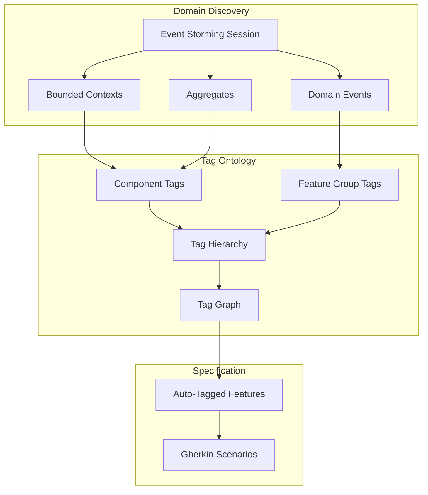

# EXMAP-004 Implementation Status Analysis

**Status:** Current Implementation Review
**Work Unit:** EXMAP-004 (Event Storming + Tag Integration)
**Completion:** ~40%

---

## Executive Summary

This document analyzes the current implementation status of EXMAP-004's Event Storming + Tag Integration feature. The analysis uses AST-based code tracing to verify what has been implemented versus what remains.

**Current Status: ~40% Complete**

- ✅ Event Storm data structures and commands (100%)
- ✅ Foundation Event Storm commands (100%)
- ✅ Basic tag system with 8 categories (100%)
- ❌ Tag relationship ontology (0%)
- ❌ Tag discovery from Event Storm (0%)
- ❌ Tag graph visualization (0%)
- ⚠️ Transformation pipeline (30%)

**Key Achievement**: Foundation Event Storm commands (add-aggregate-to-foundation, add-command-to-foundation, add-domain-event-to-foundation) are fully implemented with 752 lines of production code, using atomic file transactions and automatic FOUNDATION.md regeneration.

**Critical Gaps**: The integration layer connecting Event Storm to tags is missing - no tag relationship ontology, no automatic tag discovery, no graph visualization.

---

## Table of Contents

1. [Current Implementation Status](#current-implementation-status)
2. [Critical Gaps](#critical-gaps)
3. [Architecture Analysis](#architecture-analysis)
4. [Implementation Patterns](#implementation-patterns)
5. [Technical Debt](#technical-debt)
6. [Completion Metrics](#completion-metrics)
7. [Implementation Roadmap](#implementation-roadmap)

---

## Current Implementation Status

### 1. Event Storm Data Structures ✅ (100%)

**Location:** `src/types/index.ts`, `src/types/generic-foundation.ts`

**What exists:**
```typescript
// Complete EventStormItem types (7 artifact types)
export type EventStormItem =
  | EventStormEvent           // Orange sticky (Domain Events)
  | EventStormCommand         // Blue sticky (Commands)
  | EventStormAggregate       // Yellow large sticky (Aggregates)
  | EventStormPolicy          // Purple sticky (Policies/Rules)
  | EventStormHotspot         // Red sticky (Hotspots/Questions)
  | EventStormExternalSystem  // Pink sticky (External Systems)
  | EventStormBoundedContext  // Blue tape (Bounded Contexts)

// Dual-level support
export interface EventStorm extends EventStormBase {
  level: 'process_modeling' | 'software_design';
  suggestedTags?: SuggestedTags;
}

export interface FoundationEventStorm extends EventStormBase {
  level: 'big_picture';
}

// Suggested tags interface (defined but never populated)
export interface SuggestedTags {
  componentTags: string[];
  featureGroupTags: string[];
  technicalTags: string[];
  reasoning: string;
}
```

**Status:** Complete - All Event Storm artifact types defined with work unit-level and foundation-level support.

---

### 2. Event Storm Commands ✅ (100%)

**Work unit-level commands:**
```bash
fspec add-domain-event <workUnitId> <text> [--timestamp] [--bounded-context]
fspec add-command <workUnitId> <text> [--actor] [--triggers]
fspec add-aggregate <workUnitId> <text> [--context]
fspec add-policy <workUnitId> <text>
fspec add-hotspot <workUnitId> <text>
fspec add-bounded-context <workUnitId> <contextName> [--itemIds]
fspec show-event-storm <workUnitId>
fspec generate-example-mapping-from-event-storm <workUnitId>
```

**Implementation files:**
- `add-domain-event.ts` (178 lines)
- `add-command.ts`
- `add-aggregate.ts`
- `add-policy.ts`
- `add-hotspot.ts`
- `add-bounded-context.ts`
- `show-event-storm.ts` (116 lines)
- `generate-example-mapping-from-event-storm.ts`
- `event-storm-utils.ts` (114 lines)

**Status:** Complete - All basic Event Storm artifact commands implemented for work unit-level Event Storming.

---

### 3. Foundation Event Storm Commands ✅ (100%)

**Foundation-level commands (Big Picture Event Storming):**
```bash
fspec add-aggregate-to-foundation <context> <aggregateName> [--description]
fspec add-command-to-foundation <context> <commandName> [--description]
fspec add-domain-event-to-foundation <context> <eventName> [--description]
fspec show-foundation-event-storm [--type <type>] [--context <name>]
```

**Implementation (752 lines total):**
- `add-aggregate-to-foundation.ts` (161 lines)
- `add-command-to-foundation.ts` (155 lines)
- `add-domain-event-to-foundation.ts` (161 lines)
- `show-foundation-event-storm.ts` (99 lines)

**Key architecture patterns:**
```typescript
// Atomic file transactions
await fileManager.transaction<GenericFoundation>(
  foundationPath,
  async data => {
    data.eventStorm.items.push(newItem);
    data.eventStorm.nextItemId++;
  }
);

// Automatic FOUNDATION.md regeneration
await generateFoundationMdCommand({ cwd });
```

**Status:** Complete - All foundation Event Storm commands implemented with atomic transactions and auto-regeneration.

---

### 4. Basic Tag System ✅ (100%)

**Location:** `spec/tags.json`, `src/commands/*tag*.ts`

**Tag categories (8 total):**
1. Component Tags (architectural components)
2. Feature Group Tags (functional areas)
3. Technical Tags (technologies/frameworks)
4. Platform Tags (OS/environments)
5. Priority Tags (implementation priority)
6. Status Tags (development status)
7. Testing Tags (test types)
8. Automation Tags (workflow automation)

**Tag commands:**
```bash
# Registry management
fspec register-tag <tag> <category> <description>
fspec delete-tag <tag>
fspec update-tag <tag> --description="..."
fspec list-tags [--category]
fspec tag-stats

# Feature/scenario tagging
fspec add-tag-to-feature <featureFile> <tag>
fspec remove-tag-from-feature <featureFile> <tag>
fspec add-tag-to-scenario <featureFile> <scenarioName> <tag>
fspec remove-tag-from-scenario <featureFile> <scenarioName> <tag>

# Tag operations
fspec retag <oldTag> <newTag>
fspec delete-features-by-tag <tag>
fspec delete-scenarios-by-tag <tag>

# Validation
fspec validate-tags
fspec list-feature-tags [<featureFile>]
fspec list-scenario-tags <featureFile>
```

**Current tags.json structure:**
```json
{
  "categories": [
    {"name": "Component Tags", "required": true, "tags": [...]},
    {"name": "Feature Group Tags", "required": true, "tags": [...]},
    // ... 6 more categories
  ],
  "statistics": { ... }
}
```

**Status:** Complete - Comprehensive tag CRUD and validation system.

---

### 5. Coverage System ✅ (100%)

**Commands:**
```bash
fspec generate-coverage [--dry-run]
fspec link-coverage <feature> --scenario="..." --test-file=... --test-lines=...
fspec link-coverage <feature> --scenario="..." --impl-file=... --impl-lines=...
fspec unlink-coverage <feature> --scenario="..." --all
fspec show-coverage [<feature>]
fspec audit-coverage [<feature>]
```

**Coverage file structure:**
```json
{
  "scenarios": [
    {"name": "Scenario", "testMappings": [
      {"file": "test.ts", "lines": "45-62", "implMappings": [
        {"file": "impl.ts", "lines": [10, 23]}
      ]}
    ]}
  ],
  "stats": {"totalScenarios": 5, "coveredScenarios": 5, "coveragePercent": 100}
}
```

**Status:** Complete - Full scenario-to-test-to-implementation traceability.

---

## Critical Gaps

### 1. Tag Relationship Ontology ❌ (0%) - CRITICAL

**What's missing:**

tags.json should have a `relationships` section with three relationship types:

```json
{
  "relationships": {
    "hierarchical": [
      {
        "parent": "@work-management",
        "children": ["@work-units", "@epics"],
        "relationshipType": "contains",
        "description": "Work management domain contains these components"
      }
    ],
    "semantic": [
      {
        "source": "@acdd",
        "target": "@gherkin",
        "type": "requires",
        "description": "ACDD workflow requires Gherkin specifications",
        "bidirectional": false
      }
    ],
    "domain": [
      {
        "tag": "@work-unit-management",
        "boundedContext": "Work Management",
        "aggregates": ["WorkUnit"],
        "domainEvents": [{"name": "WorkUnitCreated", "triggersEvent": "..."}],
        "commands": [{"name": "CreateWorkUnit", "triggersEvent": "WorkUnitCreated"}]
      }
    ]
  },
  "metadata": {
    "lastEventStormSync": "2025-11-05T10:30:00.000Z",
    "domainModelVersion": "1.0.0",
    "boundedContextCount": 5
  }
}
```

**Current state:**
- ❌ No `relationships` section in tags.json
- ❌ Tags are flat (no hierarchies)
- ❌ No semantic relationships
- ❌ No domain mappings
- ❌ No Event Storm sync metadata

**Impact:**
- Tags are organizational only, not domain-grounded
- Can't visualize domain architecture
- Can't navigate tag relationships
- No automatic tag suggestions

**Priority:** **CRITICAL** - Core missing piece of EXMAP-004

---

### 2. Tag Relationship Commands ❌ (0%) - CRITICAL

**What's missing:**

```bash
# Add hierarchical relationship
fspec add-tag-relationship --type=hierarchical \
  --parent=@work-management \
  --child=@work-units

# Add semantic relationship
fspec add-tag-relationship --type=semantic \
  --source=@acdd \
  --target=@gherkin \
  --relation=requires

# Add domain relationship
fspec add-tag-relationship --type=domain \
  --tag=@work-unit-management \
  --event="WorkUnitCreated" \
  --command="CreateWorkUnit" \
  --aggregate="WorkUnit"

# Show relationships
fspec show-tag-relationships <tag>

# Validate relationships
fspec validate-tag-relationships [--fix]
```

**Current state:**
- ❌ No `add-tag-relationship` command
- ❌ No `show-tag-relationships` command
- ❌ No `validate-tag-relationships` command

**Impact:** No way to build or view tag ontology programmatically

**Priority:** **CRITICAL**

---

### 3. Tag Discovery from Event Storm ❌ (0%) - CRITICAL WORKFLOW GAP

**What's missing:**

```bash
# Analyze Event Storm and suggest tags
fspec suggest-tags-from-events <workUnitId>

# Auto-register tags with relationships
fspec sync-tags-with-event-storm <workUnitId> [--auto-confirm]

# Derive tags from bounded context (foundation-level)
fspec derive-tags-from-bounded-context <contextName>

# Generate tag ontology from foundation Event Storm
fspec derive-tags-from-foundation
```

**Transformation rules missing:**

| Event Storm Artifact | Tag Category | Transformation Rule | Example |
|---------------------|--------------|---------------------|---------|
| **Domain Event** (🟠) | Feature Group Tag | Remove "ed" suffix, add @ | `UserRegistered` → `@user-registration` |
| **Bounded Context** | Component Tag | Lowercase, hyphenate, add @ | "Authentication Context" → `@auth` |
| **Aggregate** (🟡) | Component Tag | Lowercase, pluralize, add @ | `WorkUnit` → `@work-units` |
| **External System** (🩷) | Technical Tag | Lowercase, hyphenate, add @ | "GitHub API" → `@github-integration` |

**Current state:**
- ✅ `SuggestedTags` interface exists in types
- ❌ No commands to populate SuggestedTags
- ❌ No transformation algorithms
- ❌ No automatic tag discovery

**Impact:**
- Manual tagging required
- Tags disconnected from domain
- No automatic suggestions
- Workflow friction

**Priority:** **CRITICAL**

---

### 4. Tag Graph Visualization ❌ (0%) - QUERY-001 NOT IMPLEMENTED

**What's missing:**

```bash
# Export tag graph
fspec export-tag-graph --format=mermaid --output=docs/tag-graph.md
fspec export-tag-graph --format=dot --filter=@work-management
fspec export-tag-graph --format=json --output=tag-graph.json

# Query relationship paths
fspec query-tag-graph --path-from=@acdd --path-to=@test-coverage
```

**Graph types needed:**
1. Hierarchical Graph (tree view)
2. Semantic Graph (workflow view)
3. Domain Graph (bounded context view)
4. Complete Ontology Graph (multi-layer)

**Current state:**
- ❌ No `export-tag-graph` command
- ❌ No `query-tag-graph` command
- ❌ No Mermaid graph generator
- ❌ No DOT graph generator
- ❌ No JSON graph export
- ❌ No pathfinding algorithms

**Impact:**
- No visual domain architecture
- Can't navigate relationships
- No architectural clarity
- No graph queries

**Priority:** **HIGH** (QUERY-001 work unit)

---

### 5. Transformation Pipeline ⚠️ (30%) - PARTIALLY IMPLEMENTED

**What exists:**
- ✅ `generate-example-mapping-from-event-storm` - Transforms policies/hotspots to rules/questions

**What's missing:**

```bash
# Transform Event Storm → Example Mapping with auto-advance
fspec transform-event-storm <workUnitId> [--auto-advance]
```

**Missing features:**
1. Auto-tagging during scenario generation
2. Domain event linking in coverage files
3. Full pipeline orchestration (single command: ES → Tag Discovery → EM → Scenarios → Auto-tag)

**Impact:**
- Manual tagging friction
- No domain event traceability
- Workflow fragmentation

**Priority:** **HIGH**

---

## Architecture Analysis

### Current Architecture: Disconnected Systems

fspec has:
- ✅ Event Storming data capture (work unit + foundation)
- ✅ Event Storm artifact CRUD commands
- ✅ Tag system (8 categories, validation, CRUD)
- ✅ Coverage tracking (scenario → test → implementation)

**But these systems are disconnected:**
- Event Storm artifacts sit in work units/foundation
- Tags are manually created and applied
- No automatic domain-to-tag mapping
- No relationship tracking between tags
- No visualization of domain architecture

### EXMAP-004 Vision: Unified Domain Knowledge System

EXMAP-004 proposes a **self-documenting, domain-driven system** where:



**Key principles:**
1. **Domain-Driven Tags** - Tags derived from domain concepts
2. **Automatic Propagation** - Domain knowledge flows: Events → Tags → Features
3. **Relationship Tracking** - Explicit hierarchical, semantic, domain relationships
4. **Visual Architecture** - Tag graphs visualize bounded contexts
5. **Living Documentation** - Tag ontology is the living map of domain architecture

### The Missing "Glue Layer"

**What's missing is the integration layer:**

```
Event Storm Artifacts  →  [MISSING GLUE]  →  Tag System
       ↓                                          ↓
  (Captured)                                 (Manual)
```

**The "glue" includes:**
1. Transformation Logic (ES artifacts → Tags)
2. Relationship Modeling (hierarchical, semantic, domain)
3. Graph Visualization (understand domain structure)
4. Automatic Propagation (tags flow from ES → Features)

---

## Implementation Patterns

### Excellent Patterns Found

**1. Atomic File Transactions**

All foundation commands use `fileManager.transaction()` for atomic updates:

```typescript
await fileManager.transaction<GenericFoundation>(
  foundationPath,
  async data => {
    data.eventStorm.items.push(newItem);
    data.eventStorm.nextItemId++;
  }
);
```

**Benefits:**
- Prevents partial writes
- Ensures data consistency
- Safe concurrent access

**2. Automatic FOUNDATION.md Regeneration**

All foundation commands auto-regenerate FOUNDATION.md:

```typescript
await generateFoundationMdCommand({ cwd });
```

**Benefits:**
- Living documentation stays in sync
- No manual markdown updates
- Single source of truth (foundation.json)

**3. Structural Filtering Only**

`show-foundation-event-storm.ts` performs structural filtering (type, context) without semantic interpretation:

```typescript
// Filter by type
if (options.type) {
  items = items.filter(item => item.type === options.type);
}

// Filter by context
if (options.context) {
  const boundedContext = items.find(
    item => item.type === 'bounded_context' && item.text === options.context
  );
  items = items.filter(item =>
    item.boundedContextId === boundedContext.id
  );
}
```

**Benefits:**
- JSON-in, JSON-out (no formatting)
- Composable with other tools
- Clear separation of concerns

---

## Technical Debt

### 1. SuggestedTags Interface Never Populated

**Issue:** `SuggestedTags` interface exists but has **zero implementations** that populate it.

**Location:** `src/types/index.ts:117-122`

```typescript
export interface SuggestedTags {
  componentTags: string[];
  featureGroupTags: string[];
  technicalTags: string[];
  reasoning: string;
}
```

**Finding:** Grep search across codebase shows no code populates `suggestedTags` field in Event Storm data.

**Impact:** Placeholder type that provides no value

**Recommendation:** Implement tag suggestion algorithms or remove interface

---

### 2. No Tag Relationship Support in Data Structure

**Issue:** tags.json has only `categories` and `statistics` keys - no `relationships` or `metadata` sections.

**AST Analysis:**
```bash
fspec research --tool=ast --operation=list-keys
# Returns: ["categories", "statistics"]
```

**Impact:** Can't add tag relationships without schema change

**Recommendation:** Extend tags.json schema to support relationships

---

### 3. Foundation Event Storm Missing Bounded Context Command

**Issue:** Can add aggregates, commands, events to foundation, but can't add new bounded contexts.

**Missing command:**
```bash
fspec add-bounded-context-to-foundation <contextName> [--description]
```

**Impact:** Must manually edit foundation.json to add bounded contexts

**Recommendation:** Implement `add-bounded-context-to-foundation` command

---

## Completion Metrics

| Feature | Current Status | Lines of Code | Completion |
|---------|---------------|---------------|------------|
| **Event Storm Data Models** | ✅ Implemented | ~200 | 100% |
| **Work Unit Event Storm Commands** | ✅ Implemented | ~800 | 100% |
| **Foundation Event Storm Commands** | ✅ Implemented | 752 | 100% |
| **Basic Tag System** | ✅ Implemented | ~1200 | 100% |
| **Tag Relationship Ontology** | ❌ Not started | 0 | 0% |
| **Tag Relationship Commands** | ❌ Not started | 0 | 0% |
| **Tag Discovery from ES** | ❌ Not started | 0 | 0% |
| **Tag Graph Visualization** | ❌ Not started | 0 | 0% |
| **Transformation Pipeline** | ⚠️ Partial | ~200 | 30% |
| **Coverage System** | ✅ Implemented | ~600 | 100% |

**Overall Completion: ~40%**

**Critical Path:** Tag Discovery + Tag Relationships (0% complete, blocks everything else)

---

## Implementation Roadmap

### Phase 1: Tag Discovery (13 points) - CRITICAL PATH

**Work Units:**
- `EXMAP-005`: Implement `suggest-tags-from-events` command (5 points)
- `EXMAP-006`: Implement `sync-tags-with-event-storm` command (3 points)
- `EXMAP-007`: Implement `derive-tags-from-bounded-context` command (3 points)
- `EXMAP-008`: Implement tag transformation algorithms (2 points)

**Deliverables:**
- Tag suggestion from Event Storm artifacts
- Auto-registration with relationships
- Domain-to-tag transformation logic

**Dependencies:** None (uses existing Event Storm commands)

---

### Phase 2: Tag Relationship System (13 points) - CRITICAL PATH

**Work Units:**
- `QUERY-002`: Enhance tag data model with relationships (3 points)
- `QUERY-003`: Implement `add-tag-relationship` command (5 points)
- `QUERY-004`: Implement `show-tag-relationships` command (2 points)
- `QUERY-005`: Implement `validate-tag-relationships` command (3 points)

**Deliverables:**
- Enhanced tags.json with relationships section
- Relationship CRUD commands
- Validation system

**Dependencies:** None (extends existing tag system)

---

### Phase 3: Tag Graph Visualization (13 points) - HIGH PRIORITY

**Work Units:**
- `QUERY-006`: Implement Mermaid graph generator (5 points)
- `QUERY-007`: Implement DOT graph generator (3 points)
- `QUERY-008`: Implement JSON graph export (2 points)
- `QUERY-009`: Add graph filtering (3 points)

**Deliverables:**
- `export-tag-graph` command
- Multiple format support (Mermaid, DOT, JSON)
- Filtering capabilities

**Dependencies:** Phase 2 (requires tag relationships)

---

### Phase 4: Transformation Pipeline (8 points) - HIGH PRIORITY

**Work Units:**
- `EXMAP-012`: Implement `transform-event-storm` command (5 points)
- `EXMAP-013`: Auto-tag feature files from Event Storm (3 points)

**Deliverables:**
- Automatic transformation: ES → Example Mapping
- Auto-tagging during scenario generation
- Domain event linking in coverage files

**Dependencies:** Phase 1 (requires tag discovery)

---

### Implementation Strategy

**Suggested Approach:**

```
Week 1-2: Tag Discovery (Phase 1) - 13 points
  - suggest-tags-from-events
  - sync-tags-with-event-storm
  - Tag transformation algorithms

Week 3-4: Tag Relationships (Phase 2) - 13 points
  - Enhance tags.json data model
  - add-tag-relationship
  - show-tag-relationships

Week 5-6: Tag Graph + Pipeline (Phase 3 + 4) - 21 points
  - export-tag-graph
  - Auto-tag feature files
  - Domain event linking

Week 7-8: Polish & Documentation - 8 points
  - Integration testing
  - Documentation
  - Examples
```

**Total Effort:** ~50 story points (6-8 weeks)

---

## Conclusion

EXMAP-004 is **~40% complete** with solid foundations (Event Storm data models, commands, tag system) but **missing the critical integration layer** that connects Event Storm to tags.

### What Exists

- ✅ Complete Event Storm data structures (dual-level)
- ✅ Foundation Event Storm commands (752 lines, excellent patterns)
- ✅ Comprehensive tag system (8 categories, validation)
- ✅ Coverage tracking (scenario → test → implementation)

### What's Missing

- ❌ **Tag relationship ontology** (hierarchical, semantic, domain)
- ❌ **Tag discovery from Event Storm** (automatic transformation)
- ❌ **Tag graph visualization** (understand domain architecture)
- ⚠️ **Transformation pipeline** (auto-tagging, orchestration)

### Next Steps

1. **Implement Phase 1** (Tag Discovery) - Unblocks automatic tag generation
2. **Implement Phase 2** (Tag Relationships) - Enables graph visualization
3. **Implement Phase 3** (Tag Graph) - Provides visual understanding
4. **Implement Phase 4** (Pipeline) - Automates workflow

**The integration layer is the key** - once Tag Discovery and Tag Relationships are implemented, the rest flows naturally.

---

**Document Status:** Current Implementation Analysis
**Related Work Units:** EXMAP-004 (Event Storm + Tag Integration), QUERY-001 (Tag Graph Visualization)
