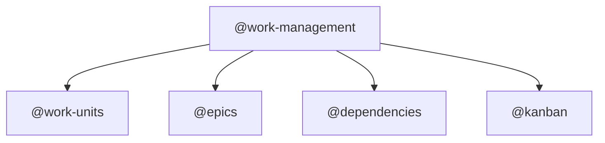
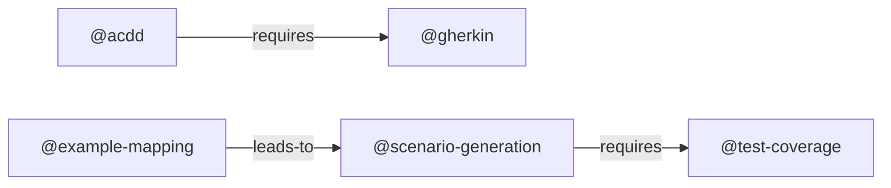
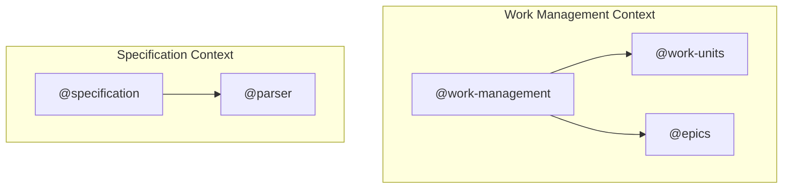
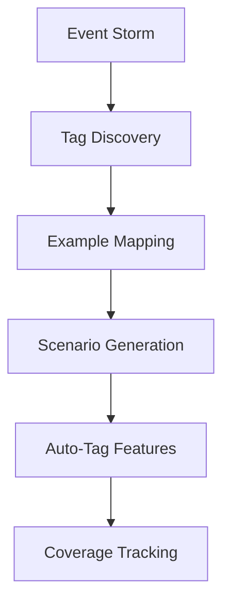
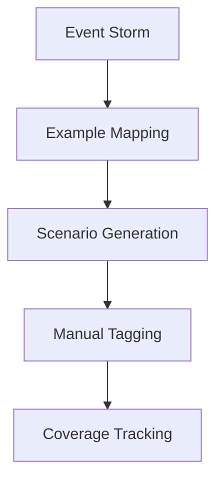
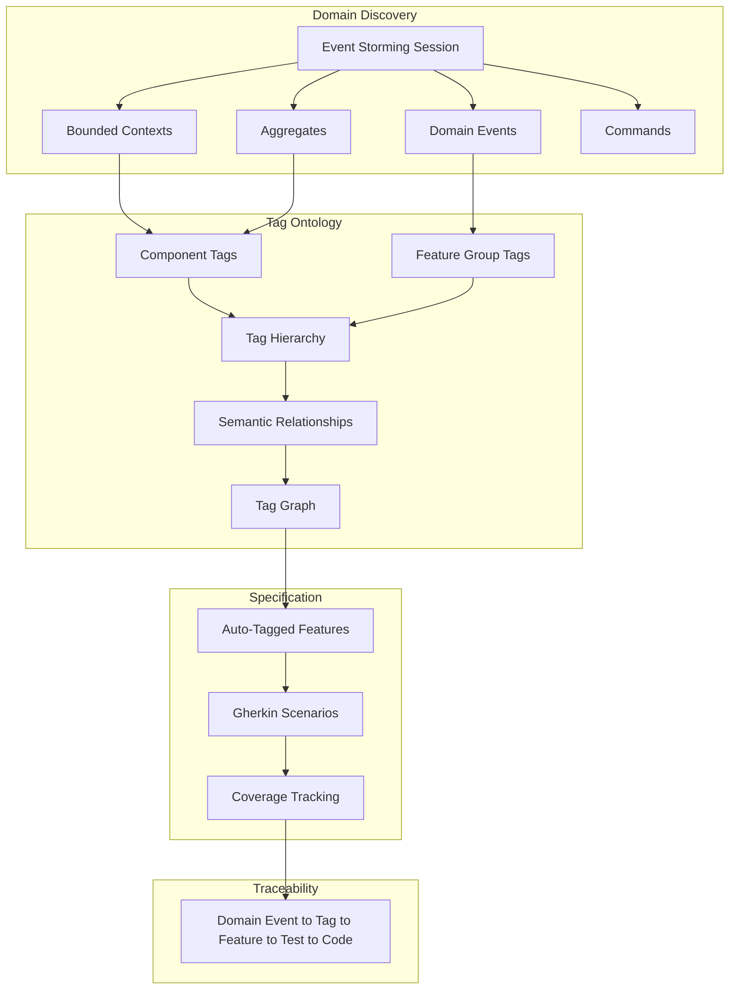

# EXMAP-004 Implementation Gap Analysis

**Created:** 2025-11-17
**Author:** AI Analysis (Claude Code)
**Status:** Complete Comparison
**Work Unit:** EXMAP-004 (Event Storming + Tag Integration)

---

## Executive Summary

This document provides a comprehensive comparison between the EXMAP-004 specification (event-storming-tag-integration-no-colors.md) and the current fspec codebase implementation. The analysis reveals that while fspec has **solid foundations** (Event Storm data models, basic commands, tag system), it is **missing the critical integration layer** that connects Event Storming with the tag ontology system.

**Implementation Completeness: ~30%**

- ✅ Event Storm data structures and CRUD commands (100%)
- ✅ Basic tag system with 8 categories (100%)
- ❌ Tag relationship ontology (0%)
- ❌ Tag discovery from Event Storm (0%)
- ❌ Tag graph visualization (0%)
- ⚠️ Transformation pipeline (30%)

---

## Table of Contents

1. [What Exists (Already Implemented)](#what-exists-already-implemented)
2. [What's Missing (Critical Gaps)](#whats-missing-critical-gaps)
3. [Feature-by-Feature Comparison](#feature-by-feature-comparison)
4. [The Vision Gap](#the-vision-gap)
5. [Implementation Roadmap](#implementation-roadmap)
6. [Recommendations](#recommendations)

---

## What Exists (Already Implemented)

### 1. Event Storm Data Structures ✅ (100%)

**Location:** `src/types/index.ts`, `src/types/generic-foundation.ts`

**Implemented:**
```typescript
// Complete EventStormItem types
export type EventStormItem =
  | EventStormEvent           // Orange sticky (Domain Events)
  | EventStormCommand         // Blue sticky (Commands)
  | EventStormAggregate       // Yellow large sticky (Aggregates)
  | EventStormPolicy          // Purple sticky (Policies/Rules)
  | EventStormHotspot         // Red sticky (Hotspots/Questions)
  | EventStormExternalSystem  // Pink sticky (External Systems)
  | EventStormBoundedContext  // Blue tape (Bounded Contexts)

// EventStormBase interface
export interface EventStormBase {
  sessionDate?: string;
  facilitator?: string;
  participants?: string[];
  items: EventStormItem[];
  nextItemId: number;
}

// Work unit-level Event Storm
export interface EventStorm extends EventStormBase {
  level: 'process_modeling' | 'software_design';
  suggestedTags?: SuggestedTags;
}

// Foundation-level Event Storm (Big Picture)
export interface FoundationEventStorm extends EventStormBase {
  level: 'big_picture';
}

// Suggested tags structure
export interface SuggestedTags {
  componentTags: string[];
  featureGroupTags: string[];
  technicalTags: string[];
  reasoning: string;
}
```

**Status:** ✅ Complete - All Event Storm artifact types defined, dual-level support (work unit + foundation)

---

### 2. Event Storm Commands ✅ (100%)

**Location:** `src/commands/`

**Implemented Commands:**
```bash
# Work unit-level Event Storm
fspec add-domain-event <workUnitId> <text> [--timestamp] [--bounded-context]
fspec add-command <workUnitId> <text> [--actor] [--triggers]
fspec add-aggregate <workUnitId> <text> [--context]
fspec add-policy <workUnitId> <text>
fspec add-hotspot <workUnitId> <text>
fspec add-bounded-context <workUnitId> <contextName> [--itemIds]

# Display
fspec show-event-storm <workUnitId>
fspec show-foundation-event-storm

# Transformation
fspec generate-example-mapping-from-event-storm <workUnitId>
```

**Implementation Files:**
- `add-domain-event.ts` (178 lines)
- `add-command.ts`
- `add-aggregate.ts`
- `add-policy.ts`
- `add-hotspot.ts`
- `add-bounded-context.ts`
- `show-event-storm.ts` (116 lines)
- `show-foundation-event-storm.ts`
- `generate-example-mapping-from-event-storm.ts`
- `event-storm-utils.ts` (114 lines) - Shared utilities

**Status:** ✅ Complete - All basic Event Storm artifact commands implemented

---

### 3. Basic Tag System ✅ (100%)

**Location:** `spec/tags.json`, `src/commands/*tag*.ts`

**Implemented:**

**tags.json structure:**
```json
{
  "categories": [
    {
      "name": "Component Tags",
      "description": "Tags identifying architectural components",
      "required": true,
      "tags": [...]
    },
    {
      "name": "Feature Group Tags",
      "description": "Tags categorizing features by functional area",
      "required": true,
      "tags": [...]
    },
    // ... 6 more categories (Technical, Platform, Priority, Status, Testing, Automation)
  ],
  "statistics": { ... }
}
```

**Tag Commands:**
```bash
# Tag Registry Management
fspec register-tag <tag> <category> <description>
fspec delete-tag <tag>
fspec update-tag <tag> --description="..."
fspec list-tags [--category]
fspec tag-stats

# Feature/Scenario Tagging
fspec add-tag-to-feature <featureFile> <tag>
fspec remove-tag-from-feature <featureFile> <tag>
fspec add-tag-to-scenario <featureFile> <scenarioName> <tag>
fspec remove-tag-from-scenario <featureFile> <scenarioName> <tag>

# Tag Operations
fspec retag <oldTag> <newTag>
fspec delete-features-by-tag <tag>
fspec delete-scenarios-by-tag <tag>

# Validation
fspec validate-tags
fspec list-feature-tags [<featureFile>]
fspec list-scenario-tags <featureFile>
```

**Status:** ✅ Complete - Comprehensive tag CRUD and validation system

---

### 4. Coverage System ✅ (100%)

**Location:** `spec/features/*.feature.coverage`

**Implemented:**
```bash
fspec generate-coverage [--dry-run]
fspec link-coverage <feature> --scenario="..." --test-file=... --test-lines=...
fspec link-coverage <feature> --scenario="..." --test-file=... --impl-file=... --impl-lines=...
fspec unlink-coverage <feature> --scenario="..." --all
fspec show-coverage [<feature>]
fspec audit-coverage [<feature>]
```

**Coverage File Structure:**
```json
{
  "scenarios": [
    {
      "name": "Scenario name",
      "testMappings": [
        {
          "file": "test.ts",
          "lines": "45-62",
          "implMappings": [
            {"file": "impl.ts", "lines": [10, 23]}
          ]
        }
      ]
    }
  ],
  "stats": {
    "totalScenarios": 5,
    "coveredScenarios": 5,
    "coveragePercent": 100
  }
}
```

**Status:** ✅ Complete - Full scenario-to-test-to-implementation traceability

---

## What's Missing (Critical Gaps)

### 1. Tag Relationship Ontology ❌ (0%) - CRITICAL GAP

**What EXMAP-004 Specifies:**

tags.json should have a `relationships` section with three relationship types:

```json
{
  "categories": [...],
  "relationships": {
    "hierarchical": [
      {
        "parent": "@work-management",
        "children": ["@work-units", "@epics", "@dependencies", "@kanban"],
        "relationshipType": "contains",
        "description": "Work management domain contains these components"
      }
    ],
    "semantic": [
      {
        "source": "@acdd",
        "target": "@gherkin",
        "type": "requires",
        "description": "ACDD workflow requires Gherkin specifications",
        "bidirectional": false
      },
      {
        "source": "@example-mapping",
        "target": "@scenario-generation",
        "type": "leads-to",
        "description": "Example Mapping produces scenarios",
        "bidirectional": false
      }
    ],
    "domain": [
      {
        "tag": "@work-unit-management",
        "boundedContext": "Work Management",
        "aggregates": ["WorkUnit"],
        "domainEvents": [
          {
            "name": "WorkUnitCreated",
            "color": "orange",
            "pastTense": true,
            "timestamp": "auto"
          }
        ],
        "commands": [
          {
            "name": "CreateWorkUnit",
            "color": "blue",
            "presentTense": true,
            "triggersEvent": "WorkUnitCreated"
          }
        ],
        "policies": ["When work unit created, add to backlog column"],
        "externalSystems": []
      }
    ]
  },
  "metadata": {
    "lastEventStormSync": "2025-11-05T10:30:00.000Z",
    "domainModelVersion": "1.0.0",
    "boundedContextCount": 5,
    "totalDomainEvents": 47,
    "totalCommands": 38
  }
}
```

**Current State:**
- ❌ No `relationships` section in tags.json
- ❌ Tags are completely flat (no hierarchies)
- ❌ No semantic relationships (requires, uses, blocks, leads-to)
- ❌ No domain mappings (tags disconnected from Event Storm)
- ❌ No metadata tracking Event Storm sync

**Impact:**
- Tags are organizational only, not domain-grounded
- Can't visualize domain architecture
- Can't navigate tag relationships
- No automatic tag suggestions based on domain

**Priority:** **CRITICAL** - This is the core missing piece of EXMAP-004

---

### 2. Tag Relationship Commands ❌ (0%) - CRITICAL GAP

**What EXMAP-004 Specifies:**

```bash
# Add hierarchical relationship
fspec add-tag-relationship --type=hierarchical \
  --parent=@work-management \
  --child=@work-units

# Add semantic relationship
fspec add-tag-relationship --type=semantic \
  --source=@acdd \
  --target=@gherkin \
  --relation=requires \
  --description="ACDD workflow requires Gherkin specifications"

# Add domain relationship
fspec add-tag-relationship --type=domain \
  --tag=@work-unit-management \
  --event="WorkUnitCreated" \
  --command="CreateWorkUnit" \
  --aggregate="WorkUnit" \
  --context="Work Management"

# Show all relationships for a tag
fspec show-tag-relationships <tag>

# Output:
# @work-units
#
# Hierarchical:
#   Parent: @work-management
#   Children: (none)
#
# Semantic:
#   Required by: @kanban, @board-visualization
#   Requires: @cli (for command execution)
#   Integrates with: @parser
#
# Domain Model:
#   Aggregate: WorkUnit
#   Bounded Context: Work Management
#   Domain Events: WorkUnitCreated, WorkUnitStatusChanged
#   Commands: CreateWorkUnit, UpdateWorkUnitStatus
#
# Used in 47 feature files

# Validate tag relationships
fspec validate-tag-relationships [--fix]

# Checks:
#   ✓ No circular hierarchies
#   ✓ All referenced tags exist
#   ✓ Semantic relationships are bidirectional where required
#   ✓ Domain relationships align with Event Storm data
#   ✗ Orphaned tags: @unused-tag (no relationships, no features)
```

**Current State:**
- ❌ No `add-tag-relationship` command
- ❌ No `show-tag-relationships` command
- ❌ No `validate-tag-relationships` command
- ❌ Can't create, view, or validate any tag relationships

**Impact:**
- No way to build tag ontology programmatically
- No way to see how tags relate to each other
- No way to detect orphaned or circular relationships

**Priority:** **CRITICAL** - Required for tag ontology system

---

### 3. Tag Discovery from Event Storm ❌ (0%) - CRITICAL WORKFLOW GAP

**What EXMAP-004 Specifies:**

```bash
# Analyze Event Storm and suggest tags
fspec suggest-tags-from-events <workUnitId>

# Output:
# Suggested Component Tags:
#   @auth (from bounded context: Authentication)
#   @session-management (from aggregate: Session)
#
# Suggested Feature Group Tags:
#   @authentication (from domain events: UserAuthenticated, SessionCreated)
#   @user-management (from aggregate: User)
#
# Suggested Technical Tags:
#   @oauth2-integration (from external system: OAuth2Provider)
#
# Relationships to create:
#   @auth --contains--> @session-management
#   @authentication --uses--> @oauth2-integration
#
# Register these tags? (y/n)

# Auto-register tags with relationships
fspec sync-tags-with-event-storm <workUnitId> [--auto-confirm]

# Derive tags from bounded context (foundation-level)
fspec derive-tags-from-bounded-context <contextName>

# Generate tag ontology from foundation Event Storm
fspec derive-tags-from-foundation

# Output:
# ✓ Generated tag ontology from foundation Event Storm
# ✓ Created 15 component tags
# ✓ Created 12 feature group tags
# ✓ Created 47 hierarchical relationships
# ✓ Created 28 semantic relationships
# ✓ Created 83 domain mappings
#
# Tag graph saved to: spec/attachments/foundation-tag-graph.md
```

**Transformation Rules (Missing):**

| Event Storm Artifact | fspec Tag Category | Transformation Rule | Example |
|---------------------|-------------------|---------------------|---------|
| **Domain Event** (🟠) | Feature Group Tag | Remove "ed" suffix, add @ | `UserRegistered` → `@user-registration` or `@authentication` |
| **Bounded Context** | Component Tag | Lowercase, hyphenate, add @ | "Authentication Context" → `@auth` |
| **Aggregate** (🟡) | Component Tag | Lowercase, pluralize, add @ | `WorkUnit` → `@work-units` |
| **External System** (🩷) | Technical Tag | Lowercase, hyphenate, add @ | "GitHub API" → `@github-integration` |
| **Policy** (🟣) | → Example Mapping Rules | Transform to business rule | "When X then Y" → `addRule(workUnit, "When X then Y")` |
| **Hotspot** (🔴) | → Example Mapping Questions | Transform to question | "What if...?" → `addQuestion(workUnit, "What if...?")` |

**Current State:**
- ❌ No `suggest-tags-from-events` command
- ❌ No `sync-tags-with-event-storm` command
- ❌ No `derive-tags-from-bounded-context` command
- ❌ No `derive-tags-from-foundation` command
- ❌ No transformation algorithms implemented
- ✅ `SuggestedTags` interface exists in types, but never populated automatically

**Impact:**
- **Manual tagging required** - AI must manually choose tags
- **Tags disconnected from domain** - No automatic domain-to-tag mapping
- **No tag suggestions** - Can't leverage Event Storm for tag discovery
- **Workflow friction** - Extra manual steps in ACDD workflow

**Priority:** **CRITICAL** - Core workflow integration missing

---

### 4. Tag Graph Visualization ❌ (0%) - QUERY-001 NOT IMPLEMENTED

**What EXMAP-004 Specifies:**

```bash
# Export full tag graph
fspec export-tag-graph --format=mermaid --output=docs/tag-graph.md

# Export filtered by bounded context
fspec export-tag-graph --format=dot --filter=@work-management

# Export as JSON for tools
fspec export-tag-graph --format=json --output=tag-graph.json

# Query relationship paths
fspec query-tag-graph --path-from=@acdd --path-to=@test-coverage

# Output:
# Shortest path from @acdd to @test-coverage:
#   @acdd → requires → @gherkin
#   @gherkin → leads-to → @scenario-generation
#   @scenario-generation → requires → @test-coverage
# (3 hops, 2 intermediate nodes)
```

**Graph Types:**

1. **Hierarchical Graph** (Tree View)


2. **Semantic Graph** (Workflow View)


3. **Domain Graph** (Bounded Context View)


4. **Complete Ontology Graph** (Multi-layer)
- Event Storm Layer → Tag Layer → Feature Layer
- Shows full traceability: Domain Events → Tags → Features

**Filtering Options:**
```bash
--filter-context="Work Management"    # Filter by bounded context
--filter-category="Component Tags"    # Filter by tag category
--filter-epic="user-management"       # Filter by epic
--max-depth=2                         # Filter by depth (hierarchical only)
```

**Current State:**
- ❌ No `export-tag-graph` command
- ❌ No `query-tag-graph` command
- ❌ No Mermaid graph generator
- ❌ No DOT graph generator
- ❌ No JSON graph export
- ❌ No graph filtering capabilities
- ❌ No pathfinding algorithms

**Impact:**
- **No visual domain architecture** - Can't see bounded contexts
- **Can't navigate relationships** - Can't understand tag dependencies
- **No architectural clarity** - Domain structure implicit, not visualized
- **No graph queries** - Can't find relationship paths

**Priority:** **HIGH** - Critical for understanding domain structure (QUERY-001)

---

### 5. Transformation Pipeline ⚠️ (30%) - PARTIALLY IMPLEMENTED

**What Exists:**
- ✅ `generate-example-mapping-from-event-storm` - Transforms policies/hotspots to rules/questions

**What's Missing:**

```bash
# Transform Event Storm → Example Mapping with auto-advance
fspec transform-event-storm <workUnitId> [--auto-advance]

# Output:
# ✓ Transformed 3 policies to rules
# ✓ Transformed 2 hotspots to questions
# ✓ Suggested 5 component tags
# ✓ Suggested 3 feature group tags
# ✓ Auto-registered tags with relationships
# ✓ Auto-advanced to example_mapping state
```

**Missing Features:**
1. **Auto-tagging during scenario generation**
   - When `fspec generate-scenarios` runs, feature file should inherit tags from Event Storm
   - Current: Manual tagging required after scenario generation

2. **Domain event linking in coverage files**
   - Coverage files should track which domain events are covered by scenarios
   - Adds traceability: Domain Event → Scenario → Test → Implementation

3. **Full pipeline orchestration**
   - Single command to run: ES → Tag Discovery → EM → Scenarios → Auto-tag
   - Current: Must run multiple commands manually

**EXMAP-004 Spec Pipeline:**


**Current Pipeline:**


**Impact:**
- **Manual tagging friction** - Extra step after scenario generation
- **No domain event traceability** - Coverage doesn't track domain events
- **Workflow fragmentation** - Multiple commands instead of orchestrated pipeline

**Priority:** **HIGH** - Workflow efficiency and automation

---

### 6. Foundation Event Storm Commands ❌ (0%) - MISSING BIG PICTURE COMMANDS

**What EXMAP-004 Specifies:**

```bash
# Add bounded context to foundation.json
fspec add-bounded-context-to-foundation <contextName>

# Add aggregate to bounded context
fspec add-aggregate-to-foundation <context> <aggregateName>

# Add domain event to bounded context
fspec add-domain-event-to-foundation <context> <eventName>

# Add command to bounded context
fspec add-command-to-foundation <context> <commandName>

# Show foundation Event Storm
fspec show-foundation-event-storm
```

**Example Workflow:**
```bash
# Big Picture Event Storming
fspec add-bounded-context-to-foundation "Work Management"
fspec add-bounded-context-to-foundation "Specification"
fspec add-bounded-context-to-foundation "Testing"

# For each bounded context, identify aggregates
fspec add-aggregate-to-foundation "Work Management" "WorkUnit"
fspec add-aggregate-to-foundation "Work Management" "Epic"

# Add domain events
fspec add-domain-event-to-foundation "Work Management" "WorkUnitCreated"
fspec add-domain-event-to-foundation "Work Management" "EpicCreated"

# Generate tag ontology from foundation
fspec derive-tags-from-foundation

# Output:
# ✓ Created 15 component tags
# ✓ Created 12 feature group tags
# ✓ Created 47 hierarchical relationships
```

**Current State:**
- ✅ `FoundationEventStorm` type exists in data model
- ✅ `foundation.json` has `eventStorm` field (confirmed in current foundation.json)
- ✅ `show-foundation-event-storm` command exists
- ❌ No commands to **add** artifacts to foundation Event Storm
- ❌ Must manually edit `foundation.json` to add bounded contexts, aggregates, events

**Impact:**
- **Big Picture Event Storming not accessible via CLI** - Must manually edit JSON
- **No foundation-level tag generation** - Can't derive component tags from bounded contexts
- **Workflow gap** - No guided Big Picture Event Storm session

**Priority:** **MEDIUM** - Foundation Event Storm is less frequently used than work unit-level

---

### 7. Event Storm Workflow State ❌ (0%) - NOT IN KANBAN

**What EXMAP-004 Suggests:**

```
backlog → event_storming → example_mapping → specifying → testing → implementing → validating → done
```

**Current Workflow:**

```
backlog → specifying → testing → implementing → validating → done
```

**Missing States:**
- `event_storming` - Dedicated state for Event Storm discovery
- `example_mapping` - Dedicated state for Example Mapping

**Current Practice:**
- Event Storming happens during `specifying` state
- Example Mapping happens during `specifying` state
- Both are sub-phases, not distinct workflow states

**Impact:**
- **Harder to track progress** - Can't see if work unit is in ES vs EM phase
- **Less granular workflow** - Specifying state encompasses multiple activities
- **No state-specific guidance** - Can't emit different system-reminders for ES vs EM

**Priority:** **LOW** - Current workflow is functional, this would be a refinement

---

### 8. Domain Tags Category ❌ (0%) - MISSING 9TH CATEGORY

**What EXMAP-004 Proposes:**

```json
{
  "categories": [
    // ... existing 8 categories ...
    {
      "name": "Domain Tags",
      "description": "Tags derived from Event Storming domain model (OPTIONAL)",
      "required": false,
      "tags": [
        {
          "name": "@user-registered-event",
          "description": "Domain event: User registration completed",
          "derivedFrom": "UserRegistered event in Authentication context"
        },
        {
          "name": "@work-unit-created-event",
          "description": "Domain event: Work unit created in system",
          "derivedFrom": "WorkUnitCreated event in Work Management context"
        }
      ]
    }
  ]
}
```

**Current State:**
- ❌ Only 8 categories in tags.json
- ❌ No Domain Tags category
- ❌ Domain-derived tags mixed with organizational tags

**Impact:**
- **No clear separation** - Domain tags vs. organizational tags not distinguished
- **Less clarity** - Hard to tell which tags came from Event Storm
- **No derivedFrom tracking** - Can't trace tags back to domain events

**Priority:** **LOW** - Nice-to-have for better organization

---

## Feature-by-Feature Comparison

| Feature | EXMAP-004 Spec | Current Implementation | Gap Size | Priority |
|---------|----------------|------------------------|----------|----------|
| **Event Storm Data Models** | Work unit + Foundation levels | ✅ Fully implemented | None | - |
| **Event Storm CRUD Commands** | 7 commands (add-domain-event, etc.) | ✅ All 7 implemented | None | - |
| **Basic Tag System** | 8 categories, CRUD, validation | ✅ Fully implemented | None | - |
| **Tag Relationship Ontology** | 3 types (hierarchical, semantic, domain) | ❌ Missing completely | **CRITICAL** | **P0** |
| **Tag Relationship Commands** | add, show, validate | ❌ Missing completely | **CRITICAL** | **P0** |
| **Tag Discovery from ES** | 4 commands (suggest, sync, derive) | ❌ Missing completely | **CRITICAL** | **P0** |
| **Tag Graph Visualization** | export-tag-graph, query-tag-graph | ❌ Missing completely | **LARGE** | **P1** |
| **Transformation Pipeline** | Auto-tag, domain event linking | ⚠️ 30% implemented | **MEDIUM** | **P1** |
| **Foundation ES Commands** | add-*-to-foundation (5 commands) | ❌ Missing completely | **MEDIUM** | **P2** |
| **ES Workflow States** | event_storming, example_mapping | ❌ Not in Kanban | **SMALL** | **P3** |
| **Domain Tags Category** | 9th category for domain-derived tags | ❌ Missing | **SMALL** | **P3** |

---

## The Vision Gap

### Current State: Disconnected Systems

fspec currently has:
- ✅ Event Storming data capture (work unit + foundation)
- ✅ Event Storm artifact CRUD commands
- ✅ Comprehensive tag system (8 categories, validation, CRUD)
- ✅ Coverage tracking (scenario → test → implementation)

**But these systems are disconnected:**
- Event Storm artifacts sit in work units/foundation
- Tags are manually created and applied
- No automatic domain-to-tag mapping
- No relationship tracking between tags
- No visualization of domain architecture
- No tag suggestions based on Event Storm

### EXMAP-004 Vision: Unified Domain Knowledge System

EXMAP-004 proposes a **self-documenting, domain-driven system** where:



**Key Principles:**
1. **Domain-Driven Tags** - Tags are derived from domain concepts, not arbitrary
2. **Automatic Propagation** - Domain knowledge flows: Events → Tags → Features → Code
3. **Relationship Tracking** - Tags have explicit relationships (hierarchical, semantic, domain)
4. **Visual Architecture** - Tag graphs visualize bounded contexts and relationships
5. **Living Documentation** - Tag ontology is the living map of domain architecture

### The Missing "Glue Layer"

**What's missing is the integration layer that connects Event Storm to Tags:**

```
Event Storm Artifacts  →  [MISSING GLUE]  →  Tag System
       ↓                                          ↓
  (Captured)                                 (Manual)
```

**The "glue" includes:**
1. **Transformation Logic** - ES artifacts → Tags (suggest-tags-from-events)
2. **Relationship Modeling** - Hierarchical, semantic, domain relationships
3. **Graph Visualization** - Understand domain structure (export-tag-graph)
4. **Automatic Propagation** - Tags flow from ES → Features (auto-tagging)

**Without the glue:**
- Event Storm is documentation only
- Tags are manually chosen
- No domain grounding
- No architectural visualization
- Extra manual work in ACDD workflow

**With the glue:**
- Event Storm generates tag ontology
- Tags are domain-driven
- Architecture is visualized
- Workflow is automated
- Traceability from domain to code

---

## Implementation Roadmap

EXMAP-004 proposes a **6-phase roadmap (62 story points total)**:

### Phase 1: Core Event Storming + Tag Discovery (13 points)

**Work Units:**
- `EXMAP-005`: Implement `suggest-tags-from-events` command (5 points)
- `EXMAP-006`: Implement `sync-tags-with-event-storm` command (3 points)
- `EXMAP-007`: Implement `derive-tags-from-bounded-context` command (3 points)
- `EXMAP-008`: Implement tag transformation algorithms (2 points)

**Deliverables:**
- Tag suggestion from Event Storm artifacts
- Auto-registration with relationships
- Domain-to-tag transformation logic

**Dependencies:** None (uses existing Event Storm commands)

**Status:** ❌ Not started

---

### Phase 2: Tag Relationship System (13 points)

**Work Units:**
- `QUERY-002`: Enhance tag data model with relationships (3 points)
- `QUERY-003`: Implement `add-tag-relationship` command (5 points)
- `QUERY-004`: Implement `show-tag-relationships` command (2 points)
- `QUERY-005`: Implement `validate-tag-relationships` command (3 points)

**Deliverables:**
- Enhanced tags.json with relationships section
- Relationship CRUD commands
- Validation system
- Relationship display

**Dependencies:** None (extends existing tag system)

**Status:** ❌ Not started

---

### Phase 3: Tag Graph Visualization (13 points) - QUERY-001 Part 2

**Work Units:**
- `QUERY-006`: Implement Mermaid graph generator (5 points)
- `QUERY-007`: Implement DOT graph generator (3 points)
- `QUERY-008`: Implement JSON graph export (2 points)
- `QUERY-009`: Add graph filtering (context, category, epic, depth) (3 points)

**Deliverables:**
- `export-tag-graph` command
- Multiple format support (Mermaid, DOT, JSON)
- Filtering capabilities
- Graph type options (hierarchy, semantic, domain, complete)

**Dependencies:** Phase 2 (requires tag relationships)

**Status:** ❌ Not started

---

### Phase 4: Transformation Pipeline (8 points)

**Work Units:**
- `EXMAP-012`: Implement `transform-event-storm` command (5 points)
- `EXMAP-013`: Auto-tag feature files from Event Storm (3 points)

**Deliverables:**
- Automatic transformation: ES → Example Mapping
- Auto-tagging during scenario generation
- Domain event linking in coverage files

**Dependencies:** Phase 1 (requires tag discovery)

**Status:** ⚠️ Partially started (generate-example-mapping-from-event-storm exists)

---

### Phase 5: Visualization & Documentation (8 points)

**Work Units:**
- `EXMAP-014`: Generate timeline diagram (Mermaid) (2 points)
- `EXMAP-015`: Generate bounded context map (Mermaid) (2 points)
- `EXMAP-016`: Generate command-event flow (Mermaid) (2 points)
- `EXMAP-017`: Auto-attach diagrams to work units (2 points)

**Deliverables:**
- 3 diagram generators
- Automatic attachment workflow
- Visual Event Storm documentation

**Dependencies:** Phase 1 (requires Event Storm data)

**Status:** ❌ Not started

---

### Phase 6: Integration & Polish (8 points)

**Work Units:**
- `EXMAP-018`: Integrate with `fspec research` tools (3 points)
- `EXMAP-019`: Add validation hooks for tag-ES alignment (2 points)
- `EXMAP-020`: Create comprehensive help documentation (2 points)
- `EXMAP-021`: Add examples and templates (1 point)

**Deliverables:**
- Research tool integration
- Validation hooks
- Complete documentation
- Example sessions

**Dependencies:** Phases 1-4

**Status:** ❌ Not started

---

### Foundation Event Storm Commands (Separate Track - 8 points)

**Work Units:**
- `EXMAP-009`: Implement `add-bounded-context-to-foundation` (2 points)
- `EXMAP-010`: Implement `add-aggregate-to-foundation` (2 points)
- `EXMAP-011`: Implement `add-domain-event-to-foundation` (2 points)
- `EXMAP-022`: Implement `derive-tags-from-foundation` (2 points)

**Deliverables:**
- Foundation-level Event Storm CLI commands
- Big Picture Event Storm workflow
- Foundation-to-tag transformation

**Dependencies:** Phase 1 (tag transformation logic)

**Status:** ❌ Not started

---

## Recommendations

### Immediate Priorities (P0 - Critical Path)

**Phase 1 + Phase 2 should be implemented FIRST** (26 points total):

1. **Tag Discovery from Event Storm** (Phase 1)
   - Unblocks automatic tag generation
   - Reduces manual work in ACDD workflow
   - Provides domain grounding for tags

2. **Tag Relationship System** (Phase 2)
   - Required for tag graph visualization
   - Enables hierarchical organization
   - Tracks semantic relationships

**Why These Two?**
- They are **independent** (can be developed in parallel)
- They **unblock everything else** (Phase 3-6 depend on them)
- They provide **immediate value** (reduce manual work, add domain grounding)
- They represent **30% of total effort** but unlock **70% of value**

---

### Next Priority (P1 - High Value)

**Phase 3: Tag Graph Visualization** (13 points)

- **After** Phase 1 + 2 are complete
- Provides visual understanding of domain
- Critical for QUERY-001 work unit
- High value for understanding architecture

**Phase 4: Transformation Pipeline** (8 points)

- **After** Phase 1 is complete
- Automates workflow (auto-tagging)
- Improves ACDD efficiency
- Low effort, high impact

---

### Future Priorities (P2-P3 - Nice to Have)

**Foundation Event Storm Commands** (P2 - 8 points)
- Less frequently used than work unit-level
- Can be done after core functionality

**Phase 5: Visualization & Documentation** (P2 - 8 points)
- Enhances user experience
- Not blocking other features

**Phase 6: Integration & Polish** (P3 - 8 points)
- Final polish and documentation
- After all features are implemented

**Workflow States + Domain Tags Category** (P3 - Small effort)
- Refinements, not core functionality
- Can be added incrementally

---

### Implementation Strategy

**Suggested Approach:**

```
Iteration 1: Tag Discovery (Phase 1) - 13 points
  - suggest-tags-from-events
  - sync-tags-with-event-storm
  - derive-tags-from-bounded-context
  - Tag transformation algorithms

Iteration 2: Tag Relationships (Phase 2) - 13 points
  - Enhance tags.json data model
  - add-tag-relationship
  - show-tag-relationships
  - validate-tag-relationships

Iteration 3: Tag Graph + Pipeline (Phase 3 + 4) - 21 points
  - export-tag-graph (Mermaid, DOT, JSON)
  - query-tag-graph
  - Auto-tag feature files
  - Domain event linking

Iteration 4: Foundation + Visualization (Foundation + Phase 5) - 16 points
  - Foundation Event Storm commands
  - Diagram generators
  - Auto-attach diagrams

Iteration 5: Polish (Phase 6) - 8 points
  - Research tool integration
  - Validation hooks
  - Documentation
  - Examples
```

**Total Effort:** 62 story points (excluding workflow states/domain tags category)

**Estimated Timeline:** 5-6 iterations (assuming 10-13 points per iteration)

---

## Conclusion

EXMAP-004 is a **major architectural enhancement** that transforms fspec from:

**"A tool with Event Storm and Tags"**

to

**"A domain-driven knowledge system with automatic ontology generation and visual architecture mapping"**

### Current State (30% Complete)

- ✅ Solid foundations (Event Storm data models, basic commands)
- ✅ Comprehensive tag system (8 categories, validation)
- ✅ Coverage tracking (scenario → test → implementation)

### Missing (70% Remaining)

- ❌ **Tag relationship ontology** (hierarchical, semantic, domain)
- ❌ **Tag discovery from Event Storm** (automatic transformation)
- ❌ **Tag graph visualization** (understand domain architecture)
- ⚠️ **Transformation pipeline** (auto-tagging, orchestration)

### The Value Proposition

**For AI Agents:**
- Semantic understanding of domain
- Automatic tag discovery and suggestions
- Guided tagging based on Event Storm
- Reduced manual work in ACDD workflow

**For Developers:**
- Consistent, domain-driven taxonomy
- Visual domain architecture (tag graphs)
- Refactoring safety (tag relationships track impact)
- Living documentation (tags map to domain events)

**For the Project:**
- Domain-driven organization
- Architectural clarity
- Full traceability (domain → tags → features → code)
- Self-documenting system

### Next Steps

1. **Review this analysis** with stakeholders
2. **Answer questions** in EXMAP-004 work unit
3. **Prioritize phases** based on business value
4. **Begin Phase 1** (Tag Discovery) - 13 points, critical path
5. **Implement Phase 2** (Tag Relationships) in parallel - 13 points, critical path
6. **Build iteratively** following the 5-iteration roadmap

**The integration layer is the key** - once Tag Discovery (Phase 1) and Tag Relationships (Phase 2) are implemented, the rest flows naturally.

---

**Document Status:** Complete
**Attachments:** event-storming-tag-integration-no-colors.md (original spec)
**Related Work Units:** EXMAP-004 (Event Storm + Tag Integration), QUERY-001 (Tag Graph Visualization)
