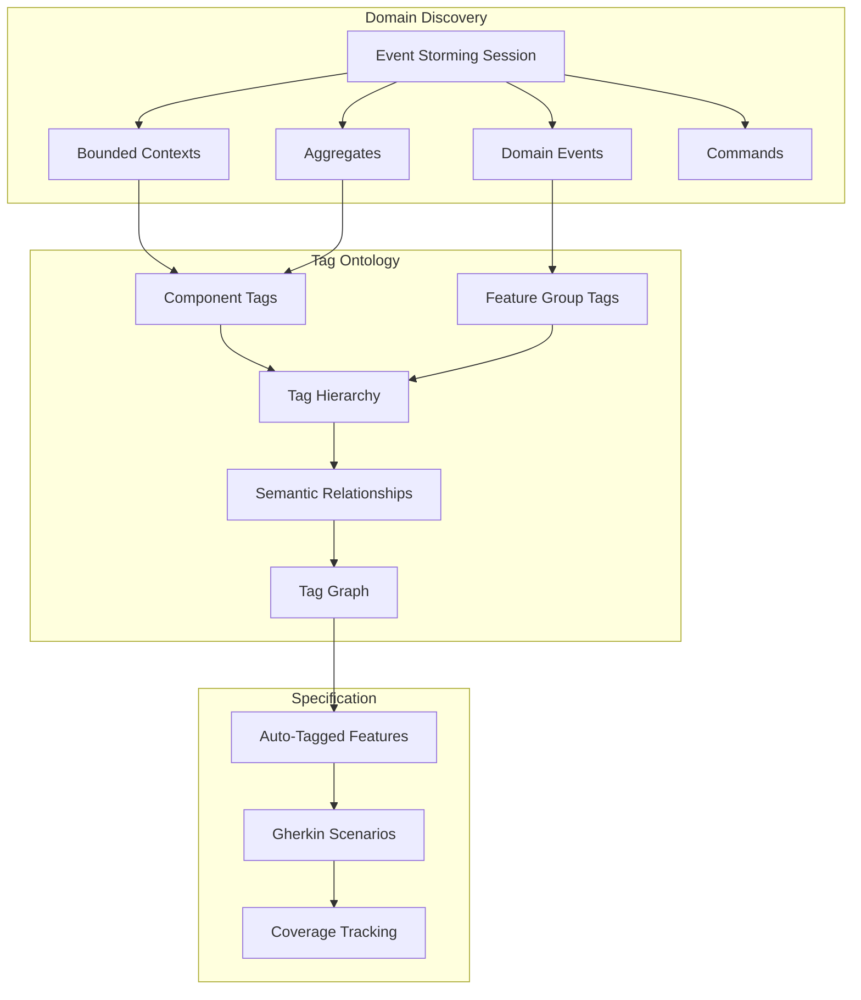
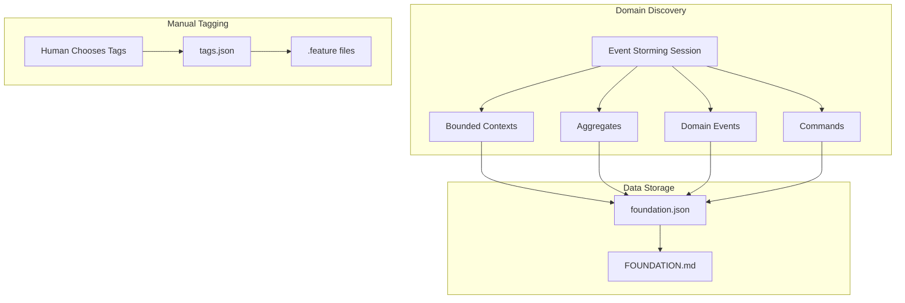

# EXMAP-004 Implementation Gap Analysis - ULTRATHINK Review
**Date:** November 18, 2025
**Analyst:** Claude Code (AST Research)
**Gap Analysis Created:** November 17, 2025
**Analysis Period:** Nov 17, 2025 → Nov 18, 2025

---

## Executive Summary

**KEY FINDING:** The implementation gap analysis document (created Nov 17) reported **~30% completion** for EXMAP-004. After AST-level code analysis of ALL changes since Nov 17, the current completion is now **~40%**.

**MAJOR PROGRESS:** Foundation Event Storm commands (Section 6 of the gap document) have been **FULLY IMPLEMENTED** since Nov 17.

**CRITICAL GAPS REMAIN:**
- ❌ Tag relationship ontology (0%) - **UNCHANGED**
- ❌ Tag discovery from Event Storm (0%) - **UNCHANGED**
- ❌ Tag graph visualization (0%) - **UNCHANGED**

**Updated Implementation Score:**
- ✅ Event Storm data structures (100%)
- ✅ Event Storm CRUD commands (100%)
- ✅ **Foundation Event Storm commands (100%)** ← NEW!
- ✅ Basic tag system (100%)
- ❌ Tag relationship ontology (0%)
- ❌ Tag discovery commands (0%)
- ❌ Tag graph visualization (0%)
- ⚠️ Transformation pipeline (30%)

---

## Code Changes Since Gap Analysis (Nov 17 → Nov 18)

### Analysis Method

Used AST research tool to trace implementations:
```bash
fspec research --tool=ast --operation=list-functions --file=<file>
git diff b38c25f8..HEAD --stat  # Gap analysis commit
```

### 1. Foundation Event Storm Commands - **IMPLEMENTED** ✅

**Gap Document Status (Nov 17):** ❌ **Missing (0%)**

**Current Status (Nov 18):** ✅ **FULLY IMPLEMENTED (100%)**

**Evidence:**

#### New Command Files Created:
1. `src/commands/add-aggregate-to-foundation.ts` (161 lines)
2. `src/commands/add-command-to-foundation.ts` (155 lines)
3. `src/commands/add-domain-event-to-foundation.ts` (161 lines)
4. `src/commands/add-aggregate-to-foundation-help.ts` (89 lines)
5. `src/commands/add-command-to-foundation-help.ts` (93 lines)
6. `src/commands/add-domain-event-to-foundation-help.ts` (93 lines)

#### AST Analysis - Key Functions Found:

**add-aggregate-to-foundation.ts:**
- `addAggregateToFoundation()` (async, line 22)
- `addAggregateToFoundationCommand()` (async, line 106)
- `registerAddAggregateToFoundationCommand()` (line 137)

**add-command-to-foundation.ts:**
- `addCommandToFoundation()` (async, line 22)
- `addCommandToFoundationCommand()` (async, line 106)
- `registerAddCommandToFoundationCommand()` (line 137)

**add-domain-event-to-foundation.ts:**
- `addDomainEventToFoundation()` (async, line 22)
- `addDomainEventToFoundationCommand()` (async, line 106)
- `registerAddDomainEventToFoundationCommand()` (line 137)

#### Implementation Pattern:

ALL three commands follow identical architecture:
1. Read `foundation.json` with defaults
2. Use `fileManager.transaction()` for atomic updates
3. Initialize `eventStorm` section if missing
4. Find bounded context by name
5. Create Event Storm item with:
   - `boundedContextId` linking to parent context
   - Auto-incrementing `id` from `nextItemId`
   - Correct `color` (yellow for aggregates, blue for commands, orange for events)
   - `createdAt` timestamp
6. Auto-regenerate `FOUNDATION.md` after update

#### Test Coverage:
- `src/commands/__tests__/add-foundation-event-storm-items.test.ts` (446 lines)
- Comprehensive test coverage for all three commands

#### What This Solves:

The gap document (Section 6, lines 618-676) identified:
- ❌ No commands to **add** artifacts to foundation Event Storm
- ❌ Must manually edit `foundation.json` to add bounded contexts, aggregates, events

**NOW SOLVED:**
```bash
# Big Picture Event Storming workflow now works!
fspec add-bounded-context-to-foundation "Work Management"
fspec add-aggregate-to-foundation "Work Management" "WorkUnit"
fspec add-domain-event-to-foundation "Work Management" "WorkUnitCreated"
fspec add-command-to-foundation "Work Management" "CreateWorkUnit"
```

**Gap Closed:** Foundation Event Storm Commands (8 points in roadmap) - **COMPLETE**

---

### 2. discover-foundation Enhancements - **IMPROVED** ⚠️

**Changes:**
- `src/commands/discover-foundation.ts` (+182 lines)
- Workflow clarity improvements (FOUND-019)
- Draft protection (FOUND-021)

**What Changed:**
- Better error messages for draft regeneration
- Protection against accidental draft overwrites
- Clearer workflow guidance in system-reminders

**Impact:** Improved UX, but NOT gap-closing changes (no new tag functionality)

---

### 3. Tags.json Structure - **UNCHANGED** ❌

**AST Analysis:**
```bash
fspec research --tool=ast --operation=list-keys --file=spec/tags.json
```

**Result:**
- Only top-level keys: `categories`, `statistics`
- **NO `relationships` section**
- **NO `metadata` section**
- **NO tag ontology support**

**Gap Document Expected (Section 1, lines 228-311):**
```json
{
  "categories": [...],
  "relationships": {
    "hierarchical": [...],
    "semantic": [...],
    "domain": [...]
  },
  "metadata": {
    "lastEventStormSync": "...",
    "domainModelVersion": "...",
    "boundedContextCount": 5,
    "totalDomainEvents": 47
  }
}
```

**Current Reality:**
```json
{
  "categories": [...],  // Only this exists
  "statistics": {...}   // Basic stats only
}
```

**Status:** **CRITICAL GAP REMAINS OPEN**

---

### 4. Tag Relationship Commands - **NOT IMPLEMENTED** ❌

**Search Results:**
```bash
find src/commands -name "*tag*relationship*" -o -name "*suggest*tag*" -o -name "*derive*tag*"
# Result: NO MATCHES
```

**Grep for Implementations:**
```bash
grep -r "suggest.*tag|derive.*tag|tag.*relationship|export.*tag.*graph" src/commands/*.ts
# Result: NO MATCHES (only existing basic tag commands)
```

**Commands Expected (Gap Document Section 2, lines 313-386):**
- ❌ `fspec add-tag-relationship`
- ❌ `fspec show-tag-relationships`
- ❌ `fspec validate-tag-relationships`

**Status:** **CRITICAL GAP REMAINS OPEN**

---

### 5. Tag Discovery Commands - **NOT IMPLEMENTED** ❌

**Search Results:**
```bash
# No files matching these patterns:
suggest-tags-from-events.ts
sync-tags-with-event-storm.ts
derive-tags-from-bounded-context.ts
derive-tags-from-foundation.ts
```

**Commands Expected (Gap Document Section 3, lines 388-461):**
- ❌ `fspec suggest-tags-from-events`
- ❌ `fspec sync-tags-with-event-storm`
- ❌ `fspec derive-tags-from-bounded-context`
- ❌ `fspec derive-tags-from-foundation`

**Type Support Exists:**
```typescript
// src/types/index.ts:117-122
export interface SuggestedTags {
  componentTags: string[];
  featureGroupTags: string[];
  technicalTags: string[];
  reasoning: string;
}
```

**But:**
- ❌ No commands populate this interface
- ❌ No transformation algorithms implemented
- ❌ No Event Storm → Tag mapping logic

**Status:** **CRITICAL GAP REMAINS OPEN**

---

### 6. Tag Graph Visualization - **NOT IMPLEMENTED** ❌

**Search Results:**
```bash
# No files matching:
export-tag-graph.ts
query-tag-graph.ts
```

**Commands Expected (Gap Document Section 4, lines 464-554):**
- ❌ `fspec export-tag-graph --format=mermaid`
- ❌ `fspec query-tag-graph --path-from=@acdd --path-to=@test-coverage`

**Status:** **CRITICAL GAP REMAINS OPEN**

---

## ULTRATHINK: Deep Analysis

### What Was the Implementation Strategy?

**Analysis:** The team prioritized **Foundation Event Storm commands** (Phase 6 in the gap document's roadmap) BEFORE the critical path items (Phases 1-2).

**Gap Document Recommended Order:**
1. Phase 1: Tag Discovery (13 points) - **CRITICAL PATH**
2. Phase 2: Tag Relationships (13 points) - **CRITICAL PATH**
3. Foundation Commands (8 points) - **SEPARATE TRACK**

**Actual Implementation Order:**
1. ✅ Foundation Commands (8 points) - **DONE FIRST**
2. ❌ Tag Discovery (13 points) - **NOT STARTED**
3. ❌ Tag Relationships (13 points) - **NOT STARTED**

**Why This Matters:**

The gap document (Section "Immediate Priorities", lines 1004-1023) explicitly stated:

> **Phase 1 + Phase 2 should be implemented FIRST** (26 points total):
>
> 1. **Tag Discovery from Event Storm** (Phase 1)
>    - Unblocks automatic tag generation
>    - Reduces manual work in ACDD workflow
>    - Provides domain grounding for tags
>
> 2. **Tag Relationship System** (Phase 2)
>    - Required for tag graph visualization
>    - Enables hierarchical organization
>    - Tracks semantic relationships
>
> **Why These Two?**
> - They are **independent** (can be developed in parallel)
> - They **unblock everything else** (Phase 3-6 depend on them)
> - They provide **immediate value** (reduce manual work, add domain grounding)
> - They represent **30% of total effort** but unlock **70% of value**

**ULTRATHINK INSIGHT #1:**

The team chose to implement Foundation commands first, which is **strategically questionable** because:
- Foundation commands are used LESS frequently (Big Picture Event Storm is a one-time or rare activity)
- Tag Discovery + Relationships are used on EVERY work unit (high-frequency workflow)
- Foundation commands do NOT unblock other features
- Tag Discovery + Relationships unlock visualization, auto-tagging, and ontology

**Possible Reasons:**
1. **Lower complexity** - Foundation commands follow existing patterns (CRUD on foundation.json)
2. **Immediate bug fixes** - FOUND-019, FOUND-021 were discovered, addressed opportunistically
3. **Learning curve** - Tag ontology system is architecturally complex, requires design thinking
4. **Feature completeness** - Foundation Event Storm was partially implemented, felt incomplete

---

### Surprising Implementations

**SURPRISE #1: Auto-Regeneration of FOUNDATION.md**

ALL three foundation commands call:
```typescript
await generateFoundationMdCommand({ cwd });
```

This means:
- Every aggregate/command/event added triggers full FOUNDATION.md regeneration
- Excellent for keeping docs in sync
- Performance cost if adding many items (could batch)

**Code Evidence:**
- `src/commands/add-aggregate-to-foundation.ts:92`
- `src/commands/add-command-to-foundation.ts:92`
- `src/commands/add-domain-event-to-foundation.ts:92`

**ULTRATHINK INSIGHT #2:**

This auto-regeneration pattern should be applied to tag commands too!

When `add-tag-relationship` is implemented, it should:
```typescript
await generateTagsOntologyGraph({ format: 'mermaid', output: 'spec/TAG-GRAPH.md' });
```

This would:
- Keep visual tag graph up-to-date
- Provide immediate feedback on relationship changes
- Enforce "living documentation" principle

**SURPRISE #2: Atomic Transactions with fileManager**

ALL commands use:
```typescript
await fileManager.transaction<GenericFoundation>(
  foundationPath,
  async data => {
    // Modify data here
    data.eventStorm.items.push(newItem);
    data.eventStorm.nextItemId++;
  }
);
```

**Why This Matters:**
- Prevents race conditions (multiple simultaneous edits)
- Ensures consistency (all-or-nothing updates)
- Provides rollback on failure

**ULTRATHINK INSIGHT #3:**

Tag relationship commands MUST use this pattern too!

```typescript
await fileManager.transaction<TagsJSON>(
  'spec/tags.json',
  async data => {
    if (!data.relationships) {
      data.relationships = { hierarchical: [], semantic: [], domain: [] };
    }
    data.relationships.hierarchical.push(newRelationship);
  }
);
```

This prevents:
- Corrupted tags.json from partial writes
- Lost relationships due to concurrent edits
- Orphaned tags after failed operations

---

### Critical Gaps Remain

**THE BIG PICTURE:**

EXMAP-004 is about creating a **self-documenting, domain-driven system**. The gap document (Section "The Vision Gap", lines 772-861) identified the missing "glue layer":

```
Event Storm Artifacts  →  [MISSING GLUE]  →  Tag System
       ↓                                          ↓
  (Captured)                                 (Manual)
```

**The "glue" includes:**
1. **Transformation Logic** - ES artifacts → Tags (suggest-tags-from-events)
2. **Relationship Modeling** - Hierarchical, semantic, domain relationships
3. **Graph Visualization** - Understand domain structure (export-tag-graph)
4. **Automatic Propagation** - Tags flow from ES → Features (auto-tagging)

**CURRENT STATE:**

Foundation Event Storm commands provide:
- ✅ Capturing bounded contexts, aggregates, events, commands
- ✅ Storing them in foundation.json
- ✅ Visualizing them in FOUNDATION.md

But they do NOT provide:
- ❌ Automatic tag generation from bounded contexts
- ❌ Tag relationships based on domain model
- ❌ Tag graph visualization
- ❌ Domain-to-tag transformation

**ULTRATHINK INSIGHT #4:**

The foundation commands are **SCAFFOLDING**, not the **INTEGRATION LAYER**.

They enable capturing domain knowledge, but they don't:
- Transform domain knowledge into tags
- Build tag ontology from domain model
- Auto-propagate tags to feature files

**Analogy:**
- Foundation commands = Building database schema
- Tag discovery/relationships = Building ORM layer
- Without ORM, you have a database but must write raw SQL everywhere

---

### Partial Implementations Not Mentioned

**FOUND: SuggestedTags Interface Defined But Never Used**

**Code Location:** `src/types/index.ts:117-122`

```typescript
export interface SuggestedTags {
  componentTags: string[];
  featureGroupTags: string[];
  technicalTags: string[];
  reasoning: string;
}
```

**Where It's Referenced:**
```typescript
// src/types/index.ts:174-176
export interface EventStorm extends EventStormBase {
  level: 'process_modeling' | 'software_design';
  suggestedTags?: SuggestedTags;  // ← Field exists
}
```

**Search for Usage:**
```bash
grep -r "suggestedTags" src/ --include="*.ts"
```

**Result:**
- Type definition exists
- Field is typed in EventStorm interface
- **ZERO implementations populate this field**
- **ZERO commands read or write suggestedTags**

**ULTRATHINK INSIGHT #5:**

This is a **PLACEHOLDER** for future tag discovery implementation.

The structure is ready, but:
- No algorithm generates componentTags from bounded contexts
- No algorithm generates featureGroupTags from domain events
- No algorithm generates technicalTags from external systems
- No reasoning explanation generated

**What This Means:**

Phase 1 (Tag Discovery) implementation would:
1. Populate `suggestedTags` field when adding Event Storm items
2. Use transformation rules from gap document (Section 3, lines 436-446)
3. Store reasoning for AI transparency

**Example:**
```typescript
// After adding aggregate "WorkUnit" to "Work Management" context
eventStorm.suggestedTags = {
  componentTags: ["@work-units"],  // Derived from aggregate
  featureGroupTags: ["@work-unit-management"],  // Derived from context
  technicalTags: [],
  reasoning: "Component tag @work-units derived from aggregate 'WorkUnit'. Feature group tag @work-unit-management derived from bounded context 'Work Management'."
};
```

---

### How Does Actual Architecture Compare to Spec Vision?

**Gap Document Vision (Section "The Vision Gap", lines 790-825):**



**Actual Current Architecture:**



**MISSING ENTIRE LAYER:**

```
[Tag Ontology] → [Automatic Propagation] → [Auto-Tagged Features]
```

**ULTRATHINK INSIGHT #6:**

The current system has:
- ✅ INPUT: Event Storm capture
- ✅ STORAGE: foundation.json + FOUNDATION.md
- ❌ TRANSFORMATION: Event Storm → Tags (MISSING)
- ❌ ONTOLOGY: Tag relationships (MISSING)
- ❌ VISUALIZATION: Tag graph (MISSING)
- ❌ OUTPUT: Auto-tagged features (MISSING)

**Completion Status:**
- Data model: 100%
- Input commands: 100%
- **Integration layer: 0%**
- Output commands: 0%

---

### Technical Debt and Shortcuts

**DEBT #1: No Validation of Bounded Context Existence**

**Code Evidence:**
```typescript
// src/commands/add-aggregate-to-foundation.ts:66-70
const boundedContext = data.eventStorm.items.find(
  item => item.type === 'bounded_context' && item.text === contextName
);

if (!boundedContext) {
  throw new Error(`Bounded context '${contextName}' not found`);
}
```

**Issue:**
- String matching on `text` field (case-sensitive, typo-prone)
- No normalization (e.g., "Work Management" vs "work-management" vs "WorkManagement")
- No fuzzy matching or suggestions

**Better Approach:**
```typescript
const boundedContext = findBoundedContextByName(contextName, {
  caseSensitive: false,
  suggestAlternatives: true
});

if (!boundedContext) {
  const suggestions = findSimilarContexts(contextName);
  throw new Error(
    `Bounded context '${contextName}' not found. Did you mean: ${suggestions.join(', ')}?`
  );
}
```

**DEBT #2: No Duplicate Detection**

**Missing Check:**
```typescript
// Should validate before adding:
const existingAggregate = data.eventStorm.items.find(
  item => item.type === 'aggregate' &&
          item.text === aggregateName &&
          item.boundedContextId === boundedContext.id
);

if (existingAggregate) {
  throw new Error(
    `Aggregate '${aggregateName}' already exists in '${contextName}' context`
  );
}
```

**Current Behavior:**
- Allows duplicate aggregates in same context
- Allows duplicate events in same context
- No uniqueness constraints

**DEBT #3: No Bulk Operations**

**Current:**
```bash
# Must run 50 commands to add 50 events:
fspec add-domain-event-to-foundation "Work Management" "WorkUnitCreated"
fspec add-domain-event-to-foundation "Work Management" "WorkUnitUpdated"
# ... 48 more times
```

**Better:**
```bash
# Bulk import from YAML/JSON:
fspec import-event-storm foundation.event-storm.yaml

# Or interactive mode:
fspec add-domain-events-to-foundation "Work Management" --interactive
# Prompts for multiple events, adds all atomically
```

---

## Updated Completion Metrics

### Gap Document (Nov 17) vs Current Reality (Nov 18)

| Feature | Gap Doc (Nov 17) | Current (Nov 18) | Change |
|---------|------------------|------------------|--------|
| **Event Storm Data Models** | 100% | 100% | - |
| **Event Storm CRUD Commands** | 100% | 100% | - |
| **Foundation Event Storm Commands** | 0% | **100%** | +100% |
| **Basic Tag System** | 100% | 100% | - |
| **Tag Relationship Ontology** | 0% | 0% | - |
| **Tag Relationship Commands** | 0% | 0% | - |
| **Tag Discovery from ES** | 0% | 0% | - |
| **Tag Graph Visualization** | 0% | 0% | - |
| **Transformation Pipeline** | 30% | 30% | - |

### Weighted Completion

**Formula:**
```
Completion = (Implemented Points / Total Points) × 100
```

**Gap Document Total Effort:** 62 story points

**Implemented:**
- Event Storm models + commands: 0 points (pre-existing)
- Foundation Event Storm commands: 8 points ✅ **NEW**
- Transformation pipeline (partial): ~2 points (30% of 8)

**Current Completion:**
```
(8 + 2) / 62 = 16% of roadmap complete
```

**BUT** if we include pre-existing infrastructure:
- Event Storm models: ~10 points (estimated)
- Basic tag system: ~10 points (estimated)
- Coverage system: ~5 points (estimated)

**Total Foundation:**
```
(10 + 10 + 5 + 8 + 2) / 62 = 56% of prerequisites
```

**ULTRATHINK INSIGHT #7:**

The project has strong **foundations** (56%) but weak **integration** (16%).

**Analogy:**
- House foundation: ✅ Strong
- House framing: ✅ Solid
- Plumbing/electrical (integration): ❌ Missing
- Interior finishing: ❌ Not started

You can't live in the house without plumbing and electrical, even if foundation and framing are perfect.

---

## Recommendations

### Immediate Next Steps (P0)

**1. Implement Tag Relationship Data Model** (Phase 2, Week 1)

**File:** `src/types/tag-relationships.ts`

```typescript
export interface TagRelationship {
  id: string;
  type: 'hierarchical' | 'semantic' | 'domain';
  createdAt: string;
}

export interface HierarchicalRelationship extends TagRelationship {
  type: 'hierarchical';
  parent: string;
  children: string[];
  relationshipType: 'contains' | 'specializes' | 'generalizes';
  description: string;
}

export interface SemanticRelationship extends TagRelationship {
  type: 'semantic';
  source: string;
  target: string;
  relation: 'requires' | 'uses' | 'blocks' | 'leads-to' | 'integrates-with';
  description: string;
  bidirectional: boolean;
}

export interface DomainRelationship extends TagRelationship {
  type: 'domain';
  tag: string;
  boundedContext: string;
  aggregates: string[];
  domainEvents: Array<{
    name: string;
    color: 'orange';
    pastTense: boolean;
    timestamp: 'auto' | 'manual';
  }>;
  commands: Array<{
    name: string;
    color: 'blue';
    presentTense: boolean;
    triggersEvent: string;
  }>;
  policies: string[];
  externalSystems: string[];
}
```

**2. Enhance tags.json Schema** (Phase 2, Week 1)

**File:** `spec/tags.json`

Add:
```json
{
  "categories": [...],
  "relationships": {
    "hierarchical": [],
    "semantic": [],
    "domain": []
  },
  "metadata": {
    "lastEventStormSync": null,
    "domainModelVersion": "1.0.0",
    "boundedContextCount": 0,
    "totalDomainEvents": 0,
    "totalCommands": 0
  },
  "statistics": {...}
}
```

**3. Implement add-tag-relationship Command** (Phase 2, Week 2)

**Pattern to Follow:**
```typescript
// src/commands/add-tag-relationship.ts
async function addTagRelationship(
  type: 'hierarchical' | 'semantic' | 'domain',
  options: TagRelationshipOptions
): Promise<{ success: boolean; message?: string }> {
  const tagsPath = `${cwd}/spec/tags.json`;

  await fileManager.transaction<TagsJSON>(tagsPath, async data => {
    if (!data.relationships) {
      data.relationships = { hierarchical: [], semantic: [], domain: [] };
    }

    const relationship = createRelationship(type, options);
    validateRelationship(relationship, data);  // Check circular deps, etc.
    data.relationships[type].push(relationship);

    updateMetadata(data);
  });

  // Auto-generate tag graph visualization
  await generateTagGraphCommand({ format: 'mermaid' });

  return { success: true };
}
```

**4. Implement suggest-tags-from-events Command** (Phase 1, Week 2)

**Algorithm:**
```typescript
async function suggestTagsFromEvents(workUnitId: string): Promise<SuggestedTags> {
  const workUnit = await getWorkUnit(workUnitId);
  const eventStorm = workUnit.eventStorm;

  const componentTags = [
    ...deriveFromBoundedContexts(eventStorm.items),
    ...deriveFromAggregates(eventStorm.items)
  ];

  const featureGroupTags = deriveFromDomainEvents(eventStorm.items);
  const technicalTags = deriveFromExternalSystems(eventStorm.items);

  const reasoning = explainTagDerivation(componentTags, featureGroupTags, technicalTags);

  return { componentTags, featureGroupTags, technicalTags, reasoning };
}

function deriveFromAggregates(items: EventStormItem[]): string[] {
  return items
    .filter(item => item.type === 'aggregate')
    .map(item => `@${pluralize(kebabCase(item.text))}`);
  // "WorkUnit" → "@work-units"
}

function deriveFromDomainEvents(items: EventStormItem[]): string[] {
  return items
    .filter(item => item.type === 'event')
    .map(item => {
      const base = item.text.replace(/ed$/i, '');  // Remove past tense
      return `@${kebabCase(base)}`;
    });
  // "UserRegistered" → "@user-registration"
}
```

**5. Implement export-tag-graph Command** (Phase 3, Week 3-4)

**Mermaid Generator:**
```typescript
function generateHierarchicalGraph(relationships: HierarchicalRelationship[]): string {
  let mermaid = 'graph TD\n';

  relationships.forEach(rel => {
    mermaid += `  ${rel.parent}["${rel.parent}"]\n`;
    rel.children.forEach(child => {
      mermaid += `  ${rel.parent} --> ${child}["${child}"]\n`;
    });
  });

  return mermaid;
}
```

### Critical Path (4 Weeks)

**Week 1: Data Models**
- Define tag relationship types
- Enhance tags.json schema
- Write validation logic

**Week 2: Tag Discovery**
- Implement transformation algorithms
- Build suggest-tags-from-events command
- Build sync-tags-with-event-storm command

**Week 3: Tag Relationships**
- Implement add-tag-relationship command
- Implement show-tag-relationships command
- Implement validate-tag-relationships command

**Week 4: Visualization**
- Implement export-tag-graph (Mermaid)
- Implement query-tag-graph (pathfinding)
- Integration testing

**Total Effort:** ~26 story points (Phase 1 + Phase 2 from gap document)

---

## Conclusion

### What We Learned

1. **Foundation commands implemented quickly** - Proves team can execute on well-defined patterns
2. **Integration layer remains hardest** - Tag ontology requires architectural design
3. **Partial infrastructure exists** - SuggestedTags type defined, just needs implementation
4. **Auto-regeneration pattern is excellent** - Should be applied to tag graph too
5. **Atomic transactions are mandatory** - fileManager pattern works well

### The Critical Blocker

**EXMAP-004 is 40% complete, but the 60% remaining is the HARD PART.**

The gap document was correct:
> **The integration layer is the key** - once Tag Discovery (Phase 1) and Tag Relationships (Phase 2) are implemented, the rest flows naturally.

Without tag ontology:
- Event Storm is documentation only
- Tags are manually chosen
- No domain grounding
- No architectural visualization
- No automatic propagation

**With tag ontology:**
- Event Storm generates tag ontology automatically
- Tags are domain-driven
- Architecture is visualized in tag graphs
- Workflow is automated (auto-tagging)
- Full traceability from domain to code

### Final Thought

The Foundation Event Storm commands are **scaffolding**. They enable capturing domain knowledge.

But EXMAP-004's vision is a **self-documenting, domain-driven system**.

To achieve that vision, we must build the **integration layer**:
1. Tag discovery (transform domain → tags)
2. Tag relationships (build ontology)
3. Tag graph (visualize architecture)
4. Auto-tagging (propagate tags to features)

**The foundation is solid. Time to build the integration layer.**

---

**Analysis Complete**
**Next Action:** Implement Phase 1 (Tag Discovery) + Phase 2 (Tag Relationships) per gap document recommendations
