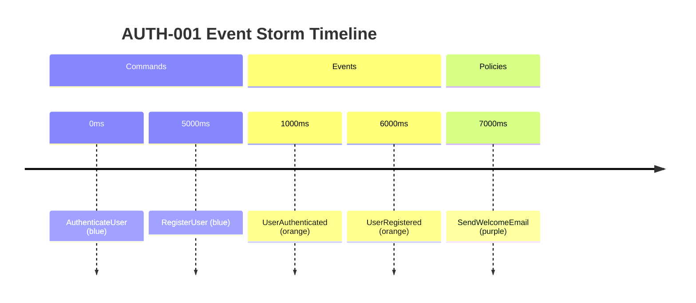
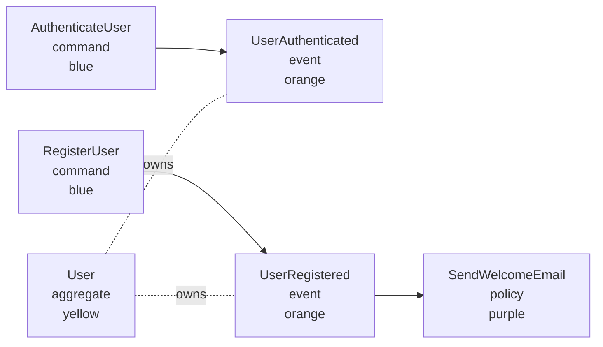

# Event Storm Workflow Gaps and Enhancement Recommendations

**Date**: 2025-11-16
**Author**: AI Analysis (Claude Code)
**Context**: Comprehensive review of completed EXMAP cards (EXMAP-001, 002, 005, 006, 007, 010, 011, 012)
**Goal**: Identify gaps and recommend enhancements to improve Event Storm → Example Mapping → Feature Files → ACDD workflow

---

## Executive Summary

The Event Storm system across 9 completed EXMAP cards forms a **coherent, well-designed system** that successfully achieves its goal of informing Example Mapping, story attachments, and the ACDD workflow. However, 5 minor gaps were identified that, if addressed, would significantly improve automation, visualization, and data integrity.

**Overall Assessment**: 9/10 (Production-ready with enhancement opportunities)

---

## Current Workflow Architecture

### Two-Level Hierarchy

1. **Foundation-Level (Strategic)**
   - Purpose: Big Picture Event Storming for domain understanding
   - Storage: `foundation.json`
   - Level: `big_picture`
   - Artifacts: Bounded contexts, major aggregates, pivotal events
   - Cards: EXMAP-010, EXMAP-012

2. **Work Unit-Level (Tactical)**
   - Purpose: Process/Design Event Storming for specific stories
   - Storage: `work-units.json`
   - Levels: `process_modeling` or `software_design`
   - Artifacts: All 7 types (events, commands, aggregates, policies, hotspots, external systems, bounded contexts)
   - Cards: EXMAP-005, EXMAP-006, EXMAP-007, EXMAP-011

### Integration Flow

```
Foundation Event Storm (Strategic)
    ↓
Work Unit Event Storm (Tactical)
    ↓
Tag Suggestion (from Event Storm artifacts)
    ↓
Example Mapping (rules, examples, questions)
    ↓
Feature File Generation (with context comments)
    ↓
ACDD Workflow (Testing → Implementing → Validating → Done)
```

---

## Gap 1: Missing Auto-Generation of Example Mapping from Event Storm

### Problem
Currently, AI agents must manually read Event Storm JSON via `show-event-storm` and manually create Example Mapping entries using `add-rule` and `add-example`. This is a manual, error-prone process that doesn't leverage the rich domain knowledge already captured in Event Storm artifacts.

### Impact
- **Medium**: Reduces automation potential
- AI agents do extra work translating Event Storm → Example Mapping
- Risk of missing important rules derivable from policies
- Inconsistent quality of Example Mapping

### Recommendation

**New Command**: `fspec generate-example-mapping-from-event-storm <work-unit-id>`

**Behavior**:
1. Read `eventStorm.items` from work unit
2. Analyze Event Storm artifacts:
   - **Policies** (when/then) → Business rules
     - Example: Policy "when UserRegistered then SendWelcomeEmail" → Rule "System must send welcome email after user registration"
   - **Hotspots** (concerns) → Questions
     - Example: Hotspot "Unclear password reset timeout" → Question "@human: What should password reset token timeout be?"
   - **Domain Events** → Examples
     - Example: Event "UserAuthenticated" → Example "User enters valid credentials and is logged in"
   - **External Systems** → Technical considerations (assumptions or rules)
     - Example: External System "OAuth2Provider" → Assumption "OAuth2 authentication handled externally"
3. Create Example Mapping entries automatically:
   - `fspec add-rule <work-unit-id> <derived-rule>`
   - `fspec add-example <work-unit-id> <derived-example>`
   - `fspec add-question <work-unit-id> <derived-question>`
4. Output summary of what was generated

**Example Usage**:
```bash
$ fspec generate-example-mapping-from-event-storm AUTH-001

Analyzing Event Storm artifacts...
  - 5 domain events
  - 3 commands
  - 2 policies
  - 1 hotspot
  - 1 external system

Generated Example Mapping:

Rules (2):
  ✓ System must send welcome email after user registration (from policy)
  ✓ Password must be validated before authentication (from aggregate responsibility)

Examples (5):
  ✓ User enters valid credentials and is logged in (from UserAuthenticated event)
  ✓ User registers and receives welcome email (from UserRegistered event)
  ✓ Invalid password triggers authentication failure (from AuthenticationFailed event)
  ...

Questions (1):
  ✓ @human: What should password reset token timeout be? (from hotspot)

Run 'fspec generate-scenarios AUTH-001' to create feature file.
```

**Benefits**:
- Reduces manual work for AI agents
- Ensures Event Storm knowledge flows to Example Mapping
- Consistent quality of derived rules/examples
- Pre-populates Example Mapping with domain-driven starting point

**Acceptance Criteria**:
- Policies with when/then generate business rules
- Domain events generate scenario examples
- Hotspots generate questions
- Command accepts `--dry-run` flag to preview without creating
- System-reminder guides AI to review and refine generated items

---

## Gap 2: No Diagram Generation from Event Storm

### Problem
Event Storm data is stored as JSON but never visualized. The `color` field (orange/blue/yellow/purple/red/pink) and `timestamp` field exist but aren't used to generate diagrams. Human developers and AI agents benefit from visual representations of domain structure.

### Impact
- **Low-Medium**: Reduces comprehension
- Event Storm data is "dark" - exists but not visible
- Misses opportunity to attach visual artifacts to work units
- Timeline visualization (using `timestamp` field) not utilized

### Recommendation

**New Command**: `fspec add-event-storm-diagram <work-unit-id> [--type=timeline|flow]`

**Behavior**:
1. Read `eventStorm.items` from work unit
2. Generate Mermaid diagram based on type:
   - **Timeline** (default): Uses `timestamp` field to show temporal flow
   - **Flow**: Shows command → event → policy relationships using `triggersEvent` and `relatedTo`
3. Render diagram as PNG using `mermaid-cli` or server-side rendering
4. Attach diagram to work unit: `spec/attachments/<work-unit-id>/event-storm-<type>.png`
5. Use color codes in diagram matching Event Storming convention

**Example Timeline Diagram** (Mermaid):


**Example Flow Diagram** (Mermaid):


**Benefits**:
- Visual representation aids comprehension
- Attachments become part of work unit documentation
- Timeline visualization uses existing `timestamp` field
- Git diffs show diagram changes alongside code changes
- Human reviewers can quickly understand domain structure

**Acceptance Criteria**:
- Timeline diagram uses `timestamp` field for ordering
- Flow diagram uses `relatedTo` and `triggersEvent` for connections
- Colors match Event Storming convention (orange/blue/yellow/purple/red/pink)
- Diagram attached to work unit automatically
- Command validates Mermaid syntax before attachment
- Existing diagrams can be regenerated (overwrite with confirmation)

---

## Gap 3: No Relationship Validation

### Problem
Event Storm items have relationship fields (`relatedTo` array, `triggersEvent` integer) but no validation ensures referenced IDs actually exist. This can lead to:
- Broken references (command with `triggersEvent=99` but event ID 99 doesn't exist)
- Orphaned relationships (item deleted but still referenced)
- Inconsistent bidirectional links (command points to event but event doesn't point back)

### Impact
- **Medium**: Data integrity risk
- Broken references confuse AI agents analyzing Event Storm
- Relationship queries fail silently
- Manual cleanup required to fix broken links

### Recommendation

**Schema Validation Enhancement**: Add JSON Schema validation for relationships

**Implementation**:
1. **On Add Commands** (add-domain-event, add-command, etc.):
   - If `--triggers-event=<id>` flag provided, validate event ID exists
   - If `--related-to=<id1,id2>` flag provided, validate all IDs exist
   - Reject command if validation fails

2. **On Delete** (soft-delete):
   - Check if deleted item is referenced by other items
   - Warn user: "Item ID 5 is referenced by 3 other items. Delete anyway? (y/n)"
   - Optionally auto-remove references with `--cascade` flag

3. **Validation Command**: `fspec validate-event-storm <work-unit-id>`
   - Scans all items for broken references
   - Reports:
     - Orphaned `triggersEvent` references
     - Invalid IDs in `relatedTo` arrays
     - Unidirectional relationships (command → event but not event → command)
   - Suggests fixes

**Example Output**:
```bash
$ fspec validate-event-storm AUTH-001

Validating Event Storm relationships...

✗ 3 issue(s) found:

1. Command ID 2 has triggersEvent=99 but event ID 99 does not exist
   Fix: Remove triggersEvent field or correct ID

2. Event ID 5 is deleted but still referenced by:
   - Command ID 3 (triggersEvent)
   - Policy ID 7 (relatedTo)
   Fix: Remove references or restore event ID 5

3. Command ID 2 points to Event ID 1 but Event ID 1 does not point back
   Fix: Add ID 2 to Event ID 1's relatedTo array

Run 'fspec fix-event-storm-relationships AUTH-001' to auto-fix.
```

**Benefits**:
- Data integrity guaranteed
- AI agents can trust relationship data
- Early detection of modeling errors
- Automated fix suggestions reduce manual cleanup

**Acceptance Criteria**:
- Add commands validate IDs before creating relationships
- Delete operations warn about references
- Validation command detects all relationship errors
- Auto-fix command available for common issues
- JSON Schema enforces relationship constraints

---

## Gap 4: No Bounded Context Filtering

### Problem
Event Storm items have optional `boundedContext` field (EXMAP-006 Rule 4) but no commands to:
- Show all items in a specific bounded context
- Validate bounded context names match foundation-level bounded contexts
- Move items between bounded contexts
- Query cross-bounded-context relationships

This limits the utility of bounded contexts as an organizational tool.

### Impact
- **Low**: Reduces queryability
- AI agents can't easily filter Event Storm by bounded context
- No validation that work unit bounded contexts align with foundation
- Can't detect cross-context dependencies (potential integration points)

### Recommendation

**Enhancement 1**: Add `--bounded-context` filter to existing commands

**Commands to Enhance**:
- `fspec show-event-storm <work-unit-id> --bounded-context="User Management"`
  - Shows only items within specified bounded context
- `fspec show-foundation-event-storm --bounded-context="User Management"`
  - Shows foundation-level items in bounded context

**Enhancement 2**: New command for bounded context management

**New Command**: `fspec validate-bounded-contexts <work-unit-id>`

**Behavior**:
1. Read work unit Event Storm items
2. Extract unique `boundedContext` values
3. Check if each matches a bounded context in foundation Event Storm
4. Report:
   - Matched contexts (valid)
   - Unmatched contexts (typos or missing in foundation)
   - Items without bounded context assignment
   - Cross-context references (integration points)

**Example Output**:
```bash
$ fspec validate-bounded-contexts AUTH-001

Bounded Context Validation:

✓ User Management (5 items, matches foundation)
✓ Authentication (3 items, matches foundation)
✗ "Session Managment" (2 items, NOT in foundation - typo?)
  Did you mean "Session Management"?

⚠ 4 items have no bounded context assigned:
  - Event ID 3: UserAuthenticated
  - Command ID 5: RefreshSession
  ...

Cross-Context Dependencies:
  - Command "AuthenticateUser" (Authentication) → Event "SessionCreated" (Session Management)
  - Policy "ExpireSession" (Session Management) → Event "UserLoggedOut" (Authentication)

Run 'fspec fix-bounded-contexts AUTH-001' to auto-correct typos.
```

**Benefits**:
- Better organization of Event Storm artifacts
- Alignment between work unit and foundation bounded contexts
- Detection of typos and inconsistencies
- Identification of integration points across contexts
- Easier querying and filtering

**Acceptance Criteria**:
- Show commands accept `--bounded-context` filter
- Validation detects mismatches with foundation
- Cross-context dependency detection
- Auto-fix for common typos (fuzzy matching)
- Items can be moved between bounded contexts

---

## Gap 5: Event Storm Data Not Flowing to Feature File Architecture Notes

### Problem
When `generate-scenarios` creates a feature file, architecture notes in the doc string (""") are manually written or left as placeholders. Event Storm data (bounded contexts, aggregates, external systems) could automatically populate architecture notes, providing immediate context.

### Impact
- **Low-Medium**: Reduces automation
- AI agents must manually write architecture notes
- Event Storm knowledge not visible in feature files
- Duplicate work documenting domain structure

### Recommendation

**Enhancement**: Auto-generate architecture notes from Event Storm

**Behavior**: When running `fspec generate-scenarios <work-unit-id>`:
1. Read Event Storm data from work unit
2. Extract key architectural elements:
   - Bounded contexts
   - Aggregates (with responsibilities)
   - External systems (with integration types)
   - Key domain events
3. Generate architecture notes doc string
4. Include in feature file below Example Mapping comments

**Example Generated Architecture Notes**:
```gherkin
@authentication
@user-management
@EXMAP-013
Feature: User Authentication

  """
  Architecture notes (auto-generated from Event Storm):

  Domain Structure:
  - Bounded Context: User Management
  - Aggregates:
    - User (Responsibilities: Authentication, Profile management)
    - Session (Responsibilities: Token generation, Session lifecycle)
  - External Systems:
    - OAuth2Provider (REST_API)
    - EmailService (MESSAGE_QUEUE)

  Key Domain Events:
  - UserAuthenticated
  - UserRegistered
  - SessionCreated
  - PasswordResetRequested

  Integration Points:
  - OAuth2Provider for external authentication
  - EmailService for welcome emails and notifications

  Note: Architecture notes derived from Event Storm artifacts.
  Manually refine as needed.
  """

  # ========================================
  # EXAMPLE MAPPING CONTEXT
  # ========================================
  ...
```

**Benefits**:
- Automatic documentation of domain structure
- Event Storm knowledge visible in feature files
- Reduces manual work for AI agents
- Consistent architecture note format
- Encourages Event Storm use by showing value

**Acceptance Criteria**:
- Architecture notes generated from Event Storm when present
- Manual refinement still possible (AI can edit doc string)
- Notes include bounded contexts, aggregates, external systems, key events
- Format is consistent and readable
- Option to disable auto-generation via `--no-architecture-notes` flag

---

## Implementation Priority

Based on impact and effort:

| Gap | Priority | Effort | Impact | ROI |
|-----|----------|--------|--------|-----|
| Gap 1: Auto-generate Example Mapping | **High** | Medium | Medium | High |
| Gap 3: Relationship Validation | **High** | Medium | Medium | High |
| Gap 2: Diagram Generation | **Medium** | High | Low-Medium | Medium |
| Gap 5: Architecture Notes Auto-gen | **Medium** | Low | Low-Medium | High |
| Gap 4: Bounded Context Filtering | **Low** | Low | Low | Medium |

**Recommended Implementation Order**:
1. **Gap 3**: Relationship Validation (protects data integrity)
2. **Gap 1**: Auto-generate Example Mapping (highest workflow impact)
3. **Gap 5**: Architecture Notes Auto-gen (low effort, high value)
4. **Gap 4**: Bounded Context Filtering (incremental improvement)
5. **Gap 2**: Diagram Generation (nice-to-have, high effort)

---

## Success Metrics

After implementing these enhancements, measure success by:

1. **Automation Rate**: % of Example Mapping entries auto-generated from Event Storm
2. **Data Integrity**: % of Event Storm work units with zero relationship validation errors
3. **Diagram Adoption**: % of work units with attached Event Storm diagrams
4. **Architecture Documentation**: % of feature files with auto-generated architecture notes
5. **AI Agent Efficiency**: Time saved per work unit (measured via AI agent session logs)

---

## Conclusion

The Event Storm workflow (EXMAP-001, 002, 005, 006, 007, 010, 011, 012) is **architecturally sound and production-ready**. These 5 minor gaps represent enhancement opportunities, not critical failures. Addressing them will:

- **Increase automation** (Gap 1, Gap 5)
- **Improve data integrity** (Gap 3)
- **Enhance visualization** (Gap 2)
- **Better organization** (Gap 4)

**Overall Assessment**: The system achieves its goal of informing Example Mapping, story attachments, and the ACDD workflow. With these enhancements, it would be exceptional.

---

## Appendix: Related Work Units

- **EXMAP-001**: Redesign Example Mapping to match BDD technique
- **EXMAP-002**: Preserve example mapping context as comments in generated feature files
- **EXMAP-005**: Event Storm data model for work units
- **EXMAP-006**: Event Storm artifact commands (events, commands, aggregates)
- **EXMAP-007**: Event Storm artifact commands (policies, hotspots, external systems)
- **EXMAP-010**: Big Picture Event Storm in foundation.json
- **EXMAP-011**: Show Event Storm data as JSON
- **EXMAP-012**: Complete Big Picture Event Storm Schema Integration
- **EXMAP-013**: Event Storm workflow enhancements and gap fixes (this story)
