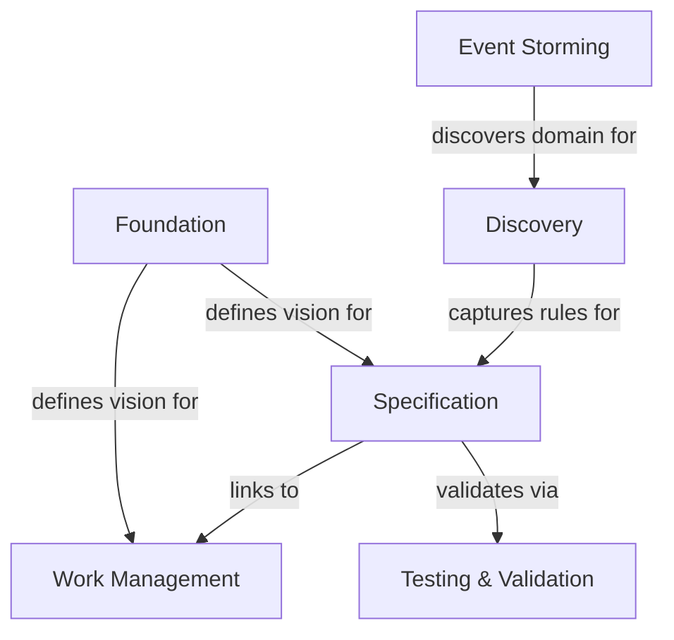

# Foundation Event Storm Commands - Implementation Analysis

## Context

During FOUND-022 (Big Picture Event Storming for Foundation), we discovered that the foundation Event Storm is missing critical commands for adding aggregates, domain events, and commands to bounded contexts.

**Current State:**
- ✅ `fspec add-foundation-bounded-context` - EXISTS and works
- ❌ `fspec add-aggregate-to-foundation` - MISSING (documented but not implemented)
- ❌ `fspec add-domain-event-to-foundation` - MISSING (documented but not implemented)
- ❌ `fspec add-command-to-foundation` - MISSING (documented but not implemented)

**Reference:** Bootstrap documentation in `fspec bootstrap` output mentions these commands.

---

## Why These Commands Are Critical

### 1. Strategic Domain Modeling
Big Picture Event Storming captures:
- **Bounded Contexts** ✅ (we have this)
- **Aggregates** ❌ (MISSING - core entities in each context)
- **Domain Events** ❌ (MISSING - key business events)
- **Commands** ❌ (MISSING - user/system actions)

Without aggregates, events, and commands, bounded contexts are just **empty boxes** with no substance.

### 2. Tag Ontology Generation (EXMAP-004)
Bootstrap docs mention:
> "This populates `spec/tags.json` with domain-driven tags automatically generated from your bounded contexts."

Aggregates would feed into component tag generation.

### 3. Architecture Documentation
Foundation Event Storm becomes the **domain architecture map**:

```
Work Management Context
  ├─ Aggregates: WorkUnit, Epic, Dependency, Prefix
  ├─ Events: WorkUnitCreated, WorkUnitStatusChanged, DependencyAdded
  └─ Commands: CreateWorkUnit, UpdateWorkUnitStatus, AddDependency

Specification Context
  ├─ Aggregates: Feature, Scenario, Step
  ├─ Events: FeatureCreated, ScenarioAdded, FeatureValidated
  └─ Commands: CreateFeature, AddScenario, ValidateFeature
```

### 4. Completeness
Big Picture Event Storm without these elements is **incomplete** according to DDD practices.

---

## Analysis Results from FOUND-022

I completed a **very thorough AST and structural analysis** of the fspec codebase and identified:
- **23 total bounded contexts** (infrastructure + business)
- **6 strategic bounded contexts** (recommended for foundation)

### 6 Strategic Bounded Contexts Added to Foundation

1. **Work Management**
2. **Specification**
3. **Discovery** (Example Mapping)
4. **Event Storming** (Domain Analysis)
5. **Foundation** (Strategic Design)
6. **Testing & Validation**

---

## Proposed Aggregates, Events, and Commands

### 1. Work Management Context

**Aggregates:**
- WorkUnit (story, task, bug)
- Epic (collection of work units)
- Dependency (relationship between work units)
- Prefix (namespace for work unit IDs)

**Domain Events:**
- WorkUnitCreated
- WorkUnitStatusChanged (backlog → specifying → testing → implementing → validating → done)
- WorkUnitBlocked
- WorkUnitEstimated
- DependencyAdded
- DependencyRemoved
- EpicCreated
- WorkUnitPrioritized

**Commands:**
- CreateWorkUnit (create-story, create-task, create-bug)
- UpdateWorkUnitStatus
- BlockWorkUnit
- EstimateWorkUnit
- AddDependency
- RemoveDependency
- CreateEpic
- PrioritizeWorkUnit

---

### 2. Specification Context

**Aggregates:**
- Feature (Gherkin feature file)
- Scenario (test scenario within feature)
- Step (Given/When/Then step)
- Tag (classification metadata)

**Domain Events:**
- FeatureCreated
- ScenarioAdded
- StepAdded
- FeatureValidated
- FeatureFormatted
- TagRegistered

**Commands:**
- CreateFeature
- AddScenario
- AddStep
- ValidateFeature
- FormatFeature
- RegisterTag

---

### 3. Discovery Context (Example Mapping)

**Aggregates:**
- Rule (business rule - blue card)
- Example (concrete example - green card)
- Question (uncertainty - red card)
- Assumption (answered question converted to assumption)

**Domain Events:**
- RuleAdded
- ExampleAdded
- QuestionAsked
- QuestionAnswered
- AssumptionRecorded
- ScenariosGenerated

**Commands:**
- AddRule
- AddExample
- AskQuestion
- AnswerQuestion
- RecordAssumption
- GenerateScenarios

---

### 4. Event Storming Context

**Aggregates:**
- DomainEvent (orange sticky)
- Command (blue sticky)
- Policy (purple sticky - reactive rule)
- Hotspot (red sticky - uncertainty/risk)
- BoundedContext (pink sticky - strategic boundary)
- Aggregate (yellow sticky - core entity)

**Domain Events:**
- EventStormSessionStarted
- DomainEventCaptured
- CommandCaptured
- PolicyCaptured
- HotspotCaptured
- ExampleMappingGenerated (from Event Storm artifacts)

**Commands:**
- StartEventStormSession
- CaptureDomainEvent
- CaptureCommand
- CapturePolicy
- CaptureHotspot
- GenerateExampleMapping

---

### 5. Foundation Context

**Aggregates:**
- ProjectVision (what we're building)
- ProblemSpace (what problem we're solving)
- SolutionSpace (how we're solving it)
- Capability (what the system can do)
- Persona (who uses the system)
- Diagram (Mermaid architecture diagrams)

**Domain Events:**
- FoundationDiscovered
- VisionDefined
- CapabilityAdded
- PersonaAdded
- DiagramCreated
- FoundationValidated

**Commands:**
- DiscoverFoundation
- DefineVision
- AddCapability
- AddPersona
- AddDiagram
- ValidateFoundation

---

### 6. Testing & Validation Context

**Aggregates:**
- Coverage (scenario-to-test-to-implementation mapping)
- TestMapping (test file linked to scenario)
- ImplementationMapping (source code linked to test)
- ValidationResult (syntax check, tag validation)

**Domain Events:**
- CoverageGenerated
- TestLinked
- ImplementationLinked
- FeatureValidated
- TagsValidated
- SpecAlignmentChecked

**Commands:**
- GenerateCoverage
- LinkTest
- LinkImplementation
- ValidateFeature
- ValidateTags
- CheckSpecAlignment

---

## Data Model

The `foundation.json` Event Storm structure already supports these types:

```json
{
  "eventStorm": {
    "level": "big_picture",
    "items": [
      {
        "id": 1,
        "type": "bounded_context",
        "text": "Work Management",
        "color": null,
        "deleted": false,
        "createdAt": "2025-11-17T10:45:37.291Z"
      }
    ],
    "nextItemId": 7
  }
}
```

**We need to support these additional types:**
- `"type": "aggregate"` - Core entity (linked to bounded context)
- `"type": "domain_event"` - Business event (linked to bounded context)
- `"type": "command"` - User/system action (linked to bounded context)
- `"type": "policy"` - Reactive rule (optional - can add later)

**Each item should include:**
- `boundedContextId` - Which context does this belong to?
- `text` - Name of the aggregate/event/command
- `description` (optional) - Additional details

---

## Required Commands to Implement

### 1. Add Aggregate to Foundation Context

```bash
fspec add-aggregate-to-foundation "Work Management" "WorkUnit"
fspec add-aggregate-to-foundation "Work Management" "Epic" --description "Collection of related work units"
```

**Behavior:**
- Find bounded context by name
- Create new item with `type: "aggregate"`
- Link to bounded context via `boundedContextId`
- Auto-increment `nextItemId`

---

### 2. Add Domain Event to Foundation Context

```bash
fspec add-domain-event-to-foundation "Work Management" "WorkUnitCreated"
fspec add-domain-event-to-foundation "Work Management" "WorkUnitStatusChanged" --description "Status changed in ACDD workflow"
```

**Behavior:**
- Find bounded context by name
- Create new item with `type: "domain_event"`
- Link to bounded context via `boundedContextId`
- Auto-increment `nextItemId`

---

### 3. Add Command to Foundation Context

```bash
fspec add-command-to-foundation "Work Management" "CreateWorkUnit"
fspec add-command-to-foundation "Work Management" "UpdateWorkUnitStatus" --description "Move work unit through ACDD states"
```

**Behavior:**
- Find bounded context by name
- Create new item with `type: "command"`
- Link to bounded context via `boundedContextId`
- Auto-increment `nextItemId`

---

### 4. Show Foundation Event Storm (Already Exists)

```bash
fspec show-foundation-event-storm
fspec show-foundation-event-storm --format=json
fspec show-foundation-event-storm --context="Work Management"
```

**Enhancement needed:**
- Add `--context` filter to show only items for specific bounded context
- Add `--type` filter to show only aggregates, events, or commands

---

## Implementation Checklist

- [ ] Create `src/commands/add-aggregate-to-foundation.ts`
- [ ] Create `src/commands/add-aggregate-to-foundation-help.ts`
- [ ] Create `src/commands/add-domain-event-to-foundation.ts`
- [ ] Create `src/commands/add-domain-event-to-foundation-help.ts`
- [ ] Create `src/commands/add-command-to-foundation.ts`
- [ ] Create `src/commands/add-command-to-foundation-help.ts`
- [ ] Update `show-foundation-event-storm.ts` to add filtering options
- [ ] Update `foundation.json` schema to include `boundedContextId` field
- [ ] Add validation to ensure aggregate/event/command links to existing bounded context
- [ ] Update `generate-foundation-md.ts` to render aggregates, events, commands in markdown
- [ ] Write tests for all new commands
- [ ] Update bootstrap documentation with examples

---

## Expected Usage Flow

```bash
# 1. Add bounded contexts (already works)
fspec add-foundation-bounded-context "Work Management"

# 2. Add aggregates to context (NEW)
fspec add-aggregate-to-foundation "Work Management" "WorkUnit"
fspec add-aggregate-to-foundation "Work Management" "Epic"
fspec add-aggregate-to-foundation "Work Management" "Dependency"

# 3. Add domain events to context (NEW)
fspec add-domain-event-to-foundation "Work Management" "WorkUnitCreated"
fspec add-domain-event-to-foundation "Work Management" "WorkUnitStatusChanged"
fspec add-domain-event-to-foundation "Work Management" "DependencyAdded"

# 4. Add commands to context (NEW)
fspec add-command-to-foundation "Work Management" "CreateWorkUnit"
fspec add-command-to-foundation "Work Management" "UpdateWorkUnitStatus"
fspec add-command-to-foundation "Work Management" "AddDependency"

# 5. View complete Event Storm
fspec show-foundation-event-storm
fspec show-foundation-event-storm --context="Work Management"

# 6. Generate FOUNDATION.md with Event Storm visualization
fspec generate-foundation-md
```

---

## Expected FOUNDATION.md Output

After implementing these commands, `FOUNDATION.md` should include:

```markdown
# Domain Architecture

## Bounded Context Map



## Work Management Context

**Aggregates:**
- WorkUnit - Story, task, or bug tracking unit
- Epic - Collection of related work units
- Dependency - Relationship between work units

**Domain Events:**
- WorkUnitCreated
- WorkUnitStatusChanged
- DependencyAdded

**Commands:**
- CreateWorkUnit
- UpdateWorkUnitStatus
- AddDependency

## Specification Context

**Aggregates:**
- Feature
- Scenario
- Step

**Domain Events:**
- FeatureCreated
- ScenarioAdded
- FeatureValidated

**Commands:**
- CreateFeature
- AddScenario
- ValidateFeature

... (repeat for all 6 contexts)
```

---

## Benefits of Implementation

1. **Complete Big Picture Event Storm** - All DDD elements captured
2. **Tag Ontology Generation** - Aggregates feed into component tag creation
3. **Architecture Documentation** - FOUNDATION.md shows complete domain model
4. **Strategic Alignment** - Team understands what entities exist in each context
5. **Consistency** - All Event Storm commands follow same pattern (work unit + foundation)

---

## Related Work

- **FOUND-022** - Big Picture Event Storming (current work unit)
- **EXMAP-004** - Tag ontology generation from Event Storm artifacts
- **Existing Commands** - `add-aggregate`, `add-domain-event`, `add-command` (work unit level)

---

## Notes from Analysis Session

- Analyzed entire fspec codebase using Task agent (Explore mode - very thorough)
- Identified 23 total bounded contexts (infrastructure + business)
- Recommended 6 strategic contexts for foundation
- Added all 6 bounded contexts successfully
- Discovered missing commands when trying to add aggregates
- Bootstrap documentation references these commands but they don't exist yet

**This story implements the missing foundation Event Storm commands to complete the Big Picture Event Storming workflow.**
