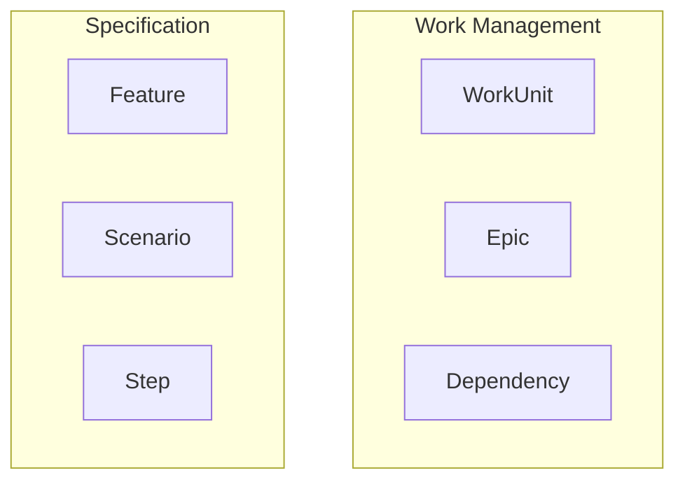

# FOUND-042 Analysis: Enhance FOUNDATION.md Event Storm Visualization

## Current State

The `generate-foundation-md` command (in `src/generators/foundation-md.ts`) currently only renders:
1. List of bounded context names
2. Basic Mermaid diagram with bounded context boxes

## What's Missing

The Event Storm visualization should show for each bounded context:
- **Aggregates** (yellow stickies) - core entities
- **Domain Events** (orange stickies) - business events  
- **Commands** (blue stickies) - user/system actions

## Current Code Location

File: `src/generators/foundation-md.ts` (lines 180-223)

Current implementation:
- Filters bounded contexts from `foundation.eventStorm.items`
- Creates simple list of context names
- Generates basic Mermaid diagram with just context boxes

## What Needs to Change

### 1. Group Items by Bounded Context

For each bounded context, collect its related items:
```typescript
const contextItems = {
  aggregates: foundation.eventStorm.items.filter(
    item => item.type === 'aggregate' && 
            'boundedContextId' in item && 
            item.boundedContextId === context.id
  ),
  events: foundation.eventStorm.items.filter(
    item => item.type === 'event' && 
            'boundedContextId' in item && 
            item.boundedContextId === context.id
  ),
  commands: foundation.eventStorm.items.filter(
    item => item.type === 'command' && 
            'boundedContextId' in item && 
            item.boundedContextId === context.id
  )
}
```

### 2. Render Context Details

For each bounded context, generate markdown section:
```markdown
## Work Management Context

**Aggregates:**
- WorkUnit - Story, task, or bug tracking unit
- Epic - Collection of related work units
- Dependency - Relationship between work units
- Prefix - Namespace for work unit IDs

**Domain Events:**
- WorkUnitCreated - Work unit was created
- WorkUnitStatusChanged - Work unit moved through ACDD workflow
- WorkUnitBlocked - Work unit blocked by dependency
- DependencyAdded - Dependency relationship created

**Commands:**
- CreateWorkUnit - Create story, task, or bug
- UpdateWorkUnitStatus - Move through ACDD workflow
- BlockWorkUnit - Block work unit with reason
- AddDependency - Link work units
```

### 3. Enhanced Mermaid Diagram (Optional)

Could show relationships between items within contexts:


Or simpler: keep current diagram, add detailed sections below.

## Recommended Approach

**Phase 1** (Simple): Add detailed sections for each bounded context showing aggregates, events, commands
**Phase 2** (Later): Enhance Mermaid diagram to show relationships

## Expected Output Format

```markdown
# Domain Architecture

## Bounded Contexts
- Work Management
- Specification  
- Discovery
- Event Storming
- Foundation
- Testing & Validation

## Bounded Context Map
[Mermaid diagram - current one is fine]

## Work Management Context

**Aggregates:**
- WorkUnit - Story, task, or bug tracking unit
...

**Domain Events:**
- WorkUnitCreated - Work unit was created
...

**Commands:**
- CreateWorkUnit - Create story, task, or bug
...

## Specification Context
[repeat pattern]

... [all 6 contexts]
```

## Implementation Location

File: `src/generators/foundation-md.ts`
Function: `export async function generateFoundationMd(foundation: Foundation): Promise<string>`
Lines: 180-223 (Event Storm section)

## Test Coverage

Need to add/update tests in:
- `src/commands/__tests__/generate-foundation-md.test.ts` (if exists)
- Or create integration test showing full Event Storm rendering

## Related Files

- `src/types/event-storm.ts` - EventStormItem types
- `src/types/foundation.ts` - Foundation type with eventStorm field
- `spec/foundation.json` - Contains 78 Event Storm items (6 contexts + 24 aggregates + 24 events + 24 commands)
