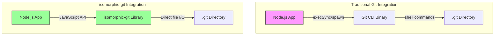
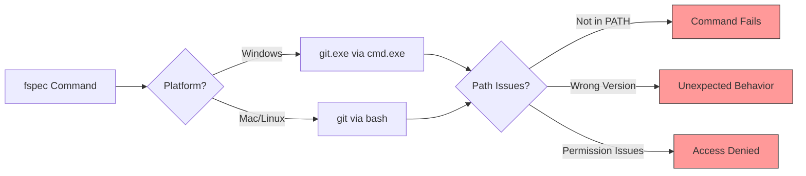
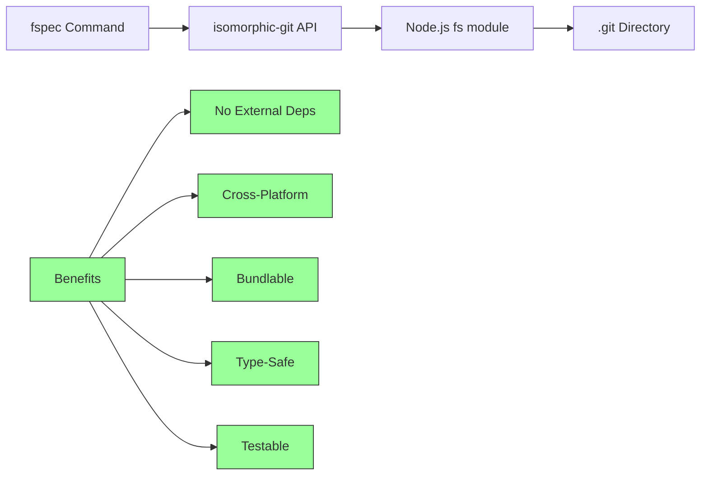
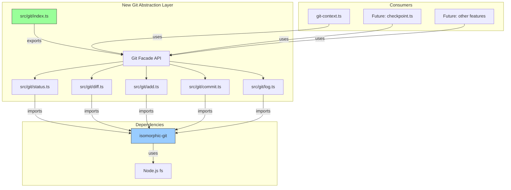
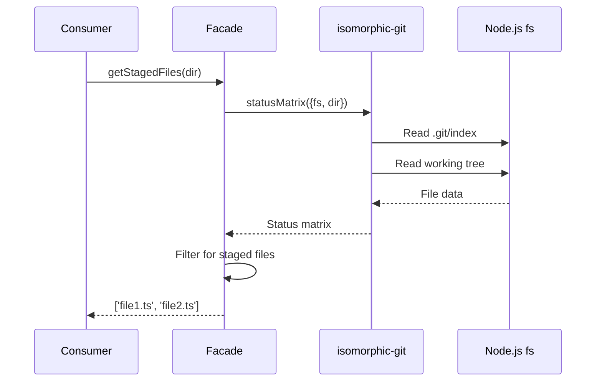
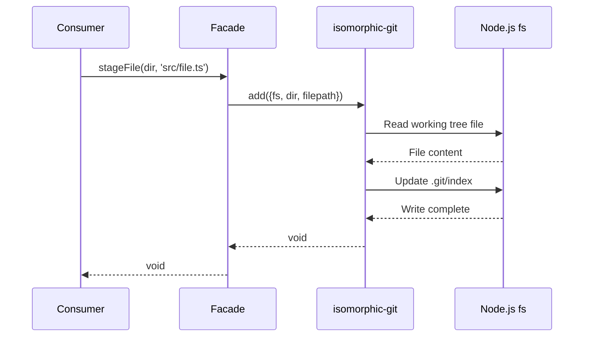
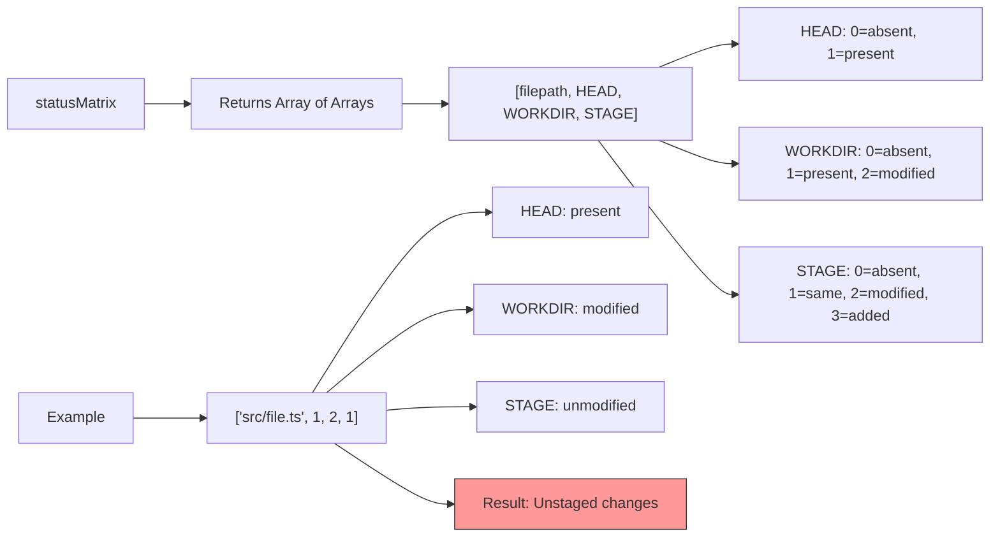
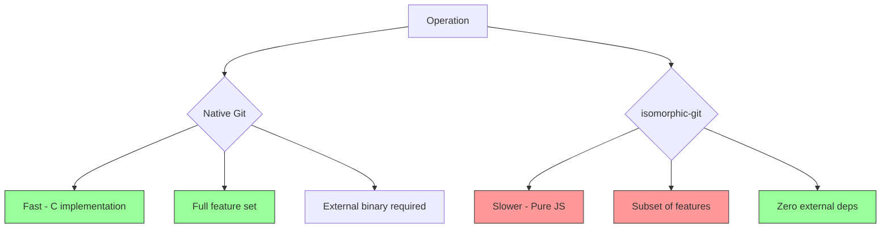

# isomorphic-git Research & Implementation Guide

**Work Unit:** GIT-001 - Replace git CLI usage with isomorphic-git library
**Date:** 2025-10-21
**Purpose:** Comprehensive research on migrating from git CLI to isomorphic-git

---

## Table of Contents

1. [Executive Summary](#executive-summary)
2. [What is isomorphic-git?](#what-is-isomorphic-git)
3. [Why Replace git CLI?](#why-replace-git-cli)
4. [Current Git Usage in fspec](#current-git-usage-in-fspec)
5. [Migration Architecture](#migration-architecture)
6. [API Mapping: git CLI → isomorphic-git](#api-mapping-git-cli--isomorphic-git)
7. [Implementation Examples](#implementation-examples)
8. [Key Differences & Limitations](#key-differences--limitations)
9. [Best Practices](#best-practices)
10. [Migration Checklist](#migration-checklist)

---

## Executive Summary

**isomorphic-git** is a pure JavaScript implementation of Git that runs in both Node.js and browsers without external dependencies. Migrating from `git` CLI calls to isomorphic-git provides:

✅ **Benefits:**
- **Zero external dependencies** - No git binary required
- **Cross-platform consistency** - Same behavior on Windows/Mac/Linux
- **Bundlable** - Ship as single executable with pkg/nexe
- **Predictable** - No shell escape issues or platform-specific behaviors
- **Type-safe** - First-class TypeScript support with auto-generated types
- **Testable** - Mock filesystem for unit testing

⚠️ **Limitations:**
- Slower than native git for large repositories
- No `git stash` yet (planned for GIT-002)
- Requires explicit iteration for bulk operations (e.g., add all files)
- No wire protocol v2 support yet

---

## What is isomorphic-git?

isomorphic-git is a **pure JavaScript reimplementation** of Git, not a binding to libgit2 (like nodegit). It reads/writes Git objects directly using JavaScript.



**Key Characteristics:**
- **Isomorphic** - Runs in Node.js AND browsers
- **Pure JS** - No native bindings, no compilation
- **Promise-based** - Modern async/await API
- **TypeScript-friendly** - Auto-generated .d.ts from JSDoc

---

## Why Replace git CLI?

### Current Issues with git CLI



**Problems with CLI approach:**
1. **External Dependency** - Requires git binary installed
2. **Platform Variance** - Different behaviors on Windows vs Unix
3. **Shell Escaping** - Security risks with unsanitized inputs
4. **Distribution** - Can't bundle as single executable
5. **Testing** - Requires real git repo for tests

### Benefits of isomorphic-git



---

## Current Git Usage in fspec

### Files Using git CLI

**Primary Usage:**
- `src/hooks/git-context.ts` - Detects staged/unstaged files for virtual hooks

**Current Implementation:**
```typescript
// src/hooks/git-context.ts (BEFORE migration)
import { execa } from 'execa';

export async function getGitContext(projectRoot: string): Promise<GitContext> {
  // Detect staged files (git diff --cached --name-only)
  const stagedResult = await execa('git', ['diff', '--cached', '--name-only'], {
    cwd: projectRoot,
    reject: false,
  });

  const stagedFiles = stagedResult.exitCode === 0 && stagedResult.stdout.trim()
    ? stagedResult.stdout.trim().split('\n')
    : [];

  // Detect unstaged files (git diff --name-only)
  const unstagedResult = await execa('git', ['diff', '--name-only'], {
    cwd: projectRoot,
    reject: false,
  });

  const unstagedFiles = unstagedResult.exitCode === 0 && unstagedResult.stdout.trim()
    ? unstagedResult.stdout.trim().split('\n')
    : [];

  return { stagedFiles, unstagedFiles };
}
```

**Git Commands Currently Used:**
1. `git diff --cached --name-only` - List staged files
2. `git diff --name-only` - List unstaged files

---

## Migration Architecture

### Proposed Module Structure



**Module Responsibilities:**

| Module | Responsibility | Exports |
|--------|---------------|---------|
| `src/git/index.ts` | Facade/entry point | All git functions |
| `src/git/status.ts` | File status detection | `getStatus()`, `listFiles()` |
| `src/git/diff.ts` | Diff operations | `getStagedFiles()`, `getUnstagedFiles()` |
| `src/git/add.ts` | Staging operations | `stageFile()`, `stageFiles()` |
| `src/git/commit.ts` | Commit operations | `createCommit()` |
| `src/git/log.ts` | History operations | `getLog()`, `getCommit()` |

---

## API Mapping: git CLI → isomorphic-git

### 1. Status Operations



**CLI to API Mapping:**

| git CLI | isomorphic-git API | Purpose |
|---------|-------------------|---------|
| `git status --porcelain` | `git.statusMatrix()` | Get all file statuses |
| `git diff --cached --name-only` | `statusMatrix()` + filter | Staged files |
| `git diff --name-only` | `statusMatrix()` + filter | Unstaged files |
| `git ls-files --others --exclude-standard` | `statusMatrix()` + filter | Untracked files |

### 2. Add/Stage Operations



**CLI to API Mapping:**

| git CLI | isomorphic-git API | Purpose |
|---------|-------------------|---------|
| `git add <file>` | `git.add({fs, dir, filepath})` | Stage single file |
| `git add .` | Loop + `git.add()` for each | Stage all files |
| `git add -A` | Loop + `git.add()` for each | Stage all including deletions |

### 3. Commit Operations

**CLI to API Mapping:**

| git CLI | isomorphic-git API | Purpose |
|---------|-------------------|---------|
| `git commit -m "msg"` | `git.commit({fs, dir, message, author})` | Create commit |
| `git log --oneline -n 10` | `git.log({fs, dir, depth: 10})` | View history |
| `git show <sha>` | `git.readCommit({fs, dir, oid})` | Read commit |

---

## Implementation Examples

### Example 1: Migrating getGitContext()

**BEFORE (git CLI):**
```typescript
import { execa } from 'execa';

export async function getGitContext(projectRoot: string): Promise<GitContext> {
  const stagedResult = await execa('git', ['diff', '--cached', '--name-only'], {
    cwd: projectRoot,
    reject: false,
  });

  const stagedFiles = stagedResult.exitCode === 0 && stagedResult.stdout.trim()
    ? stagedResult.stdout.trim().split('\n')
    : [];

  const unstagedResult = await execa('git', ['diff', '--name-only'], {
    cwd: projectRoot,
    reject: false,
  });

  const unstagedFiles = unstagedResult.exitCode === 0 && unstagedResult.stdout.trim()
    ? unstagedResult.stdout.trim().split('\n')
    : [];

  return { stagedFiles, unstagedFiles };
}
```

**AFTER (isomorphic-git):**
```typescript
import git from 'isomorphic-git';
import fs from 'fs';

export async function getGitContext(projectRoot: string): Promise<GitContext> {
  try {
    // Get status matrix for all files
    const matrix = await git.statusMatrix({
      fs,
      dir: projectRoot,
    });

    // Status matrix format: [filepath, HEAD, WORKDIR, STAGE]
    // HEAD: 0 = absent, 1 = present
    // WORKDIR: 0 = absent, 1 = present, 2 = modified
    // STAGE: 0 = absent, 1 = unmodified, 2 = modified, 3 = added

    const stagedFiles: string[] = [];
    const unstagedFiles: string[] = [];

    for (const [filepath, head, workdir, stage] of matrix) {
      // Staged files: STAGE !== HEAD
      if (stage !== head) {
        stagedFiles.push(filepath);
      }

      // Unstaged files: WORKDIR !== STAGE
      if (workdir !== stage) {
        unstagedFiles.push(filepath);
      }
    }

    return { stagedFiles, unstagedFiles };
  } catch (error: unknown) {
    // Not a git repo or other error
    return { stagedFiles: [], unstagedFiles: [] };
  }
}
```

### Example 2: Status Matrix Explained



**Status Matrix Values:**

| Scenario | HEAD | WORKDIR | STAGE | Meaning |
|----------|------|---------|-------|---------|
| Untracked file | 0 | 2 | 0 | New file, not staged |
| Staged addition | 0 | 2 | 3 | New file, staged |
| Unstaged modification | 1 | 2 | 1 | Modified, not staged |
| Staged modification | 1 | 2 | 2 | Modified, staged |
| Deleted (unstaged) | 1 | 0 | 1 | Deleted, not staged |
| Deleted (staged) | 1 | 0 | 0 | Deleted, staged |

### Example 3: TypeScript Integration

```typescript
import git from 'isomorphic-git';
import fs from 'fs';
import type { StatusRow } from 'isomorphic-git';

interface FileStatus {
  filepath: string;
  staged: boolean;
  modified: boolean;
  untracked: boolean;
}

export async function getFileStatuses(dir: string): Promise<FileStatus[]> {
  const matrix: StatusRow[] = await git.statusMatrix({ fs, dir });

  return matrix.map(([filepath, head, workdir, stage]) => ({
    filepath,
    staged: stage !== head,
    modified: workdir === 2 && stage === 1,
    untracked: head === 0 && stage === 0,
  }));
}
```

---

## Key Differences & Limitations

### Differences from Native Git



**Performance:**
- Native git: Optimized C code, fastest for large repos
- isomorphic-git: Pure JavaScript, ~2-3x slower for common operations
- **fspec impact:** Minimal (small repos, infrequent git operations)

**Feature Parity:**

| Feature | Native Git | isomorphic-git |
|---------|-----------|----------------|
| clone | ✅ | ✅ |
| status | ✅ | ✅ (via statusMatrix) |
| add | ✅ | ✅ |
| commit | ✅ | ✅ |
| log | ✅ | ✅ |
| diff | ✅ | ⚠️ (basic, no line diffs) |
| stash | ✅ | ❌ (not yet) |
| rebase | ✅ | ❌ |
| merge | ✅ | ⚠️ (basic) |

### Limitations Relevant to fspec

1. **No git stash** (yet)
   - Workaround: Will implement in GIT-002 using commits + refs
   - Plan: Create hidden branch for stashes

2. **Bulk operations require iteration**
   - No `git add .` equivalent
   - Must loop through files individually
   - Example:
     ```typescript
     const files = await git.statusMatrix({ fs, dir });
     for (const [filepath, , , stage] of files) {
       if (stage === 0) {
         await git.add({ fs, dir, filepath });
       }
     }
     ```

3. **No line-level diffs**
   - Can detect file-level changes
   - Cannot show `+`/`-` line diffs like `git diff`
   - **fspec impact:** Not needed (we only need file lists)

---

## Best Practices

### 1. Filesystem Configuration

```typescript
// RECOMMENDED: Use Node.js fs directly
import fs from 'fs';
import git from 'isomorphic-git';

// All operations use the same fs instance
await git.status({ fs, dir: '/path/to/repo', filepath: 'README.md' });
```

**Why?**
- Consistent behavior across all git operations
- No need for LightningFS (browser-only)
- Native performance

### 2. Error Handling

```typescript
import { Errors } from 'isomorphic-git';

try {
  await git.status({ fs, dir, filepath });
} catch (error) {
  if (error instanceof Errors.NotFoundError) {
    // File not found
  } else if (error instanceof Errors.InvalidOidError) {
    // Invalid commit hash
  } else if (error instanceof Errors.MissingParameterError) {
    // Missing required parameter
  }
}
```

### 3. TypeScript Typing

```typescript
import type { StatusRow, ReadCommitResult, GitAuth } from 'isomorphic-git';

// Status matrix row
const row: StatusRow = ['src/file.ts', 1, 2, 1];

// Commit result
const commit: ReadCommitResult = await git.readCommit({ fs, dir, oid });

// Authentication (for future use)
const auth: GitAuth = {
  username: 'token',
  password: process.env.GITHUB_TOKEN,
};
```

### 4. Directory Handling

```typescript
// ALWAYS use absolute paths
const projectRoot = process.cwd();
await git.status({ fs, dir: projectRoot, filepath: 'src/file.ts' });

// NOT relative paths
// await git.status({ fs, dir: '.', filepath: 'src/file.ts' }); // ❌
```

### 5. Bulk Operations Pattern

```typescript
// Pattern: Get all files first, then iterate
const matrix = await git.statusMatrix({ fs, dir });

// Filter for untracked files
const untrackedFiles = matrix
  .filter(([, head, , stage]) => head === 0 && stage === 0)
  .map(([filepath]) => filepath);

// Stage all untracked files
for (const filepath of untrackedFiles) {
  await git.add({ fs, dir, filepath });
}

// Or use Promise.all for parallel operations
await Promise.all(
  untrackedFiles.map(filepath => git.add({ fs, dir, filepath }))
);
```

---

## Migration Checklist

### Phase 1: Setup (GIT-001)

- [ ] Install isomorphic-git: `npm install isomorphic-git`
- [ ] Install types (auto-included in package)
- [ ] Create `src/git/` directory structure
- [ ] Create facade module `src/git/index.ts`
- [ ] Implement status operations `src/git/status.ts`
- [ ] Implement diff operations `src/git/diff.ts`

### Phase 2: Migrate Existing Code (GIT-001)

- [ ] Update `src/hooks/git-context.ts` to use facade
- [ ] Remove `execa` dependency for git operations
- [ ] Write unit tests for new git modules
- [ ] Test with real git repositories
- [ ] Update documentation

### Phase 3: Future Operations (GIT-002)

- [ ] Implement add/stage operations `src/git/add.ts`
- [ ] Implement commit operations `src/git/commit.ts`
- [ ] Implement log operations `src/git/log.ts`
- [ ] Implement custom stash using commits + refs
- [ ] Implement checkpoint system for workflow transitions

---

## Example: Complete Migration of git-context.ts

```typescript
// src/git/status.ts - NEW FILE
import git from 'isomorphic-git';
import fs from 'fs';
import type { StatusRow } from 'isomorphic-git';

export interface GitFileStatus {
  staged: boolean;
  unstaged: boolean;
  untracked: boolean;
}

/**
 * Get status matrix for all files in repository
 */
export async function getStatusMatrix(dir: string): Promise<StatusRow[]> {
  try {
    return await git.statusMatrix({ fs, dir });
  } catch (error: unknown) {
    // Not a git repo or other error
    return [];
  }
}

/**
 * Get list of staged files
 */
export async function getStagedFiles(dir: string): Promise<string[]> {
  const matrix = await getStatusMatrix(dir);

  return matrix
    .filter(([, head, , stage]) => stage !== head)
    .map(([filepath]) => filepath);
}

/**
 * Get list of unstaged modified files
 */
export async function getUnstagedFiles(dir: string): Promise<string[]> {
  const matrix = await getStatusMatrix(dir);

  return matrix
    .filter(([, , workdir, stage]) => workdir === 2 && stage === 1)
    .map(([filepath]) => filepath);
}

/**
 * Get list of untracked files
 */
export async function getUntrackedFiles(dir: string): Promise<string[]> {
  const matrix = await getStatusMatrix(dir);

  return matrix
    .filter(([, head, , stage]) => head === 0 && stage === 0)
    .map(([filepath]) => filepath);
}

/**
 * Get status for a specific file
 */
export async function getFileStatus(
  dir: string,
  filepath: string
): Promise<GitFileStatus | null> {
  const matrix = await getStatusMatrix(dir);
  const row = matrix.find(([f]) => f === filepath);

  if (!row) {
    return null;
  }

  const [, head, workdir, stage] = row;

  return {
    staged: stage !== head,
    unstaged: workdir === 2 && stage === 1,
    untracked: head === 0 && stage === 0,
  };
}
```

```typescript
// src/git/index.ts - FACADE
export {
  getStatusMatrix,
  getStagedFiles,
  getUnstagedFiles,
  getUntrackedFiles,
  getFileStatus,
} from './status';

export type { GitFileStatus } from './status';
```

```typescript
// src/hooks/git-context.ts - UPDATED
import { getStagedFiles, getUnstagedFiles } from '../git';

export interface GitContext {
  stagedFiles: string[];
  unstagedFiles: string[];
}

/**
 * Detect git context (staged and unstaged files)
 * @param projectRoot - Project root directory
 * @returns Git context with file lists
 */
export async function getGitContext(
  projectRoot: string
): Promise<GitContext> {
  const stagedFiles = await getStagedFiles(projectRoot);
  const unstagedFiles = await getUnstagedFiles(projectRoot);

  return {
    stagedFiles,
    unstagedFiles,
  };
}
```

---

## References

- **isomorphic-git Official Docs:** https://isomorphic-git.org/
- **Quick Start Guide:** https://isomorphic-git.org/docs/en/quickstart
- **API Reference:** https://isomorphic-git.org/docs/en/alphabetic
- **FAQ:** https://isomorphic-git.org/docs/en/faq
- **GitHub Examples:** https://github.com/isomorphic-git/examples
- **TypeScript Examples:** https://github.com/isomorphic-git/examples/tree/main/typescript-node

---

## Next Steps

After completing GIT-001 (this story), proceed to:

**GIT-002: Intelligent checkpoint system for workflow transitions**
- Implement custom stash using isomorphic-git commits
- Create checkpoint snapshots on workflow state changes
- Add rollback capability for work unit transitions
- Track fspec-modified files (not just Claude Code changes)

---

**Document Version:** 1.0
**Last Updated:** 2025-10-21
**Author:** AI Research (Claude)
