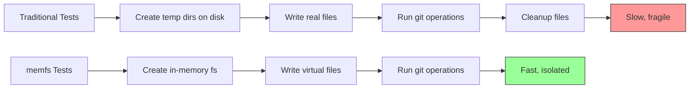
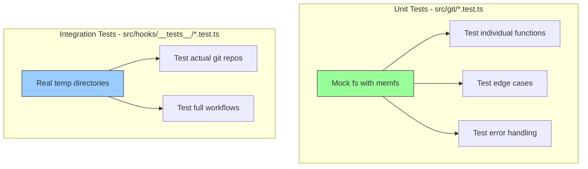

# Testing Patterns for isomorphic-git

**Work Unit:** GIT-001 - Replace git CLI usage with isomorphic-git library
**Purpose:** Guide for writing tests using mock filesystems with isomorphic-git and Vitest
**Date:** 2025-10-21

---

## Table of Contents

1. [Overview](#overview)
2. [Testing Strategy](#testing-strategy)
3. [memfs + Vitest Setup](#memfs--vitest-setup)
4. [isomorphic-git Test Patterns](#isomorphic-git-test-patterns)
5. [Complete Test Examples](#complete-test-examples)
6. [Best Practices](#best-practices)
7. [Common Pitfalls](#common-pitfalls)

---

## Overview

isomorphic-git allows you to **bring your own filesystem (fs)** implementation. This makes testing trivial - use an in-memory filesystem like **memfs** instead of real disk I/O.

### Why memfs?



**Benefits:**
- ✅ **Fast** - No disk I/O, tests run in milliseconds
- ✅ **Isolated** - Each test gets fresh filesystem, no cleanup needed
- ✅ **Portable** - Works everywhere, no temp dir permissions issues
- ✅ **Deterministic** - No race conditions from parallel tests

---

## Testing Strategy

### Test Levels



**Recommendation:**

| Test Type | Filesystem | When to Use |
|-----------|-----------|-------------|
| **Unit tests** | memfs (in-memory) | Testing `src/git/*.ts` modules in isolation |
| **Integration tests** | Real fs (temp dirs) | Testing `git-context.ts` with actual repos |

---

## memfs + Vitest Setup

### Installation

```bash
npm install --save-dev memfs
```

**Note:** memfs is already installed in fspec as a dev dependency.

### Basic Setup Pattern

```typescript
import { describe, it, expect, beforeEach } from 'vitest';
import { vol } from 'memfs';
import git from 'isomorphic-git';

describe('Git Status Operations', () => {
  beforeEach(() => {
    // Reset in-memory filesystem before each test
    vol.reset();
  });

  it('should detect staged files', async () => {
    // Use memfs as the filesystem
    const fs = vol as any; // memfs implements fs interface

    // Create virtual git repository structure
    vol.fromJSON({
      '/test-repo/.git/config': '[core]\nrepositoryformatversion = 0',
      '/test-repo/.git/HEAD': 'ref: refs/heads/main',
      '/test-repo/README.md': '# Test Repo',
    });

    // Use isomorphic-git with memfs
    const result = await git.status({
      fs,
      dir: '/test-repo',
      filepath: 'README.md',
    });

    expect(result).toBeDefined();
  });
});
```

### Vitest Mock Configuration

For automatic fs mocking across all tests, create mock files:

**Option 1: Manual mocking per test (Recommended)**

```typescript
import { vol } from 'memfs';

// In each test file that needs memfs
const fs = vol as any;
```

**Option 2: Global fs mocking (Use sparingly)**

Create `__mocks__/fs.cjs` at project root:

```javascript
// __mocks__/fs.cjs
const { fs } = require('memfs');
module.exports = fs;
```

Then in `vitest.config.ts`:

```typescript
import { defineConfig } from 'vitest/config';

export default defineConfig({
  test: {
    globals: true,
    setupFiles: ['./vitest.setup.ts'],
  },
});
```

And in `vitest.setup.ts`:

```typescript
import { vi } from 'vitest';

// Mock Node.js fs module globally
vi.mock('fs', async () => {
  const memfs = await vi.importActual<typeof import('memfs')>('memfs');
  return {
    default: memfs.fs,
    ...memfs.fs,
  };
});

vi.mock('fs/promises', async () => {
  const memfs = await vi.importActual<typeof import('memfs')>('memfs');
  return memfs.fs.promises;
});
```

**⚠️ Warning:** Global mocking can break tests that need real filesystem access. Use manual mocking per test for better control.

---

## isomorphic-git Test Patterns

### Pattern 1: Testing Status Operations

```typescript
import { describe, it, expect, beforeEach } from 'vitest';
import { vol } from 'memfs';
import git from 'isomorphic-git';

describe('getStagedFiles()', () => {
  const fs = vol as any;

  beforeEach(() => {
    vol.reset();
  });

  it('should return empty array when no files are staged', async () => {
    // Setup: Create minimal git repo
    vol.fromJSON({
      '/repo/.git/config': '[core]\nrepositoryformatversion = 0',
      '/repo/.git/HEAD': 'ref: refs/heads/main',
      '/repo/.git/index': '', // Empty index
    });

    const matrix = await git.statusMatrix({ fs, dir: '/repo' });
    const staged = matrix.filter(([, head, , stage]) => stage !== head);

    expect(staged).toEqual([]);
  });

  it('should detect staged files after git.add()', async () => {
    // Setup: Create repo with file
    vol.fromJSON({
      '/repo/.git/config': '[core]\nrepositoryformatversion = 0',
      '/repo/.git/HEAD': 'ref: refs/heads/main',
      '/repo/file.txt': 'Hello World',
    });

    // Initialize git repo properly
    await git.init({ fs, dir: '/repo' });

    // Stage the file
    await git.add({ fs, dir: '/repo', filepath: 'file.txt' });

    // Verify it's staged
    const matrix = await git.statusMatrix({ fs, dir: '/repo' });
    const staged = matrix.filter(([, head, , stage]) => stage !== head);

    expect(staged.length).toBe(1);
    expect(staged[0][0]).toBe('file.txt');
  });
});
```

### Pattern 2: Testing with Commits

```typescript
describe('Git operations with commits', () => {
  const fs = vol as any;

  beforeEach(() => {
    vol.reset();
  });

  it('should detect modified files after commit', async () => {
    vol.fromJSON({
      '/repo/README.md': '# Initial content',
    });

    // Initialize repo
    await git.init({ fs, dir: '/repo', defaultBranch: 'main' });

    // Create initial commit
    await git.add({ fs, dir: '/repo', filepath: 'README.md' });
    await git.commit({
      fs,
      dir: '/repo',
      message: 'Initial commit',
      author: { name: 'Test', email: 'test@example.com' },
    });

    // Modify file
    fs.writeFileSync('/repo/README.md', '# Modified content');

    // Check status
    const status = await git.status({
      fs,
      dir: '/repo',
      filepath: 'README.md',
    });

    expect(status).toBe('*modified'); // Asterisk = unstaged
  });
});
```

### Pattern 3: Testing Error Conditions

```typescript
describe('Error handling', () => {
  const fs = vol as any;

  beforeEach(() => {
    vol.reset();
  });

  it('should handle non-git directory gracefully', async () => {
    // Create regular directory (no .git)
    vol.fromJSON({
      '/not-a-repo/file.txt': 'content',
    });

    // Expect error when calling git operations
    await expect(
      git.status({ fs, dir: '/not-a-repo', filepath: 'file.txt' })
    ).rejects.toThrow();
  });

  it('should handle missing files', async () => {
    await git.init({ fs, dir: '/repo' });

    const status = await git.status({
      fs,
      dir: '/repo',
      filepath: 'does-not-exist.txt',
    });

    expect(status).toBe('absent');
  });
});
```

### Pattern 4: Testing .gitignore Behavior

```typescript
describe('.gitignore support', () => {
  const fs = vol as any;

  beforeEach(() => {
    vol.reset();
  });

  it('should exclude ignored files from status', async () => {
    vol.fromJSON({
      '/repo/.gitignore': 'node_modules/\n*.log',
      '/repo/README.md': '# Readme',
      '/repo/debug.log': 'logs...',
      '/repo/node_modules/package.json': '{}',
    });

    await git.init({ fs, dir: '/repo' });

    const matrix = await git.statusMatrix({ fs, dir: '/repo' });

    // Filter out ignored files
    const files = matrix.map(([filepath]) => filepath);

    expect(files).toContain('README.md');
    expect(files).toContain('.gitignore');
    expect(files).not.toContain('debug.log'); // Ignored
    expect(files).not.toContain('node_modules/package.json'); // Ignored
  });
});
```

---

## Complete Test Examples

### Example 1: Testing src/git/status.ts

```typescript
// src/git/__tests__/status.test.ts
import { describe, it, expect, beforeEach } from 'vitest';
import { vol } from 'memfs';
import git from 'isomorphic-git';
import { getStagedFiles, getUnstagedFiles } from '../status';

describe('src/git/status.ts', () => {
  const fs = vol as any;

  beforeEach(() => {
    vol.reset();
  });

  describe('getStagedFiles()', () => {
    it('should return empty array when repository is clean', async () => {
      await git.init({ fs, dir: '/repo' });

      const staged = await getStagedFiles('/repo');

      expect(staged).toEqual([]);
    });

    it('should return staged files after adding them', async () => {
      vol.fromJSON({
        '/repo/file1.txt': 'content 1',
        '/repo/file2.txt': 'content 2',
      });

      await git.init({ fs, dir: '/repo' });
      await git.add({ fs, dir: '/repo', filepath: 'file1.txt' });

      const staged = await getStagedFiles('/repo');

      expect(staged).toEqual(['file1.txt']);
      expect(staged).not.toContain('file2.txt');
    });
  });

  describe('getUnstagedFiles()', () => {
    it('should detect unstaged modifications', async () => {
      // Create repo with initial commit
      vol.fromJSON({ '/repo/file.txt': 'initial' });
      await git.init({ fs, dir: '/repo' });
      await git.add({ fs, dir: '/repo', filepath: 'file.txt' });
      await git.commit({
        fs,
        dir: '/repo',
        message: 'Initial',
        author: { name: 'Test', email: 'test@test.com' },
      });

      // Modify file
      fs.writeFileSync('/repo/file.txt', 'modified');

      const unstaged = await getUnstagedFiles('/repo');

      expect(unstaged).toEqual(['file.txt']);
    });
  });
});
```

### Example 2: Integration Test with Real Filesystem

```typescript
// src/hooks/__tests__/git-context.integration.test.ts
import { describe, it, expect, beforeEach, afterEach } from 'vitest';
import { promises as fs } from 'fs';
import { tmpdir } from 'os';
import { join } from 'path';
import { execSync } from 'child_process';
import { getGitContext } from '../git-context';

describe('git-context.ts (integration)', () => {
  let testDir: string;

  beforeEach(async () => {
    // Create temp directory
    testDir = join(tmpdir(), `fspec-test-${Date.now()}`);
    await fs.mkdir(testDir, { recursive: true });

    // Initialize real git repo
    execSync('git init', { cwd: testDir });
    execSync('git config user.name "Test"', { cwd: testDir });
    execSync('git config user.email "test@test.com"', { cwd: testDir });
  });

  afterEach(async () => {
    // Cleanup
    await fs.rm(testDir, { recursive: true, force: true });
  });

  it('should detect staged and unstaged files in real repo', async () => {
    // Create and stage a file
    await fs.writeFile(join(testDir, 'staged.txt'), 'staged content');
    execSync('git add staged.txt', { cwd: testDir });

    // Create unstaged file
    await fs.writeFile(join(testDir, 'unstaged.txt'), 'unstaged content');

    // Test with new implementation
    const context = await getGitContext(testDir);

    expect(context.stagedFiles).toContain('staged.txt');
    expect(context.unstagedFiles).toContain('unstaged.txt');
  });
});
```

### Example 3: Testing Edge Cases

```typescript
// src/git/__tests__/edge-cases.test.ts
import { describe, it, expect, beforeEach } from 'vitest';
import { vol } from 'memfs';
import git from 'isomorphic-git';
import { getStagedFiles } from '../status';

describe('Edge cases', () => {
  const fs = vol as any;

  beforeEach(() => {
    vol.reset();
  });

  it('should handle empty repository (no commits)', async () => {
    await git.init({ fs, dir: '/repo' });

    // Add file in empty repo (no HEAD commit yet)
    vol.fromJSON({ '/repo/README.md': '# New repo' });
    await git.add({ fs, dir: '/repo', filepath: 'README.md' });

    const staged = await getStagedFiles('/repo');

    expect(staged).toEqual(['README.md']);
  });

  it('should respect .gitignore', async () => {
    vol.fromJSON({
      '/repo/.gitignore': '*.log\nnode_modules/',
      '/repo/app.js': 'code',
      '/repo/debug.log': 'logs',
    });

    await git.init({ fs, dir: '/repo' });

    const matrix = await git.statusMatrix({ fs, dir: '/repo' });
    const files = matrix.map(([f]) => f);

    expect(files).toContain('app.js');
    expect(files).toContain('.gitignore');
    expect(files).not.toContain('debug.log'); // Ignored
  });

  it('should handle clean repository', async () => {
    await git.init({ fs, dir: '/repo' });

    vol.fromJSON({ '/repo/file.txt': 'content' });
    await git.add({ fs, dir: '/repo', filepath: 'file.txt' });
    await git.commit({
      fs,
      dir: '/repo',
      message: 'Initial',
      author: { name: 'Test', email: 'test@test.com' },
    });

    // No changes after commit
    const staged = await getStagedFiles('/repo');
    const unstaged = await getUnstagedFiles('/repo');

    expect(staged).toEqual([]);
    expect(unstaged).toEqual([]);
  });
});
```

---

## Best Practices

### 1. Reset memfs Before Each Test

```typescript
beforeEach(() => {
  vol.reset(); // Clear filesystem state
});
```

**Why:** Ensures test isolation, prevents state leakage between tests.

### 2. Use Descriptive File Structures

```typescript
// Good: Clear structure
vol.fromJSON({
  '/repo/.git/config': '[core]\nrepositoryformatversion = 0',
  '/repo/.git/HEAD': 'ref: refs/heads/main',
  '/repo/src/index.ts': 'export {}',
  '/repo/src/utils.ts': 'export {}',
});

// Bad: Confusing minimal structure
vol.fromJSON({
  '/r/.git/c': 'x',
  '/r/f': 'y',
});
```

### 3. Initialize Repos Properly

```typescript
// Good: Use git.init()
await git.init({ fs, dir: '/repo', defaultBranch: 'main' });

// Bad: Manual .git structure (fragile)
vol.fromJSON({
  '/repo/.git/config': '...',
  '/repo/.git/HEAD': '...',
});
```

### 4. Test Both Success and Error Paths

```typescript
it('should succeed with valid repo', async () => {
  await git.init({ fs, dir: '/repo' });
  await expect(getStagedFiles('/repo')).resolves.toEqual([]);
});

it('should handle non-git directory', async () => {
  vol.fromJSON({ '/not-repo/file.txt': 'content' });
  await expect(getStagedFiles('/not-repo')).rejects.toThrow();
});
```

### 5. Use Integration Tests for Complex Scenarios

```typescript
// Unit test: Mock fs, test logic
it('should filter staged files correctly', async () => {
  const fs = vol as any;
  // ... test with memfs
});

// Integration test: Real fs, test end-to-end
it('should work with actual git repo', async () => {
  const tmpDir = await createTempGitRepo();
  // ... test with real filesystem
});
```

---

## Common Pitfalls

### Pitfall 1: Forgetting to Reset memfs

```typescript
// ❌ BAD: Tests will interfere with each other
describe('Tests', () => {
  it('test 1', async () => {
    vol.fromJSON({ '/repo/file.txt': 'v1' });
    // ...
  });

  it('test 2', async () => {
    // file.txt still exists from test 1!
    // ...
  });
});

// ✅ GOOD: Clean state
describe('Tests', () => {
  beforeEach(() => {
    vol.reset();
  });

  it('test 1', async () => {
    vol.fromJSON({ '/repo/file.txt': 'v1' });
    // ...
  });

  it('test 2', async () => {
    // Fresh filesystem
    // ...
  });
});
```

### Pitfall 2: Type Casting Issues

```typescript
// ❌ BAD: TypeScript complains about fs type mismatch
const fs = vol; // Type error

// ✅ GOOD: Cast to any or proper type
const fs = vol as any;

// ✅ BETTER: Type properly if needed
import type { IFs } from 'memfs';
const fs: IFs = vol;
```

### Pitfall 3: Assuming Real Filesystem Behavior

```typescript
// ❌ BAD: memfs doesn't support symlinks or permissions
vol.symlinkSync('/src', '/link'); // Not supported

// ✅ GOOD: Stick to basic operations
vol.fromJSON({ '/src/file.txt': 'content' });
```

### Pitfall 4: Not Handling Async Operations

```typescript
// ❌ BAD: Missing await
it('should work', () => {
  git.init({ fs, dir: '/repo' }); // No await!
  const files = getStagedFiles('/repo'); // Will fail
});

// ✅ GOOD: Proper async handling
it('should work', async () => {
  await git.init({ fs, dir: '/repo' });
  const files = await getStagedFiles('/repo');
});
```

---

## Reference Implementation from isomorphic-git

The isomorphic-git project itself uses these patterns in their test suite:

**Example from their test-commit.js:**

```javascript
const { makeFixture } = require('./__helpers__/FixtureFS.js');

describe('commit', () => {
  it('commit', async () => {
    const { fs, dir, gitdir } = await makeFixture('test-commit');

    await git.commit({
      fs,
      dir,
      gitdir,
      message: 'Initial commit',
      author: {
        name: 'Mr. Test',
        email: 'mrtest@example.com',
      },
    });

    const commits = await git.log({ fs, dir, gitdir });
    expect(commits.length).toBe(1);
  });
});
```

**Their makeFixture() helper:**
- Creates isolated test fixtures
- Pre-populates with test data
- Provides clean fs instance per test

We can adopt a similar pattern for fspec tests.

---

## Summary

### Quick Checklist for Writing Tests

- [ ] Install memfs as dev dependency
- [ ] Import `vol` from memfs in test files
- [ ] Reset vol in `beforeEach()` hooks
- [ ] Use `vol.fromJSON()` to create test file structures
- [ ] Cast vol to fs type: `const fs = vol as any`
- [ ] Pass fs to isomorphic-git functions
- [ ] Write unit tests with memfs for `src/git/*.ts` modules
- [ ] Write integration tests with real fs for complex scenarios
- [ ] Test edge cases: empty repos, .gitignore, clean repos
- [ ] Verify error handling for non-git directories

---

## References

- **memfs npm package:** https://www.npmjs.com/package/memfs
- **Vitest mocking guide:** https://vitest.dev/guide/mocking
- **isomorphic-git test suite:** https://github.com/isomorphic-git/isomorphic-git/tree/main/__tests__
- **Mock fs with Vitest:** https://kschaul.com/til/2024/06/26/mock-fs-with-vitest-and-memfs/

---

**Document Version:** 1.0
**Last Updated:** 2025-10-21
**Author:** AI Research (Claude)
