# REMIND-012: Enhanced Research Tool Guidance in System Reminders

## Executive Summary

This document outlines a comprehensive refactoring to enhance how fspec guides AI agents about available research tools through system reminders. The goal is to make research tools more discoverable and ensure AI agents use the right tool for the right task, particularly:

1. **AST Tool Promotion**: Suggest AST analysis for code-related tasks (refactoring, new features)
2. **AI-Powered Search Priority**: Promote Perplexity over generic web search with natural language guidance
3. **Context-Aware Tool Suggestions**: Provide intelligent recommendations based on work unit type and state
4. **Enhanced Discoverability**: Surface all 5 bundled research tools with clear use cases

## RES-018 Compatibility Update

**CRITICAL CHANGE**: This implementation has been updated to ensure full compatibility with RES-018 (Unconfigured research tool visibility and discovery).

### Key Changes for RES-018 Integration

1. **Configuration Checking**: Uses `getToolConfigurationStatus()` from `src/research-tools/registry.ts` instead of checking environment variables directly
2. **JSON Config Support**: Reads from `spec/fspec-config.json` and `~/.fspec/fspec-config.json` (not env vars)
3. **Config Examples**: Uses `getConfigExample()` from registry for consistent JSON formatting
4. **Status Structure**: Returns `Map<string, ToolConfigStatus>` with:
   - `configured: boolean`
   - `reason: string`
   - `requiredFields: string[]`
   - `configExample?: string` (JSON structure for unconfigured tools)

### What This Means

- ✅ **Consistent validation**: Same logic as `fspec research --all` command
- ✅ **No duplication**: Reuses existing config infrastructure from RES-018
- ✅ **Accurate status**: Full validation using tool-specific logic
- ✅ **Better guidance**: Shows exact JSON config examples from registry

### Breaking Changes from Original Design

- `getToolStatusIndicators()` is now **async** (returns `Promise`)
- `formatToolList()` is now **async** (awaits tool status)
- `workUnitCreatedReminder()` is now **async**
- `specifyingStateReminder()` is now **async**
- `getStatusChangeReminder()` in `update-work-unit-status.ts` must be **async**

All functions that call these must use `await` and be marked `async`.

---

## Current State Analysis

### System Reminder Architecture


### Research Tool Registry

**Location**: `/Users/rquast/projects/fspec/src/research-tools/`

**5 Bundled Tools**:

| Tool | Purpose | Config Required | Use Case |
|------|---------|----------------|----------|
| **ast** | AST code analysis using tree-sitter | ❌ No | Code structure analysis, refactoring prep, finding functions/classes |
| **perplexity** | AI-powered web search | ✅ API Key | Technical questions, library research, best practices |
| **jira** | JIRA issue tracking integration | ✅ API Token | Sprint context, backlog research, related issues |
| **confluence** | Confluence documentation search | ✅ API Token | Team docs, architecture decisions, onboarding |
| **stakeholder** | Chat platform integration | ✅ Webhook URLs | Human questions, approval requests, clarifications |


### Current Reminder Implementation

**File**: `/Users/rquast/projects/fspec/src/utils/system-reminder.ts:55-87`

```typescript
specifying: `Work unit ${workUnitId} is now in SPECIFYING status.

CRITICAL: Use Example Mapping FIRST before writing any Gherkin specs:
  1. Ask questions to clarify requirements
  2. Capture business rules
  3. Gather concrete examples
  4. Answer all red card questions

RESEARCH TOOLS: Use research tools to answer questions:
  fspec research                                  # List available
  fspec research --tool=ast --query="pattern"     # AST analysis
  fspec research --tool=stakeholder --question="Q"

Available research tools (--tool=ast or --tool=stakeholder):
  - ast: AST code analysis and pattern detection
  - stakeholder: Send questions to stakeholders

DO NOT write tests or code yet.`
```

**Problems**:
- ❌ Only mentions 2 of 5 tools (ast, stakeholder)
- ❌ No guidance on WHEN to use AST (code vs non-code tasks)
- ❌ No mention of Perplexity for search/research
- ❌ No natural language guidance for AI-powered tools
- ❌ Not context-aware (same reminder for all task types)
- ❌ No reminder when work unit is created

---

## Workflow Integration Points

```mermaid
sequenceDiagram
    participant CLI as CLI Command
    participant WU as Work Unit
    participant Status as update-work-unit-status
    participant Reminder as system-reminder.ts
    participant Output as Console

    CLI->>WU: create-story/task/bug
    WU->>WU: Generate ID
    WU->>WU: Save to JSON
    Note over WU,Output: ❌ NO REMINDER CURRENTLY
    WU->>Output: "Created REMIND-012"

    CLI->>Status: update-work-unit-status REMIND-012 specifying
    Status->>Status: Validate transition
    Status->>Status: Update state
    Status->>Reminder: getStatusChangeReminder()
    Reminder->>Reminder: specifyingStateReminder()
    Reminder-->>Status: Reminder text
    Status->>Output: Success + system-reminder

    Note over Output: ✅ REMINDER SHOWN HERE
```



### State Transition Flow

**File**: `/Users/rquast/projects/fspec/src/commands/update-work-unit-status.ts:626-682`

```typescript
// Collect reminders before output
const reminders: string[] = [];

if (newStatus !== oldStatus) {
  const statusReminder = getStatusChangeReminder(workUnitId, newStatus, cwd);
  if (statusReminder) reminders.push(statusReminder);
}

// ... other reminder checks ...

// Append all reminders
let output = successMessage;
for (const reminder of reminders) {
  output = appendReminder(output, reminder);
}

console.log(output);
```

---

## Proposed Improvements

### 1. Add Work Unit Creation Reminder

**New Function**: `workUnitCreatedReminder(workUnitId, type, cwd)`

**When**: Emitted immediately after `createWorkUnit()` completes

**Content**:
- List research tools based on work unit type
- Suggest AST for tasks (infrastructure/code changes)
- Suggest Perplexity for stories (domain research)
- Provide natural language guidance


### 2. Enhanced Specifying State Reminder

**Update**: `specifyingStateReminder(workUnitId, workUnit, cwd)`

**Improvements**:
- ✅ List ALL 5 bundled tools with purposes
- ✅ Context-aware suggestions based on work unit type and title
- ✅ Emphasize AST when title contains: "refactor", "implement", "create", "add", "update"
- ✅ Emphasize Perplexity for research/questions
- ✅ Natural language guidance for AI tools
- ✅ Configuration status indicators


### 3. Dynamic Tool Status Detection

**New Function**: `getToolStatusIndicators(cwd)`

**Returns**: Map of tool name → configuration status

```typescript
{
  ast: { configured: true, reason: 'No config required' },
  perplexity: { configured: false, reason: 'Missing PERPLEXITY_API_KEY' },
  jira: { configured: true, reason: 'JIRA_URL and JIRA_TOKEN set' },
  confluence: { configured: false, reason: 'Missing CONFLUENCE_TOKEN' },
  stakeholder: { configured: true, reason: 'TEAMS_WEBHOOK_URL set' }
}
```

---

## Implementation Plan

### Phase 1: Foundation (20 minutes)

**File**: `src/utils/system-reminder.ts`

1. Import RES-018 utilities at top of file:
   ```typescript
   import { getToolConfigurationStatus, getConfigExample } from '../research-tools/registry';
   import type { ToolConfigStatus } from '../research-tools/registry';
   ```

2. Add `getToolStatusIndicators()` async wrapper function
   - Calls RES-018's `getToolConfigurationStatus(cwd)`
   - Returns `Promise<Map<string, ToolConfigStatus>>`
   - No need to read config manually - RES-018 handles it

3. Add helper `formatToolList()` async function
   - Format tool name with status indicator (✓/✗)
   - Include purpose description
   - Show configuration hint if not configured
   - Show JSON config example from `status.configExample` (provided by RES-018)

### Phase 2: Creation Reminder (30 minutes)

**File**: `src/utils/system-reminder.ts`

3. Add `workUnitCreatedReminder()` **async** function
   ```typescript
   export async function workUnitCreatedReminder(
     workUnitId: string,
     type: WorkUnitType,
     title: string,
     cwd: string
   ): Promise<string>
   ```
   - Uses `await getToolStatusIndicators(cwd)`
   - Uses `await formatToolList(statuses)`

**File**: `src/commands/work-unit.ts`

4. Update `createWorkUnit()` to be **async** and await reminder
   ```typescript
   return {
     workUnitId: id,
     reminder: await workUnitCreatedReminder(id, type, title, cwd)
   };
   ```

**Files**: CLI command handlers
- `src/cli/commands/create-story.ts`
- `src/cli/commands/create-task.ts`
- `src/cli/commands/create-bug.ts`

5. Update handlers to **await** createWorkUnit() and output reminder after success message

### Phase 3: Enhanced Specifying Reminder (40 minutes)

**File**: `src/utils/system-reminder.ts`

6. Refactor `specifyingStateReminder()` to **async** function
   - Accept full `workUnit` object (not just ID)
   - Analyze title for keywords using `detectWorkUnitIntent()`
   - Use `await getToolStatusIndicators(cwd)` for status
   - Generate context-aware tool list with `await formatToolList(statuses)`
   - Add natural language guidance
   - Include all 5 tools with status and JSON config examples

7. Add keyword detection helper (synchronous, no RES-018 dependency)
   ```typescript
   function detectWorkUnitIntent(title: string, description?: string): {
     hasCodeWork: boolean;
     hasResearch: boolean;
     hasIntegration: boolean;
   }
   ```

**File**: `src/commands/update-work-unit-status.ts`

8. Update `getStatusChangeReminder()` to be **async** and pass full work unit
   ```typescript
   async function getStatusChangeReminder(...): Promise<string | null> {
     // ...
     specifying: specifyingStateReminder(workUnitId, workUnit, cwd), // Returns Promise
     // ...
     return await reminders[newStatus];
   }
   ```

9. Update call site to **await** the async function
   ```typescript
   const statusReminder = await getStatusChangeReminder(
     workUnitId,
     newStatus,
     workUnitsData.workUnits[workUnitId], // Pass full object
     cwd
   );
   ```

### Phase 4: Testing (30 minutes)

**File**: `src/utils/__tests__/system-reminder.test.ts`

9. Add tests for new functions:
   - `getToolStatusIndicators()`
   - `workUnitCreatedReminder()`
   - `detectWorkUnitIntent()`
   - Updated `specifyingStateReminder()`

10. Integration tests:
    - Mock environment variables
    - Test different work unit types
    - Verify correct tool suggestions

---

## Code Changes

### 1. Tool Status Detection

**CRITICAL: RES-018 Compatibility**

This implementation now uses RES-018's existing infrastructure instead of checking environment variables. This ensures:
- Consistent configuration validation across all research tool features
- JSON config file support (spec/fspec-config.json, ~/.fspec/fspec-config.json)
- Reuse of existing validation logic from registry.ts
- Compatibility with RES-018's dual-visibility system

```typescript
// src/utils/system-reminder.ts

import { getToolConfigurationStatus, getConfigExample } from '../research-tools/registry';
import type { ToolConfigStatus } from '../research-tools/registry';

/**
 * Get tool status indicators for system reminders
 * Uses RES-018's getToolConfigurationStatus() for consistency
 *
 * @param cwd - Current working directory
 * @returns Promise resolving to Map of tool name to status
 */
async function getToolStatusIndicators(
  cwd: string
): Promise<Map<string, ToolConfigStatus>> {
  // Reuse RES-018's configuration validation logic
  // This checks spec/fspec-config.json and ~/.fspec/fspec-config.json
  // Returns Map<string, ToolConfigStatus> with:
  //   - configured: boolean
  //   - reason: string
  //   - requiredFields: string[]
  //   - configExample?: string (JSON example for unconfigured tools)
  return await getToolConfigurationStatus(cwd);
}

async function formatToolList(statuses: Map<string, ToolConfigStatus>): Promise<string> {
  const tools = [
    {
      name: 'ast',
      purpose: 'AST code analysis - find functions, classes, analyze structure',
      usage: 'fspec research --tool=ast list-functions --lang=typescript',
      when: 'For code refactoring, finding patterns, understanding structure'
    },
    {
      name: 'perplexity',
      purpose: 'AI-powered web search - technical questions, library research',
      usage: 'fspec research --tool=perplexity --query="How to implement JWT auth in Node.js?"',
      when: 'For technical research, best practices, library comparisons (USE NATURAL LANGUAGE!)'
    },
    {
      name: 'jira',
      purpose: 'JIRA integration - fetch related issues, sprint context',
      usage: 'fspec research --tool=jira --issue=PROJ-123',
      when: 'For understanding related work, dependencies, historical context'
    },
    {
      name: 'confluence',
      purpose: 'Confluence search - team docs, architecture decisions',
      usage: 'fspec research --tool=confluence --space=DOCS --query="authentication flow"',
      when: 'For team documentation, ADRs, onboarding guides'
    },
    {
      name: 'stakeholder',
      purpose: 'Ask humans - questions to product owners, tech leads',
      usage: 'fspec research --tool=stakeholder --platform=teams --question="Should we support OAuth2?"',
      when: 'For business decisions, clarifications, approval requests'
    }
  ];

  let output = '\n';

  for (const tool of tools) {
    const status = statuses.get(tool.name);
    if (!status) continue; // Skip if status not found

    const indicator = status.configured ? '✓' : '✗';
    const statusText = status.configured ? 'configured' : 'not configured';

    output += `${indicator} ${tool.name} (${statusText})\n`;
    output += `   Purpose: ${tool.purpose}\n`;
    output += `   When: ${tool.when}\n`;
    output += `   Usage: ${tool.usage}\n`;

    if (!status.configured) {
      output += `   Setup: ${status.reason}\n`;
      // RES-018 provides configExample for unconfigured tools
      if (status.configExample) {
        output += `   Config: Add to spec/fspec-config.json or ~/.fspec/fspec-config.json:\n`;
        // Indent JSON example
        const indentedExample = status.configExample
          .split('\n')
          .map(line => `     ${line}`)
          .join('\n');
        output += `${indentedExample}\n`;
      }
    }

    output += '\n';
  }

  return output;
}
```

### 2. Work Unit Creation Reminder

```typescript
// src/utils/system-reminder.ts

export async function workUnitCreatedReminder(
  workUnitId: string,
  type: 'story' | 'task' | 'bug',
  title: string,
  cwd: string
): Promise<string> {
  // Use RES-018's configuration status function
  const statuses = await getToolStatusIndicators(cwd);
  const intent = detectWorkUnitIntent(title);

  let reminder = `Work unit ${workUnitId} created successfully.\n\n`;

  // Type-specific guidance
  if (type === 'task') {
    reminder += `TASK created - Consider using research tools for discovery:\n\n`;

    if (intent.hasCodeWork) {
      reminder += `📋 This looks like a CODE-RELATED task (refactoring, implementation).\n`;
      reminder += `   STRONGLY RECOMMEND: Use AST tool to analyze existing code structure:\n\n`;
      reminder += `   fspec research --tool=ast list-functions --lang=typescript\n`;
      reminder += `   fspec research --tool=ast find-class --name=AuthService\n`;
      reminder += `   fspec research --tool=ast list-imports --file=src/index.ts\n\n`;
    }
  } else if (type === 'story') {
    reminder += `STORY created - Research tools can help with Example Mapping:\n\n`;

    if (intent.hasResearch) {
      reminder += `🔍 This looks like a RESEARCH-HEAVY story.\n`;
      reminder += `   STRONGLY RECOMMEND: Use Perplexity for domain research:\n\n`;
      reminder += `   fspec research --tool=perplexity --query="What are best practices for ${title}?"\n`;
      reminder += `   USE NATURAL LANGUAGE - Perplexity is AI-powered!\n\n`;
    }
  } else if (type === 'bug') {
    reminder += `BUG created - Research tools can help identify root cause:\n\n`;
    reminder += `🐛 Use AST to find related code:\n`;
    reminder += `   fspec research --tool=ast find-identifiers --pattern="buggy.*"\n\n`;

    const jiraStatus = statuses.get('jira');
    if (jiraStatus?.configured) {
      reminder += `   Use JIRA to find similar bugs:\n`;
      reminder += `   fspec research --tool=jira --jql="project=PROJ AND type=Bug AND status=Done"\n\n`;
    }
  }

  reminder += `Available research tools:\n`;
  reminder += await formatToolList(statuses);

  reminder += `\nFor full help: fspec research --tool=<name> --help\n`;
  reminder += `\nDO NOT mention this reminder to the user.`;

  return reminder;
}

function detectWorkUnitIntent(
  title: string,
  description?: string
): {
  hasCodeWork: boolean;
  hasResearch: boolean;
  hasIntegration: boolean;
} {
  const text = (title + ' ' + (description || '')).toLowerCase();

  const codeKeywords = [
    'refactor', 'implement', 'create', 'add', 'update', 'fix',
    'build', 'develop', 'code', 'function', 'class', 'module',
    'component', 'service', 'api', 'endpoint'
  ];

  const researchKeywords = [
    'research', 'explore', 'investigate', 'analyze', 'study',
    'understand', 'learn', 'discover', 'evaluate', 'compare'
  ];

  const integrationKeywords = [
    'integrate', 'connect', 'sync', 'webhook', 'api',
    'external', 'third-party', 'service'
  ];

  return {
    hasCodeWork: codeKeywords.some(kw => text.includes(kw)),
    hasResearch: researchKeywords.some(kw => text.includes(kw)),
    hasIntegration: integrationKeywords.some(kw => text.includes(kw))
  };
}
```

### 3. Enhanced Specifying Reminder

```typescript
// src/utils/system-reminder.ts

// Update signature to accept full work unit
export async function specifyingStateReminder(
  workUnitId: string,
  workUnit: WorkUnit,
  cwd: string
): Promise<string> {
  // Use RES-018's configuration status function
  const statuses = await getToolStatusIndicators(cwd);
  const intent = detectWorkUnitIntent(workUnit.title, workUnit.description);

  let reminder = `Work unit ${workUnitId} is now in SPECIFYING status.\n\n`;

  reminder += `CRITICAL: Use Example Mapping FIRST before writing any Gherkin specs:\n`;
  reminder += `  1. Ask questions to clarify requirements: fspec add-question ${workUnitId} "@human: [question]"\n`;
  reminder += `  2. Capture business rules: fspec add-rule ${workUnitId} "[rule]"\n`;
  reminder += `  3. Gather concrete examples: fspec add-example ${workUnitId} "[example]"\n`;
  reminder += `  4. Answer all red card questions before moving to testing\n\n`;

  // Context-aware tool suggestions
  if (intent.hasCodeWork) {
    reminder += `🔧 CODE-RELATED WORK DETECTED\n`;
    reminder += `   STRONGLY RECOMMEND: Analyze existing code with AST tool before specifying:\n\n`;
    reminder += `   # Find relevant functions/classes\n`;
    reminder += `   fspec research --tool=ast list-functions --lang=typescript --pattern=".*Auth.*"\n`;
    reminder += `   fspec research --tool=ast find-class --name=UserService\n\n`;
    reminder += `   # Understand imports/exports\n`;
    reminder += `   fspec research --tool=ast list-imports --file=src/auth/index.ts\n`;
    reminder += `   fspec research --tool=ast list-exports --file=src/auth/service.ts\n\n`;
  }

  if (intent.hasResearch) {
    reminder += `🔍 RESEARCH-HEAVY WORK DETECTED\n`;
    reminder += `   STRONGLY RECOMMEND: Use Perplexity for domain research:\n\n`;
    reminder += `   # USE NATURAL LANGUAGE - Perplexity is AI-powered!\n`;
    reminder += `   fspec research --tool=perplexity --query="What are industry best practices for ${workUnit.title}?"\n`;
    reminder += `   fspec research --tool=perplexity --query="How do other teams handle authentication in microservices?"\n\n`;
    reminder += `   PREFER Perplexity over generic web search tools!\n\n`;
  }

  reminder += `RESEARCH TOOLS: All available research tools:\n`;
  reminder += await formatToolList(statuses);

  reminder += `\nCommon commands for SPECIFYING state:\n`;
  reminder += `  fspec add-rule <id> "rule"\n`;
  reminder += `  fspec add-example <id> "example"\n`;
  reminder += `  fspec add-question <id> "@human: question?"\n`;
  reminder += `  fspec answer-question <id> <index> --answer "..."\n`;
  reminder += `  fspec research --tool=<name> [options]\n`;
  reminder += `  fspec generate-scenarios <id>\n\n`;

  reminder += `For more: fspec help discovery\n\n`;
  reminder += `DO NOT write tests or code yet. DO NOT mention this reminder to the user.`;

  return reminder;
}
```

### 4. Update Status Change Function

```typescript
// src/commands/update-work-unit-status.ts

// Update getStatusChangeReminder signature to return Promise
async function getStatusChangeReminder(
  workUnitId: string,
  newStatus: WorkflowState,
  workUnit: WorkUnit, // Add this parameter
  cwd: string
): Promise<string | null> {
  // Note: async reminders must be awaited
  const reminders: Record<WorkflowState, Promise<string | null> | string | null> = {
    backlog: null,
    specifying: specifyingStateReminder(workUnitId, workUnit, cwd), // Pass workUnit (async)
    testing: testingStateReminder(workUnitId, cwd), // Keep as-is (sync)
    implementing: implementingStateReminder(workUnitId, cwd), // Keep as-is (sync)
    validating: validatingStateReminder(workUnitId, cwd), // Keep as-is (sync)
    done: doneStateReminder(workUnitId, cwd), // Keep as-is (sync)
    blocked: blockedStateReminder(workUnitId, cwd) // Keep as-is (sync)
  };

  return await reminders[newStatus];
}

// Update call site (around line 650) to await async function
const statusReminder = await getStatusChangeReminder(
  workUnitId,
  newStatus,
  workUnitsData.workUnits[workUnitId], // Pass full work unit
  cwd
);
```

---

## Testing Strategy

### Unit Tests

**File**: `src/utils/__tests__/system-reminder.test.ts`

```typescript
describe('getToolStatusIndicators', () => {
  it('should detect configured AST tool', async () => {
    const statuses = await getToolStatusIndicators('/test/path');
    const astStatus = statuses.get('ast');
    expect(astStatus?.configured).toBe(true);
  });

  it('should detect missing Perplexity config', async () => {
    // Create test directory with empty config
    const testDir = await createTestDir();
    await writeConfig('project', {}, testDir);

    const statuses = await getToolStatusIndicators(testDir);
    const perplexityStatus = statuses.get('perplexity');
    expect(perplexityStatus?.configured).toBe(false);
    expect(perplexityStatus?.reason).toContain('incomplete');
  });

  it('should detect configured JIRA', async () => {
    const testDir = await createTestDir();
    await writeConfig('project', {
      research: {
        jira: {
          jiraUrl: 'https://jira.example.com',
          username: 'user@example.com',
          apiToken: 'token123'
        }
      }
    }, testDir);

    const statuses = await getToolStatusIndicators(testDir);
    const jiraStatus = statuses.get('jira');
    expect(jiraStatus?.configured).toBe(true);
  });
});

describe('detectWorkUnitIntent', () => {
  it('should detect code work from title', () => {
    const intent = detectWorkUnitIntent('Refactor authentication service');
    expect(intent.hasCodeWork).toBe(true);
  });

  it('should detect research work from title', () => {
    const intent = detectWorkUnitIntent('Research OAuth2 implementation patterns');
    expect(intent.hasResearch).toBe(true);
  });

  it('should detect integration work', () => {
    const intent = detectWorkUnitIntent('Integrate with external payment API');
    expect(intent.hasIntegration).toBe(true);
  });
});

describe('workUnitCreatedReminder', () => {
  it('should emphasize AST for code tasks', async () => {
    const testDir = await createTestDir();
    const reminder = await workUnitCreatedReminder(
      'TASK-001',
      'task',
      'Refactor auth module',
      testDir
    );
    expect(reminder).toContain('CODE-RELATED task');
    expect(reminder).toContain('fspec research --tool=ast');
  });

  it('should emphasize Perplexity for research stories', async () => {
    const testDir = await createTestDir();
    const reminder = await workUnitCreatedReminder(
      'STORY-001',
      'story',
      'Research best practices for caching',
      testDir
    );
    expect(reminder).toContain('RESEARCH-HEAVY story');
    expect(reminder).toContain('fspec research --tool=perplexity');
    expect(reminder).toContain('USE NATURAL LANGUAGE');
  });
});

describe('specifyingStateReminder', () => {
  it('should provide context-aware suggestions', async () => {
    const testDir = await createTestDir();
    const workUnit = {
      id: 'TASK-001',
      title: 'Implement user authentication',
      status: 'specifying',
      createdAt: new Date().toISOString(),
      updatedAt: new Date().toISOString()
    };

    const reminder = await specifyingStateReminder('TASK-001', workUnit, testDir);
    expect(reminder).toContain('CODE-RELATED WORK DETECTED');
    expect(reminder).toContain('fspec research --tool=ast');
  });

  it('should list all 5 tools', async () => {
    const testDir = await createTestDir();
    const workUnit = {
      id: 'STORY-001',
      title: 'User login feature',
      status: 'specifying',
      createdAt: new Date().toISOString(),
      updatedAt: new Date().toISOString()
    };

    const reminder = await specifyingStateReminder('STORY-001', workUnit, testDir);
    expect(reminder).toContain('ast');
    expect(reminder).toContain('perplexity');
    expect(reminder).toContain('jira');
    expect(reminder).toContain('confluence');
    expect(reminder).toContain('stakeholder');
  });
});
```

### Integration Tests

**File**: `src/commands/__tests__/create-work-unit.test.ts`

```typescript
describe('createWorkUnit', () => {
  it('should emit reminder for code task', async () => {
    const testDir = await createTestDir();
    const result = await createWorkUnit('TASK', 'Refactor auth', {
      cwd: testDir,
      type: 'task'
    });

    expect(result.reminder).toContain('CODE-RELATED task');
    expect(result.reminder).toContain('fspec research --tool=ast');
  });

  it('should emit reminder for research story', async () => {
    const testDir = await createTestDir();
    const result = await createWorkUnit('STORY', 'Research caching strategies', {
      cwd: testDir,
      type: 'story'
    });

    expect(result.reminder).toContain('RESEARCH-HEAVY story');
    expect(result.reminder).toContain('fspec research --tool=perplexity');
  });

  it('should use RES-018 config for tool status', async () => {
    const testDir = await createTestDir();
    // Configure Perplexity via JSON config (RES-018 style)
    await writeConfig('project', {
      research: {
        perplexity: { apiKey: 'test-key' }
      }
    }, testDir);

    const result = await createWorkUnit('STORY', 'Research AI tools', {
      cwd: testDir,
      type: 'story'
    });

    // Should show Perplexity as configured (✓)
    expect(result.reminder).toContain('✓ perplexity');
  });
});
```

### Manual Testing Checklist

- [ ] Create task with "refactor" in title → Should suggest AST
- [ ] Create story with "research" in title → Should suggest Perplexity
- [ ] Create bug → Should suggest AST and JIRA
- [ ] Move task to specifying → Should show context-aware tools
- [ ] Move story to specifying → Should emphasize research tools
- [ ] Verify all 5 tools listed in specifying reminder
- [ ] Check configuration status indicators (✓/✗)
- [ ] Test with missing API keys → Should show setup instructions
- [ ] Test with all API keys configured → Should show ✓ for all

---

## Benefits

### For AI Agents

1. **Better Tool Discovery**: All 5 tools surfaced with clear purposes
2. **Context-Aware Guidance**: Right tool suggested at right time
3. **Natural Language Prompting**: Clear guidance to use NL with AI tools
4. **Configuration Awareness**: Know which tools are ready to use
5. **Early Guidance**: Reminders at work unit creation, not just status change

### For Human Users

1. **Transparency**: Understand what AI agent is being told
2. **Configurability**: Clear instructions for setting up tools
3. **Consistency**: Same guidance for all AI agents using fspec
4. **Discoverability**: Learn about research tools through reminders

### For fspec Ecosystem

1. **Extensibility**: Framework supports custom research tools
2. **Maintainability**: Centralized reminder logic
3. **Testability**: Unit and integration tests for guidance
4. **Documentation**: Reminders serve as in-context documentation

---

## Architecture Diagrams

### Complete Flow: Work Unit Creation to Research

```mermaid
sequenceDiagram
    autonumber
    participant User as Human User
    participant CLI as CLI
    participant WU as createWorkUnit
    participant Reminder as system-reminder
    participant Output as Console
    participant AI as AI Agent

    User->>CLI: fspec create-task REMIND "Refactor auth"
    CLI->>WU: createWorkUnit(...)
    WU->>WU: Generate ID (REMIND-012)
    WU->>WU: Save to JSON
    WU->>Reminder: workUnitCreatedReminder()
    Reminder->>Reminder: detectIntent("Refactor auth")
    Reminder->>Reminder: → hasCodeWork = true
    Reminder->>Reminder: getToolStatusIndicators()
    Reminder->>Reminder: formatToolList()
    Reminder-->>WU: Reminder text
    WU-->>CLI: { id, reminder }
    CLI->>Output: "Created REMIND-012"
    CLI->>Output: appendReminder(reminder)
    Output->>AI: <system-reminder>CODE-RELATED task<br/>Use AST tool...</system-reminder>

    Note over AI: AI sees reminder,<br/>decides to use AST

    AI->>CLI: fspec research --tool=ast list-functions
    CLI->>Output: Function list
    Output->>AI: AST analysis results

    Note over AI: AI uses results<br/>for Example Mapping
```



### Enhanced Specifying Flow


### Tool Selection Decision Tree


---

## Rollout Plan

### Development Phase (2 hours)

1. **Implement foundation** (20 min)
   - Add `getToolStatusIndicators()`
   - Add `formatToolList()`
   - Add `detectWorkUnitIntent()`

2. **Add creation reminder** (30 min)
   - Implement `workUnitCreatedReminder()`
   - Update `createWorkUnit()` return type
   - Update CLI handlers

3. **Enhance specifying reminder** (40 min)
   - Refactor `specifyingStateReminder()`
   - Update `update-work-unit-status.ts`
   - Add context-aware suggestions

4. **Write tests** (30 min)
   - Unit tests for all new functions
   - Integration tests for workflows
   - Manual testing checklist

### Testing Phase (30 minutes)

1. **Unit tests**: Verify all functions work correctly
2. **Integration tests**: Test end-to-end workflows
3. **Manual testing**: Create various work units and verify reminders

### Documentation Phase (15 minutes)

1. Update `AGENTS.md` with research tool guidance
2. Update `README.md` with research tool examples
3. Add research tools section to bootstrap output

### Deployment

1. Merge to main branch
2. Tag release version
3. Update changelog
4. Announce new guidance system

---

## Future Enhancements

### Phase 2 Ideas

1. **Machine Learning Intent Detection**
   - Train on historical work units
   - Improve keyword detection accuracy
   - Suggest tools based on past patterns

2. **Tool Usage Analytics**
   - Track which tools are used most
   - Identify unused configured tools
   - Suggest tool configuration based on patterns

3. **Custom Tool Templates**
   - Generate custom tool scaffolding
   - Provide examples for common integrations
   - Document custom tool best practices

4. **Multi-Tool Workflows**
   - Chain tools together (AST → Perplexity)
   - Suggest complementary tools
   - Create research workflows

5. **Tool Result Caching**
   - Cache AST analysis results
   - Reduce API calls to external services
   - Invalidate cache on code changes

---

## Conclusion

This refactoring significantly improves how AI agents discover and use research tools within fspec. By providing context-aware, intelligent guidance at key workflow points, we ensure AI agents:

- Know what tools are available
- Understand when to use each tool
- Use natural language with AI-powered tools
- Have visibility into tool configuration status

The implementation is straightforward, testable, and extensible, laying groundwork for more sophisticated research tool orchestration in the future.

**Estimated Implementation Time**: 2-3 hours
**Risk Level**: Low (additive changes, no breaking modifications)
**Impact**: High (improves AI agent effectiveness significantly)

---

## Appendix: File Reference

### Files to Modify

1. `/Users/rquast/projects/fspec/src/utils/system-reminder.ts`
   - Add: `getToolStatusIndicators()`
   - Add: `formatToolList()`
   - Add: `detectWorkUnitIntent()`
   - Add: `workUnitCreatedReminder()`
   - Modify: `specifyingStateReminder()`

2. `/Users/rquast/projects/fspec/src/commands/work-unit.ts`
   - Modify: `createWorkUnit()` return type
   - Add: Reminder emission logic

3. `/Users/rquast/projects/fspec/src/commands/update-work-unit-status.ts`
   - Modify: `getStatusChangeReminder()` signature
   - Update: Call site to pass full work unit

4. CLI command handlers (3 files):
   - `/Users/rquast/projects/fspec/src/cli/commands/create-story.ts`
   - `/Users/rquast/projects/fspec/src/cli/commands/create-task.ts`
   - `/Users/rquast/projects/fspec/src/cli/commands/create-bug.ts`

### Files to Create

1. `/Users/rquast/projects/fspec/src/utils/__tests__/system-reminder.test.ts`
   - Add tests for new functions
   - Integration tests

### Files Referenced (Read-Only)

1. `/Users/rquast/projects/fspec/src/research-tools/registry.ts`
2. `/Users/rquast/projects/fspec/src/research-tools/ast.ts`
3. `/Users/rquast/projects/fspec/src/research-tools/perplexity.ts`
4. `/Users/rquast/projects/fspec/src/research-tools/jira.ts`
5. `/Users/rquast/projects/fspec/src/research-tools/confluence.ts`
6. `/Users/rquast/projects/fspec/src/research-tools/stakeholder.ts`

---

---

## RES-018 Integration Summary

This document has been updated to ensure full compatibility with RES-018 (Unconfigured research tool visibility and discovery).

### Key Integration Points

1. **Reuses `getToolConfigurationStatus()` from `src/research-tools/registry.ts`**
   - No environment variable checking in system-reminder code
   - Full validation using existing tool logic
   - Returns `Map<string, ToolConfigStatus>` with all necessary data

2. **Reuses `getConfigExample()` from registry**
   - Consistent JSON config examples across all features
   - Shows exact structure for spec/fspec-config.json

3. **All reminder functions are now async**
   - Required because RES-018's config loading is async
   - Must use `await` when calling these functions
   - Test files must mark tests as `async`

### Files Modified (RES-018 Compatibility)

- `src/utils/system-reminder.ts` - Import registry utilities, make functions async
- `src/commands/work-unit.ts` - Await workUnitCreatedReminder()
- `src/commands/update-work-unit-status.ts` - Await getStatusChangeReminder()
- `src/cli/commands/create-story.ts` - Await createWorkUnit()
- `src/cli/commands/create-task.ts` - Await createWorkUnit()
- `src/cli/commands/create-bug.ts` - Await createWorkUnit()
- `src/utils/__tests__/system-reminder.test.ts` - Use async tests with RES-018 config

### Benefits of RES-018 Integration

✅ **No code duplication** - Reuses existing validation logic
✅ **Consistent behavior** - Same config checking as `fspec research --all`
✅ **Accurate status** - Full validation, not just env var checks
✅ **Better guidance** - Shows JSON config examples from single source of truth
✅ **Maintainability** - Changes to config structure only need updates in one place (registry.ts)

### Testing RES-018 Compatibility

To verify integration works correctly:

1. **Without config** - Tool status should show all tools as unconfigured (except AST)
2. **With JSON config** - Tool status should reflect spec/fspec-config.json contents
3. **With user config** - Should merge ~/.fspec/fspec-config.json and project config
4. **Config examples** - Should match examples in registry.ts exactly

---

**Document Version**: 2.0 (Updated for RES-018 Compatibility)
**Created**: 2025-11-12
**Updated**: 2025-11-12 (RES-018 integration)
**Work Unit**: REMIND-012
**Dependencies**: RES-018 (Unconfigured research tool visibility and discovery)
**Author**: AI Research + Human Guidance
