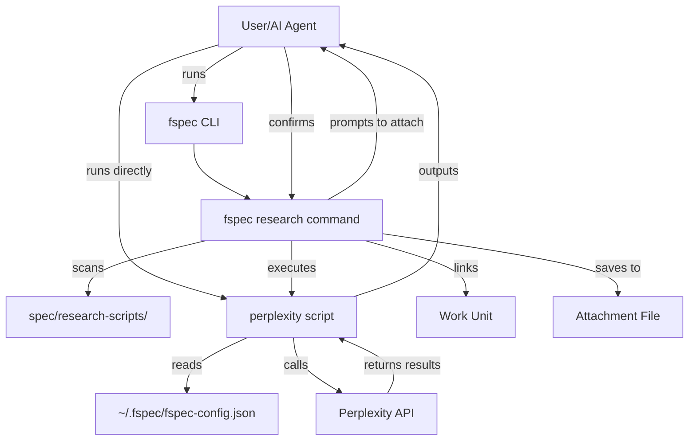
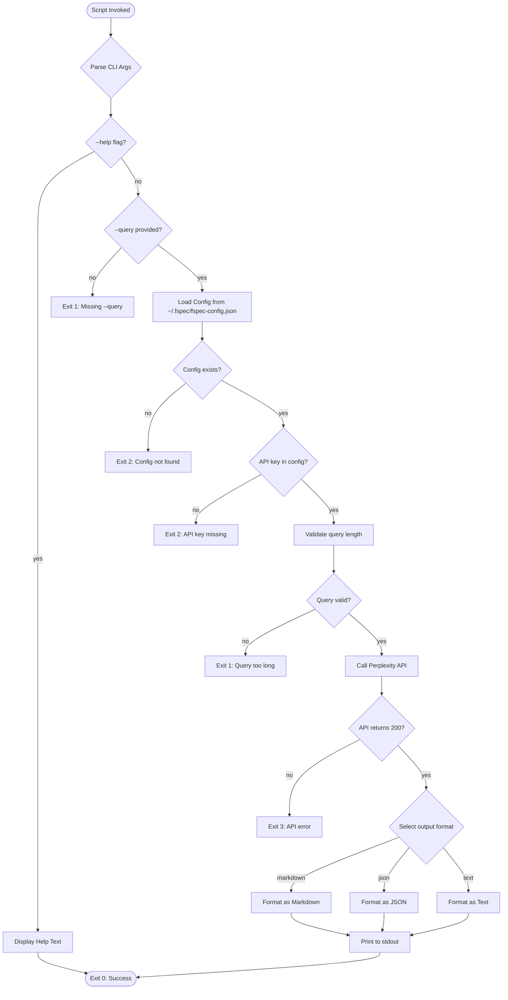
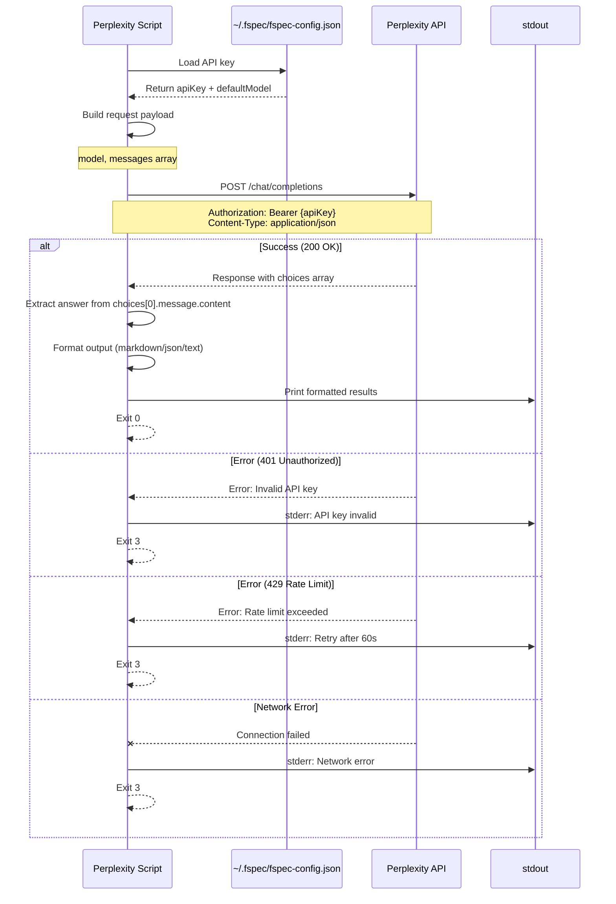
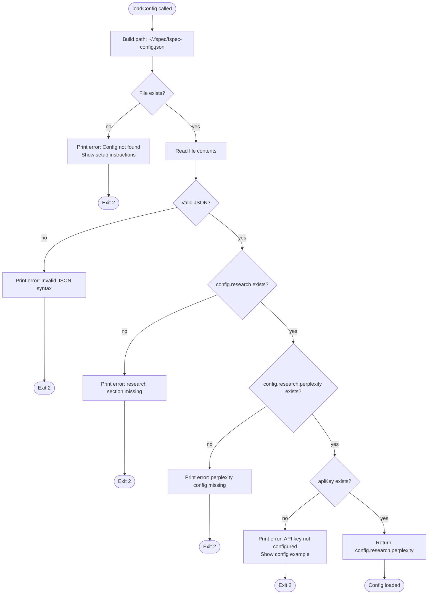
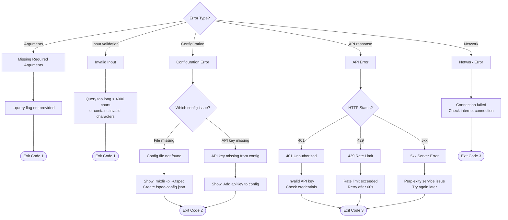
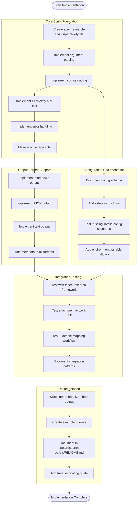
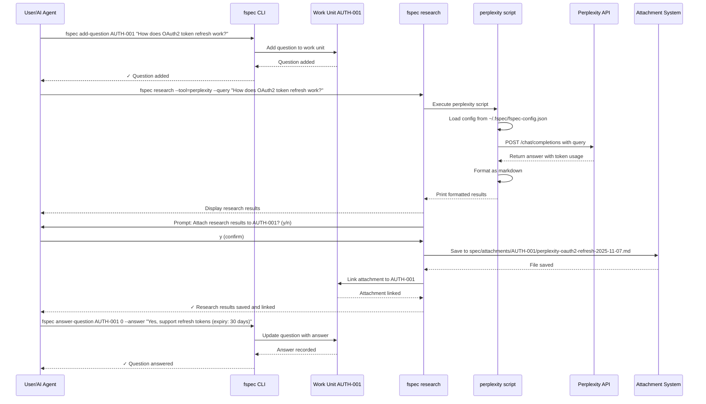
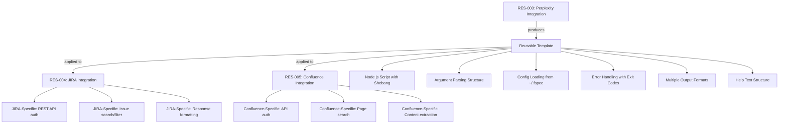

# RES-003: Perplexity Research Tool Integration - Design Document

**Work Unit:** RES-003
**Epic:** research-tools
**Status:** Design Review
**Created:** 2025-11-07
**Author:** AI Agent (Claude)

---

## 1. Overview

### 1.1 Purpose
Create a Perplexity API integration script that enables AI agents and developers to research questions during Example Mapping sessions using Perplexity's AI-powered search capabilities.

### 1.2 Goals
- Provide seamless integration with fspec's research framework (RES-002)
- Enable real-time research during specification phase
- Return well-formatted, actionable research results
- Serve as template for other research tool integrations (RES-004, RES-005)
- Support both interactive and automated workflows

### 1.3 Non-Goals
- Building a full Perplexity client library
- Supporting all Perplexity API features (focus on search/question-answering)
- Caching or rate limiting (future enhancement)

---

## 2. Integration with Research Framework

### 2.0 System Architecture



### 2.1 Framework Contract (from RES-002)

Based on RES-002 rules, our script must:

1. **Be auto-discoverable**: Placed in `spec/research-scripts/` with executable bit set
2. **Be standalone**: Define its own CLI interface (not bound to stdin/stdout contract)
3. **Provide help**: Support `--help` flag for AI agents to learn usage
4. **Return formatted output**: Any format (JSON, markdown, text) - framework agnostic
5. **Handle errors gracefully**: Return non-zero exit codes on failure

### 2.2 Discovery Mechanism

```bash
# Tool will be discovered by scanning spec/research-scripts/
spec/research-scripts/
  └── perplexity          # or perplexity.sh, perplexity.py, etc.
```

The framework will:
- Detect file by executable bit (not extension)
- Derive tool name from filename: `perplexity.sh` → `perplexity`
- Display in `fspec research` output with description

### 2.3 Invocation Pattern

```bash
# Direct invocation (standalone)
spec/research-scripts/perplexity --query "How does OAuth2 work?"

# Via framework (orchestrated)
fspec research --tool=perplexity --query "How does OAuth2 work?"
```

---

## 3. Architecture Design

### 3.1 Technology Choice

**Recommendation: Node.js Script (.js)**

**Rationale:**
- Project already uses TypeScript/Node.js ecosystem
- Easy to integrate with Perplexity API (HTTP client libraries)
- Portable across platforms (macOS, Linux, Windows via WSL)
- Can be made executable with shebang: `#!/usr/bin/env node`
- Fast startup time for interactive workflows

**Alternative considered:**
- Bash + curl: Too limited for JSON parsing and error handling
- Python: Requires Python runtime (not guaranteed in all environments)

### 3.2 Script Structure

```
spec/research-scripts/perplexity
  ├── Shebang:          #!/usr/bin/env node
  ├── Argument parsing: --query, --help, --format, --model
  ├── Config loading:   Read API key from config
  ├── API call:         Fetch from Perplexity API
  ├── Response format:  Markdown output
  └── Error handling:   Exit codes + stderr
```

**Script Execution Flow:**



### 3.3 Dependencies

**NPM packages needed:**
- None (use Node.js built-in `https` module for API calls)
- Or: `node-fetch` (if cleaner API preferred)

**Rationale for minimal dependencies:**
- Research scripts should be lightweight
- Avoid dependency hell for simple HTTP calls
- Built-in `https` module is sufficient for REST API

---

## 4. Perplexity API Integration

### 4.0 API Request/Response Flow



### 4.1 API Overview

**Base URL:** `https://api.perplexity.ai`

**Endpoints:**
- `POST /chat/completions` - Main search/question-answering endpoint

**Authentication:**
- Bearer token in `Authorization` header
- API key stored in user config: `~/.fspec/fspec-config.json`

**Request Format:**
```json
{
  "model": "llama-3.1-sonar-small-128k-online",
  "messages": [
    {
      "role": "system",
      "content": "Be precise and concise."
    },
    {
      "role": "user",
      "content": "How does OAuth2 work?"
    }
  ]
}
```

**Response Format:**
```json
{
  "id": "...",
  "model": "llama-3.1-sonar-small-128k-online",
  "choices": [
    {
      "message": {
        "role": "assistant",
        "content": "OAuth 2.0 is an authorization framework..."
      },
      "finish_reason": "stop"
    }
  ],
  "usage": {
    "prompt_tokens": 20,
    "completion_tokens": 150,
    "total_tokens": 170
  }
}
```

### 4.2 Model Selection

**Default Model:** `llama-3.1-sonar-small-128k-online`

**Rationale:**
- Fast responses
- Online access (real-time web search)
- Good balance of quality and cost

**Configurable via flag:** `--model <model-name>`

---

## 5. Script Interface Design

### 5.1 Command-Line Interface

```bash
# Basic usage
perplexity --query "How does OAuth2 work?"

# With model selection
perplexity --query "What is ACDD?" --model llama-3.1-sonar-large-128k-online

# Output format control
perplexity --query "Explain BDD" --format json

# Get help
perplexity --help
```

### 5.2 Flags and Options

| Flag | Required | Default | Description |
|------|----------|---------|-------------|
| `--query <text>` | Yes | - | Question to research |
| `--model <name>` | No | `llama-3.1-sonar-small-128k-online` | Perplexity model to use |
| `--format <type>` | No | `markdown` | Output format: `markdown`, `json`, `text` |
| `--help` | No | - | Display help message |

### 5.3 Help Output

```
PERPLEXITY RESEARCH TOOL

Research questions using Perplexity AI during Example Mapping.

USAGE
  perplexity --query "your question here" [options]

OPTIONS
  --query <text>      Question to research (required)
  --model <name>      Perplexity model (default: llama-3.1-sonar-small-128k-online)
  --format <type>     Output format: markdown, json, text (default: markdown)
  --help              Show this help message

EXAMPLES
  perplexity --query "How does OAuth2 work?"
  perplexity --query "What is Example Mapping?" --format json

CONFIGURATION
  API key must be set in ~/.fspec/fspec-config.json:
  {
    "research": {
      "perplexity": {
        "apiKey": "pplx-..."
      }
    }
  }

EXIT CODES
  0  Success
  1  Missing required flag (--query)
  2  API key not configured
  3  API error (network, rate limit, etc.)
```

---

## 6. Configuration Management

### 6.1 Configuration File Location

**User-level config:** `~/.fspec/fspec-config.json`

**Rationale:**
- API keys are user-specific, not project-specific
- Follows CONFIG-001 pattern (user vs project config)
- Keeps secrets out of project repository

### 6.2 Configuration Schema

```json
{
  "research": {
    "perplexity": {
      "apiKey": "pplx-...",
      "defaultModel": "llama-3.1-sonar-small-128k-online"
    }
  }
}
```

### 6.3 Configuration Loading

**Configuration Loading Flow:**



**Implementation:**

```javascript
const os = require('os');
const fs = require('fs');
const path = require('path');

function loadConfig() {
  const configPath = path.join(os.homedir(), '.fspec', 'fspec-config.json');

  if (!fs.existsSync(configPath)) {
    console.error('Error: Config file not found at ~/.fspec/fspec-config.json');
    console.error('Create config with Perplexity API key:');
    console.error('  mkdir -p ~/.fspec');
    console.error('  echo \'{"research":{"perplexity":{"apiKey":"pplx-..."}}}\'');
    process.exit(2);
  }

  const config = JSON.parse(fs.readFileSync(configPath, 'utf8'));

  if (!config.research?.perplexity?.apiKey) {
    console.error('Error: Perplexity API key not configured');
    console.error('Add to ~/.fspec/fspec-config.json:');
    console.error('  "research": { "perplexity": { "apiKey": "pplx-..." } }');
    process.exit(2);
  }

  return config.research.perplexity;
}
```

---

## 7. Error Handling

### 7.0 Error Handling Decision Tree



### 7.1 Error Categories

| Category | Exit Code | Description | Example |
|----------|-----------|-------------|---------|
| Missing args | 1 | Required flag not provided | `--query` missing |
| Config error | 2 | API key not configured | Missing `apiKey` in config |
| API error | 3 | Network, rate limit, etc. | 429 Too Many Requests |

### 7.2 Error Messages

**Format:** Structured, actionable messages with fix suggestions

```
Error: Perplexity API request failed (HTTP 429)

Reason: Rate limit exceeded
Fix: Wait 60 seconds and retry, or upgrade API plan

API Response:
{
  "error": {
    "message": "Rate limit exceeded. Try again in 60 seconds.",
    "type": "rate_limit_error"
  }
}
```

### 7.3 Network Error Handling

```javascript
async function callPerplexityAPI(query, config) {
  try {
    const response = await fetch('https://api.perplexity.ai/chat/completions', {
      method: 'POST',
      headers: {
        'Authorization': `Bearer ${config.apiKey}`,
        'Content-Type': 'application/json'
      },
      body: JSON.stringify({
        model: config.defaultModel || 'llama-3.1-sonar-small-128k-online',
        messages: [
          { role: 'system', content: 'Be precise and concise.' },
          { role: 'user', content: query }
        ]
      })
    });

    if (!response.ok) {
      const error = await response.json();
      console.error(`Error: Perplexity API request failed (HTTP ${response.status})\n`);
      console.error(`Reason: ${error.error?.message || 'Unknown error'}`);
      console.error(`\nAPI Response:\n${JSON.stringify(error, null, 2)}`);
      process.exit(3);
    }

    return await response.json();
  } catch (err) {
    console.error(`Error: Network request failed\n`);
    console.error(`Reason: ${err.message}`);
    console.error(`\nFix: Check internet connection and API endpoint availability`);
    process.exit(3);
  }
}
```

---

## 8. Output Format

### 8.0 Output Format Selection

```mermaid
flowchart LR
    Start([API Response Received])
    ExtractAnswer[Extract answer from response.choices]
    ExtractMetadata[Extract metadata: model, tokens, timestamp]
    CheckFormat{--format flag value}

    FormatMarkdown[Build Markdown Structure]
    MarkdownTitle[Add title with query]
    MarkdownMeta[Add source, date metadata]
    MarkdownAnswer[Add answer content]
    MarkdownFooter[Add token usage footer]
    OutputMD[Output to stdout]

    FormatJSON[Build JSON Object]
    JSONFields[Add: query, source, model, timestamp, answer, usage]
    JSONStringify[JSON.stringify with 2-space indent]
    OutputJSON[Output to stdout]

    FormatText[Extract Plain Text]
    TextAnswer[Extract answer only, no metadata]
    OutputText[Output to stdout]

    Exit([Exit 0])

    Start --> ExtractAnswer
    ExtractAnswer --> ExtractMetadata
    ExtractMetadata --> CheckFormat

    CheckFormat -->|markdown or unspecified| FormatMarkdown
    FormatMarkdown --> MarkdownTitle
    MarkdownTitle --> MarkdownMeta
    MarkdownMeta --> MarkdownAnswer
    MarkdownAnswer --> MarkdownFooter
    MarkdownFooter --> OutputMD --> Exit

    CheckFormat -->|json| FormatJSON
    FormatJSON --> JSONFields
    JSONFields --> JSONStringify
    JSONStringify --> OutputJSON --> Exit

    CheckFormat -->|text| FormatText
    FormatText --> TextAnswer
    TextAnswer --> OutputText --> Exit
```



### 8.1 Markdown Format (Default)

**Design Goal:** Human-readable, easy to save as attachment

```markdown
# Research Results: How does OAuth2 work?

**Source:** Perplexity AI (llama-3.1-sonar-small-128k-online)
**Date:** 2025-11-07 12:45:30 UTC

---

## Answer

OAuth 2.0 is an authorization framework that enables applications to obtain
limited access to user accounts on an HTTP service. It works by delegating
user authentication to the service that hosts the user account, and authorizing
third-party applications to access that user account.

### Key Components

1. **Resource Owner**: The user who authorizes an application
2. **Client**: The application requesting access
3. **Authorization Server**: Validates identity and issues tokens
4. **Resource Server**: Hosts protected user accounts

### Flow

1. Client requests authorization from resource owner
2. Client receives authorization grant
3. Client requests access token from authorization server
4. Authorization server authenticates client and validates grant
5. Client uses access token to access protected resources

---

**Tokens Used:** 170 (prompt: 20, completion: 150)
```

### 8.2 JSON Format

**Design Goal:** Machine-readable, structured for programmatic use

```json
{
  "query": "How does OAuth2 work?",
  "source": "Perplexity AI",
  "model": "llama-3.1-sonar-small-128k-online",
  "timestamp": "2025-11-07T12:45:30.000Z",
  "answer": "OAuth 2.0 is an authorization framework...",
  "usage": {
    "promptTokens": 20,
    "completionTokens": 150,
    "totalTokens": 170
  }
}
```

### 8.3 Text Format

**Design Goal:** Plain text for simple integration

```
OAuth 2.0 is an authorization framework that enables applications to obtain
limited access to user accounts on an HTTP service. It works by delegating
user authentication to the service that hosts the user account, and authorizing
third-party applications to access that user account.

...
```

---

## 9. Security Considerations

### 9.1 API Key Storage

✅ **DO:**
- Store API key in user-level config (`~/.fspec/fspec-config.json`)
- Set file permissions to 600 (read/write for user only)
- Never commit API keys to git
- Add `~/.fspec/` to global gitignore

❌ **DON'T:**
- Store API keys in project-level config
- Pass API keys via command-line flags (visible in process list)
- Log API keys in error messages

### 9.2 Environment Variables (Alternative)

**Optional:** Support `PERPLEXITY_API_KEY` environment variable as fallback

```javascript
function getApiKey(config) {
  return config.apiKey || process.env.PERPLEXITY_API_KEY;
}
```

### 9.3 Input Sanitization

**Validate query length:**
```javascript
if (query.length > 4000) {
  console.error('Error: Query too long (max 4000 characters)');
  process.exit(1);
}
```

---

## 10. Testing Strategy

### 10.1 Manual Testing

**Test Cases:**

1. ✅ Basic query returns formatted results
2. ✅ Missing `--query` flag shows error
3. ✅ API key not configured shows helpful error
4. ✅ Invalid API key returns API error (401)
5. ✅ Network error handled gracefully
6. ✅ `--help` flag displays help text
7. ✅ `--format json` outputs valid JSON
8. ✅ `--format markdown` outputs valid markdown
9. ✅ Long query (3000 chars) succeeds
10. ✅ Query with special characters escapes properly

### 10.2 Integration Testing

**With fspec research framework:**

1. ✅ Script is auto-discovered in `spec/research-scripts/`
2. ✅ Framework invokes script with correct flags
3. ✅ Results can be attached to work unit
4. ✅ Multiple sequential queries succeed

### 10.3 Error Scenario Testing

1. ✅ Rate limit (HTTP 429) - shows retry message
2. ✅ Network timeout - shows connection error
3. ✅ Malformed API response - shows parsing error
4. ✅ Empty query - shows validation error

---

## 11. Implementation Plan

### 11.0 Implementation Dependencies



### 11.1 Core Script Foundation
- [ ] Create `spec/research-scripts/perplexity` file
- [ ] Implement argument parsing (`--query`, `--help`, `--format`, `--model`)
- [ ] Implement config loading from `~/.fspec/fspec-config.json`
- [ ] Implement Perplexity API call with proper authentication
- [ ] Implement error handling for all failure modes
- [ ] Make script executable (`chmod +x`)
- [ ] Test standalone execution

### 11.2 Output Format Support
- [ ] Implement markdown output format (default)
- [ ] Implement JSON output format (`--format json`)
- [ ] Implement text output format (`--format text`)
- [ ] Add timestamp and metadata to all output formats
- [ ] Test all output formats with various queries

### 11.3 Configuration Documentation
- [ ] Document config schema in README
- [ ] Add setup instructions for API key configuration
- [ ] Test error messages with missing/invalid config
- [ ] Add environment variable fallback (optional)

### 11.4 Integration Testing
- [ ] Test script discovery with `fspec research`
- [ ] Test script execution via framework
- [ ] Test attachment to work units
- [ ] Test during Example Mapping workflow
- [ ] Document integration patterns

### 11.5 Documentation
- [ ] Write comprehensive `--help` output
- [ ] Create example queries for AI agents
- [ ] Document in `spec/research-scripts/README.md`
- [ ] Add troubleshooting guide for common errors

---

## 12. Examples

### 12.1 Example Mapping Workflow

**Complete Workflow Sequence:**



**CLI Commands:**

```bash
# 1. Add question during Example Mapping
fspec add-question AUTH-001 "@human: How does OAuth2 token refresh work?"

# 2. Research the question
fspec research --tool=perplexity --query "How does OAuth2 token refresh work?"

# Output:
# Research Results: How does OAuth2 token refresh work?
# ...
# Attach research results to AUTH-001? (y/n)

# 3. Attach results (user types 'y')
# ✓ Research results saved to spec/attachments/AUTH-001/perplexity-oauth2-refresh-2025-11-07.md

# 4. Answer the question with research insight
fspec answer-question AUTH-001 0 --answer "Yes, support refresh tokens (expiry: 30 days)"
```

### 12.2 Direct Script Usage

```bash
# Research during specification
./spec/research-scripts/perplexity --query "What are BDD best practices?"

# Save results to file
./spec/research-scripts/perplexity --query "JIRA REST API authentication" > research.md

# JSON output for programmatic use
./spec/research-scripts/perplexity --query "Confluence search API" --format json | jq .answer
```

---

## 13. Template for Future Integrations

This Perplexity integration serves as a **reference template** for RES-004 (JIRA) and RES-005 (Confluence).

### 13.0 Template Reuse Pattern



**Reusable Patterns:**
1. Node.js script with shebang
2. Argument parsing structure
3. Config loading from `~/.fspec/fspec-config.json`
4. Error handling with exit codes
5. Multiple output formats (markdown, json, text)
6. Help text structure
7. Testing checklist

**Integration-Specific Changes:**
- API endpoint and authentication method
- Request/response format
- Config schema (different API key path)
- Output formatting (adapt to API response structure)

---

## 14. Open Questions

1. **Rate Limiting**: Should we implement client-side rate limiting?
   - **Recommendation**: No for MVP. Rely on API error handling.

2. **Caching**: Should we cache recent queries?
   - **Recommendation**: No for MVP. Future enhancement (RES-008?).

3. **Streaming**: Should we support streaming responses?
   - **Recommendation**: No for MVP. Perplexity API supports it, but adds complexity.

4. **Model Selection**: Should we expose all Perplexity models?
   - **Recommendation**: Yes via `--model` flag, document in help.

5. **Token Tracking**: Should we track token usage over time?
   - **Recommendation**: No for MVP. Future enhancement for cost monitoring.

---

## 15. Success Criteria

This integration is complete when:

✅ Script is executable and auto-discovered by `fspec research`
✅ `--help` flag provides comprehensive usage documentation
✅ API key can be configured in `~/.fspec/fspec-config.json`
✅ Research queries return formatted markdown results
✅ JSON and text output formats work correctly
✅ Error handling covers all failure modes (missing args, config, API errors)
✅ Results can be attached to work units via framework
✅ All manual test cases pass
✅ Integration testing with fspec research framework succeeds
✅ Documentation is complete and AI agent-friendly

---

## 16. References

- **RES-002**: Research framework with custom script integration
- **CONFIG-001**: Shared configuration management utilities
- **Perplexity API Docs**: https://docs.perplexity.ai/
- **Example Mapping**: https://cucumber.io/blog/bdd/example-mapping-introduction/

---

**END OF DESIGN DOCUMENT**
