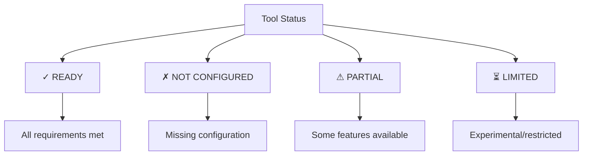
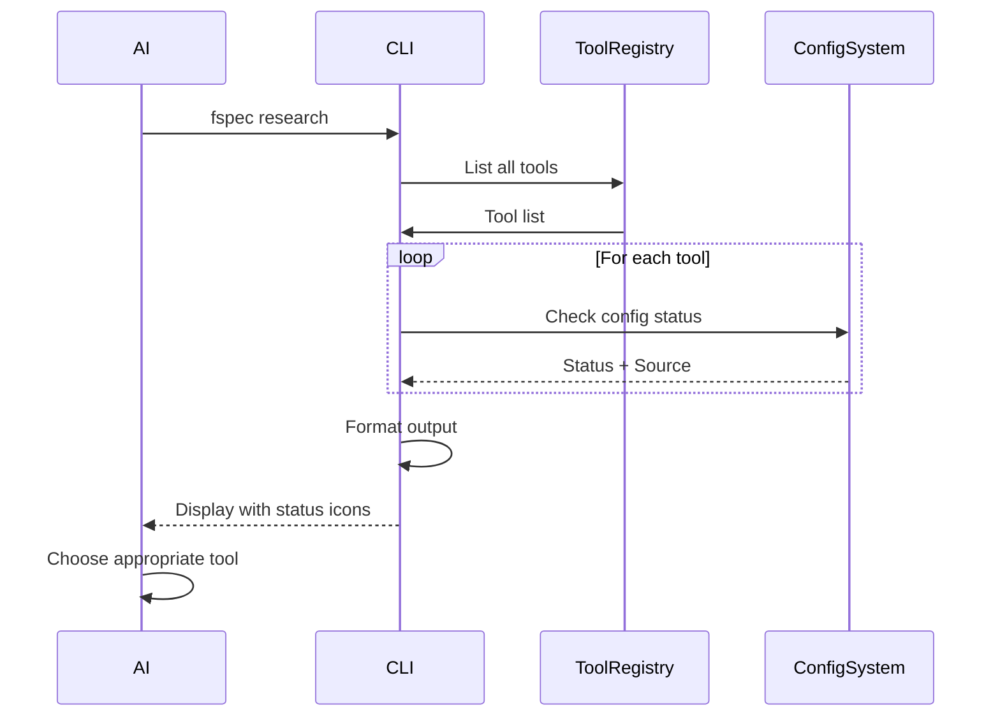

# RES-010: Tool Discovery and Status Display

## Problem Statement

Currently, `fspec research` lists tools by name only with no indication of:
- Which tools are configured and ready to use
- What each tool does or when to use it
- What configuration is required
- Tool capabilities and limitations

This forces AI agents to guess which tools are available and discover configuration issues only after execution fails.

## Proposed Solution

### Enhanced Tool Listing

```bash
$ fspec research

Research Tools
==============

✓ Perplexity                    READY
  AI-powered research for technical questions
  Source: ENV (PERPLEXITY_API_KEY)
  Usage: fspec research --tool=perplexity --query "..."

✗ Confluence                    NOT CONFIGURED
  Search Confluence documentation
  Missing: CONFLUENCE_URL, CONFLUENCE_TOKEN
  Setup: fspec research --configure confluence

✓ Jira                          READY
  Query Jira issues and tickets
  Source: USER (~/.fspec/fspec-config.json)
  Usage: fspec research --tool=jira --query "..."

⚠  AST (tree-sitter)            LIMITED
  Language-agnostic code analysis
  Status: Test mode only (production coming in RES-014)
  Usage: FSPEC_TEST_MODE=1 fspec research --tool=ast --query "..."

✓ Stakeholder                   PARTIAL
  Send questions to Teams/Slack/Discord
  Configured: Teams ✓, Slack ✗
  Usage: fspec research --tool=stakeholder --platform=teams --question "..."

Summary: 3 ready, 1 partial, 1 not configured, 1 limited
```

### Status Icons



## Detailed Tool Descriptions

### Tool Metadata Schema

```typescript
interface ToolMetadata {
  name: string;
  status: 'ready' | 'not-configured' | 'partial' | 'limited';
  description: string;
  whenToUse: string[];
  configSource?: 'ENV' | 'USER' | 'PROJECT' | 'DEFAULT';
  requiredConfig: string[];
  optionalConfig: string[];
  examples: string[];
  limitations?: string[];
  relatedWork?: string[];
}
```

### Example: Perplexity Tool Metadata

```json
{
  "name": "Perplexity",
  "status": "ready",
  "description": "AI-powered research using Perplexity API for technical questions and up-to-date information",
  "whenToUse": [
    "Need current information beyond AI training cutoff",
    "Technical questions requiring web search",
    "Implementation best practices and patterns"
  ],
  "configSource": "ENV",
  "requiredConfig": ["PERPLEXITY_API_KEY"],
  "optionalConfig": ["PERPLEXITY_MODEL"],
  "examples": [
    "fspec research --tool=perplexity --query 'How to implement EventSource in Node.js?'",
    "fspec research --tool=perplexity --query 'Latest TypeScript best practices 2025'"
  ],
  "limitations": [
    "Requires internet connection",
    "API rate limits apply",
    "Costs per query"
  ],
  "relatedWork": []
}
```

## System-Reminder Integration

### Current System-Reminder (Verbose)

```xml
<system-reminder>
RESEARCH TOOLS: Use research tools to answer questions during Example Mapping:
  fspec research                                  # List available research tools
  fspec research --tool=ast --query="pattern"     # Search codebase using AST analysis
  fspec research --tool=stakeholder --platform=teams --question="question" --work-unit=RES-010

Available research tools (--tool=ast or --tool=stakeholder):
  - ast: AST code analysis and pattern detection
  - stakeholder: Send questions to stakeholders via Teams/Slack/Discord
</system-reminder>
```

### Proposed System-Reminder (Concise + Status)

```xml
<system-reminder>
RESEARCH TOOLS AVAILABLE: Run 'fspec research' for full list

Ready to use:
  ✓ perplexity - AI research for technical questions
  ✓ jira - Query Jira tickets
  ⚠ stakeholder - Send questions via Teams (Slack not configured)

Not configured:
  ✗ confluence - Needs CONFLUENCE_URL and CONFLUENCE_TOKEN

Use: fspec research --tool=<name> [options]
Setup: fspec research --configure <name>
</system-reminder>
```

## Visual Design

### Color-Coded Status

```
✓ READY          → Green text
✗ NOT CONFIGURED → Red text
⚠ PARTIAL        → Yellow text
⏳ LIMITED        → Cyan text
```

### Progress Indicators

```bash
Overall Research Tool Configuration: 60% (3/5 tools ready)

█████████░░░░░░░ 60%
```

## Filtering and Sorting

```bash
# Show only configured tools
$ fspec research --status=ready

# Show only unconfigured tools
$ fspec research --status=not-configured

# Sort by name
$ fspec research --sort=name

# Sort by status (ready first)
$ fspec research --sort=status
```

## Interactive Mode

```bash
$ fspec research --interactive

Research Tools (Interactive)
============================

Use ↑/↓ to navigate, Enter to view details, C to configure, Q to quit

  ✓ Perplexity                    READY
→ ✗ Confluence                    NOT CONFIGURED
  ✓ Jira                          READY
  ⚠  AST (tree-sitter)            LIMITED
  ✓ Stakeholder                   PARTIAL

Press Enter for details...
```

## JSON Output for Programmatic Use

```bash
$ fspec research --format=json

{
  "tools": [
    {
      "name": "perplexity",
      "status": "ready",
      "description": "AI-powered research...",
      "configSource": "ENV",
      "whenToUse": [...]
    },
    ...
  ],
  "summary": {
    "total": 5,
    "ready": 3,
    "partial": 1,
    "notConfigured": 1,
    "limited": 1
  }
}
```

## Workflow Diagram



## Implementation Details

### Tool Registry Location

Create `/spec/research-tools-registry.json`:

```json
{
  "tools": {
    "perplexity": {
      "description": "AI-powered research using Perplexity API",
      "script": "spec/research-scripts/perplexity",
      "whenToUse": [
        "Technical questions requiring web search",
        "Up-to-date information beyond AI training cutoff"
      ],
      "requiredConfig": ["apiKey"],
      "optionalConfig": ["model", "format"],
      "examples": [...]
    },
    ...
  }
}
```

### Auto-Discovery Enhancement

Current: Scan `spec/research-scripts/` for executables
Proposed: Scan directory + merge with registry metadata

## Benefits

1. **Faster Discovery**: AI sees tool status at a glance
2. **Reduced Errors**: Know configuration issues upfront
3. **Better Choices**: "When to use" guidance helps select right tool
4. **Self-Service**: Configure tools without reading docs
5. **Transparency**: See exactly where config comes from

## Success Metrics

- **Discoverability**: 100% of AI agents find research tools on first try
- **Configuration Success**: 90%+ tools configured correctly via wizard
- **Usage**: 50%+ increase in research tool adoption during Example Mapping
- **Error Reduction**: 80%+ fewer config-related errors

## Related Work

- RES-012: Configuration system (provides status data)
- RES-011: Tool-specific help (details for each tool)
- RES-013: Smart integration (uses discovered tools)
