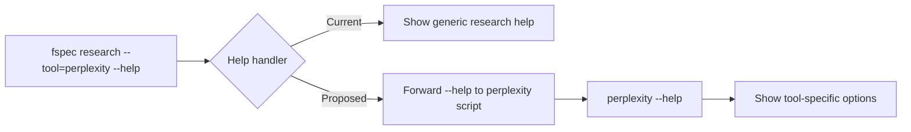
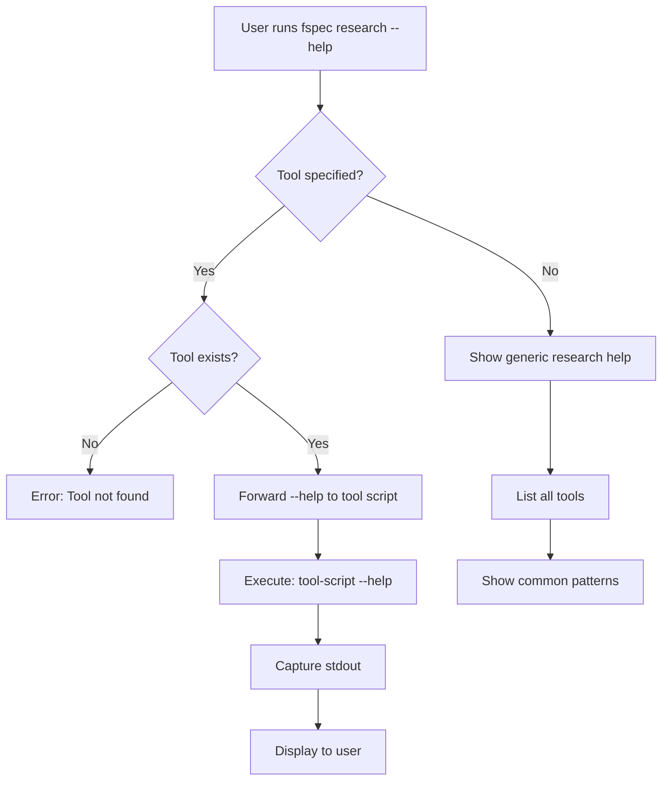

# RES-011: Tool-Specific Help System

## Problem Statement

When running `fspec research --tool=<name> --help`, users currently see generic research help instead of tool-specific documentation:

```bash
$ fspec research --tool=perplexity --help

# Shows GENERIC help for all of 'fspec research'
# Should show Perplexity-specific options: --query, --model, --format
```

This forces users to:
1. Read the actual script file (`spec/research-scripts/perplexity`)
2. Guess command-line flags
3. Trial-and-error to discover options

## Root Cause

The `fspec research` command handles `--help` itself instead of forwarding it to the tool script.



## Proposed Solution

### Help Forwarding Logic



### Implementation

```typescript
// src/commands/research.ts

async function handleHelp(toolName?: string): Promise<void> {
  if (!toolName) {
    // No tool specified - show generic help
    showGenericResearchHelp();
    return;
  }

  // Tool specified - forward to tool script
  const toolPath = path.join('spec/research-scripts', toolName);

  if (!fs.existsSync(toolPath)) {
    console.error(`Error: Research tool '${toolName}' not found`);
    console.error(`Run 'fspec research' to see available tools`);
    process.exit(1);
  }

  // Execute tool script with --help flag
  const result = await execCommand(toolPath, ['--help']);
  console.log(result.stdout);
  process.exit(result.exitCode);
}
```

## Example Output

### Generic Help (No Tool)

```bash
$ fspec research --help

RESEARCH
Execute research tools to answer questions during Example Mapping

USAGE
  fspec research [--tool=<name>] [tool-specific-args...]

OPTIONS
  --tool <name>         Tool to execute (perplexity, ast, jira, etc.)
  --work-unit <id>      Attach results to work unit
  [tool-args]           Arguments passed to research tool

EXAMPLES
  1. List all research tools
     fspec research

  2. Get help for specific tool
     fspec research --tool=perplexity --help

  3. Run research query
     fspec research --tool=perplexity --query "How to use EventSource?"

AVAILABLE TOOLS
  ✓ perplexity - AI-powered research
  ✗ confluence - Search Confluence docs (not configured)
  ✓ jira - Query Jira tickets
  ⚠ ast - Code analysis (limited)
  ✓ stakeholder - Send questions to teams

For tool-specific help: fspec research --tool=<name> --help
```

### Tool-Specific Help (Perplexity)

```bash
$ fspec research --tool=perplexity --help

PERPLEXITY RESEARCH TOOL
Research questions using Perplexity AI during Example Mapping.

USAGE
  perplexity --query "your question here" [options]

OPTIONS
  --query <text>      Question to research (required)
  --model <name>      Perplexity model (default: sonar)
  --format <type>     Output format: markdown, json, text (default: markdown)
  --help              Show this help message

EXAMPLES
  perplexity --query "How does OAuth2 work?"
  perplexity --query "What is Example Mapping?" --format json

CONFIGURATION
  API key must be set in environment variable:
    export PERPLEXITY_API_KEY="pplx-..."

  Or in ~/.fspec/fspec-config.json:
    {
      "research": {
        "perplexity": {
          "apiKey": "pplx-..."
        }
      }
    }

EXIT CODES
  0  Success
  1  Missing required flag (--query)
  2  API key not configured
  3  API error (network, rate limit, etc.)

SETUP
  Run configuration wizard: fspec research --configure perplexity
```

### Tool-Specific Help (AST)

```bash
$ fspec research --tool=ast --help

AST CODE ANALYSIS TOOL
Powered by tree-sitter for language-agnostic code understanding

USAGE
  ast [--query <pattern> | --file <path>] [options]

OPTIONS
  --query <pattern>         Natural language or tree-sitter query
  --file <path>            Analyze specific file
  --language <lang>        Override language detection
  --format <type>          Output format: json, markdown, tree
  --help                   Show this help message

EXAMPLES
  1. Find all exported functions
     ast --query "exported functions"

  2. Find async functions with error handling
     ast --query "async functions with try-catch"

  3. Analyze single file
     ast --file src/utils/openBrowser.ts

  4. Build call graph
     ast --query "call graph for openInBrowser"

SUPPORTED LANGUAGES
  ✓ JavaScript/TypeScript
  ✓ Python
  ✓ Bash
  ⏳ Rust, Go, Java (coming soon)

LIMITATIONS
  ⚠ Currently requires FSPEC_TEST_MODE=1 (production coming in RES-014)

PERFORMANCE
  - Caches parsed ASTs for fast re-queries
  - Incremental parsing on file changes
  - Parallel processing for multiple files

For more: https://tree-sitter.github.io/tree-sitter/
```

## Standardized Help Format

All research tool scripts should follow this template:

```bash
#!/usr/bin/env node

function showHelp() {
  console.log(`TOOL NAME
Brief description of what this tool does

USAGE
  tool-name [required-args] [options]

OPTIONS
  --required <value>    Required option description
  --optional <value>    Optional option description (default: ...)
  --help                Show this help message

EXAMPLES
  1. Basic usage
     tool-name --required value

  2. Advanced usage
     tool-name --required value --optional value

CONFIGURATION
  [Describe config requirements: env vars, config files, etc.]

EXIT CODES
  0  Success
  1  Invalid arguments
  2  Configuration error
  3  Runtime error

SETUP
  [Link to configuration wizard or setup instructions]
`);
}

// Parse args
if (process.argv.includes('--help')) {
  showHelp();
  process.exit(0);
}
```

## Help Validation

Ensure all research tool scripts have `--help`:

```bash
$ fspec research --validate-help

Validating research tool help documentation...

✓ perplexity
  Has --help flag: Yes
  Help format: Valid
  Examples provided: 2

✗ confluence
  Has --help flag: No
  Issue: Missing showHelp() function

✓ jira
  Has --help flag: Yes
  Help format: Valid
  Examples provided: 3

⚠ ast
  Has --help flag: Yes
  Help format: Valid
  Warning: Limitations not documented

✓ stakeholder
  Has --help flag: Yes
  Help format: Valid
  Examples provided: 1

Summary: 4 valid, 1 missing help
```

## Error Messages

### Tool Not Found

```bash
$ fspec research --tool=nonexistent --help

Error: Research tool 'nonexistent' not found

Available tools:
  - perplexity
  - confluence
  - jira
  - ast
  - stakeholder

Run 'fspec research' for full list with status
```

### Help Not Implemented

```bash
$ fspec research --tool=old-tool --help

Warning: Tool 'old-tool' does not implement --help flag

Showing generic usage:
  fspec research --tool=old-tool [args...]

For more information, check: spec/research-scripts/old-tool
```

## Benefits

1. **Self-Documenting**: Each tool documents itself
2. **Discoverability**: Users learn tool capabilities without reading code
3. **Consistency**: Standardized help format across all tools
4. **Maintainability**: Help lives with tool implementation
5. **Extensibility**: New tools automatically get help support

## Implementation Checklist

- [ ] Modify `fspec research` command to forward `--help` to tool scripts
- [ ] Ensure all existing tools implement `--help` flag
- [ ] Create help template for new tools
- [ ] Add `--validate-help` command for quality checks
- [ ] Update documentation with help standards

## Success Metrics

- **Coverage**: 100% of research tools have `--help` documentation
- **Usage**: 50%+ of users run `--help` before using new tool
- **Quality**: Help documentation rated 4+ stars (user survey)
- **Consistency**: All tools follow standardized help format

## Related Work

- RES-010: Tool discovery (links to `--help` for details)
- RES-012: Configuration system (help documents config requirements)
- RES-014: AST tool (implements comprehensive help)
