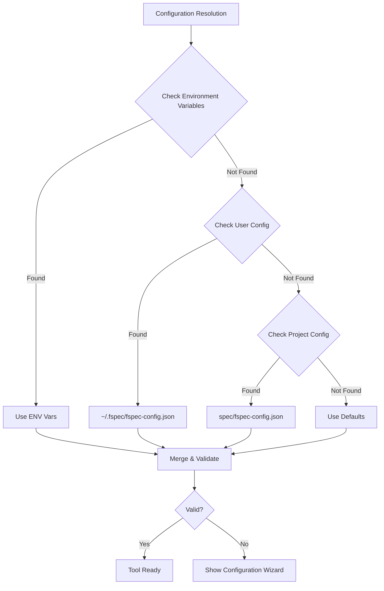
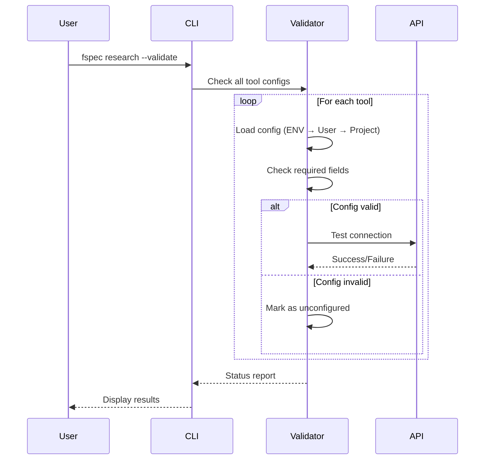

# RES-012: Configuration Management with TUI Integration

## Problem Statement

The current research tool configuration system has several critical UX issues:

1. **Split Brain**: Configuration lives in both `~/.fspec/fspec-config.json` (user-level) and `spec/fspec-config.json` (project-level)
2. **No Validation**: API keys and settings aren't validated until tool execution fails
3. **Plain Text Secrets**: API keys stored in plain text with no environment variable support
4. **No Discovery**: Users don't know which tools are configured until they try them
5. **Manual Setup**: No wizard or guided configuration experience
6. **No Visibility**: Can't see configuration status from TUI

## Proposed Solution

### Multi-Layer Configuration System



### Priority Order

1. **Environment Variables** (highest priority)
   - `PERPLEXITY_API_KEY`
   - `JIRA_TOKEN`
   - `CONFLUENCE_TOKEN`
   - `OPENAI_API_KEY`
   - etc.

2. **User-Level Config** (`~/.fspec/fspec-config.json`)
   - Personal API keys and preferences
   - Shared across all projects
   - .gitignored by default

3. **Project-Level Config** (`spec/fspec-config.json`)
   - Project-specific research tool URLs
   - Team defaults (no secrets)
   - Version controlled

4. **Defaults** (lowest priority)
   - Built-in sensible defaults
   - Public API endpoints

## TUI Integration: Configuration Viewer

### Design

Add a new view mode to TUI (similar to checkpoint-viewer and changed-files-viewer):


### Keyboard Shortcuts

- **R** - Open Research Configuration Viewer
- **ESC** - Return to board
- **↑/↓** - Navigate tools
- **Enter** - Edit selected tool configuration
- **V** - Validate all configurations
- **T** - Test selected tool (dry run)

### UI Layout

```
┌─ Research Tool Configuration ────────────────────────────────────────┐
│                                                                       │
│  Tool Status                    Configuration Source                 │
│  ═══════════                    ═══════════════════                  │
│                                                                       │
│  ✓ Perplexity                   ENV: PERPLEXITY_API_KEY              │
│    API Ready                     Model: sonar                         │
│                                  Last Validated: 2min ago             │
│                                                                       │
│  ✗ Confluence                   NOT CONFIGURED                        │
│    Missing API key               Press Enter to configure             │
│                                                                       │
│  ✓ Jira                         USER: ~/.fspec/fspec-config.json     │
│    API Ready                     Host: company.atlassian.net          │
│                                  Last Validated: 1hr ago              │
│                                                                       │
│  ✗ AST (tree-sitter)            NOT AVAILABLE                         │
│    Production mode disabled      See RES-014 for implementation       │
│                                                                       │
│  ⚠  Stakeholder                 PROJECT: spec/fspec-config.json       │
│    Partial config                Teams webhook configured             │
│                                  Slack missing (optional)             │
│                                                                       │
├─ Actions ────────────────────────────────────────────────────────────┤
│                                                                       │
│  [Enter] Edit  [V] Validate All  [T] Test  [ESC] Back to Board       │
│                                                                       │
└───────────────────────────────────────────────────────────────────────┘
```

## Configuration Wizard

Interactive CLI wizard for first-time setup:

```bash
$ fspec research --configure perplexity

Research Tool Configuration Wizard
===================================

Configuring: Perplexity AI

Step 1/3: API Key
-----------------
Perplexity requires an API key from https://perplexity.ai/settings/api

Where would you like to store the API key?
  [1] Environment variable (PERPLEXITY_API_KEY) - Recommended
  [2] User config (~/.fspec/fspec-config.json)
  [3] Project config (spec/fspec-config.json) - NOT recommended for secrets

Choice [1]: 1

Please set the environment variable:
  export PERPLEXITY_API_KEY="pplx-..."

Or add to ~/.bashrc / ~/.zshrc for persistence.

Continue when ready [Press Enter]:

Step 2/3: Model Selection
--------------------------
Default model: sonar

Available models:
  - sonar (fast, recommended)
  - sonar-pro (more accurate, slower)

Use default? [Y/n]: y

Step 3/3: Validation
--------------------
Testing connection to Perplexity API...

✓ API key valid
✓ Model "sonar" available
✓ Test query successful

Configuration complete!

Would you like to configure another tool? [y/N]: n
```

## Validation System



### Validation Command

```bash
$ fspec research --validate

Validating Research Tool Configurations...

✓ Perplexity
  Source: ENV (PERPLEXITY_API_KEY)
  Model: sonar
  Status: Connected

✗ Confluence
  Status: Not configured
  Missing: CONFLUENCE_URL, CONFLUENCE_TOKEN

✓ Jira
  Source: USER (~/.fspec/fspec-config.json)
  Host: company.atlassian.net
  Status: Connected

⚠  Stakeholder
  Source: PROJECT (spec/fspec-config.json)
  Status: Partially configured
  Teams: ✓ Configured
  Slack: ✗ Missing webhook URL (optional)

Summary: 2 ready, 1 partial, 1 unconfigured
```

## Environment Variable Support

### Standard Variables

| Tool | Environment Variable | Required | Default |
|------|---------------------|----------|---------|
| Perplexity | `PERPLEXITY_API_KEY` | Yes | - |
| Perplexity | `PERPLEXITY_MODEL` | No | `sonar` |
| Confluence | `CONFLUENCE_URL` | Yes | - |
| Confluence | `CONFLUENCE_TOKEN` | Yes | - |
| Jira | `JIRA_URL` | Yes | - |
| Jira | `JIRA_TOKEN` | Yes | - |
| Stakeholder | `TEAMS_WEBHOOK_URL` | No | - |
| Stakeholder | `SLACK_WEBHOOK_URL` | No | - |

### .env File Support

Support loading from `.env` file (gitignored):

```bash
# .env (project root)
PERPLEXITY_API_KEY=pplx-...
JIRA_URL=https://company.atlassian.net
JIRA_TOKEN=...
```

Use `dotenv` library to load automatically.

## Implementation Plan

### Phase 1: Config Resolution Layer
1. Implement multi-layer config resolution (ENV → User → Project → Defaults)
2. Add validation schema for each tool
3. Support .env file loading

### Phase 2: CLI Wizard
1. Build interactive configuration wizard
2. Add `--configure <tool>` flag
3. Implement validation during setup

### Phase 3: TUI Integration
1. Create `ResearchConfigViewer` component
2. Add 'R' keybinding to BoardView
3. Implement edit/validate/test actions

### Phase 4: Environment Variable Support
1. Define standard env var names
2. Update all research tools to check env vars first
3. Document in tool --help output

## Security Considerations

1. **Never commit secrets** - User config should be .gitignored
2. **Prefer env vars** - Encourage environment variables over config files
3. **Validate inputs** - Sanitize API keys and URLs before storage
4. **Audit logging** - Log config changes (not values) for accountability

## Testing Strategy

1. **Unit Tests**: Config resolution priority order
2. **Integration Tests**: Wizard flow end-to-end
3. **E2E Tests**: TUI config viewer interactions
4. **Security Tests**: Ensure secrets not leaked in logs/errors

## Success Metrics

- Time to configure first research tool < 2 minutes
- Zero plain-text API keys in project repos
- 100% of tools show configuration status in TUI
- Validation catches 100% of misconfigurations before tool execution

## Related Work

- RES-010: Tool Discovery (shows config status)
- RES-013: Smart Integration (uses validated configs)
- RES-014: AST Tool (new tool to integrate with config system)
