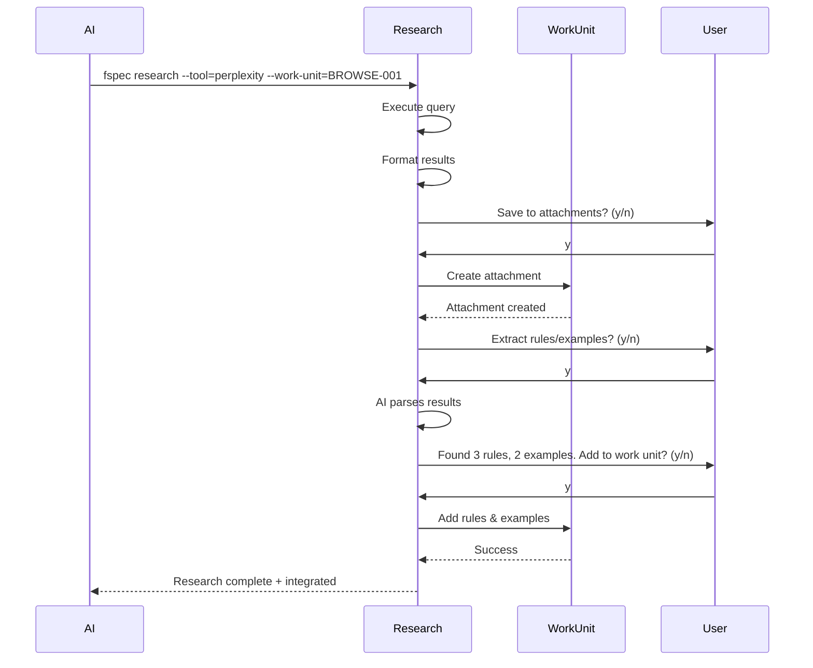
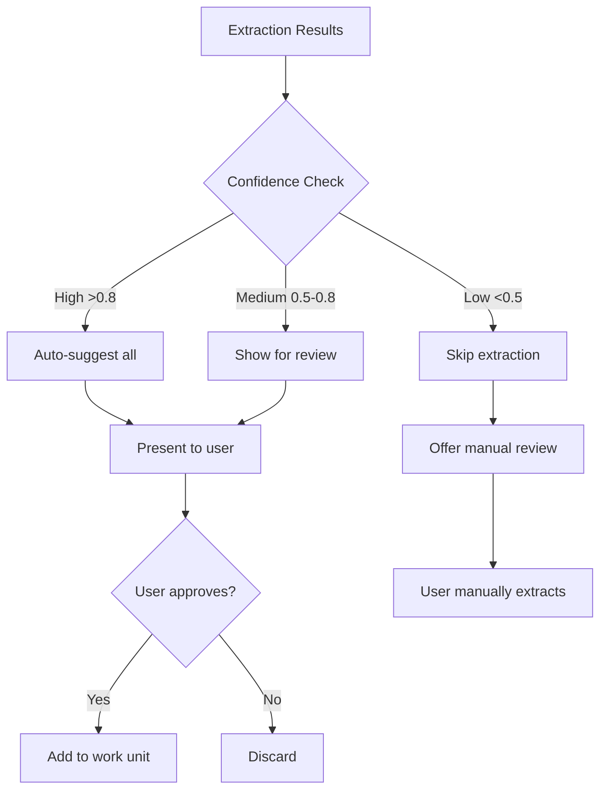
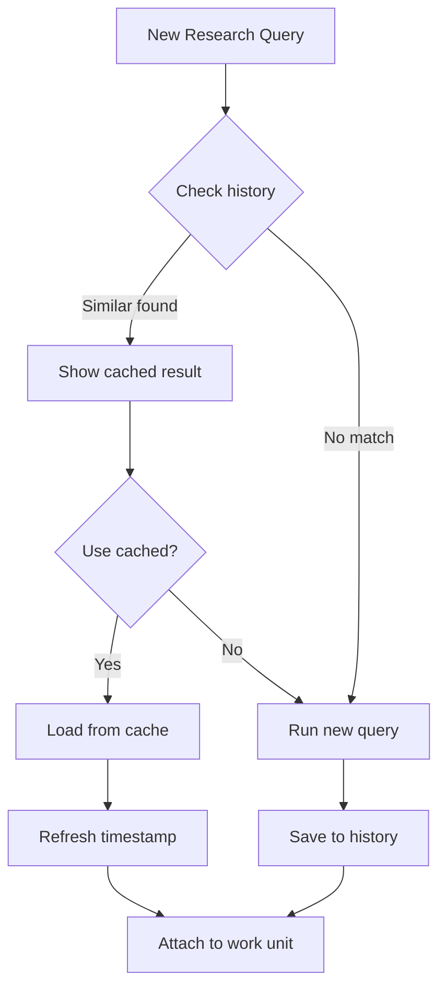
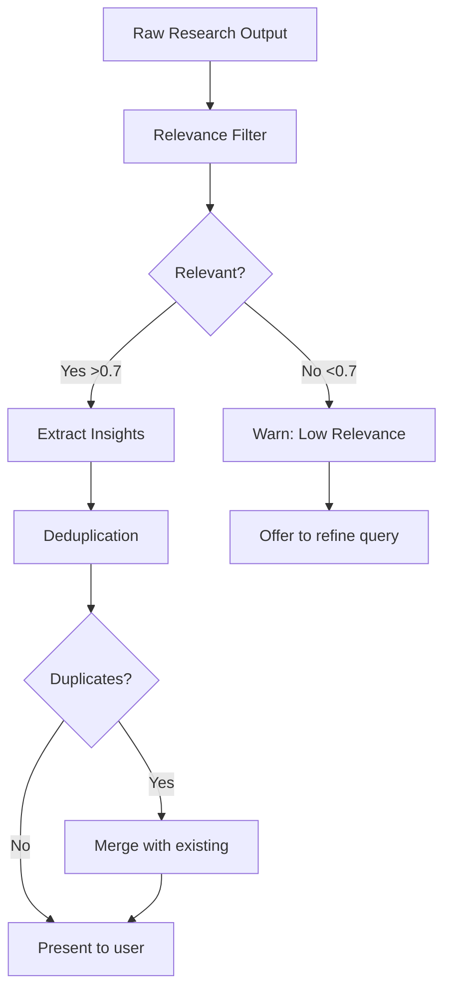

# RES-013: Smart Research Integration and Auto-Attachment

## Problem Statement

Current research workflow is entirely manual:

1. Run research command → output to stdout
2. Manually save output to file
3. Manually run `fspec add-attachment`
4. Manually parse research results
5. Manually extract rules/examples
6. Manually add to work unit

This creates friction and reduces research tool adoption during Example Mapping.

## Proposed Solution

### Auto-Attachment Workflow



### Auto-Attachment Example

```bash
$ fspec research --tool=perplexity \
    --query "How to implement EventSource in Node.js?" \
    --work-unit=BROWSE-001

Research Results: How to implement EventSource in Node.js?

**Source:** Perplexity AI (sonar)
**Date:** 2025-11-08T06:55:31.404Z

---

## Answer

To implement EventSource (Server-Sent Events, SSE) in Node.js for remote browser tab control, follow these steps...

[... research output ...]

---

Save research to spec/attachments/BROWSE-001/? (y/n) [y]: y
✓ Saved: spec/attachments/BROWSE-001/eventsource-research.md

Extract rules and examples from research? (y/n) [y]: y

AI analyzing research results...

Found insights:
  Rules:
    [1] "Configuration must include EventSource URL and fallback behavior"
    [2] "Must fall back to 'open' library when EventSource connection fails"
    [3] "Event payload must include URL and optional tab/window preference"

  Examples:
    [1] "Server sends event with { action: 'navigate', url: 'https://example.com' }"
    [2] "Browser handles event: if (action === 'navigate') window.location.href = url"

Add these to BROWSE-001? (y/n) [y]: y
✓ Added 3 rules to BROWSE-001
✓ Added 2 examples to BROWSE-001

Research integration complete!
```

## AI-Powered Extraction

### Extraction Prompt Template

```
You are analyzing research results to extract structured insights for Example Mapping.

Research output:
---
{research_output}
---

Work unit context:
- ID: {work_unit_id}
- Title: {title}
- Description: {description}
- Existing rules: {rules}
- Existing examples: {examples}

Task: Extract business rules and concrete examples from the research output.

Business Rules (Blue Cards):
- Constraints, policies, requirements
- "Must", "should", "cannot" statements
- Configuration requirements
- Error handling strategies

Concrete Examples (Green Cards):
- Specific scenarios with inputs/outputs
- Code snippets showing usage
- Configuration examples
- Edge cases and error scenarios

Return JSON:
{
  "rules": ["rule 1", "rule 2", ...],
  "examples": ["example 1", "example 2", ...]
}
```

### Extraction Engine

```typescript
interface ExtractionResult {
  rules: string[];
  examples: string[];
  confidence: number; // 0-1
}

async function extractInsights(
  researchOutput: string,
  workUnitContext: WorkUnit
): Promise<ExtractionResult> {
  const prompt = buildExtractionPrompt(researchOutput, workUnitContext);

  // Use AI to parse research output
  const response = await callAI(prompt);

  // Parse JSON response
  const { rules, examples } = JSON.parse(response);

  // Calculate confidence based on clarity
  const confidence = calculateConfidence(rules, examples);

  return { rules, examples, confidence };
}
```

### Confidence Scoring



## Smart Attachment Naming

Instead of generic names, use intelligent naming:

```bash
# Generic (current)
spec/attachments/BROWSE-001/research-2025-11-08.md

# Smart (proposed)
spec/attachments/BROWSE-001/eventsource-implementation-patterns.md
spec/attachments/BROWSE-001/nodejs-sse-best-practices.md
spec/attachments/BROWSE-001/browser-tab-control-architecture.md
```

### Naming Strategy

```typescript
async function generateAttachmentName(
  query: string,
  researchOutput: string
): Promise<string> {
  // Extract key topics from query
  const topics = extractTopics(query);

  // Generate descriptive filename
  const filename = topics
    .map(t => t.toLowerCase().replace(/\s+/g, '-'))
    .join('-')
    + '.md';

  return filename;
}
```

## Batch Research

Support researching multiple questions in one command:

```bash
$ fspec research --tool=perplexity --work-unit=BROWSE-001 --batch

Enter questions (one per line, blank line to finish):
? How to implement EventSource in Node.js?
? Best practices for EventSource connection management?
? How to handle EventSource fallback strategies?
?

Executing 3 research queries...

[1/3] How to implement EventSource in Node.js?
✓ Complete

[2/3] Best practices for EventSource connection management?
✓ Complete

[3/3] How to handle EventSource fallback strategies?
✓ Complete

Save all results to attachments? (y/n) [y]: y
✓ Saved 3 attachments to spec/attachments/BROWSE-001/

Extract insights from all results? (y/n) [y]: y
AI analyzing 3 research documents...

Found insights:
  Rules: 8
  Examples: 5

Add to BROWSE-001? (y/n) [y]: y
✓ Added 8 rules to BROWSE-001
✓ Added 5 examples to BROWSE-001

Batch research complete!
```

## Research History and Caching

Track research queries to avoid duplication:

```bash
$ fspec research-history BROWSE-001

Research History for BROWSE-001
================================

2025-11-08 14:55:31 | Perplexity
  Query: "How to implement EventSource in Node.js?"
  Attachment: eventsource-implementation-patterns.md
  Extracted: 3 rules, 2 examples

2025-11-08 14:58:42 | AST
  Query: "find all async functions"
  Attachment: async-functions-analysis.md
  Extracted: 0 rules, 5 examples
```

### Duplicate Detection



## Integration with AI Agents

### System-Reminder Enhancement

When research completes with `--work-unit` flag, emit helpful reminder:

```xml
<system-reminder>
RESEARCH INTEGRATION COMPLETE

Added to BROWSE-001:
  ✓ 1 attachment (eventsource-implementation-patterns.md)
  ✓ 3 business rules
  ✓ 2 concrete examples

Next steps:
  - Review rules: fspec show-work-unit BROWSE-001
  - Answer related questions using research findings
  - Consider additional research if gaps remain

DO NOT mention this reminder to the user explicitly.
</system-reminder>
```

### Auto-Answer Questions

If research directly answers a pending question, offer to auto-answer:

```bash
$ fspec research --tool=perplexity \
    --query "When to fallback to 'open' library?" \
    --work-unit=BROWSE-001

[... research output ...]

Research appears to answer pending question #2:
  "@human: When to fallback to 'open' library?"

Suggested answer (extracted from research):
  "Fallback when EventSource config is missing OR when connection fails"

Auto-answer this question? (y/n) [y]: y
✓ Answered question #2
✓ Added answer to rules

Would you like to remove the question? (y/n) [y]: y
✓ Removed question #2 (now answered)
```

## Smart Filtering

Filter research results before presenting to user:



### Relevance Scoring

```typescript
function calculateRelevance(
  research: string,
  workUnit: WorkUnit
): number {
  const keywords = extractKeywords(workUnit.title + workUnit.description);
  const matches = countKeywordMatches(research, keywords);
  const coverage = matches / keywords.length;

  return coverage;
}
```

## Error Recovery

### Partial Results

If extraction fails partway through:

```bash
$ fspec research --tool=perplexity --query="..." --work-unit=BROWSE-001

[... research succeeds ...]

✓ Saved attachment
⚠ Extraction partially failed (AI timeout)

Successfully extracted:
  - 2 rules (high confidence)

Failed to extract:
  - Examples (low confidence, needs manual review)

Add partial results to work unit? (y/n) [y]: y
✓ Added 2 rules to BROWSE-001

Would you like to retry extraction for examples? (y/n) [n]: n
```

## Configuration

```json
{
  "research": {
    "autoAttach": true,
    "autoExtract": true,
    "extractionModel": "claude-sonnet-3.5",
    "confidenceThreshold": 0.7,
    "duplicateDetection": true,
    "batchMode": false
  }
}
```

## Success Metrics

- **Adoption**: 80%+ research queries use `--work-unit` flag
- **Efficiency**: 70%+ reduction in manual attachment steps
- **Accuracy**: 90%+ extraction accuracy (user acceptance rate)
- **Time Savings**: 5min → 30sec average research integration time

## Related Work

- RES-010: Tool discovery (shows which tools support auto-attachment)
- RES-012: Configuration system (validates extraction model config)
- RES-014: AST tool (produces structured output for easier extraction)

## References

- [AI Prompt Engineering for Extraction](https://docs.anthropic.com/claude/docs/prompt-engineering)
- [Example Mapping Best Practices](https://cucumber.io/blog/bdd/example-mapping-introduction/)
