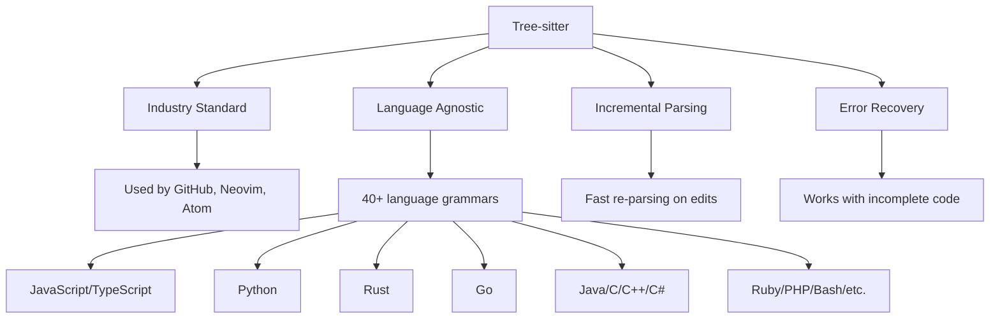
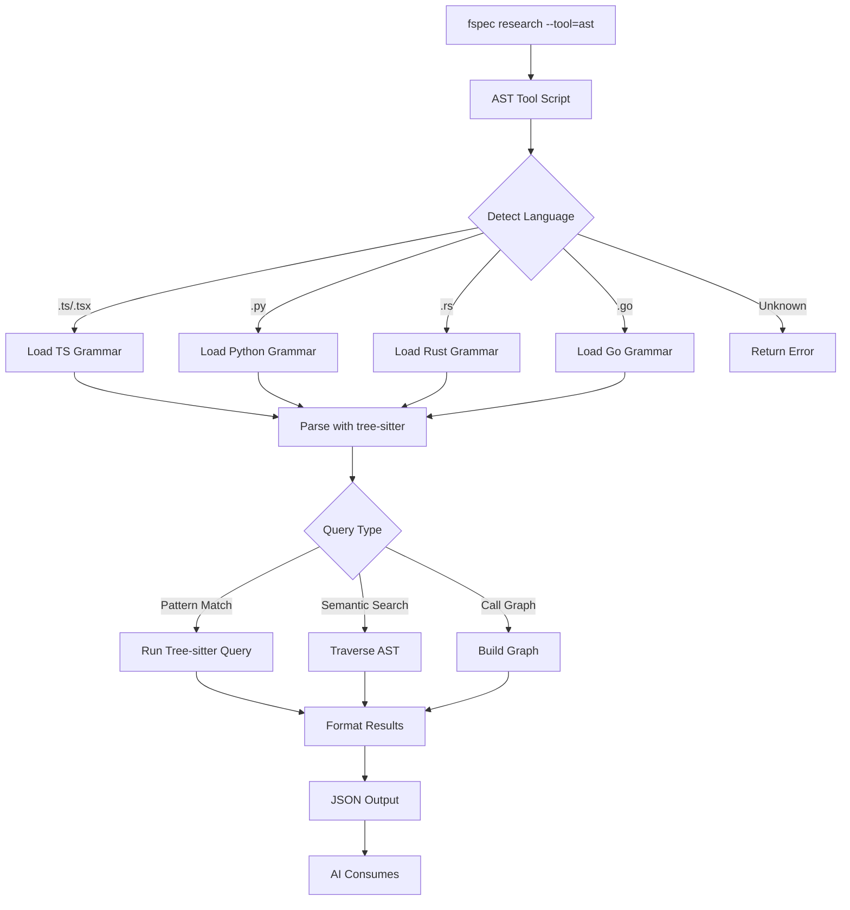
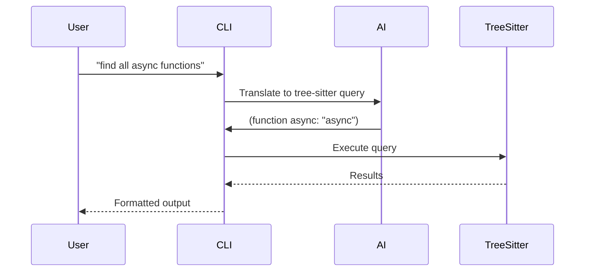
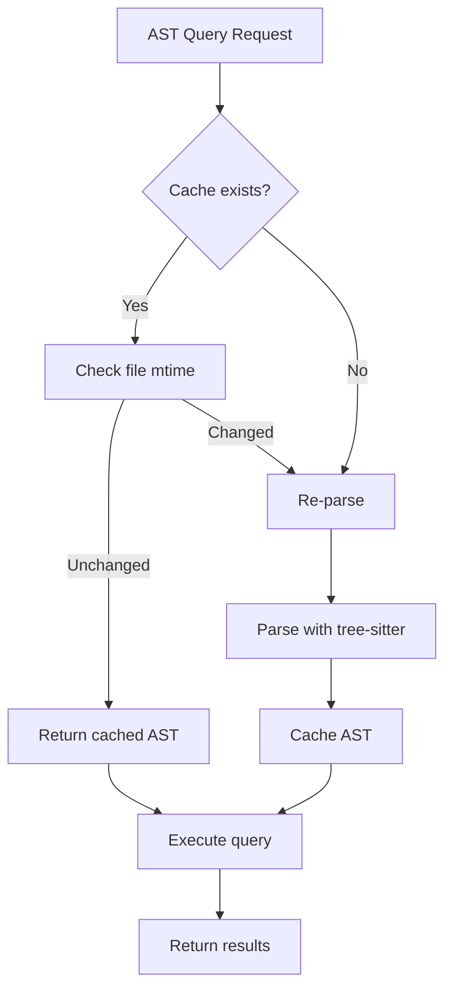

# RES-014: Language-Agnostic AST Tool for AI Analysis

## Problem Statement

The current AST research tool is unusable in production:

1. **Test Mode Only**: Requires `FSPEC_TEST_MODE=1`, blocking real Example Mapping workflows
2. **Language Specific**: Likely tied to JavaScript/TypeScript only
3. **Limited Functionality**: Unclear what patterns it can detect
4. **Poor AI Integration**: Doesn't provide semantic understanding needed for AI agents

## Why AI Needs AST (Not Just Grepping)

### Grep vs AST Comparison

| Capability | Grep/Regex | AST Analysis |
|-----------|------------|--------------|
| Find literal strings | ✓ Fast | ✓ Slower |
| Understand syntax | ✗ No | ✓ Yes |
| Language agnostic | ✓ Yes | ⚠️  Need parsers |
| Find patterns across lines | ⚠️  Complex | ✓ Easy |
| Semantic relationships | ✗ No | ✓ Yes |
| Rename refactoring safe | ✗ No | ✓ Yes |
| Call graph analysis | ✗ No | ✓ Yes |

### AI Use Cases for AST

1. **Architecture Understanding**
   - Find all exported functions/classes
   - Map dependency graphs
   - Identify design patterns (singleton, factory, etc.)

2. **Code Pattern Detection**
   - Find all async functions with error handling
   - Locate functions with >5 parameters (code smell)
   - Identify unused imports

3. **Impact Analysis**
   - "What calls this function?"
   - "What does this class inherit from?"
   - "Where is this interface implemented?"

4. **Semantic Search**
   - Find functions by semantic meaning, not just name
   - Locate code blocks with specific control flow
   - Search by code structure, not text patterns

## Proposed Solution: Tree-sitter

### Why Tree-sitter?



### Tree-sitter Features

1. **Language Agnostic**
   - 40+ officially maintained grammars
   - Community grammars for niche languages
   - Consistent API across all languages

2. **Production Ready**
   - Powers GitHub's code navigation
   - Used in Neovim for syntax highlighting
   - Battle-tested at scale

3. **Error Tolerant**
   - Parses incomplete/invalid code gracefully
   - Returns partial AST with error nodes
   - Perfect for AI analyzing in-progress work

4. **Fast & Incremental**
   - Parses large files quickly
   - Incremental updates on edits
   - Suitable for real-time analysis

5. **Rich Query Language**
   - S-expression queries for pattern matching
   - Supports capturing nodes, predicates
   - More powerful than regex for code search

## Implementation Architecture



## Query Patterns

### Example: Find All Exported Functions

```scheme
; Tree-sitter query for TypeScript
(export_statement
  declaration: (function_declaration
    name: (identifier) @function.name
    parameters: (formal_parameters) @function.params
  )
) @export
```

### Example: Find Async Functions with Try-Catch

```scheme
; Tree-sitter query
(function_declaration
  async: "async"
  name: (identifier) @function.name
  body: (statement_block
    (try_statement) @try
  )
) @async.with.error.handling
```

### Example: Find Classes with >5 Methods

```scheme
; Tree-sitter query + filter
(class_declaration
  name: (identifier) @class.name
  body: (class_body
    (method_definition) @method
  )
) @class

; Post-processing: filter where count(@method) > 5
```

## CLI Interface

### Basic Usage

```bash
# Find all exported functions
$ fspec research --tool=ast --query "find exported functions"

{
  "matches": [
    {
      "file": "src/commands/research.ts",
      "line": 42,
      "function": "executeResearch",
      "kind": "export",
      "parameters": ["tool", "args"]
    },
    ...
  ],
  "stats": {
    "filesScanned": 158,
    "matchCount": 23
  }
}
```

### Advanced Queries

```bash
# Find all async functions
$ fspec research --tool=ast --query "async functions"

# Find functions with >5 parameters (code smell)
$ fspec research --tool=ast --query "functions with >5 parameters"

# Find all classes implementing interface
$ fspec research --tool=ast --query "classes implementing IRepository"

# Build call graph for function
$ fspec research --tool=ast --query "call graph for openInBrowser"

# Find unused imports
$ fspec research --tool=ast --query "unused imports"
```

### File-Specific Analysis

```bash
# Analyze single file
$ fspec research --tool=ast --file "src/utils/openBrowser.ts"

{
  "file": "src/utils/openBrowser.ts",
  "language": "typescript",
  "ast": {
    "type": "program",
    "exports": [
      {
        "name": "openInBrowser",
        "kind": "function",
        "async": true,
        "parameters": ["options"],
        "line": 19
      }
    ],
    "imports": [
      {
        "source": "open",
        "kind": "default",
        "line": 6
      }
    ]
  },
  "metrics": {
    "functions": 1,
    "lines": 28,
    "complexity": 2
  }
}
```

## Language Support

### Phase 1 (MVP)

1. **JavaScript/TypeScript** - Most common in fspec codebase
2. **Python** - Popular for AI/scripting
3. **Bash** - Research tool scripts

### Phase 2 (Extended)

4. **Rust** - Systems programming
5. **Go** - Backend services
6. **Java/C#** - Enterprise codebases

### Phase 3 (Comprehensive)

7. **C/C++** - Low-level code
8. **Ruby** - Web frameworks
9. **PHP** - Legacy codebases
10. **Other** - On-demand based on usage

## Natural Language to Query Translation

### AI-Powered Query Builder



Use LLM to translate natural language → tree-sitter queries:

```bash
# AI translates this...
$ fspec research --tool=ast --query "find functions that make HTTP requests"

# ...into tree-sitter query like:
(call_expression
  function: (member_expression
    object: (identifier) @obj
    property: (property_identifier) @prop
  )
)
; where @obj matches "fetch" | "axios" | "http" | "https"
```

## Integration with Example Mapping

### Workflow


### Example

```bash
# During Example Mapping for BROWSE-001
$ fspec add-question BROWSE-001 "@ai: How is openBrowser currently used?"

# AI internally runs:
$ fspec research --tool=ast --query "find calls to openInBrowser" --work-unit=BROWSE-001

# Results auto-attached to BROWSE-001
# AI uses results to answer question:
$ fspec answer-question BROWSE-001 0 --answer "openInBrowser used in 2 places: TUI attachment viewer and report-bug command" --add-to rule
```

## Performance Considerations

### Caching Strategy



### Optimizations

1. **Incremental Parsing**: Only re-parse changed files
2. **Query Caching**: Cache common query results
3. **Parallel Processing**: Parse multiple files concurrently
4. **Lazy Loading**: Load grammars on-demand

### Performance Targets

| Operation | Target | Rationale |
|-----------|--------|-----------|
| Parse single file | <100ms | Real-time feedback |
| Parse entire codebase | <5s | Acceptable for research |
| Query execution | <500ms | Interactive use |
| Cache hit | <10ms | Near instant |

## Error Handling

### Partial AST on Syntax Errors

```json
{
  "file": "src/broken.ts",
  "language": "typescript",
  "ast": {
    "type": "program",
    "children": [...],
    "errors": [
      {
        "line": 42,
        "column": 15,
        "message": "Expected ';' but found 'function'"
      }
    ]
  },
  "partialResults": true
}
```

Tree-sitter returns partial AST even with syntax errors, allowing AI to still extract useful information.

## Testing Strategy

### Unit Tests

```typescript
describe('AST Tool', () => {
  it('should parse TypeScript file', async () => {
    const result = await parseFile('test.ts');
    expect(result.language).toBe('typescript');
    expect(result.ast.type).toBe('program');
  });

  it('should find exported functions', async () => {
    const result = await query('find exported functions', 'test.ts');
    expect(result.matches).toHaveLength(3);
  });

  it('should handle syntax errors gracefully', async () => {
    const result = await parseFile('broken.ts');
    expect(result.partialResults).toBe(true);
    expect(result.errors).toBeDefined();
  });
});
```

### Integration Tests

```bash
# Test with real codebase
$ npm run test:ast

Testing AST tool on fspec codebase...
✓ Parsed 158 files
✓ Found 342 functions
✓ Detected 12 async functions
✓ Identified 5 exported classes
✓ Built call graph (2,341 edges)

All tests passed!
```

## Documentation & Help

### Tool-Specific Help

```bash
$ fspec research --tool=ast --help

AST CODE ANALYSIS TOOL
Powered by tree-sitter for language-agnostic code understanding

USAGE
  fspec research --tool=ast [options]

OPTIONS
  --query <pattern>         Natural language or tree-sitter query
  --file <path>            Analyze specific file
  --language <lang>        Override language detection
  --format <type>          Output format: json, markdown, tree
  --work-unit <id>         Attach results to work unit

EXAMPLES
  1. Find all exported functions
     fspec research --tool=ast --query "exported functions"

  2. Find async functions with error handling
     fspec research --tool=ast --query "async functions with try-catch"

  3. Analyze single file
     fspec research --tool=ast --file src/utils/openBrowser.ts

  4. Build call graph
     fspec research --tool=ast --query "call graph for openInBrowser"

SUPPORTED LANGUAGES
  ✓ JavaScript/TypeScript
  ✓ Python
  ✓ Bash
  ⏳ Rust, Go, Java (coming soon)

PERFORMANCE
  - Caches parsed ASTs for fast re-queries
  - Incremental parsing on file changes
  - Parallel processing for multiple files

For more: https://tree-sitter.github.io/tree-sitter/
```

## Migration Path from Current AST Tool

### Phase 1: Coexistence
- Keep current AST tool (test mode only)
- Build new tree-sitter tool alongside
- Mark old tool as deprecated

### Phase 2: Feature Parity
- Implement all queries from old tool
- Add new tree-sitter capabilities
- Test with real Example Mapping workflows

### Phase 3: Cutover
- Remove `FSPEC_TEST_MODE=1` requirement
- Default to tree-sitter implementation
- Archive old AST tool code

### Phase 4: Enhancement
- Add more languages
- Improve AI query translation
- Optimize performance

## Success Metrics

- **Usability**: AI can run AST queries without test mode
- **Coverage**: Supports top 5 languages in fspec ecosystem
- **Performance**: Parses entire codebase in <5 seconds
- **Accuracy**: 95%+ query result relevance
- **Adoption**: 50%+ of Example Mapping sessions use AST tool

## Related Work

- RES-012: Configuration system (validates AST tool setup)
- RES-013: Smart integration (auto-attaches AST results)
- RES-010: Tool discovery (shows AST tool status and capabilities)

## References

- [Tree-sitter Documentation](https://tree-sitter.github.io/tree-sitter/)
- [Tree-sitter Playground](https://tree-sitter.github.io/tree-sitter/playground)
- [Language Grammars](https://github.com/tree-sitter/tree-sitter/wiki/List-of-parsers)
- [Query Syntax](https://tree-sitter.github.io/tree-sitter/using-parsers#pattern-matching-with-queries)
