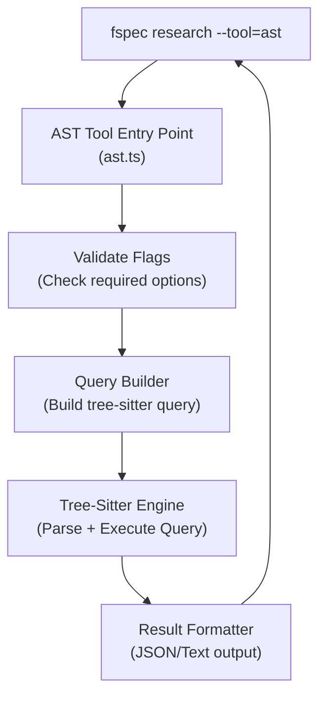
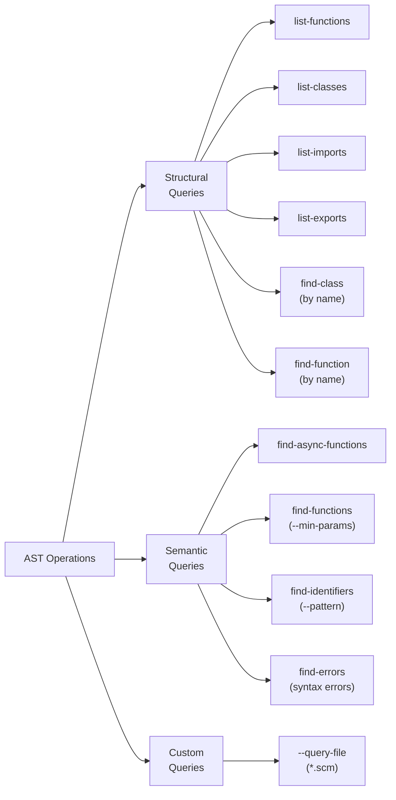
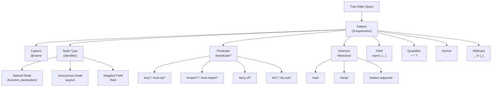

# AST Tool Refactoring Research: Replacing Semantic Natural Language with Deterministic Tree-Sitter Queries

**Date**: 2025-11-12
**Objective**: Refactor the fspec AST research tool to eliminate semantic natural language query parsing and replace it with deterministic tree-sitter query language operations.

---

## Executive Summary

The current fspec AST tool (`src/research-tools/ast.ts` and `src/utils/ast-parser.ts`) uses **semantic natural language processing** to interpret user queries (e.g., `"find all functions"`, `"class MyClass"`). This violates the principle that **only AI should use semantic natural language** - fspec is a deterministic script and should use deterministic, structured query patterns.

**Key Finding**: Tree-sitter provides a complete, deterministic S-expression-based query language that can express ALL the patterns currently handled by natural language parsing, plus many more advanced capabilities.

**Recommendation**: Replace the natural language query system with tree-sitter's query language, exposing predefined query operations through explicit command-line flags.

---

## Problem Analysis

### Current Anti-Patterns in `ast-parser.ts`

The following code sections use **semantic natural language parsing**:

```typescript
// Line 421-427: Semantic phrase detection
const isFindAll =
  queryLower.includes('find all') ||
  queryLower.includes('all ') ||
  queryLower.startsWith('all');

// Line 430: Semantic word matching
if (queryLower.includes('class')) { /* ... */ }

// Line 439: Semantic pattern extraction
const classMatch = /class\s+(\w+)/.exec(query);

// Line 457: Semantic word matching
if (queryLower.includes('function')) { /* ... */ }

// Line 465: Semantic word matching
if (queryLower.includes('import')) { /* ... */ }

// Line 478: Semantic phrase matching
if (queryLower.includes('export default')) { /* ... */ }
```

**Why this is problematic**:
1. **Ambiguity**: "find all functions" vs "all functions" vs "functions" - unclear boundaries
2. **Language coupling**: Only works for English natural language
3. **Limited expressiveness**: Cannot express complex patterns (e.g., "functions with > 5 parameters", "async functions returning promises")
4. **Maintenance burden**: Adding new patterns requires string matching logic
5. **No composition**: Cannot combine patterns (e.g., "classes with methods that call external APIs")

---

## Tree-Sitter Query Language Capabilities

Tree-sitter provides a **deterministic S-expression query language** with the following capabilities:

### 1. Basic Pattern Matching

```scheme
; Match any function declaration
(function_declaration) @function

; Match binary expressions
(binary_expression) @expr
```

### 2. Field-Based Matching

```scheme
; Match function with specific name
(function_declaration
  name: (identifier) @fn-name)

; Match assignment to member expression
(assignment_expression
  left: (member_expression
    object: (call_expression)))
```

### 3. Anonymous Node Matching

```scheme
; Match specific operators
(binary_expression
  operator: "!="
  right: (null))
```

### 4. Wildcards

```scheme
; Match any named node
(call (_) @call.inner)

; Match any node (named or anonymous)
(expression _)
```

### 5. Quantifiers

```scheme
; One or more comments
(comment)+ @doc

; Zero or more decorators
(class_declaration
  (decorator)* @decorator
  name: (identifier) @name)

; Optional string argument
(call_expression
  function: (identifier) @fn
  arguments: (arguments (string)? @arg))
```

### 6. Grouping

```scheme
; Comment followed by function
(
  (comment)
  (function_declaration)
)

; Comma-separated numbers
(
  (number)
  ("," (number))*
)
```

### 7. Alternations

```scheme
; Match call to variable OR property
(call_expression
  function: [
    (identifier) @function
    (member_expression
      property: (property_identifier) @method)
  ])
```

### 8. Predicates

```scheme
; Match identifiers starting with capital letter
((identifier) @constant
  (#match? @constant "^[A-Z][A-Z_]+"))

; Match specific builtin variables
((identifier) @builtin
  (#any-of? @builtin "arguments" "module" "window"))

; Match when two captures have same text
(pair
  key: (property_identifier) @key
  value: (identifier) @value
  (#eq? @key @value))

; Negation
((identifier) @var
  (#not-match? @var "^(lambda|load)$"))
```

### 9. Anchors

```scheme
; First identifier in array
(array . (identifier) @first)

; Last expression in block
(block (_) @last .)

; Consecutive identifiers in dotted name
(dotted_name
  (identifier) @prev
  .
  (identifier) @next)
```

### 10. Negated Fields

```scheme
; Class without type parameters
(class_declaration
  name: (identifier) @name
  !type_parameters)
```

---

## Proposed Refactoring Architecture

### High-Level Design



### Command-Line Interface Redesign

**BEFORE (Semantic Natural Language)**:
```bash
# Ambiguous, semantic, English-dependent
fspec research --tool=ast --query "find all functions"
fspec research --tool=ast --query "class MyClass"
fspec research --tool=ast --query "functions with more than 5 parameters"
```

**AFTER (Deterministic Operations)**:
```bash
# Operation-based flags (deterministic)
fspec research --tool=ast --operation=list-functions --file=src/auth.ts
fspec research --tool=ast --operation=list-classes --file=src/auth.ts
fspec research --tool=ast --operation=find-class --name=MyClass --file=src/auth.ts
fspec research --tool=ast --operation=list-imports --file=src/auth.ts
fspec research --tool=ast --operation=find-exports --export-type=default --file=src/auth.ts

# Advanced operations with predicates
fspec research --tool=ast --operation=find-functions --min-params=5 --file=src/auth.ts
fspec research --tool=ast --operation=find-identifiers --pattern="^[A-Z][A-Z_]+" --file=src/auth.ts
fspec research --tool=ast --operation=find-async-functions --file=src/auth.ts

# Custom query (for power users)
fspec research --tool=ast --query-file=queries/my-pattern.scm --file=src/auth.ts
```

### Operation Taxonomy



---

## Detailed Tree-Sitter Query Mappings

### Current Operation → Tree-Sitter Query Translation

| Current Semantic Query | Tree-Sitter Query | Operation Flag |
|------------------------|-------------------|----------------|
| `"find all functions"` | `(function_declaration) @fn`<br/>`(function_expression) @fn`<br/>`(arrow_function) @fn` | `--operation=list-functions` |
| `"find all classes"` | `(class_declaration) @class`<br/>`(class) @class` | `--operation=list-classes` |
| `"class ClassName"` | `(class_declaration name: (identifier) @name (#eq? @name "ClassName"))` | `--operation=find-class --name=ClassName` |
| `"find all imports"` | `(import_statement) @import`<br/>`(import_declaration) @import` | `--operation=list-imports` |
| `"export default"` | `(export_statement (#eq? "default")) @export` | `--operation=find-exports --export-type=default` |
| `"functions with > 5 params"` | `(function_declaration parameters: (formal_parameters (_)+ @param) (#gt-count? @param 5))` | `--operation=find-functions --min-params=5` |
| `"async functions"` | `(function_declaration "async") @async-fn` | `--operation=find-async-functions` |

### New Capabilities Enabled by Tree-Sitter

These patterns **cannot** be expressed with the current natural language system:

```scheme
; Find functions that call a specific function
(call_expression
  function: (identifier) @callee
  (#eq? @callee "fetchData")) @call-site

; Find class methods with decorators
(class_declaration
  body: (class_body
    (method_definition
      (decorator) @decorator
      name: (property_identifier) @method)))

; Find variable assignments to arrow functions
(variable_declarator
  name: (identifier) @var-name
  value: (arrow_function) @arrow)

; Find JSDoc-documented functions
(comment)+ @doc
.
(function_declaration
  name: (identifier) @fn-name) @fn
(#match? @doc "^/\\*\\*")

; Find functions with try-catch blocks
(function_declaration
  body: (statement_block
    (try_statement) @try-catch)) @error-handling-fn

; Find all TODO comments
((comment) @todo
  (#match? @todo "TODO|FIXME|XXX"))
```

---

## Implementation Plan

### Phase 1: Query Library Creation

Create a **query library** with predefined tree-sitter queries for common operations:

```
src/utils/ast-queries/
├── javascript/
│   ├── functions.scm       # All function-related queries
│   ├── classes.scm         # All class-related queries
│   ├── imports.scm         # All import-related queries
│   ├── exports.scm         # All export-related queries
│   └── patterns.scm        # Advanced pattern queries
├── typescript/
│   ├── functions.scm
│   ├── classes.scm
│   ├── types.scm           # Type-specific queries
│   └── interfaces.scm
├── python/
│   ├── functions.scm
│   ├── classes.scm
│   └── decorators.scm
├── go/
│   ├── functions.scm
│   ├── structs.scm
│   └── interfaces.scm
└── rust/
    ├── functions.scm
    ├── structs.scm
    ├── traits.scm
    └── impls.scm
```

**Example: `src/utils/ast-queries/javascript/functions.scm`**:
```scheme
; Query: list-functions
; Description: Find all function declarations and expressions
[
  (function_declaration
    name: (identifier) @name) @function.declaration
  (function_expression
    name: (identifier)? @name) @function.expression
  (arrow_function) @function.arrow
  (method_definition
    name: (property_identifier) @name) @function.method
  (generator_function_declaration
    name: (identifier) @name) @function.generator
]

; Query: find-async-functions
; Description: Find all async function declarations
(function_declaration
  "async"
  name: (identifier) @name) @function.async

; Query: find-high-param-functions
; Description: Find functions with parameter count >= threshold
; Requires: --min-params flag
(function_declaration
  name: (identifier) @name
  parameters: (formal_parameters) @params) @function.high-param
```

### Phase 2: Query Executor

Create a **query executor** that:
1. Loads the appropriate `.scm` file based on language + operation
2. Substitutes parameters (e.g., `--name`, `--min-params`)
3. Executes the query using tree-sitter's Query API
4. Post-processes results (applies predicate filters)

```typescript
interface QueryExecutor {
  language: string;
  operation: string;
  parameters: Record<string, string>;

  loadQuery(): string; // Load .scm file
  buildQuery(): Parser.Query; // Build tree-sitter Query object
  execute(tree: Parser.Tree): QueryMatch[]; // Execute query
  filter(matches: QueryMatch[]): QueryMatch[]; // Apply predicates
  format(matches: QueryMatch[]): string; // Format output
}
```

### Phase 3: Predicate System

Implement custom predicates for parameter-based filtering:

```typescript
const predicates = {
  // Count-based predicates
  'gt-count': (captures: Capture[], threshold: number) =>
    captures.length > threshold,

  'gte-count': (captures: Capture[], threshold: number) =>
    captures.length >= threshold,

  // Name-based predicates
  'name-eq': (capture: Capture, name: string) =>
    capture.node.text === name,

  // Pattern-based predicates
  'name-matches': (capture: Capture, pattern: string) =>
    new RegExp(pattern).test(capture.node.text),
};
```

### Phase 4: CLI Integration

Update `src/research-tools/ast.ts` to parse new flags:

```typescript
export const tool: ResearchTool = {
  name: 'ast',
  description: 'AST code analysis using tree-sitter queries',

  async execute(args: string[]): Promise<string> {
    const operationIndex = args.indexOf('--operation');
    const fileIndex = args.indexOf('--file');
    const queryFileIndex = args.indexOf('--query-file');

    // Validate required flags
    if (fileIndex === -1) {
      throw new Error('--file is required');
    }

    if (operationIndex === -1 && queryFileIndex === -1) {
      throw new Error('Either --operation or --query-file is required');
    }

    const operation = operationIndex >= 0 ? args[operationIndex + 1] : undefined;
    const filePath = args[fileIndex + 1];
    const queryFile = queryFileIndex >= 0 ? args[queryFileIndex + 1] : undefined;

    // Build query executor
    const executor = new QueryExecutor({
      language: detectLanguage(filePath),
      operation: operation || 'custom',
      queryFile,
      parameters: extractParameters(args),
    });

    // Execute query
    const result = await executor.run(filePath);
    return JSON.stringify(result, null, 2);
  },
};
```

---

## Benefits of Refactoring

### 1. **Deterministic Behavior**
- No ambiguity in query interpretation
- Explicit operation flags document intent
- Reproducible results across runs

### 2. **Language-Agnostic**
- Works for ALL languages supported by tree-sitter (40+)
- No English language coupling
- Consistent interface across languages

### 3. **Composability**
- Combine multiple operations via query files
- Chain predicates for complex filters
- Build custom queries without changing code

### 4. **Extensibility**
- Add new operations by creating `.scm` files
- No code changes required for new patterns
- Community can contribute query libraries

### 5. **Performance**
- Tree-sitter queries are highly optimized (C library)
- Incremental parsing for large codebases
- Lazy evaluation of predicates

### 6. **Expressiveness**
- Support complex AST patterns (see "New Capabilities" section)
- Predicates enable runtime filtering
- Anchors enable precise sibling/parent matching

### 7. **Documentation**
- `.scm` files are self-documenting
- Operation flags are explicit
- Help text can show example queries

---

## Migration Strategy

### Step 1: Parallel Implementation
- Implement new query system alongside existing natural language system
- Add `--use-queries` flag to opt into new behavior
- Deprecate natural language queries with warning messages

### Step 2: User Education
- Update documentation with query examples
- Provide migration guide: natural language → operations
- Create cheat sheet for common operations

### Step 3: Hard Cutover
- Remove natural language query parsing code
- Make `--operation` or `--query-file` required
- Emit error with migration instructions if old usage detected

### Step 4: Cleanup
- Remove deprecated code paths
- Simplify `ast-parser.ts` to only handle query execution
- Archive old tests, add comprehensive query tests

---

## Example Usage Scenarios

### Scenario 1: Finding All Functions in a File

**OLD (Natural Language)**:
```bash
fspec research --tool=ast --query "find all functions" --file src/auth.ts
```

**NEW (Deterministic)**:
```bash
fspec research --tool=ast --operation=list-functions --file src/auth.ts
```

**Output**:
```json
{
  "operation": "list-functions",
  "file": "src/auth.ts",
  "matches": [
    {
      "type": "function.declaration",
      "name": "authenticate",
      "startLine": 10,
      "endLine": 25,
      "code": "function authenticate(user: User) { ... }"
    },
    {
      "type": "function.arrow",
      "name": null,
      "startLine": 30,
      "endLine": 32,
      "code": "const validate = (token: string) => { ... }"
    }
  ]
}
```

### Scenario 2: Finding Functions with High Parameter Count

**OLD (Impossible)**:
```bash
# This would require semantic NLP to understand "more than 5 parameters"
fspec research --tool=ast --query "functions with more than 5 parameters"
```

**NEW (Deterministic)**:
```bash
fspec research --tool=ast --operation=find-functions --min-params=5 --file src/api.ts
```

**Output**:
```json
{
  "operation": "find-functions",
  "filters": { "min-params": 5 },
  "file": "src/api.ts",
  "matches": [
    {
      "type": "function.declaration",
      "name": "createUser",
      "paramCount": 6,
      "startLine": 45,
      "endLine": 78,
      "code": "function createUser(name, email, password, role, department, manager) { ... }"
    }
  ]
}
```

### Scenario 3: Finding Classes with Specific Name

**OLD (Semantic)**:
```bash
fspec research --tool=ast --query "class UserService" --file src/services.ts
```

**NEW (Deterministic)**:
```bash
fspec research --tool=ast --operation=find-class --name=UserService --file src/services.ts
```

**Output**:
```json
{
  "operation": "find-class",
  "filters": { "name": "UserService" },
  "file": "src/services.ts",
  "matches": [
    {
      "type": "class.declaration",
      "name": "UserService",
      "startLine": 12,
      "endLine": 89,
      "methods": [
        { "name": "create", "startLine": 15, "endLine": 23 },
        { "name": "update", "startLine": 25, "endLine": 41 },
        { "name": "delete", "startLine": 43, "endLine": 55 }
      ]
    }
  ]
}
```

### Scenario 4: Custom Query (Power Users)

**NEW ONLY**:
```bash
# Create custom query file
cat > my-query.scm <<'EOF'
; Find functions that call fetchData
(call_expression
  function: (identifier) @callee
  (#eq? @callee "fetchData")) @call-site
EOF

fspec research --tool=ast --query-file=my-query.scm --file src/api.ts
```

**Output**:
```json
{
  "operation": "custom",
  "queryFile": "my-query.scm",
  "file": "src/api.ts",
  "matches": [
    {
      "capture": "call-site",
      "callee": "fetchData",
      "startLine": 67,
      "endLine": 67,
      "code": "const data = await fetchData(userId);"
    },
    {
      "capture": "call-site",
      "callee": "fetchData",
      "startLine": 112,
      "endLine": 112,
      "code": "return fetchData(endpoint);"
    }
  ]
}
```

---

## Tree-Sitter Query Language Reference

### Complete Syntax Summary



### Query Components

| Component | Syntax | Example | Description |
|-----------|--------|---------|-------------|
| **Node Type** | `(node_type)` | `(function_declaration)` | Match specific node type |
| **Field** | `field: (...)` | `name: (identifier)` | Match child by field name |
| **Capture** | `@name` | `@function` | Tag matched node with name |
| **Quantifier (+)** | `pattern+` | `(comment)+` | One or more |
| **Quantifier (*)** | `pattern*` | `(decorator)*` | Zero or more |
| **Quantifier (?)** | `pattern?` | `(string)?` | Optional (zero or one) |
| **Wildcard (named)** | `(_)` | `(call (_))` | Match any named node |
| **Wildcard (any)** | `_` | `(expression _)` | Match any node |
| **Anchor (first)** | `. pattern` | `. (identifier)` | First child only |
| **Anchor (last)** | `pattern .` | `(_) .` | Last child only |
| **Anchor (adjacent)** | `pat1 . pat2` | `(id) . (id)` | Consecutive siblings |
| **Alternation** | `[pat1 pat2]` | `[(id) (num)]` | Match any of patterns |
| **Group** | `(pat1 pat2)` | `((comment) (fn))` | Sequence of siblings |
| **Anonymous Node** | `"text"` | `"async"` | Match literal token |
| **Negated Field** | `!field` | `!type_parameters` | Must NOT have field |
| **Predicate (#eq?)** | `(#eq? @a @b)` | `(#eq? @key @value)` | Captures equal |
| **Predicate (#match?)** | `(#match? @a "regex")` | `(#match? @id "^[A-Z]")` | Regex match |
| **Predicate (#any-of?)** | `(#any-of? @a "x" "y")` | `(#any-of? @var "window" "document")` | Equals any string |
| **Directive (#set!)** | `(#set! key "val")` | `(#set! injection.language "js")` | Associate metadata |

---

## Recommended Node.js Tree-Sitter API Usage

### Installation

```bash
npm install tree-sitter tree-sitter-javascript tree-sitter-typescript
# Already installed in fspec
```

### Basic Query Execution

```typescript
import Parser from 'tree-sitter';
import JavaScript from 'tree-sitter-javascript';
import { readFile } from 'fs/promises';

// Create parser
const parser = new Parser();
parser.setLanguage(JavaScript);

// Parse source code
const sourceCode = await readFile('src/auth.ts', 'utf-8');
const tree = parser.parse(sourceCode);

// Create query
const querySource = `
  (function_declaration
    name: (identifier) @fn-name) @fn-decl
`;

const query = new Parser.Query(JavaScript, querySource);

// Execute query
const matches = query.matches(tree.rootNode);

// Process matches
for (const match of matches) {
  for (const capture of match.captures) {
    console.log(`Captured: ${capture.name} = "${capture.node.text}"`);
  }
}
```

### Query with Predicates

```typescript
const querySource = `
  ((identifier) @constant
    (#match? @constant "^[A-Z][A-Z_]+$"))
`;

const query = new Parser.Query(JavaScript, querySource);
const captures = query.captures(tree.rootNode);

// Note: Predicates are NOT automatically applied by tree-sitter bindings
// You must filter manually in TypeScript:
const filtered = captures.filter(capture => {
  return /^[A-Z][A-Z_]+$/.test(capture.node.text);
});
```

**IMPORTANT**: The Node.js tree-sitter binding does NOT automatically apply predicates. You must:
1. Parse predicates from the query object
2. Apply them manually in TypeScript/JavaScript

---

## Testing Strategy

### Unit Tests for Query Loader

```typescript
describe('QueryLoader', () => {
  it('should load query file for given language and operation', () => {
    const loader = new QueryLoader();
    const query = loader.load('javascript', 'list-functions');
    expect(query).toContain('function_declaration');
  });

  it('should throw error for unsupported language', () => {
    const loader = new QueryLoader();
    expect(() => loader.load('cobol', 'list-functions'))
      .toThrow('Unsupported language: cobol');
  });
});
```

### Integration Tests for Query Executor

```typescript
describe('QueryExecutor', () => {
  it('should find all function declarations', async () => {
    const sourceCode = `
      function foo() {}
      const bar = () => {};
      class Baz {
        method() {}
      }
    `;

    const executor = new QueryExecutor({
      language: 'javascript',
      operation: 'list-functions',
      parameters: {},
    });

    const result = await executor.executeOnSource(sourceCode);
    expect(result.matches).toHaveLength(3);
    expect(result.matches.map(m => m.name)).toEqual(['foo', 'bar', 'method']);
  });

  it('should filter by parameter count', async () => {
    const sourceCode = `
      function low(a, b) {}
      function high(a, b, c, d, e, f) {}
    `;

    const executor = new QueryExecutor({
      language: 'javascript',
      operation: 'find-functions',
      parameters: { minParams: '5' },
    });

    const result = await executor.executeOnSource(sourceCode);
    expect(result.matches).toHaveLength(1);
    expect(result.matches[0].name).toBe('high');
  });
});
```

### E2E Tests for CLI

```bash
# Test list-functions operation
fspec research --tool=ast --operation=list-functions --file=test/fixtures/sample.ts > output.json
diff output.json test/expected/list-functions.json

# Test find-class operation
fspec research --tool=ast --operation=find-class --name=UserService --file=test/fixtures/services.ts > output.json
diff output.json test/expected/find-class-UserService.json
```

---

## Documentation Updates Required

### 1. Help Text Refactoring

**OLD**:
```
OPTIONS
  --query <query>
    Natural language query for pattern detection (required if no --file)
```

**NEW**:
```
OPTIONS
  --operation <operation>
    AST operation to perform (required if no --query-file)
    Operations:
      list-functions       - Find all function declarations/expressions
      list-classes         - Find all class declarations
      list-imports         - Find all import statements
      list-exports         - Find all export statements
      find-class           - Find specific class by name (requires --name)
      find-function        - Find specific function by name (requires --name)
      find-async-functions - Find all async functions
      find-identifiers     - Find identifiers matching pattern (requires --pattern)

  --file <path>
    Source file to analyze (required)

  --name <name>
    Filter by name (used with find-class, find-function)

  --pattern <regex>
    Regular expression pattern (used with find-identifiers)

  --min-params <count>
    Minimum parameter count (used with find-functions)

  --query-file <path>
    Custom tree-sitter query file (.scm) for advanced patterns
```

### 2. User Guide

Add section to documentation:

```markdown
## Using the AST Tool with Tree-Sitter Queries

The AST tool uses tree-sitter's deterministic query language to analyze code structure.

### Common Operations

#### Finding All Functions
```bash
fspec research --tool=ast --operation=list-functions --file=src/auth.ts
```

#### Finding Classes
```bash
# List all classes
fspec research --tool=ast --operation=list-classes --file=src/services.ts

# Find specific class
fspec research --tool=ast --operation=find-class --name=UserService --file=src/services.ts
```

#### Advanced Filtering
```bash
# Functions with high parameter count
fspec research --tool=ast --operation=find-functions --min-params=5 --file=src/api.ts

# Identifiers matching pattern
fspec research --tool=ast --operation=find-identifiers --pattern="^[A-Z][A-Z_]+" --file=src/constants.ts
```

### Custom Queries

For advanced use cases, you can provide a custom tree-sitter query file:

```bash
# Create query file (my-query.scm)
cat > my-query.scm <<'EOF'
(call_expression
  function: (identifier) @callee
  (#eq? @callee "fetchData")) @call-site
EOF

# Execute custom query
fspec research --tool=ast --query-file=my-query.scm --file=src/api.ts
```

### Query Language Reference

See [Tree-Sitter Query Documentation](https://tree-sitter.github.io/tree-sitter/using-parsers/queries/1-syntax.html)
```

---

## Performance Considerations

### Query Caching

```typescript
class QueryCache {
  private cache = new Map<string, Parser.Query>();

  get(language: string, querySource: string): Parser.Query {
    const key = `${language}:${hash(querySource)}`;

    if (!this.cache.has(key)) {
      const lang = getLanguage(language);
      const query = new Parser.Query(lang, querySource);
      this.cache.set(key, query);
    }

    return this.cache.get(key)!;
  }
}
```

### Incremental Parsing

For large codebases, parse once and reuse tree:

```typescript
class ASTCache {
  private trees = new Map<string, Parser.Tree>();

  async getTree(filePath: string): Promise<Parser.Tree> {
    if (!this.trees.has(filePath)) {
      const sourceCode = await readFile(filePath, 'utf-8');
      const parser = getParser(filePath);
      const tree = parser.parse(sourceCode);
      this.trees.set(filePath, tree);
    }

    return this.trees.get(filePath)!;
  }

  invalidate(filePath: string) {
    this.trees.delete(filePath);
  }
}
```

---

## Conclusion

Refactoring the AST tool to use tree-sitter's deterministic query language will:

1. **Eliminate semantic natural language anti-patterns** - No more ambiguous string matching
2. **Enable powerful new capabilities** - Complex AST pattern matching impossible with NLP
3. **Improve maintainability** - Query library is self-documenting and extensible
4. **Increase performance** - Tree-sitter queries are highly optimized
5. **Support all languages** - Language-agnostic approach works for 40+ languages

The migration path is straightforward:
- Phase 1: Implement query library and executor
- Phase 2: Add new CLI flags alongside old `--query` flag
- Phase 3: Deprecate natural language queries
- Phase 4: Remove old code paths

This aligns perfectly with the principle: **Only AI should use semantic natural language. fspec is a deterministic script and should use deterministic operations.**

---

## References

- [Tree-Sitter Documentation](https://tree-sitter.github.io/tree-sitter/)
- [Tree-Sitter Query Syntax](https://tree-sitter.github.io/tree-sitter/using-parsers/queries/1-syntax.html)
- [Tree-Sitter Query Operators](https://tree-sitter.github.io/tree-sitter/using-parsers/queries/2-operators.html)
- [Tree-Sitter Predicates](https://tree-sitter.github.io/tree-sitter/using-parsers/queries/3-predicates-and-directives.html)
- [Tree-Sitter JavaScript Grammar](https://github.com/tree-sitter/tree-sitter-javascript)
- [Tree-Sitter CLI Documentation](https://tree-sitter.github.io/tree-sitter/cli)
