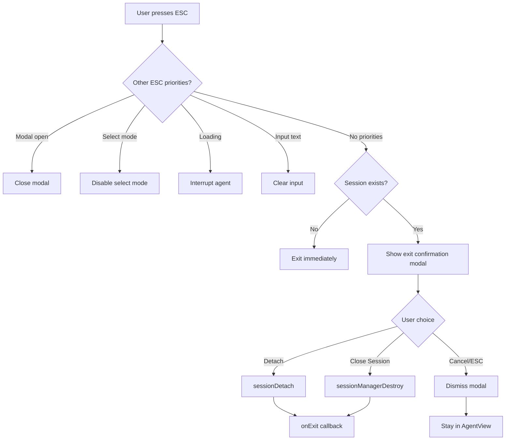

# TUI-046: Detach Confirmation Modal Design

## Overview

When users exit AgentView.tsx by pressing ESC (after all priority handlers are exhausted), a confirmation modal should appear asking whether to **detach** (keep session running in background) or **close** the session (terminate it). This enables users to start long-running agent tasks, switch to the kanban board or other TUI views, and later reattach to see progress.

## Architecture

### Component Integration

```
AgentView.tsx
├── State: showExitConfirmation (boolean)
├── ESC Handler (Priority 5)
│   └── if (sessionRef.current) → setShowExitConfirmation(true)
│   └── else → onExit() (no session, skip modal)
└── ThreeButtonDialog (conditional render)
    ├── message: "Exit Session?"
    ├── description: "The agent is running. Choose how to exit."
    ├── options: ["Detach", "Close Session", "Cancel"]
    ├── defaultSelectedIndex: 0 (Detach is safest default)
    ├── onSelect: handleExitChoice(index)
    └── onCancel: setShowExitConfirmation(false)
```

### Session Lifecycle Flow



### Code Changes

#### 1. New State Variable

```typescript
// Around line 690 (after showDeleteDialog state)
const [showExitConfirmation, setShowExitConfirmation] = useState(false);
```

#### 2. Modified ESC Handler (Priority 5)

```typescript
// Line 4043-4045, replace:
// Priority 5: Exit view
onExit();

// With:
// Priority 5: Show exit confirmation if session exists
if (sessionRef.current) {
  setShowExitConfirmation(true);
} else {
  onExit();
}
```

#### 3. Exit Choice Handler

```typescript
const handleExitChoice = useCallback(async (index: number, option: string) => {
  if (!sessionRef.current) {
    onExit();
    return;
  }
  
  const sessionId = currentSessionId; // Need to track session ID
  
  if (index === 0) {
    // Detach - session continues running
    try {
      const { sessionDetach } = await import('@sengac/codelet-napi');
      sessionDetach(sessionId);
    } catch (err) {
      // Log but continue - session may not be in background manager
      logger.warn('Failed to detach session:', err);
    }
    onExit();
  } else if (index === 1) {
    // Close Session - terminate
    try {
      const { sessionManagerDestroy } = await import('@sengac/codelet-napi');
      sessionManagerDestroy(sessionId);
    } catch (err) {
      // Log but continue - session may not be in background manager
      logger.warn('Failed to destroy session:', err);
    }
    onExit();
  } else {
    // Cancel - dismiss modal
    setShowExitConfirmation(false);
  }
}, [currentSessionId, onExit]);
```

#### 4. ThreeButtonDialog Rendering

```tsx
// After showDeleteDialog conditional render (around line 4826)
{showExitConfirmation && (
  <ThreeButtonDialog
    message="Exit Session?"
    description={isLoading 
      ? "The agent is currently running. Choose how to exit."
      : "Choose how to exit the session."
    }
    options={['Detach', 'Close Session', 'Cancel']}
    defaultSelectedIndex={0}
    onSelect={handleExitChoice}
    onCancel={() => setShowExitConfirmation(false)}
  />
)}
```

## NAPI Integration

The feature uses existing NAPI functions from NAPI-009 (Background Session Management):

| Function | Purpose |
|----------|---------|
| `sessionDetach(sessionId)` | Detach from session, it continues running in background |
| `sessionManagerDestroy(sessionId)` | Terminate background session completely |

### Session ID Tracking

Currently `AgentView.tsx` doesn't track session ID explicitly (uses `sessionRef.current` for the CodeletSession object). Need to either:

1. **Option A**: Store session ID when creating session
2. **Option B**: Get session ID from CodeletSession (if API supports it)

Recommend Option A - add `currentSessionId` state that's set when session is created.

## ThreeButtonDialog Reuse (DRY/SOLID)

This reuses the existing `ThreeButtonDialog` component from TUI-040 (Delete Session from Resume View):

**Location**: `src/components/ThreeButtonDialog.tsx`

**API**:
```typescript
interface ThreeButtonDialogProps {
  message: string;
  options: [string, string, string];
  onSelect: (index: number, option: string) => void;
  onCancel: () => void;
  defaultSelectedIndex?: number;
  description?: string;
}
```

**Navigation**:
- Left/Right arrows to move between buttons
- Enter to select highlighted option
- ESC to cancel (calls onCancel)

## Testing Considerations

### Unit Tests
- Modal appears when ESC pressed with active session
- Modal does NOT appear when ESC pressed with no session
- Detach option calls `sessionDetach` and exits
- Close Session option calls `sessionManagerDestroy` and exits
- Cancel option dismisses modal without exit
- ESC while modal open dismisses modal

### Integration Tests
- Detached session appears in `/resume` list with running status (TUI-047)
- Close Session removes session from background manager

## Edge Cases

1. **Session creation timing**: Modal should only show after first prompt sent (session created)
2. **Error during detach/destroy**: Log error but still exit (non-blocking)
3. **Multiple rapid ESC presses**: First shows modal, second dismisses it (correct behavior via onCancel)
4. **Session already destroyed**: Handle gracefully if session no longer in manager

## Related Work Units

- **NAPI-009**: Background Session Management with Attach/Detach (foundation)
- **TUI-040**: Delete Session from Resume View (ThreeButtonDialog pattern)
- **TUI-047**: Attach to Detached Sessions from Resume View (companion feature)
