# TUI-047: Attach to Detached Sessions from Resume View

## Overview

Enhance the `/resume` command in AgentView.tsx to show which sessions are running in the background (detached via TUI-046) vs. idle persisted sessions. When a user selects a running background session, **attach** to it using the NAPI-009 session API instead of loading from persistence. This provides instant access to live streaming output.

## Architecture

### Data Flow

```mermaid
flowchart TD
    A[User types /resume] --> B[handleResumeMode]
    B --> C[persistenceListSessions]
    B --> D[sessionManagerList]
    C --> E[Merge session lists]
    D --> E
    E --> F[Display with status icons]
    F --> G{User selects session}
    G -->|🔄 Running| H[sessionAttach + buffer hydration]
    G -->|💾 Idle| I[persistenceLoadSession]
    H --> J[Live streaming begins]
    I --> K[Load from persistence]
```



### Session List Merge Strategy

```typescript
interface MergedSession {
  id: string;
  name: string;
  updatedAt: string;
  isBackgroundSession: boolean;  // true if in sessionManagerList
  status: 'running' | 'idle';     // from sessionGetStatus or 'idle' for persisted
  // ... other SessionManifest fields
}

function mergeSessionLists(
  persisted: NapiSessionManifest[],
  background: SessionInfo[]
): MergedSession[] {
  const backgroundMap = new Map(background.map(s => [s.id, s]));
  
  const merged = persisted.map(session => {
    const bg = backgroundMap.get(session.id);
    return {
      ...session,
      isBackgroundSession: !!bg,
      status: bg?.status || 'idle'
    };
  });
  
  // Add any background sessions not in persistence (edge case)
  for (const bg of background) {
    if (!merged.find(s => s.id === bg.id)) {
      merged.push({
        id: bg.id,
        name: bg.name,
        updatedAt: new Date().toISOString(),
        isBackgroundSession: true,
        status: bg.status
      });
    }
  }
  
  return merged.sort((a, b) => 
    new Date(b.updatedAt).getTime() - new Date(a.updatedAt).getTime()
  );
}
```

### Status Icon Rendering

```tsx
// In resume list rendering (around line 4757)
const getStatusIcon = (session: MergedSession): string => {
  if (session.isBackgroundSession) {
    return session.status === 'running' ? '🔄' : '⏸️';
  }
  return '💾';
};

// Render each session row
<Text>
  {getStatusIcon(session)} {session.name}
  <Text dimColor> ({formatTimeAgo(session.updatedAt)})</Text>
</Text>
```

### Attach vs Load Decision

```typescript
const handleResumeSelect = useCallback(async () => {
  const selectedSession = mergedSessions[resumeSessionIndex];
  
  if (selectedSession.isBackgroundSession && selectedSession.status === 'running') {
    // ATTACH to running background session
    await attachToBackgroundSession(selectedSession.id);
  } else {
    // LOAD from persistence (existing code path)
    await loadPersistedSession(selectedSession.id);
  }
}, [mergedSessions, resumeSessionIndex]);
```

## NAPI Integration

### Functions Used

| Function | Purpose |
|----------|---------|
| `sessionManagerList()` | Get all background sessions with status |
| `sessionGetStatus(id)` | Check if session is 'running' or 'idle' |
| `sessionGetBufferedOutput(id, limit)` | Get output produced while detached |
| `sessionAttach(id, callback)` | Attach to live streaming |

### Attach Flow Implementation

```typescript
const attachToBackgroundSession = async (sessionId: string) => {
  const {
    sessionGetBufferedOutput,
    sessionAttach,
    sessionGetStatus
  } = await import('@sengac/codelet-napi');
  
  // 1. Get buffered output (produced while detached)
  const bufferedChunks = sessionGetBufferedOutput(sessionId, 10000);
  
  // 2. Hydrate conversation from buffer
  for (const chunk of bufferedChunks) {
    handleStreamChunk(chunk); // Same handler as live streaming
  }
  
  // 3. Attach for live streaming
  sessionAttach(sessionId, (err, chunk) => {
    if (err) {
      logger.error('Stream error:', err);
      return;
    }
    handleStreamChunk(chunk);
  });
  
  // 4. Update UI state
  setCurrentSessionId(sessionId);
  setIsResumeMode(false);
  
  // 5. Set loading state based on session status
  const status = sessionGetStatus(sessionId);
  setIsLoading(status === 'running');
};
```

### StreamChunk Handling

The `handleStreamChunk` function processes chunks from both:
1. Buffered output (hydration)
2. Live streaming (real-time)

```typescript
const handleStreamChunk = (chunk: StreamChunk) => {
  switch (chunk.type) {
    case 'text':
      appendToConversation(chunk.text);
      break;
    case 'tool_call':
      showToolCall(chunk.toolCall);
      break;
    case 'tool_result':
      showToolResult(chunk.toolResult);
      break;
    case 'thinking':
      showThinking(chunk.thinking);
      break;
    case 'status':
      handleStatusChange(chunk.status);
      break;
    case 'tokens':
      updateTokenUsage(chunk.tokens);
      break;
    // ... etc
  }
};
```

## Code Changes

### 1. New State for Merged Sessions

```typescript
interface MergedSession extends SessionManifest {
  isBackgroundSession: boolean;
  backgroundStatus: 'running' | 'idle' | null;
}

const [mergedSessions, setMergedSessions] = useState<MergedSession[]>([]);
```

### 2. Modified handleResumeMode

```typescript
const handleResumeMode = useCallback(async () => {
  try {
    const { 
      persistenceListSessions,
      sessionManagerList 
    } = await import('@sengac/codelet-napi');
    
    // Get both lists
    const persisted = persistenceListSessions(currentProjectRef.current);
    const background = sessionManagerList();
    
    // Merge with background sessions taking precedence
    const merged = mergeSessionLists(persisted, background);
    
    setMergedSessions(merged);
    setResumeSessionIndex(0);
    setIsResumeMode(true);
  } catch (err) {
    // ... error handling
  }
}, []);
```

### 3. Updated Resume List Rendering

```tsx
{mergedSessions
  .slice(resumeScrollOffset, resumeScrollOffset + resumeVisibleHeight)
  .map((session, visibleIdx) => {
    const actualIdx = resumeScrollOffset + visibleIdx;
    const isSelected = actualIdx === resumeSessionIndex;
    const statusIcon = session.isBackgroundSession
      ? (session.backgroundStatus === 'running' ? '🔄' : '⏸️')
      : '💾';
    
    return (
      <Box key={session.id}>
        <Text
          backgroundColor={isSelected ? 'blue' : undefined}
          color={isSelected ? 'white' : undefined}
        >
          {statusIcon} {session.name}
          <Text dimColor> ({formatRelativeTime(session.updatedAt)})</Text>
        </Text>
      </Box>
    );
  })}
```

## Testing Considerations

### Unit Tests

1. **Merge Logic**
   - Background sessions override persisted session status
   - Sessions sorted by updatedAt descending
   - Sessions only in background list still appear

2. **Icon Display**
   - 🔄 shown for running background sessions
   - ⏸️ shown for idle background sessions  
   - 💾 shown for persisted-only sessions

3. **Selection Behavior**
   - Running session triggers attach flow
   - Idle/persisted session triggers load flow

### Integration Tests

1. Detach → Resume → Attach flow end-to-end
2. Buffer hydration displays correct conversation state
3. Live streaming continues after attach
4. Delete works for both session types

## Edge Cases

1. **Session in both lists with different status**: Use background session data
2. **Background session not in persistence**: Show anyway, may not have history
3. **Attach fails**: Fall back to persistence load with error message
4. **Empty buffer**: Normal, just start live streaming
5. **Session finished between list and select**: Status may change, handle gracefully

## Icon Legend (Footer)

Consider adding legend to footer when in resume mode:

```
🔄 Running | ⏸️ Paused | 💾 Saved | Enter Select | ↑↓ Navigate | D Delete | Esc Cancel
```

## Related Work Units

- **TUI-046**: Detach Confirmation Modal (creates detached sessions)
- **NAPI-009**: Background Session Management (API foundation)
- **TUI-040**: Delete Session from Resume View (delete functionality)

## Dependencies

- TUI-046 should be implemented first (creates detached sessions)
- NAPI-009 must be complete (provides sessionAttach/sessionDetach APIs)
