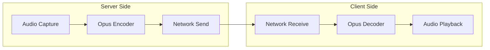

# Test Document with Valid Mermaid Diagram

This document contains a mermaid diagram with CORRECT subgraph syntax (no quotes).

## Audio Streaming Flow (Valid Syntax)

This diagram uses `subgraph ServerSide[Server Side]` which is VALID and should be accepted.
