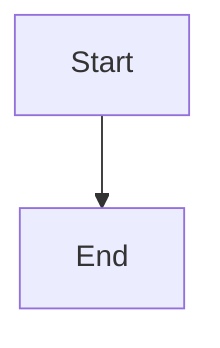

<!-- THIS FILE IS AUTO-GENERATED FROM spec/foundation.json -->
<!-- DO NOT EDIT THIS FILE DIRECTLY -->
<!-- Edit spec/foundation.json and run: fspec generate-foundation-md -->

# Test Project Project Foundation

## Vision

A test project for validation

---

## Problem Space

### Test Problem

Test problem description

**Impact:** high

---

## Solution Space

### Overview

Test solution overview

### Capabilities

- **Test Capability**: Test capability description

---

## Architecture Diagrams

### New System Flow

---
